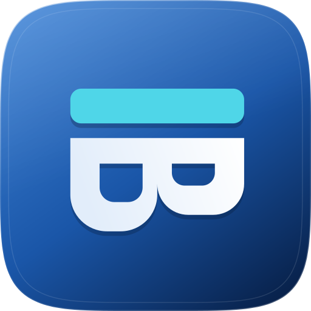
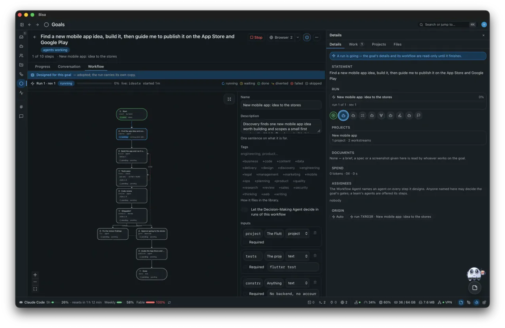

<div align="center">



# Bisa
**A Decentralized Agentic IDE.**

</div>

<!-- website:overview — generated by `just website` from website/screenshots/manifest.json -->
<p align="center"></p>
<p align="center"><sub>Goals · Projects · Agents · Teams · Workflows · Notes · Drawing · Pets · Addons</sub></p>
<!-- /website:overview -->

🌐 Website: https://bisa.dev · 💻 Source: https://github.com/mourad-ghafiri/Bisa · 📄 Licence: MIT ([LICENSE](LICENSE))

Bisa is a local-first, account-free platform where people and agents carry
work from a stated want to a running outcome. It orchestrates the coding harnesses you already have —
Claude Code, Codex CLI, OpenCode, GitHub Copilot CLI, Grok Build, pi, Oh My Pi, anything speaking ACP —
rather than shipping its own, and it speaks Nostr (GEP), MCP, ACP and A2A.

One engine, three ways to reach it: the **desktop app**, the **`bisa` command line**, and the **node**
both of them talk to.

## 🖥️ The desktop app

⬇️ **Download** — one signed, notarized disk image for Apple Silicon and Intel, with its SHA-256, on
the [Releases page](https://github.com/mourad-ghafiri/Bisa/releases). Linux and Windows are coming
soon, and build from source today. How to install and verify it is in
[Getting started](docs/guide/getting-started.md#1-the-desktop-application--release-ready-to-use);
what changed in each release is in [CHANGELOG.md](CHANGELOG.md).

The app carries its own node: nothing else needs to be running. Its first launch checks five things —
git, a harness, and the three core agents — and installs nothing: where something is missing, it
shows the official line to copy.

### The sidebar, top to bottom

- 📥 **Inbox** — everything that waits on you, in one place: gates to approve, questions with the
  answers the agent thinks it has (or *I'm not sure*), held steps, and harnesses waiting at their
  prompt in a terminal.
- 🤖 **Agents** — definitions on the harnesses you already have, each with its own keypair, a model
  plan with failover, an effort fitted to the model, skills and MCP servers. Three core agents — the
  General Agent staffs, the Workflow Agent designs, the Decision-Making Agent judges — and a catalog
  installed on demand ([agents and teams](docs/guide/agents-and-teams.md)).
- 👥 **Teams** — agents and people under a purpose, one level deep; assign a goal to a team and it
  is staffed from it.
- 🗂️ **Projects** — the Project IDE: a workstream (a branch and a checkout) for each piece of work;
  harnesses in terminal tabs that report and are guarded; pull requests on GitHub, GitLab and
  Bitbucket Cloud in seven steps with an agent's review; a git client with a commit graph and a
  recovery ref before anything moves your tree; Agent mode with every edit kept or undone by hunk;
  the Board; the embedded browser; Mobile Development for Flutter
  ([the IDE](docs/guide/the-ide.md), [projects](docs/guide/projects.md)).
- 🔀 **Workflows** — graphs of steps in four families, drawn in the designer, taken from a template,
  or proposed by the Workflow Agent; ten ways a run begins, each written down as a durable signal
  first ([workflows](docs/guide/workflows.md), [events](docs/guide/events.md)).
- 🎯 **Goals** — one sentence you come back to, in *auto*, *guided* or *manual*: designed, adopted,
  run and kept in a signed journal ([goals](docs/guide/goals.md)).
- 📡 **Pulse** — the workspace's live feed, paged back as far as it goes.
- 💬 **Channels** — people and agents in the same rooms; conversations about any goal, workflow,
  project, note or drawing; artifacts that render live ([channels](docs/guide/channels.md),
  [artifacts](docs/guide/artifacts.md)).
- ✉️ **Direct messages** — one to one with an agent, or with a person on another machine, then
  encrypted pairwise to the two of you.
- ⚙️ **Settings** — one registry at three scopes, five theme families, a keymap with presets.

### Also in the box

- 🤝 **Collaboration** over Nostr relays — optional and off by default, every fact sealed and
  gift-wrapped for each recipient ([collaboration](docs/guide/collaboration.md)).
- 🔌 **Connectors** to outside platforms, with accounts you add ([connectors](docs/guide/connectors.md)).
- 📝 **Notes** and ✏️ **drawings**, each a git repository, with agents that add to them while you watch.
- 🛡️ **Security** — the Redactor, the Tool & Commands Guard and the Classifier, and a publish gate
  where work leaves your machine; best effort, never a sandbox
  ([security architecture](docs/architecture/11-security.md)).
- ⚖️ **Decision-making** — calibrated judgements from Jev or any RLCD model, or a harness; off until
  you choose who judges ([decisions](docs/guide/decisions.md)).
- 🧩 **Addons** — small windows of HTML, CSS and JavaScript, thirteen built in and your own imported
  ([addons](docs/guide/addons.md)).
- 🐾 **Pets** that keep you company in the footer while agents work.
- 🔔 **The menu bar icon and notifications**, by category.

More in [the desktop guide](docs/guide/the-desktop.md) and [the IDE guide](docs/guide/the-ide.md).

## ⌨️ The command line

The app's node is also the `bisa` command, inside the application — link
`/Applications/Bisa.app/Contents/MacOS/bisa` into a folder on your PATH
([Getting started](docs/guide/getting-started.md#1-the-desktop-application--release-ready-to-use)). What the window does, the command line
does too. While a node runs, every verb routes through it, so a decision made in a terminal resolves
the gate in the running engine; without one, it runs an embedded engine of its own (`--no-node`
forces that).

Two ways in. **Talk to it** — a fresh workspace has two of the platform's own agents to talk to, each
with its own keypair and your harnesses behind it:

```sh
bisa dm send <agent-pubkey> --text "read ./notes.md and tell me what is missing"
```

**Or say what you want, and let it be run properly:**

```sh
bisa new "Create a landing page for the bookmark product"
bisa inbox      # what waits on you: a question to answer, a gate to decide
```

The Workflow Agent takes it from there: it asks you what it needs to know, starts from the closest of
the catalog's templates, and **proposes a workflow** — the steps that make the want real: agents work,
checks judge, you answer and approve. You adopt it, and the General Agent **staffs it** — installing
from the catalog the agents and teams the work actually needs. Your harnesses do the work, the checks
verify it, and the events it listens for keep it running.

`bisa doctor` runs the first launch's five checks from a terminal. Every verb is in
[the command line reference](docs/reference/cli.md).

## 🛰️ The node

`bisa node` is the same binary, headless — the daemon the desktop app and the command line talk to,
on your laptop in the background or on a server:

```sh
bisa node                           # unix socket only: ~/.bisa/run/node.sock
bisa node --listen 127.0.0.1:4477   # + HTTP on one loopback address
```

- 🔐 **An HTTP API with one event stream**, behind a bearer token of 32 random bytes in an owner-only
  file; `--listen` refuses an address beyond this machine unless told otherwise
  ([HTTP API](docs/reference/http-api.md), generated from the code).
- 🧰 **The MCP server** every harness session is handed, so agents work through the platform's own
  tools ([MCP tools](docs/reference/mcp-tools.md)).
- 🌍 **A2A** — the node can be an agent other agents hand tasks to, and a remote A2A agent can be a
  worker.
- ⏱️ **Events are heard and waits elapse** only while a node runs; the collaboration pump runs beside
  the engine, and dials no relay until sync is turned on.
- 🔁 **After a crash, nothing to do** — every fact the node acknowledged is on the disk, and the next
  start reads it back before it serves anyone.

How to run and operate it: [operating](docs/guide/operating.md).

## 💡 The ideas behind it

- **A goal is the durable object, and its workflow is how it runs.** A workflow is a small graph
  of eighteen kinds of step — events (`start`, `wait`, `emit`, `end`), gateways (`decide`, `if`,
  `switch`, `judge`, `parallel`), loops (`for_each`, `while`) and tasks (`agent`, `human`,
  `approval`, `check`, `connector`, `notify`, `spawn`) — designed by hand,
  taken from a template, or proposed by the Workflow Agent and adopted by you. One live run at a
  time carries a goal; the goal's status is wherever the run has got to. A workflow also runs on its
  own, **in the workspace**, with no goal at all — from the library, an event it listens for or `bisa workflow run`,
  as many at once as you start. Every fact about a run is a signed event in its journal. Sessions are
  evidence, not the unit of work.
- **You decide; you don't drive.** `bisa inbox` is the one place anything waits for you: a
  question to answer or a gate to decide. A question arrives with the answers the agent thinks it
  has; pick one, say something else, or say **I'm not sure**, which sends the agent back to ask
  something narrower.
- **No account. No server.** A keypair minted on first run is your identity. Everything lives in
  `~/.bisa/`. Collaboration is optional and rides encrypted over Nostr relays, which are dumb
  transport and never authorities.
- **Projects belong to the workspace; goals attach to them.** A project is a real folder — created
  as a git repository, cloned, imported or adopted — and it can be attached to zero or more goals.
  Attaching and detaching move nothing on disk. **Bisa never writes into a folder it did not
  create.** Each piece of work gets a **workstream**, a branch and a checkout of its own; committing
  is local, and pushing or opening a pull request passes the `publish` gate because that is where
  work leaves your machine.
- **Three core agents and a catalog.** A workspace opens with the General Agent, the Workflow Agent
  and the `general` channel and nothing else; the third core agent, the Decision-Making Agent,
  judges where a decision point asks it, and is off until you switch it on. The catalog holds agents named after jobs you already
  recognise, the skills they carry, teams, channels and workflow templates, installed on demand and
  never seeded ([the catalog](docs/reference/catalog.md)).
- **Agents are definitions**: a prompt, a harness, a model plan with failover and an effort, skills and MCP
  servers, each with its own attested keypair so its work is signed as itself.
- **Channels and teams.** Standing rooms with rosters, direct channels. An unaddressed question
  reaches the General Agent, which answers or hands it to the agent that should.
- **What starts a workflow is part of it.** A `start` step per way in: by hand, on a schedule, when
  a hook is called, when something is said, raised or changed, when a check starts failing. Turn a
  workflow On, or let a goal listen, and every occurrence is written down as a durable **signal**
  that starts a run — in the workspace, or on the goal — under the same gates and budgets as work
  you started yourself. An event never acts directly; a step that waits can time out, be reminded or
  be diverted by a **boundary event**.
- **Nothing is deleted while something points at it**, and the refusal names what is holding it.

## 📚 Documentation

**→ Start here: [`docs/guide/getting-started.md`](docs/guide/getting-started.md)**

| | |
|---|---|
| [Guides](docs/README.md#guides) | projects, goals, workflows, events and gateways, agents and teams, channels, sync, operating, the desktop, the IDE |
| [Reference](docs/README.md#reference) | CLI, HTTP API (generated), workspace layout, GEP, catalog, MCP tools |
| [Architecture](docs/architecture/README.md) | the domain model, workflows, layering, persistence, the protocol, the runtime flows, one page per crate, the Project IDE |
| [Contributing](docs/README.md#contributing) | setup, testing rules, terminology, layering, release |

## 🤝 Contributing

Contributions are welcome — code, docs, translations, catalog additions, bug reports and feedback.
Start with **[CONTRIBUTING.md](CONTRIBUTING.md)**: every change begins from an accepted issue, comes
with its tests and docs, declares its compatibility, and is reviewed against written checklists.
Coding agents read [AGENTS.md](AGENTS.md).

- 🧭 [How to contribute](docs/contributing/how-to-contribute.md) and the [area guides](docs/contributing/areas/README.md)
- 🔎 [Review](docs/contributing/review/README.md) — code, security, performance, licences, compatibility, docs
- 🔒 [Compatibility](docs/reference/compatibility.md) — inside 0.x, a minor or patch release never breaks your workspace, scripts or integrations
- 🛡️ Vulnerabilities are reported privately — [SECURITY.md](SECURITY.md)
- 💬 Questions and ideas: GitHub Discussions · [SUPPORT.md](SUPPORT.md) · [Code of Conduct](CODE_OF_CONDUCT.md) · [Governance](GOVERNANCE.md)

## 🛠️ Build from source

```sh
cargo build --workspace && cargo test --workspace
just verify        # the whole gate — docs/contributing/release.md
```

On a Mac, `scripts/start-macos.sh` builds the desktop app the first time and opens it every time
after ([setup](docs/contributing/setup.md)).

## 📄 Licence and credits

MIT ([LICENSE](LICENSE)); the work Bisa ships is credited in
[THIRD-PARTY-NOTICES.md](THIRD-PARTY-NOTICES.md). To report a security fault, see
[SECURITY.md](SECURITY.md). The website's source is in [`website/`](website/README.md), built by
`just website`.
