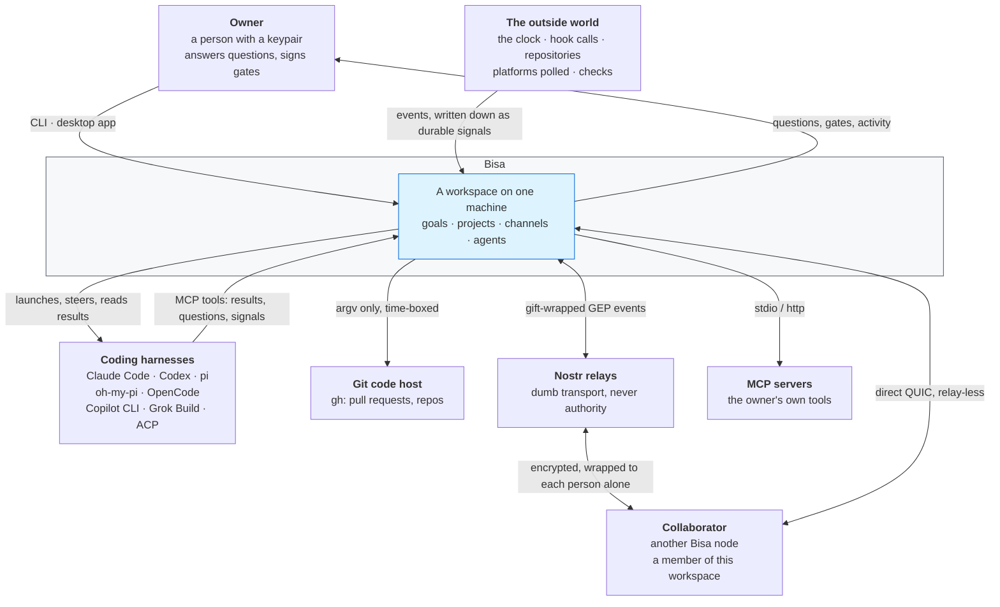
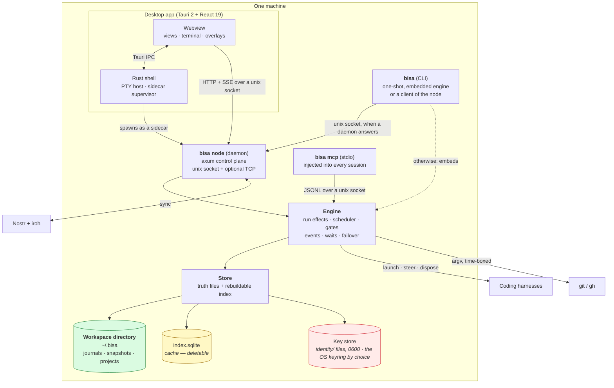

# 01 — System context and containers

C4 levels 1 and 2. Level 3 (components) is covered per subsystem in documents 02–09; level 4 is the
code.

---

## Level 1 — System context

**What the picture asserts, and what it deliberately does not:**

- **No server sits between the owner and their workspace.** There is no account, no tenancy, no
  control plane the vendor operates. A relay carries ciphertext and cannot read it.
- **Harnesses are orchestrated, not implemented.** Bisa never contains a model client. It
  launches the tools the owner already has and speaks their protocols at one boundary.
- **The outside world can only *make an event*.** An event never acts; it is written down as a
  durable signal, and the signal starts a run of the workflow that listens for it — under the same
  gates, budgets and concurrency caps as work the owner started
  ([03 — Workflows](03-workflows.md#events)).

---

## Level 2 — Containers

### One binary, three personalities

`bisa` is a multicall binary. Which personality runs is decided by argv, and all three share
the same engine and store code:

| Invocation | Role |
|---|---|
| `bisa …` | CLI. Talks to a running daemon over its unix socket when one answers; otherwise embeds the engine for a one-shot. |
| `bisa node` | Daemon. An axum control plane over a live engine, with an SSE event stream. |
| `bisa mcp` | The MCP server injected into every harness session, speaking to the engine over a unix socket. |

The desktop app ships the same binary as a sidecar and drives it over HTTP.

### What each container owns

| Container | Owns | Never does |
|---|---|---|
| **Webview** | rendering, navigation, local window state — where the person was and what every screen kept of itself, in its own storage | reach the filesystem; know a path; name a program; send what it remembers to the node |
| **Rust shell** | the PTY, the sidecar's lifetime, the login `PATH`, the window's size and place (a file of its own under the app's config folder) | domain logic |
| **Node** | the HTTP/SSE surface, the hook receiver, A2A | write to the store directly — every write goes through the engine |
| **Engine** | the run machine's effects, scheduling, gates, listening for events, waits, failover, and **every filesystem effect** | transport |
| **Store** | truth files, the rebuildable index, identity, and the typed API above them | create a directory for work, run `git`, launch a process |
| **Core** | the domain: types, the state machine, invariants | any I/O at all |

### Where the security boundaries actually are

Three, and they are not where a reader usually guesses:

1. **The key files / the keyring.** The account is a keypair. There is no reset link. Keys are
   files under `identity/` by default, written with `O_CREAT|O_EXCL` at mode `0600` — never created
   wide and narrowed afterwards; the OS keyring holds them only with `BISA_KEYSTORE=keyring`.
2. **The unix socket** at `<data-dir>/run/node.sock`, mode `0600`, **and the bearer token**
   (`run/token`, mode `0600`). Every route on both listeners wants the token; the socket's file
   permissions are a second, independent check. `--listen` exposes the same plane on TCP, where
   the token stands alone, and a non-loopback address is refused unless `--insecure-allow-remote`
   is passed. `POST /hooks/{host}/{step}` is the one public route with a secret of its own (the listener's, as a
   token or an HMAC-SHA256 over the body), and it answers only while this machine allows public
   hooks (`events.public_hooks`, off by default).
3. **`resolve_within`.** Any caller-supplied path is resolved by canonicalization, not by a string
   prefix test — because `..`, an absolute path and a symlink out of the tree are three ways to ask
   one question and only canonicalization answers all three.

The embedded terminal is deliberately outside all of this: it is a Tauri command in the desktop
shell, not a node route, because a PTY behind the control plane is a shell for anything that can
read the workspace's token.
