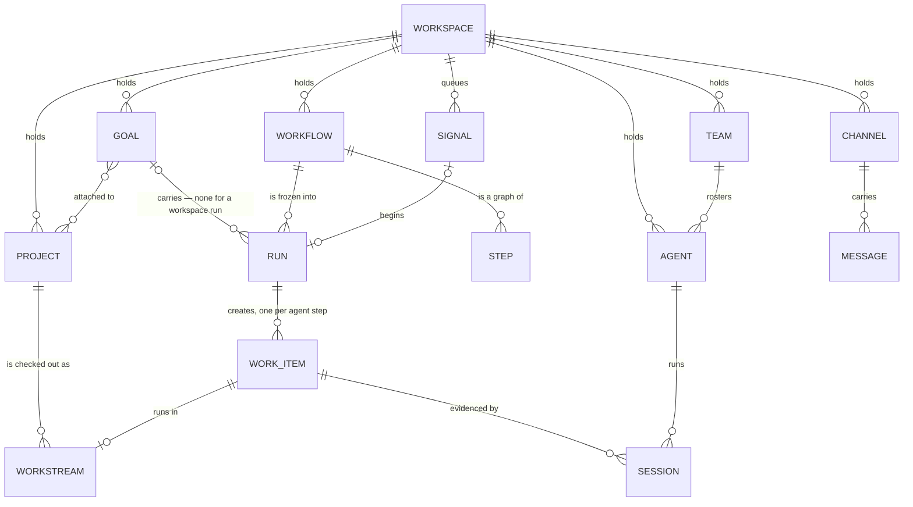

# 02 — The domain model

Every aggregate, every value object, every invariant — and, for each invariant, the one place it is
enforced.

---

## Ubiquitous language

One word per concept. If a word is not in this table it is not a domain term, and using it in a
type name is a defect.

| Term | Means | Does **not** mean |
|---|---|---|
| **Workspace** | one directory, one identity, one collaboration audience. The root of everything | an account, a tenant, an organisation |
| **Goal** | a durable, signed record of a wanted outcome, carried by the workflow it runs | a task, a ticket, a plan |
| **Workflow** | a named graph of steps with typed inputs; a reusable definition, versioned by `revision`; born of the workspace, the catalog or one goal | a state machine, a script |
| **Archived** | a mark on a goal, a workflow or a project (`Archived { at }`) — put away: hidden from every list that does not ask, refused for the moves that would start work on it, one move back. Never a status: an archived goal is a closed goal | a lifecycle state; a deleted thing |
| **Design** | a workflow born of one goal (`WorkflowOrigin::Goal`): the Workflow Agent's proposal or the goal's own drawing. Under its goal, out of the library, promotable | a draft, a template |
| **Step** | one node of a workflow: what happens, who does it, what follows — eighteen kinds in four families: events, gateways, loops, tasks | a task, a subtask |
| **Flow** | a directed edge between two steps, optionally labelled with a branch of the step it leaves — a `decide`'s rule, an `if`'s `yes`/`no`, a `switch`'s case, a loop's `each`/`loop`/`done` — or with the name of a boundary event that diverts it | a stream, a pipeline |
| **Event** | something a workflow reacts to — a time, a call, a message, a change, a named signal: what a start begins on, a wait holds for, a boundary fires on | a bus frame; an action |
| **Start event** | a `start` step: one way a run may begin — by hand, or on an event (`StartOn`) | a cron job; a record of its own |
| **Listener** | a start event armed for a **host** — the workspace, for a library workflow that is On, or a goal (`ListenerKey { host, step }`) | a stored record; a subscription on the bus |
| **Listening** | a host's standing: the inputs the runs its events begin bind, a per-run budget, since when, paused why (`Listening`) | a revision of the workflow |
| **Boundary event** | an event on a live step: it diverts the step — the step stops, the run takes the boundary's flows — or acts beside it | a second path run in parallel |
| **Gateway** | a step that routes: `decide`, `if`, `switch`, `judge` choose one, a `decide` that picks every rule chooses several, `parallel` takes all | a merge node — the step the branches flow into joins them |
| **Run** | one execution of a workflow — a goal's, or the workspace's with no goal behind it (`RunScope`); the only place execution state lives | a session, a job |
| **Workspace run** | a run of the workspace: started from its workflow — *Run…*, `bisa workflow run`, an event of a library workflow that is On — with no goal, at once and beside any other run of it, never queued, spending against a ceiling frozen when it was made (the one the workflow listens with, else `budget.default.*`) | a goal; a queued run |
| **Home** | where a run's truth is filed — its goal's folder, or a workspace run's own under `workflows/runs/<RunId>/`: the journal, the run's snapshot, its work items, its ledger, its results and its scratch folder (`Home`); a goal's own facts — notes, documents, attachments, guidance, an adoption — are always the goal's | an owner; a place a person works in |
| **Template** | a catalog workflow, installed like an agent | a form letter |
| **Work item** | the schedulable leaf an `agent` step creates: instructions a fresh session can act on alone | a subtask of a subtask |
| **Project** | a folder the workspace works in, git or not. A **place**, which remembers where it was born | something a goal owns |
| **Origin** | where a project or a workflow came from, recorded once by the engine at creation — the workspace, a goal, the catalog, or the very step that asked | an owner; a relation |
| **Workstream** | one checkout occupant of a project — the primary (its own root), a worktree on a branch, or a copy — where one piece of work happens | a sandbox, a container |
| **Channel** | a standing conversation the workspace can see | a transport, an SSE stream, a tokio primitive |
| **Direct message** | a conversation with a restricted audience | a channel |
| **Agent** | a definition — prompt, harness, model plan, skills, MCP servers — with its own keypair | a running process |
| **Effort** | how hard a model works on a task — `minimal` · `low` · `medium` · `high` · `xhigh` · `max` (`Effort`); what is asked for may also be `auto` (`EffortChoice`), and a level is fitted to what the model takes ([06](06-agents-and-teams.md#effort)) | a harness's own flag; thinking switched off; the thinking a harness streams |
| **Workflow Agent** | `workflow-agent`, the second core agent: designs, validates and repairs workflows | the General Agent |
| **Session** | one live run of a harness. Evidence, never the unit of work | a goal, a work item |
| **Team** | a named set of agents and humans, expanded at assignment time | a folder, a permission group |
| **Assignee** | one word for agent, human or team | an owner |
| **Skill** | a procedure an agent works through, referenced by id and shared | a prompt |
| **Signal** | the durable, idempotent record of one occurrence of an event, written down before anything acts; a **named** signal is one a run, a session or a person raises (`emit`) | an event on the bus; an action |
| **Approval** | a signed human decision on one of the three gates | a permission |
| **Decision-Making Agent** | `decision-making-agent`, the third core agent, beside the General Agent and the Workflow Agent, and the one that judges — asked a typed question at a fixed set of decision points, held to one contract; it holds no record: no key, no prompt, no conversation, no work item, and it signs nothing | a model; an agent that can be messaged, assigned or woken; an authority |
| **Judgement** | what the Decision-Making Agent answers with — a noul, a choice or a score, each with how sure it is | a decision (kind 3401, a person's signed approval); a rule |
| **Note** | a markdown scratchpad belonging to no record the platform maintains | a comment, a description |
| **Placement** | the directory a session runs in, and what kind of directory it is | a sandbox |
| **Stream** | one SSE frame category — `engine`, `conversation`, `inbox` (one row's state: what it owes, what is unread, what happened) | a channel |
| **Conversation** | a saved exchange a person starts with one or more agents — an id, an **origin** (the node, the workspace, a goal, a workflow, a project or a workstream), a title, its messages, archived or not; many per origin; where the IDE's Agent panel talks ([13 — Conversations](13-conversations.md)) | a channel, a goal's thread, a session |
| **Session kind** | which of four things a live harness run is — `worker` (a step's work item) · `guided` (the Workflow Agent's design wake) · `conversation` (a turn of a conversation) · `terminal` (a harness a person opened in a terminal); `SessionKind` in the store, on the roster and on the wire | a persona; an interactive session |
| **Review note** | an annotation on a diff line, pinned to the diff it was written against, handed to an agent as data | a comment on a message |
| **Recovery ref** | `refs/bisa/safety/*` — a commit object saved before any tree-moving git operation: a tip, the saved tree, or a stash entry about to be dropped (its kind is its suffix) | a stash entry — a stash is the person's, on git's own list; a recovery ref is the platform's, and may pin one |
| **Consent** | `HumanConsent` — the token a tree-moving git operation requires, minted only from an authenticated request | an approval; a gate |
| **Profile** | who you are for one organization on one code host — author, SSH key, account — as one gitconfig file the platform owns and your global git config includes for that owner's remotes (`GitProfile`) | an identity provider; a settings key; a second copy of anything git holds |
| **Connector** | a declarative definition of one outside platform's API — a base URL, the hosts it may reach, an auth scheme, account-level parameters, operations — that a `connector` step calls; shipped in the catalog or written by hand, and synced like a skill (kind 33414) | an integration, a plugin; a credential; the platform itself |
| **Addon** | a community-built overlay widget — a folder of HTML, CSS and JavaScript with an `addon.json` — installed as a **record** (the manifest, its `origin`, `enabled`, what was **granted**) and a **bundle** the node serves; shown in a sandboxed frame over the desktop and reaching the platform only through the bridge, with what the person granted (kind 33407; [18](18-addons.md)) | a plugin, an extension, a widget of the app's own chrome |
| **Person** | a human on another node this workspace hosts: a pubkey in `members.json` at a **role** — owner, admin, member, guest — with a fixed permission matrix; reaches what the role and the rosters allow, writes only a human's acts, brings no agents ([14](14-collaboration.md)) | a collaborator with a copy of the workspace; an agent |
| **Invitation** | a single-use, expiring code a person claims to become a person here — the role and the channels it offers, the secret kept only as a hash | a member; a relay's record |
| **Account** | a login to an outside service the platform can speak as: a code host's — a token it stores, or a sign-in the machine's `gh` or `glab` already holds — bound to a checkout through `codehost.account` in git config, with one default per kind (`codehost.<kind>.account`); or a connector's — a label, non-secret parameters and secret fields in the keystore, one default per connector, this machine's and never on the wire | the token itself; a member; an agent's identity |

Words deliberately absent because they name nothing: there is no *task*, no *ticket*, no
*lifecycle state*, no *contract*, no *criterion*, no *plan*. What a criterion checked is a `check`
step; what a plan decomposed is a workflow's `agent` steps.

---

## Aggregates

An aggregate is a consistency boundary: one root, one writer, one set of invariants that hold
between any two operations.

Three relations are worth a sentence each. **Goal ⇄ Project** is many-to-many, a relation and not a
hierarchy, and document [04](04-workspace-project-goal.md) is entirely about why. **Workflow →
Run** is a freeze: a run carries its own copy of the workflow, so editing the library changes no run
in flight, and an amendment is an event on the run ([03](03-workflows.md#events-and-effects)).
**Goal → Run** is optional: a run is a goal's (`RunScope::Goal`) or the workspace's
(`RunScope::Workspace`), the scope is recorded at creation and never changes, and where the run's
truth is filed — its **home** — follows from it (`WorkflowRun::home`,
[03](03-workflows.md#runs-of-the-workspace)).

### The roots

| Aggregate root | Identity | Wire kind | Sole writer |
|---|---|---|---|
| `Goal` | `GoalId` (ULID) | 33400 | engine |
| `Workflow` | `WorkflowId` (ULID) | 33412 | engine |
| `WorkflowRun` | `RunId` (ULID) | 33413 | engine — `store/runs.rs` is its one writer, and only the engine calls it; filed in its home — its goal's folder, or its own under `workflows/runs/<RunId>/` |
| `WorkItemSpec` | `WorkItemId` (ULID) | 33402 | engine |
| `Project` | `ProjectId` (ULID) + `Slug` | 33409 | engine (records go through the store; effects are the engine's) |
| `Workstream` | `WorkstreamId` (ULID) | *none — local* | engine |
| `Channel` | `ChannelId` | 33405 | store |
| `Agent` | `AgentId` (slug) | 33403 | store |
| `Team` | `TeamId` (slug) | 33408 | store |
| `Skill` | `SkillId` (slug) | 33411 | store |
| `McpServer` | `McpId` (slug) | *none — local* | store |
| `Note` | `NoteId` (ULID) | *none — local* | store |
| `Drawing` | `DrawingId` (ULID) | 33401 | store (the record; the engine's doors announce it — [19](19-drawings.md)) |
| `Connector` | `ConnectorId` (slug) | 33414 | store |
| `ConnectorAccount` | `AccountId` (ULID) | *none — local* | store |
| `AddonRecord` | `AddonId` (slug) | 33407 | store (the record; the engine's doors announce it) |

**Why some things have no wire kind.** [GEP](09-protocol-gep.md) asks one question of every
candidate: *would a second node be able to act on this?* A workstream names a path on one machine. An
MCP stdio server is a command line on one disk. A note is a scratchpad. A connector account is one
machine's login, with its secrets in that machine's keystore. All four fail, so none of them
travels, and a peer's snapshot can never contain one.

### Value objects

`PrincipalId` (64 lowercase hex, shape-validated at construction) · `Slug` (path-traversal
allowlist) · the slug ids `AgentId`, `TeamId`, `SkillId`, `McpId`, `ChannelId`, `ConnectorId`,
`OperationId` (`[a-z0-9][a-z0-9_.:-]{0,63}`, no `..`; refused as `CoreError::InvalidId`) ·
`StepId` and `InputName` (`[a-z][a-z0-9_-]{0,31}` — no `.` or `:`, which the placeholder grammar
uses; refused as `CoreError::InvalidWord`) · `Branch` (non-blank, at most 64 bytes; refused as
`CoreError::InvalidBranch`) · `GoalMode` (`auto` · `guided` · `manual`; refused as
`CoreError::UnknownGoalMode`) · `Assignee` (`agent:` | `human:` | `team:`) · `Tags` ·
`Budget` / `BudgetSpent` · `AttachmentRef` · `ToolTier` · `HarnessCaps` · `Origin` / `AgentOrigin` ·
`ModelPlan` · `Effort` and `EffortChoice` (refused as `CoreError::UnknownEffort`) · `RosterPolicy` · `ClosureReason` · `GoalStatus` · `Placement` · `RunScope`
(`workspace { budget }` · `goal { goal }`) · `Home` (`goal { goal }` · `run { run }`,
`core/home.rs`) · `ListenerHost` (`workspace:<workflow>` · `goal:<goal>`) and `ListenerKey`
(`<host>/<step>`) · `Listening` · `SignalScope` (`workspace` · `goal { goal }`) · `Chain` ·
`Schedule` · `Guard` (`core/listen.rs`, `core/start.rs`).

**A listener is not an aggregate.** It is a start step of a host that listens — nothing of its own
is stored but its memory (when it is next due, what it has seen), which is local and rebuilt from
nothing when it is lost. What is truth is the workflow, the host's `Listening` and the signal
queue.

**Parse, do not validate.** Every one of these is constructed through a checked constructor and can
only exist in a valid state. `Slug` is the load-bearing case: it becomes a directory name, so it is
a *type*, not a `String` that happens to have been checked somewhere upstream. A function that joins
a path takes a `Slug`, and the compiler will not let a raw string reach it.

---

## Invariants, and the one place each is enforced

"Enforced" means there is a code path that refuses. Everything below lives in `bisa-core`
unless the table says otherwise, and nothing outside the named site re-implements it.

### The workflow and its run

| # | Invariant | Enforced in |
|---|---|---|
| I1 | A run changes only through `WorkflowRun::apply`; an `Err` leaves it byte-identical | `core/run.rs`, and the property test `apply_is_total_and_never_panics` |
| I2 | Validation is pure and exhaustive: every `ProblemKind` a definition earns is reported, none stops the others | `core/workflow.rs` — `Workflow::validate`; its unit tests `names_and_ids_are_checked`, `flows_must_resolve_and_never_point_home`, `switch_cases_and_flows_agree` (one call reports every kind earned); `crates/bisa-core/tests/it/layering.rs::core_performs_no_io` |
| I3 | A `GoalStatus` is never stored — it is a projection of the goal's `closed`, its `listening` and its current run: the live run, else the latest that started, never a queued one | `core/goal.rs` — `Goal::status`; its unit tests `goal_json_roundtrip_and_status_projection`, `a_queued_current_run_reads_waiting_and_agents`, `a_listening_goal_waits_on_the_world_and_a_paused_one_on_you` |
| I3a | A **goal** has at most one live run; every other unfinished run of it is queued, ordered by `(queued_at, id)`, and starts only when nothing is live. A **workspace run** never queues: it starts at once, any number of them live beside each other. Every writer of a run takes the one `run_writes` lock, and a start from a goal's queue is refused while a run of it is live | `store/runs.rs` — `create_run`, `start_queued_run`; `engine/ops.rs::advance_queue`; the unit tests `a_second_run_queues_behind_the_first`, `withdrawing_a_queued_run_keeps_the_rest_in_order`, `a_workspace_run_is_found_by_its_folder_and_never_queued` in `store/runs.rs`, `crates/bisa-store/tests/it/workspace_runs.rs::two_runs_of_one_workflow_go_at_once_and_neither_queues`, `crates/bisa-engine/tests/it/workflow.rs::a_queued_run_starts_when_the_live_one_finishes` |
| I3b | A workspace run reads no goal: a definition whose steps read `{goal.statement}` or `{goal.title}` is refused before anything is written (`ProblemKind::NeedsGoal`, one per such step), at a start and when a library workflow is turned on | `core/workflow.rs` — `Workflow::scope_problems`, called by `validate_bound`; `store/runs.rs::create_run`, `engine/listen/turn.rs`; the unit test `a_workspace_run_refuses_every_step_that_reads_its_goal` in `core/workflow.rs`, `crates/bisa-store/tests/it/workspace_runs.rs::a_workspace_run_refuses_a_goals_design_an_archived_workflow_and_a_goal_reading_one`, `crates/bisa-engine/tests/it/events.rs::what_cannot_listen_is_refused_when_it_is_turned_on` |
| I4 | A synced run snapshot lands only when its revision is higher **and** every approval step it passed has a signed, authorised decision locally; a run never changes scope; a goal snapshot never reopens a closed goal | `store/ingest.rs` — `run_snapshot_admissible`, `remote_goal_admissible`; its unit tests `a_run_snapshot_needs_an_authorised_decision_per_approval_step_it_passed`, `a_run_that_passed_an_approval_lands_only_after_the_decision`, `a_goal_snapshot_that_reopens_a_closed_goal_is_refused_for_good` |
| I5 | A start event is its workflow's to validate: its event's fields read the listening inputs and nothing else, its mapping reads the event and nothing else and names declared inputs, a start by hand maps nothing and has no guard — and **no step reads the event**: the mapping is its one reader. A host is turned on only when its workflow has no problems, has a start on an event, is given what listening needs, and every start resolves against it | `core/workflow.rs` (`start_problems`, `ProblemKind::StartPlaceholder`), `core/start.rs` (`map_event`), `engine/listen/turn.rs::check`; the unit tests `the_event_is_read_by_a_starts_mapping_and_nowhere_else` and `a_start_has_nothing_before_it_and_one_start_is_by_hand` in `core/workflow.rs`, `an_occurrence_maps_onto_typed_inputs` in `core/start.rs`, `crates/bisa-engine/tests/it/events.rs::what_cannot_listen_is_refused_when_it_is_turned_on` |
| I5a | `revision` is monotonic; a lower revision never replaces a snapshot, a higher one does, and between two authors at the same revision the later clock decides | `store/snapshots.rs` (`put_expecting`, `apply_remote`); its unit tests `latest_wins_and_stale_write_refused`, `remote_apply_prefers_higher_revision_over_later_clock`, `same_second_writes_do_not_both_succeed` |
| I5b | An `Approval` step's `Decided` event carries an approval the governance policy accepts, approve and decline alike | `store/runs.rs` — `record_run_event`; its unit test `a_run_walks_through_the_store` (an unknown approval, another subject's and a decline passed off as an approval are refused, the run untouched), `crates/bisa-store/tests/it/workspace_runs.rs::a_workspace_runs_gate_is_decided_through_its_own_journal` |

**I4 closes a real hole the shape before it had.** A peer could once move a goal past a gate with no
check at all. A run snapshot that claims an approval was passed is admitted only once the decision
that authorises it has arrived — and a refusal for a missing decision is not marked seen, so a later
catch-up retries it.

### Work and placement

| # | Invariant | Enforced in |
|---|---|---|
| I6 | A work item's state changes only through a `WorkItemTransition` | `core/workitem.rs`; its unit tests `the_ordinary_life_of_an_item`, `illegal_moves_are_named_not_performed`; `work_item_state_moves_only_through_its_transitions` in `store/workspace.rs` |
| I7 | A claim is atomic: exactly one claimer wins; a work item's state has one writer at a time, so no move is written over by another made at the same moment | `store/workspace.rs` (`item_writer`), `tests/it/claims.rs` |
| I8 | A session runs in the folder of the thing it works on, and that folder is inside the workspace | `store/paths.rs`; `crates/bisa-engine/tests/it/placement.rs::no_session_ever_launches_in_the_workspace_root` |
| I9 | A caller-supplied path stays inside its base — canonicalized, never prefix-matched | `store/paths.rs::resolve_within`; its unit tests `dot_dot_and_absolute_paths_are_refused`, `a_symlink_out_of_the_tree_is_refused`; `crates/bisa-node/tests/it/files.rs::a_path_out_of_the_tree_is_refused_and_the_refusal_names_the_boundary` |
| I10 | A slug is an allowlist: lowercase ASCII alphanumerics, `-`, `_`, first character alphanumeric | `core/project.rs` (`Slug`); its unit tests `accepts_ordinary_slugs`, `refuses_path_traversal_in_every_shape` |
| I11 | A branch name is *sanitized*, never refused | `core/workstream.rs`; its unit tests `output_is_always_a_legal_ref`, `everything_git_forbids_is_folded_away` |
| I12 | Every path reaching `git` from a selection is `:(top,literal)`-wrapped; a leading `-`, `:`, an absolute path or a `..` component is refused | `bisa-vcs` (`git.rs` — `literal_pathspec`); `crates/bisa-vcs/tests/it/git.rs::pathspecs_accept_real_filenames_and_refuse_reach`, `crates/bisa-vcs/tests/it/interactive.rs::discard_paths_reads_a_path_the_way_staging_does` |

**I10 and I11 are deliberately opposite.** A slug becomes a directory name, so it is a security
boundary and gets an allowlist. A branch name is a label, so failing a whole run over a typed
character would be absurd.

### Association and deletion

| # | Invariant | Enforced in |
|---|---|---|
| I13 | A project's existence never depends on a goal's — nor does its origin: `ProjectOrigin::Goal` and `::Step` name a goal that may since be gone (a workspace run's step names none). The same rule holds for a goal's origin: a goal born of a workspace run's `spawn` keeps `GoalOrigin::Run { run, step }` after the run's folder has gone with its workflow — origin is history | `core/project.rs` (`Attachment`, `origin`) and `store/projects.rs`; `ON DELETE CASCADE` on `goal_projects` as defence, and **no** foreign key on `projects.origin_*` or on a goal's origin; the unit tests `a_project_records_workspace_goal_or_step_origin_and_the_index_finds_it_by_each` in `store/projects.rs`, `delete_goal_removes_fs_and_rows_and_detaches_projects` in `store/workspace.rs`, `foreign_keys_are_on_and_cascade` in `store/index.rs` |
| I14 | Detaching a project from a goal moves no bytes, deletes nothing and rewrites no origin — attachment is the relation, origin is history | `engine/projects.rs` — detach writes one record and touches no path; `crates/bisa-node/tests/it/node.rs::project_visibility_is_attachment_and_nothing_else`, `crates/bisa-cli/tests/it/e2e/projects_and_workstreams.rs::a_project_comes_in_four_ways_and_is_attached_carried_shown_and_forgotten` (the folder stays where it was) |
| I15 | Nothing is deleted while something points at it, and the refusal names the holders — a workflow is held by the goals that use it and by the `spawn` steps and `run` starts that name it; a connector and a channel by the starts, waits and boundary events that name them. A project is held by nothing: forgetting one stops every session in it first and is never refused, and a definition that named it by id then reads *unknown project* (`ProblemKind::UnknownProject`) wherever it is checked — saved, turned on, started. Its workspace runs are a workflow's history, not holders: they go with it, and a deletion is refused only while one of them goes. What it listened with — its record, its listeners' memory, its hooks' secrets — goes with it | `store/usage.rs::usage_of`, called by every `remove_*`; `store/workflows.rs::delete_workflow`; `crates/bisa-store/tests/it/usage.rs` (`a_workflow_a_goal_a_run_start_or_a_spawn_step_uses_cannot_be_removed`, `a_channel_a_message_start_listens_in_cannot_be_removed`), `crates/bisa-store/tests/it/connectors.rs::a_connector_stays_while_an_account_or_a_step_names_it`, `crates/bisa-store/tests/it/workspace_runs.rs::deleting_a_workflow_takes_its_finished_runs_and_is_refused_while_one_goes`, `crates/bisa-store/tests/it/listening.rs::deleting_a_workflow_forgets_what_it_listened_with` |
| I16 | The `general` channel cannot be deleted | `core/channel.rs` — `delete` takes a `DeletableChannel` that cannot be constructed for it; its unit test `general_cannot_be_made_deletable`; `crates/bisa-node/tests/it/node.rs::channels_messages_and_dms` (409 over the socket) |
| I17 | Neither core agent that holds a record can be deleted or disabled, and a core agent's name is fixed; the Decision-Making Agent's id is reserved — no agent record takes it | `core/agent.rs`, via `AgentOrigin::Core` and `AgentId::CORE`; its unit tests `a_core_agent_takes_only_a_harness_or_a_model_plan`, `a_core_agents_name_is_fixed`, `no_agent_takes_the_decision_making_agents_id` |

### Membership and addressing

| # | Invariant | Enforced in |
|---|---|---|
| I18 | Implicit membership is never stored — a roster that means "everyone" stores no list | `core/channel.rs::RosterPolicy`; its unit test `everyone_derives_from_enablement_and_stores_nothing`; `crates/bisa-store/tests/it/catalog.rs::the_core_agents_are_participants_everywhere_and_stored_nowhere` |
| I19 | The General Agent and the Workflow Agent participate in every team and channel and are members of none; neither is a candidate for unassigned work. The Decision-Making Agent is in no room and no queue | `core/agent.rs` + `engine/assign.rs`; `crates/bisa-store/tests/it/catalog.rs::the_core_agents_are_participants_everywhere_and_stored_nowhere`, `crates/bisa-engine/tests/it/assign.rs` (`the_core_agent_is_never_offered_work_it_was_not_asked_for_by_name`, `the_core_agent_is_a_principal_of_every_team`) |
| I20 | A disabled agent leaves the addressing directory entirely — it is not merely hidden from a picker | `core/agent.rs`; `crates/bisa-store/tests/it/studio.rs::a_disabled_agent_cannot_be_addressed`, `mentions_resolve_agents_teams_and_the_channel_handle` in `store/conversation.rs` |
| I21 | An unknown mention token is refused, never silently dropped | `store/conversation.rs::resolve_mentions`; its unit test `mentions_resolve_agents_teams_and_the_channel_handle`; `crates/bisa-node/tests/it/node.rs::a_channel_roster_addresses_nobody_until_it_is_addressed` (400 over the socket) |
| I22 | A human wakes the General Agent or the Workflow Agent; either may wake one other agent, the other of the two included; nobody wakes itself, and nothing wakes the Decision-Making Agent | `engine/conversation.rs`; `crates/bisa-engine/tests/it/conversation.rs` (`an_unaddressed_channel_message_wakes_the_core_agent_and_nobody_else`, `a_hand_off_from_the_core_agent_wakes_one_agent_and_then_stops`, `an_agents_own_message_never_wakes_it`) |

**I20 has a reason worth keeping in view.** Hiding a disabled agent from a picker while leaving its
name resolvable is worse than either: the message carries a `p` tag nothing will answer *and*,
because it addressed somebody, triage does not answer either. The message reaches nobody, with no
error.

### Assignment and approval

| # | Invariant | Enforced in |
|---|---|---|
| I23 | Assignment resolves in one union; `workers()` and `approvers()` are filters over it | `store/governance.rs::assignees_for` (the union), `engine/assign.rs` (the two filters); `crates/bisa-engine/tests/it/assign.rs` (`teams_expand_and_humans_never_take_work`, `explicit_beats_project_beats_goal_beats_ancestor`) |
| I24 | A work item's own assignees, when non-empty, win alone | `engine/assign.rs`; `crates/bisa-engine/tests/it/assign.rs::an_explicit_item_assignee_wins_alone` |
| I25 | Any walk over a user-editable parent link carries a visited set | `store/governance.rs::assignees_for` and `store/governance.rs::staff_scope` (their visited sets), read by `engine/assign.rs` and `engine/staff.rs` |
| I63 | A goal's design is staffed from the agents and teams it names — its own, else its nearest ancestor's that names any, a team whole or one of its members — and from the whole enabled staff when none on the chain names any; nearest wins, never widened by a parent | `store/governance.rs::staff_scope`, `engine/staff.rs::StaffRoster::{for_goal, scoped_to}`, the Workflow Agent's doors in `engine/intake.rs` (`list_staff`, `validate_workflow`, `propose_workflow`, `amend_workflow`) and `engine/guided.rs` (the wake's `STAFF`); `crates/bisa-store/tests/it/studio.rs::a_goals_staff_scope_is_its_own_else_its_nearest_ancestors`, `crates/bisa-engine/tests/it/workflow_agent.rs::a_goal_that_names_who_carries_it_is_staffed_from_them_alone`, `crates/bisa-engine/tests/it/guided.rs::a_design_wake_for_a_goal_that_names_who_carries_it_lists_them_alone` |
| I26 | Free text and "I am not sure" are valid on every question, whatever the asker offered | `core/ask.rs`; its unit test `a_question_accepts_i_am_not_sure_and_free_text_whatever_it_offered`; `answers_are_validated_against_the_question` in `core/run.rs` |
| I27 | An unknown option id on an answer is refused, not dropped — on the live path and the durable one, and on a `human` step's `Answered` event | `core/ask.rs::validate_answer`, `core/run.rs`; their unit tests `unknown_and_multiple_selections_are_refused` and `answers_are_validated_against_the_question`; `crates/bisa-engine/tests/it/engine.rs::an_answer_that_does_not_fit_its_question_is_refused` (the live path), `crates/bisa-cli/tests/it/cli.rs::answering_a_question_carries_the_selection_and_the_text` (the durable one) |

**I26 states a rule about power, not about data.** The escape hatches belong to the platform, not to
the asker: an agent choosing what to offer must not be able to choose what a person is allowed to
say. And *"I am not sure"* is a third outcome, not a decline — it resolves the wait without deciding
the question, and steers the asker to ask something narrower.

### Provenance and identity

| # | Invariant | Enforced in |
|---|---|---|
| I28 | `origin` is recorded at creation and never accepted from a caller | `store/agents.rs`, `teams.rs`, `channels.rs`, `skills.rs`, `workflows.rs` (`create_workflow(new, origin)`), `projects.rs` (`NewProject.origin`); the unit tests `provenance_and_keys_are_immutable_for_everyone` in `core/agent.rs` and `create_get_list_update_delete_workflow` in `store/workflows.rs`; `crates/bisa-node/tests/it/node.rs::skill_library_and_agent_wiring` |
| I28a | A project's or workflow's origin is derived by the engine from the session or route that created it — a work item ⇒ `Step`, a goal session or a conversation with a goal origin ⇒ `Goal`, a channel, a direct channel or a conversation with any other origin ⇒ `Workspace`; a proposal ⇒ `Goal`; the catalog installer ⇒ `Catalog` — and no request body has the field | `engine/intake.rs::project_origin_for` (through `projects::create_for_agent`, the one path an agent makes a project by), `engine/ops.rs::propose_workflow`, `node/projects.rs`, `node/workflows.rs`, `cli/projects.rs::origin_for`; the unit test `a_projects_origin_follows_the_session` in `engine/intake.rs`, `crates/bisa-engine/tests/it/workflow_agent.rs::propose_workflow_installs_nothing_sets_the_goal_and_opens_the_adopt_gate`, `crates/bisa-node/tests/it/node.rs::a_project_says_where_it_was_born`, `crates/bisa-store/tests/it/catalog.rs::installing_a_workflow_brings_its_agents_and_the_templates_it_spawns` |
| I29 | `WorkItemSpec.agent` is written by the engine when it picks, and no request body has the field | `core/workitem.rs` — the field is not in any DTO; `crates/bisa-node/tests/it/node.rs::an_agent_step_becomes_a_work_item_bound_to_its_step_and_the_caller_never_names_the_runner`, `crates/bisa-engine/tests/it/engine.rs::an_assigned_agent_signs_its_claim` |
| I30 | An agent signs as itself, with an owner attestation; what the platform writes on a workflow's behalf — a `notify` step's post, a step's question, an approval's gate, an agent's tool post with no identity — is an agent's, never the owner's | `store/identity.rs`, `engine/effects.rs` (`post`, `open_step_gate`), `engine/intake.rs::posting_agent`; `crates/bisa-engine/tests/it/workflow.rs` (`a_notify_step_speaks_as_the_workflow_agent_unless_told_whom`, `a_steps_question_is_the_workflow_agents_fact`), `crates/bisa-engine/tests/it/engine.rs` (`an_agents_post_without_an_identity_is_the_general_agents_never_the_persons`, `an_assigned_agent_signs_its_claim`) |
| I31 | A secret is created at mode `0600` and never widened | `store/identity.rs`; its unit test `a_new_key_never_overwrites_and_files_are_private` |
| I31a | A connector account's secret fields live in the keystore under `connector:<connector>:<account>:<field>` and nowhere else: never in the record, a snapshot, a route's answer or a prompt; a route says which fields are set and where they live | `store/connectors.rs` (`set_connector_secrets`, `connector_account_secrets`); its unit test `accounts_hold_no_value_and_the_first_is_the_default`; `crates/bisa-store/tests/it/connectors.rs::a_catalog_connector_installs_and_an_account_keeps_its_secret_in_the_keystore`, `crates/bisa-node/tests/it/connectors.rs::connector_accounts_carry_which_fields_are_set_and_never_a_value` |

**I28 and I29 are the same rule twice.** A caller that could send its own `origin` could rename a
local agent into a catalog one and take over the id. A caller that could set `agent` would route
around the assignment union entirely — and choose whose signing keys a session runs with.

### Events

| # | Invariant | Enforced in |
|---|---|---|
| I32 | An event never acts; it is written down as a signal, and the worker begins runs from the queue under the same gates, budgets, pause switch and caps as work a person started. A person armed every listener — save what an auto adoption arms alone: a schedule, a signal, a run's end, a platform topic, a message | `engine/listen/ear.rs`, `engine/listen/dispatch.rs`, `core/start.rs` (`StartOn::arms_unattended`, its unit test `who_may_arm_a_start_and_what_counts_against_the_rate`); `crates/bisa-engine/tests/it/events.rs` (`a_schedule_that_comes_due_starts_a_run_of_the_workspace_at_its_start`, `a_goal_whose_budget_is_spent_pauses_its_listening`) |
| I33 | A signal is enqueued durably before it is dispatched; `(host, step, dedupe_key)` is unique and every source sets a key; one signal makes one run — the run names the signal that made it, once (`WorkflowRun.dispatched`), and a restart keeps the run's start and event, never that | `store/signals.rs`, `store/runs.rs`, `store/index.rs`; the unit tests `an_occurrence_is_written_once_and_an_oversized_one_never` in `store/signals.rs` and `one_signal_makes_one_run_and_a_listener_counts_its_live_runs` in `store/index.rs`; `crates/bisa-engine/tests/it/events.rs::a_dispatch_replayed_after_a_crash_makes_no_second_run`, `crates/bisa-engine/tests/it/workspace_runs.rs::restarting_a_run_an_event_began_keeps_its_start_its_event_and_its_ceiling` |
| I34 | A listener may not appear twice in one causal chain; a chain stops at `events.chain_depth` hops; every start but a schedule's, a hook's and a person's begins at most `events.fires_per_minute` runs a minute; the listening runtime's own topics are never heard back | `core/listen.rs` (`Chain::refuses`, its unit test `the_chain_refuses_a_repeat_and_a_line_too_deep`), `engine/listen/ear.rs`; `crates/bisa-engine/tests/it/events.rs` (`the_causal_chain_refuses_a_self_loop_and_caps_the_depth`, `a_signal_start_over_its_rate_waits_in_the_backlog`, `a_platform_start_hears_a_topic_with_its_fields`) |
| I35 | Conditions, filters and templates are closed, typed sets, matched exactly — there is no expression language and no coercion beyond a number or a boolean spelled as text | `core/workflow.rs` (`Condition`), `core/listen.rs` (the filters' `hears`), `core/template.rs`; the unit tests `platform_and_signal_fields_match_exactly_and_never_coerce` in `core/listen.rs` and `unknown_roots_are_a_parse_error_not_verbatim` in `core/template.rs` |

**I35 is a refusal, not an omission.** An evaluator would make every workflow a scripting surface
running unreviewed on the node's own privileges, and it would be untestable without I/O. The four
combinators — `all`, `any`, `one`, `not` — compose the closed set and add no expression to it; an
eleventh condition is a code change with a test.

**I32 is what makes a flood cost the queue, not the workspace.** A thousand calls to a hook are a
thousand rows a worker takes up one at a time, each meeting its listener's guard, its backlog's
bound and the workspace's caps before anything runs.

### The IDE

| # | Invariant | Enforced in |
|---|---|---|
| I36 | A file write lands only under a writable root — a project tree, a workstream checkout, `goals/<id>/scratch/`, a workspace run's `workflows/runs/<id>/scratch/`, a work item's root (its checkout, else its home's scratch) — never a truth file | `engine/ide/files.rs::writable_root` + `store/paths.rs::resolve_within`; `crates/bisa-engine/tests/it/ide_files.rs` (`writes_stay_inside_the_writable_root`, `every_write_verb_refuses_a_symlink_out_of_the_root`) |
| I37 | A write states the hash of what it read; a mismatch is refused with the current body attached | `engine/ide/files.rs` (the rule `store/notes.rs` already holds); `crates/bisa-engine/tests/it/ide_files.rs::a_save_is_compare_and_swap_and_a_conflict_carries_the_current_text`, `crates/bisa-node/tests/it/ide.rs::read_write_and_the_conflict_body` |
| I38 | A tree-moving git operation requires a `HumanConsent`, which has exactly one constructor site, reachable only from a request that carries the workspace's token in its `Authorization` header — the IDE's consented routes, a workstream's close with its tree and its forced push, a folder repository's pull | `bisa-vcs::interactive` + `node/ide/consent.rs`; `crates/bisa-core/tests/it/layering.rs` — `consent_is_minted_in_one_place`, `interactive_tier_has_two_named_engine_callers`, `no_agent_path_reaches_interactive` |
| I39 | A tree-moving git operation writes a recovery ref before it runs | `bisa-vcs::interactive`; `every_interactive_fn_records_recovery_before_it_runs_anything` |
| I40 | Exactly one engine holds a workspace at a time; the CLI never embeds a second engine while a daemon holds the lock | `engine/lib.rs` (`run/engine.lock`) + `cli/client.rs`; `crates/bisa-engine/tests/it/lock.rs` (`a_second_engine_on_one_workspace_is_refused_with_the_holder`, `the_holder_can_be_read_without_taking_the_lock`), `crates/bisa-cli/tests/it/cli.rs::cli_routes_through_running_node`; `cli/main.rs::node` (the door: `EngineLock::holder` before the workspace is opened, naming the holder and the node's socket), `crates/bisa-cli/tests/it/e2e/one_node_per_workspace.rs` |
| I41 | The platform never writes its own scratch into an adopted root; a person's edits through the IDE are the person's | `harness/skills.rs` (appendix in an adopted root); `crates/bisa-node/tests/it/node.rs::a_managed_root_is_a_repository_and_an_adopted_one_is_untouched`, `crates/bisa-engine/tests/it/projects.rs::an_adopted_repository_is_never_written_without_a_request` |
| I42 | A workstream's state changes only through a `WorkstreamTransition`; `transition_workstream` is its only writer. A card's column on the Board is a separate field a person sets, never the state, and no drag moves a branch | `core/workstream.rs`, `core/board.rs`; the unit tests `every_cell_of_the_lifecycle_is_a_state_or_a_refusal_in_words` in `core/workstream.rs` and `only_name_note_pinned_and_the_board_are_editable` in `store/workstreams.rs`; `crates/bisa-engine/tests/it/projects.rs::cards_are_placed_on_the_board_by_index_and_the_column_is_never_the_state` |
| I43 | Nothing an agent session receives is absent from the chips the person can see above the composer | `engine/conversation.rs` renders `ContextRef` chips and nothing else; the unit tests `the_context_block_renders_every_chip_in_order_and_nothing_when_empty` and `a_follow_up_turn_carries_the_chips_bytes_not_only_their_labels` in `engine/framing.rs` |
| I44 | A setting is held only at a scope its definition allows; a write elsewhere is refused | `core/settings.rs` + `store/settings.rs`; their unit tests `a_disallowed_scope_is_refused_at_write_and_ignored_at_read` and `resolution_and_write_scope_enforcement_through_the_files`; `crates/bisa-node/tests/it/settings.rs::a_disallowed_scope_or_a_bad_value_is_refused_naming_the_rule_and_writes_nothing` |
| I45 | The platform writes git config only for the keys in its schema (`bisa-vcs::config_schema`) and for the `includeIf` entries of its own profile files, at the layer a person named: a repository's **local** layer through its Git tab, the creation form, the Connection card's account pin, `project identity` or `project git-config`; the **global** layer only through three named engine functions, each reached from Settings › Git & code hosts and pinned to its module by a test — `identity::set_global_config` (the schema keys, `PUT /git/config`), `gitprofiles::{put, remove, reappend_includes}` (the `includeIf` entries for the platform's profile files, `PUT`/`DELETE /git/profiles/{slug}`) and `codehost::set_default_account` (`codehost.<kind>.account`, `PUT /codehost/{kind}/default`) — never from a creation, a commit, a policy or an agent. A commit in a repository nobody is set to commit in is refused by name before anything is staged | `bisa-vcs::git::config_set`, `include_set`, `include_remove` (`tests/it/git.rs::global_config_is_written_only_by_config_set`), `bisa-engine/tests/it/projects.rs::only_the_three_named_writers_reach_the_global_layer`, `engine/projects.rs::ensure_identity` |
| I46 | An agent step's session runs in a project's workstream — on a goal, the step's or the goal's only one; in a workspace run, the one the step names, which nothing attaches — or, with none, in its home's scratch folder with no workstream; no project is born of a step; a goal with several projects and a step naming none is refused at run start; a worktree that settled clean is closed | `core/placement.rs::resolve_step_project`, `engine/projects.rs::{resolve_for_step, project_for_step, close_clean_worktree}`, `engine/effects.rs` (`StartAgent`), `ops::start_run`; `bisa-engine/tests/it/placement.rs`, `tests/it/projects.rs`, `tests/it/workspace_runs.rs` |
| I47 | A repository the platform makes gets local git config from its request when it names any; otherwise a repository with an identity of its own is kept, and the workspace's `git.committer` decides what a global identity means — `inherit` (the default: nothing written, nothing asked), `pin` (the global pair written into the repository's own config) or `ask` (asked all the same); nothing resolving is always asked for (`committer.needed`) | `engine/identity.rs::Committer::resolve` (unit-tested), `engine/projects.rs::create`; `bisa-engine/tests/it/projects.rs` |
| I48 | The question of a goal the Workflow Agent designs for is answerable as asked — an answer by default, a decision only when asked for — and its answer, or its verdict, resumes the design; it is journaled under `ask_human:<goal>` and rebuilt after a restart; a proposal or a start withdraws it. An adoption binds its inputs before the gate is recorded, so a missing input leaves the adoption pending | `engine/ops.rs::decide` (`answer_or_verdict`, `check_adoption_inputs`), `engine/intake.rs::ask_human`, `node/inbox.rs::durable_actions`; `bisa-engine/tests/it/guided.rs`, `bisa-node/src/inbox.rs` tests |
| I49 | No secret the redactor recognises reaches a harness, a journal, a route or a code host from the platform's hand — it travels as a placeholder — and none an agent hands back is stored, synced or sent raw: the request half of every MCP tool, a reply, a note's answer, a commit message and a pull request go through the redactor where they enter. A placeholder is restored only at an execution point on this machine: the tool input a guarded harness is about to run, a `check` step's or a check start's command; a connector parameter still carrying one is refused. The node's own bearer token is in no harness child's environment. Every tool call a guarded harness makes is judged by the guard rules before it runs — a person's answer remembered per goal or workspace run — and the classifier never allows what the rules did not ([11 — Security](11-security.md)) | `security/redact.rs`, `security/guard.rs`, `security/builtin.rs` (unit tests on synthetic tokens, a fake environment and matched-never-run commands), `harness/proc.rs`, `engine/security.rs` (`RedactedSession`, `redact_inbound`, `decide_tool`), `engine/inputs.rs`, `engine/intake.rs`; `bisa-engine/tests/it/security.rs` (`a_message_holding_a_token_reaches_the_harness_redacted_and_the_reply_keeps_the_placeholder`, `an_agents_message_and_note_through_the_socket_are_stored_as_placeholders`, `a_placeholder_the_vault_knows_is_restored_only_in_the_input_that_runs`, `the_same_question_on_the_same_goal_is_asked_once_and_the_answer_is_remembered`, `no_verdict_goes_to_the_person_never_to_an_allow`), `guided.rs` (`what_the_workflow_agent_says_of_a_failure_carries_no_secret`), `projects.rs` (`a_pull_request_title_carrying_a_token_leaves_as_a_placeholder`, `a_settlement_commit_message_carries_a_placeholder_not_the_token`), `connectors.rs` (`a_parameter_still_carrying_a_placeholder_never_reaches_the_host`), `bisa-node/tests/it/security.rs`; the unit tests named: `the_redaction_rules_recognise_synthetic_tokens_of_each_shape`, `env_rules_arm_only_the_names_that_say_secret_and_never_read_a_value` and `the_destructive_shapes_are_refused_by_name` in `security/builtin.rs`, `a_secret_becomes_a_placeholder_and_the_round_trip_is_identity` in `security/redact.rs`, `a_child_never_inherits_the_control_plane_token` in `harness/proc.rs` |
| I50 | Retiring refuses first, stops the work next, and never widens on its own: a deletion that would be refused (a goal's design used elsewhere, a workflow something uses) is refused before anything stops; archiving or deleting a goal or a workflow then stops every session on it and in the projects the plan touches — the harness process aborted at once — and waits for the rows to end before a folder goes; a workflow's live workspace runs are retired first, whatever its fate — cancelled (cause `retired`), their sessions ended and waited for — and stay as its history when it is archived, go with it when it is deleted; archiving or deleting a workflow any other way is refused while one of them goes; only a project **born of** the thing takes the plan's fate, a merely attached one is detached and never deleted; an adopted folder is never moved; a workflow something uses is archived, never deleted (I15); an archived goal was closed first, and unarchiving reopens nothing | `engine/retire.rs` (`retire_workflow`), `engine/sessions.rs`, `store/runs.rs::set_goal_archived` (refuses an open goal), `store/workflows.rs` (archive and delete refused while a workspace run goes); `bisa-engine/tests/it/retire.rs`, `bisa-store/tests/it/archive.rs`, `bisa-store/tests/it/workspace_runs.rs` |
| I51 | An auto goal is adopted, begun — run, or armed to listen — and amended by the platform through a journal note, never through a forged `Decision`; auto skips only the platform's own gates — the adoption, the amendment, the start — and never a person's (an `approval` or `human` step, a release, the guard's ask, a call the classifier finds harmful or cannot judge, a publish); above a step's ceiling it has the classifier read what no rule decided (`goals.auto.permissions`) where a guided or manual goal asks; it stops adopting alone when a design cannot start unattended, would listen for an event a person arms (a hook, a check, a connector or a project start), or the goal has failed, in a row, past `goals.auto.repair_limit`, and the Adopt gate then says why. A manual goal wakes nobody, and a proposal on it is the person's draft | `engine/ops.rs::{propose_workflow, adopt_alone, propose_amend}`, `engine/guided.rs::guided_applies`; `bisa-engine/tests/it/guided.rs` (`an_auto_capture_is_adopted_and_started_without_a_gate`, `an_auto_proposal_that_cannot_start_unattended_opens_the_adopt_gate`, `a_failed_auto_run_is_repaired_and_restarted_within_its_budget`, `a_manual_capture_wakes_nobody_and_a_proposal_is_its_draft`), `tests/it/workflow_agent.rs::an_auto_goals_amendment_applies_without_a_gate` |
| I52 | The Inbox lists things, never events: a row is a goal, a channel, a direct channel, a conversation, a workstream, a project or a workflow — each under the source it is about, a conversation under its origin's — earned by an ask, a decision, a mention, a direct channel, an unread message or a notice, and kept — a workspace run, which no goal holds, earns its workflow's row with its asks and its notices; a **notice** is one of the named facts of `engine/notices.rs`, read from the activity index and never stored twice, worded as the Pulse words it; what is **owed** is the asks alone — a notice never moves the holder or a goal card's count; the sidebar's badge counts every row not yet read or needing the person, a notice-only row among them, and is accented by what is owed alone — and one local read watermark per row covers its messages and its notices | `engine/notices.rs` (`row_of`, `target_of`), `node/inbox.rs`, `store/index.rs::activity_by_kinds`; `bisa-engine/src/notices.rs::tests`, `bisa-node/tests/it/{node,resilience,events,runs}.rs`, `desktop/src/views/_studio/inboxModel.test.mjs` |
| I53 | A restart loses no acknowledged fact and launches no second agent for a step whose session died: every truth log is fsynced per line, the index is transactional, self-checking and reconciled with the live snapshots at open; at boot every dead session is ended and its harness child terminated, an interrupted `agent` step resumes on the same work item in the same checkout, a `check` and an `emit` run again, the rest — a `connector`, a `judge`, a `notify`, a `spawn` — run again only within their `retries` and otherwise fail once, none charged an attempt — save a `connector` write with no idempotency key, which is stopped (`StepStopped`) rather than sent again, its attempt counted — a wait catches up on what the downtime covered, a boundary timer counts from its step's entry and a reminder from how often it fired, a queued signal is dispatched once and a schedule the downtime covered fires once, a question no live gate can answer any more is withdrawn with its reason, and the run's home says what happened — the walk covers every open goal's unfinished run and every live workspace run (`live_workspace_runs`) | `crates/bisa-store/tests/it/durability.rs`, `crates/bisa-engine/tests/it/recovery.rs`, `crates/bisa-node/tests/it/resilience.rs` |
| I54 | A person on another node writes only a human's acts under their own key — the human kinds, and a channel when an admin; an attestation is admitted only from this node's owner, so no agent of another node ever writes here | `store/ingest.rs` (role admission); its unit test `non_member_rejected_and_attested_agent_accepted`; `crates/bisa-store/tests/it/studio.rs::cross_workspace_message_ingest` (a channel from an admin, refused from a guest) |
| I55 | A person receives exactly what their role reaches — `bisa_core::reaches` over the channel, the role and the rosters — wrapped to them alone, never a shared key | `net/truth.rs::reaches_fact`, `net/host.rs`; `net/tests/it/host.rs` |
| I56 | An invitation's secret is stored as a hash, claimed once, in constant time, and expires; the owner may withdraw it while pending | `store/invites.rs`; its unit tests `the_hash_is_in_the_file_and_never_in_the_record`, `a_code_is_claimed_once_and_only_while_it_lives`, `expired_withdrawn_and_requested_codes_refuse_in_their_own_words` |
| I57 | A message from outside reaches an agent only after the classifier's *safe* or the owner's release, and an agent woken by an outsider asks for every tool beyond reading unless the owner said otherwise | `engine/collab.rs`, `engine/security.rs`, `engine/inputs.rs`; `crates/bisa-engine/tests/it/collab.rs` (`a_safe_verdict_releases_the_message_and_a_harmful_one_holds_it_for_the_owner`, `a_release_for_somebody_who_left_is_refused_and_the_row_is_gone`), `crates/bisa-cli/tests/it/e2e/two_nodes_and_a_relay.rs::a_person_on_another_node_is_invited_joins_speaks_is_read_and_is_removed` |
| I58 | An addon reaches the platform only through the bridge, with what the person granted — a subset of what its manifest declares, exactly as declared — and never the token, a path, a program, a file, a message or the network itself; its bundle is served without the token, inside its folder, typed from an allowlist, under one Content-Security-Policy, and the window refuses every navigation off the app's origin and that bundle | `core/addon.rs`, `store/addons.rs`, `node/addons.rs` + `auth::is_addon_file`, `engine/addons.rs`, `desktop/src/addons/addonBridgeModel.mjs`, `desktop/src-tauri/src/navigation.rs`; `crates/bisa-node/tests/it/addons.rs`, `desktop/src/scenarios/addons.test.mjs` |
| I59 | A host listens only once it was turned on, and what it listens with is apart from its definition: a library workflow's record is local truth and a toggle is never a revision; a goal's is on the goal's own snapshot. A failed run pauses a goal's listening and withdraws the runs its events had queued; stop, close, archive and delete end it; archiving a workflow turns it off; a save that removes a public hook start its listening host answers on is refused | `store/listening.rs`, `store/workflows.rs`, `engine/listen/turn.rs`, `engine/listen/dispatch.rs` (`pause_goal`), `engine/ops.rs` (`begin_goal`); `bisa-store/tests/it/listening.rs`, `bisa-engine/tests/it/events.rs` |
| I60 | A boundary event sits on a step whose work can be stopped and fires for the visit it was armed for — one of an earlier visit moves nothing. A divert stops the step's work and takes only the flows labelled with its name; an act never moves its step; a reminder never diverts. What the engine holds armed is a projection of the run's snapshot, synced after every write and at boot | `core/boundary.rs` (`may_carry_boundaries`), `core/run.rs` (`RunError::StaleBoundary`), `engine/waits.rs` (`sync_boundaries`); `bisa-engine/tests/it/boundaries.rs` |
| I61 | What comes from outside is read before it begins anything: a public hook answers only while its start and the machine both allow it (`events.public_hooks`), proves itself with its secret over the raw body, and its body — like a connector start's item — is redacted and held for the content screen, staying held on a harmful reading or no verdict until a person lets it through. A hook's secret is shown once and read back by no route | `node/hooks.rs`, `engine/listen/hooks.rs`, `store/identity.rs`; `bisa-node/tests/it/events.rs`, `bisa-engine/tests/it/events.rs` |
| I62 | The platform never installs, updates or signs in to anything on the person's behalf and never runs an install line: the setup gate, Settings › Harnesses and `bisa doctor` show the official documentation's command to copy and open the official page; a fix writes only the platform's own settings and agent records ([16 — The setup gate](16-setup-gate.md#invariant)) | `harness/install.rs`; `crates/bisa-engine/tests/it/readiness.rs`, `crates/bisa-node/tests/it/readiness.rs`, `desktop/src/shell/setupModel.test.mjs` |
| I64 | One Bisa at a time: a second launch of the desktop — per machine on macOS and Windows, per session bus on Linux — hands its arguments to the running app, which brings its window back, and ends inside the shell's `build`, before any other plugin's setup, before the node is started and before a log file is attached, so it leaves no second node, no second window and no run marker | `tauri-plugin-single-instance`, first in `desktop/src-tauri/src/main.rs`; `desktop/src-tauri/src/second_launch.rs` and its unit tests; `sidecar::boot` from `setup`; `desktop/src/scenarios/secondLaunch.test.mjs` |

**I38 and I39 together are what strengthen the version-control invariant** from *cannot revert a
file* to *nothing in this tree can make a change unrecoverable*. See [the IDE documents](ide/04-git.md).

---

## What the domain layer deliberately does not know

- **How anything is stored.** `bisa-core` has no `serde` path types, no SQL, no filesystem.
- **How anything is transported.** No HTTP, no Nostr, no MCP.
- **What time it is.** Timestamps arrive as parameters — `apply(event, now)`, the `between`
  condition's hour. This is what makes the run machine exhaustively testable without a clock.
- **Whether a harness exists.** Availability is a two-phase probe at the edge; the domain models
  the *plan*, never the *machine*.

Consequences: `bisa-core` has no async runtime, no database driver, no HTTP client in its
manifest; and it contains zero `unwrap`, `expect` or `panic!` in production code. Both are checked —
see [07 — Layering](07-layering.md).
