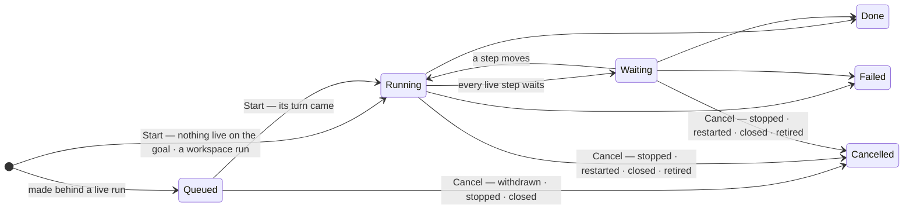
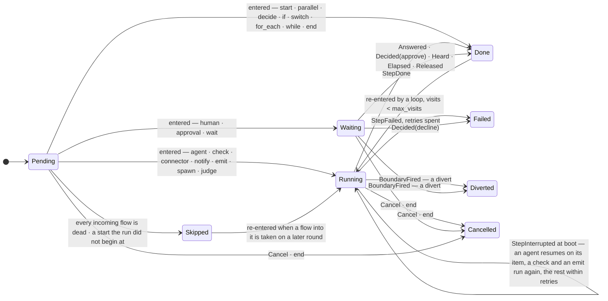
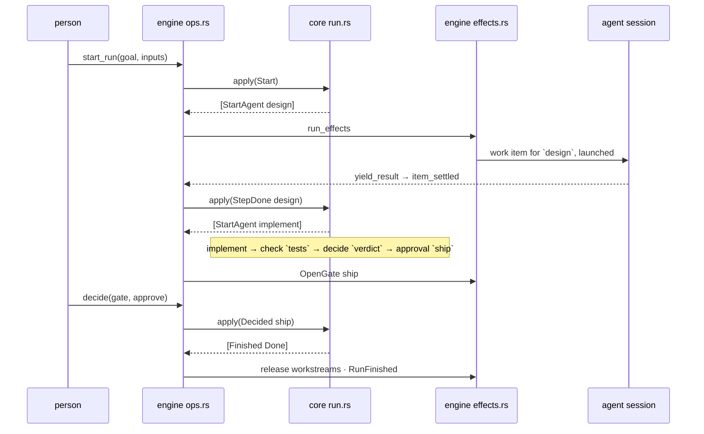
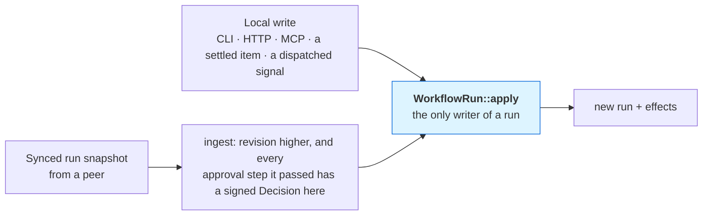

# 03 — Workflows

A goal is a stated want and a **workflow**: a small graph of steps that says how the want becomes
real. Eighteen kinds of step in four families — events, gateways, loops and tasks. One run per
attempt. One function that may change a run. Nothing else moves a goal. A workflow also runs on its
own — a **workspace run**, started from the workflow with no goal behind it
([Runs of the workspace](#runs-of-the-workspace)) — and begins by hand or on an event
([Events](#events)).

A graph rather than a fixed lifecycle, because one engine has to carry software delivery,
research, hiring, an event, a content calendar and an incident alike.

---

## Vocabulary

| Term | Means |
|---|---|
| **Workflow** | a named graph of steps with typed inputs; a reusable definition, versioned by `revision` |
| **Step** | one node: what happens, who does it, what follows |
| **Flow** | a directed edge `from → to`, optionally labelled with a branch of a gateway or a loop, or with the name of a boundary event that diverts |
| **Event** | something a workflow reacts to — a time, a call, a message, a change, a signal: a `StartOn`, a `WaitFor`, a `BoundaryOn` |
| **Start event** | a `start` step: one way a run may begin |
| **Listener** | a start event armed for a **host** — the workspace, for a library workflow that is On, or a goal (`ListenerKey { host, step }`) |
| **Listening** | a host's standing: the inputs its event runs bind, a per-run budget, since when, paused why (`Listening`) |
| **Signal** | the durable, idempotent record of one occurrence; a *named* signal is one a run, a session or a person raises |
| **Boundary event** | an event on a live step: it diverts the step, or acts beside it |
| **Gateway** | a step that routes: `decide`, `if`, `switch`, `judge`, `parallel` |
| **Run** | one execution of a workflow — a goal's, or the workspace's with no goal (a **workspace run**); the only place execution state lives |
| **Home** | where a run's truth is filed: its goal's folder, or a workspace run's own (`Home`) |
| **Template** | a catalog workflow (`library/catalog/workflows/<slug>.toml`), installed like an agent |
| **Connector** | a declarative definition of one outside platform's API — its hosts, its auth scheme, its operations — that a `connector` step calls; installed from the catalog or written by hand ([Connectors](#connectors)) |
| **Account** | this machine's login to a connector's platform: a label, non-secret parameters, and secret fields kept in the keystore; never on the wire |
| **Workflow Agent** | `workflow-agent`, the second core agent: designs, validates and repairs workflows |

Retired words, because they name nothing now: lifecycle state, transition, contract, criterion,
plan, trigger, trigger source, trigger scope, trigger action, trigger condition, probe, watch.

---

## The graph

```rust
pub struct Workflow {
    pub id: WorkflowId,
    pub name: String,
    pub description: String,
    pub inputs: Vec<InputDef>,      // typed parameters a run is started with
    pub steps: Vec<Step>,           // the order is the designer's layout; the graph is `then`
    pub origin: WorkflowOrigin,     // Workspace | Catalog { slug } | Goal { goal } — derived, never sent
    pub author: PrincipalId,
    pub tags: Tags,
    pub decision_making: bool,       // switches the Decision-Making Agent on for every point a run of it reaches
    pub revision: u64,
    pub created_at: u64,
}

pub struct Step {
    pub id: StepId,                 // [a-z][a-z0-9_-]{0,31}
    pub name: String,
    pub kind: StepKind,             // flattened: `kind` plus the kind's own fields
    pub then: Vec<Flow>,            // Flow { to, branch: Option<Branch> }
    pub boundaries: Vec<Boundary>,  // events on the step while it is live
    pub join: Join,                 // All (default) | Any | One
    pub on_fail: OnFail,            // Fail (default) | Skip | Then { step }
    pub retries: u8,
    pub max_visits: u8,             // default 3, never 0 — the bound on every re-entry by a back edge
    pub position: Option<Point>,    // where its card stands on the canvas
}
```

`WorkflowOrigin` is where the definition was born, recorded once and never accepted from a caller
(I28a): `Workspace` for a person's drawing in the library, `Catalog { slug }` for an installed
template, `Goal { goal }` for a **design** — a workflow made for one goal (see [A goal's designs and
the library](#a-goals-designs-and-the-library)).

A workflow says how it begins with **`start` steps**, one per way in, and every step is reachable
from one of them. A workflow that names no `start` begins by hand at its one root: the step nothing
flows into — no `then`, no `on_fail: then` route — and, when every step has something flowing into
it because the first step is a loop's target, the first step in display order
(`Workflow::start_steps`). `Workflow::manual_entry` is where a run by hand begins — the `manual`
start, else that root — and a workflow that names starts and none by hand is **event-only**
(`Workflow::is_event_only`): only its events begin it. Cycles are legal: a review that sends work
back is the normal case, and `max_visits` is what stops a loop from running forever. The flows a
depth-first walk from the starts finds pointing back into a step still on its path are the
workflow's **loop edges** (`Workflow::loop_edges`); the other flows — the forward edges — always
form a DAG from the starts, and `Workflow::successors(step)` lists a step's `then` targets and then
its fail route, once. There is no explicit end node requirement — a run finishes `Done` when every
branch has drained — but an `end` step exists for the workflow that wants to say so, to finish the
run at once, or to fail on purpose.

### The eighteen kinds

Four families (`StepKind::family`), which are the designer's palette groups: **events** — `start`,
`wait`, `emit`, `end`; **gateways** — `decide`, `if`, `switch`, `judge`, `parallel`; **loops** —
`for_each`, `while`; **tasks** — `agent`, `human`, `approval`, `check`, `connector`, `notify`,
`spawn`.

| Kind | What happens | Who moves it | Effect the engine performs |
|---|---|---|---|
| `start` | one way a run begins: `on` is its event (`StartOn` — `manual`, `schedule`, `hook`, `message`, `signal`, `project`, `run`, `platform`, `connector`, `check`), `inputs` maps the event onto the run's inputs, `guard` says what an occurrence does while runs it started still go ([Start events](#start-events)) | nobody — done the moment the run enters it; the starts the run did not begin at are skipped | — |
| `agent` | a work item is created from `instructions`, placed in a workstream of the project `project` names or the goal's only one (a workspace run: the one it names) — or in its home's scratch folder when there is none, where its result is its deliverable — and run by an installed agent; `assignee`, `project`, `harness`, `model` (a pin, never substituted), `effort` (a pin — a level or `auto` — that wins over the agent's and is fitted to what the model takes, [06 § Effort](06-agents-and-teams.md#effort)), `output_schema`, `tier_ceiling` | the session's result | `StartAgent` |
| `human` | a question with `options` (and `multi`) is asked of a person | a person answers — free text and *not sure* always valid | `Ask` |
| `approval` | a yes/no a person signs; a decline **fails the step** | a person decides the `Approval` gate | `OpenGate` |
| `check` | a `command` exits 0 **where the run's work landed** — the checkout of the work item the run's latest agent step ran on (a project's workstream is a worktree beside the root, which would not see the file), else the run's project root, else its home's scratch folder — or an upstream step's output satisfies a JSON `schema` | the engine, bounded by `check_timeout_secs` | `RunCheck` |
| `decide` | `rules` are evaluated in order; with `pick: first` (the default) the first that holds names the branch, with `pick: every` every one that holds names one and their flows are all taken; `otherwise` when none holds | nobody — pure, done at once | — |
| `if` | one condition, `when`; the flow labelled `yes` is taken when it holds, `no` otherwise | nobody — done at once | — |
| `switch` | `on` — a template — is rendered as text and compared, byte for byte, to each of `cases` (`{ value, branch }`); the first match names the branch, else `otherwise`; the output is `{ value }` | nobody — done at once; a subject that cannot render fails the step | — |
| `judge` | the Decision-Making Agent reads `state` — a template — rendered against the run and picks one of `options` (`{ branch, meaning }`) by what each means; the output is `{ choice, confidence, judged }`, the branch read off `choice`; `otherwise` when it is not sure enough (`min_confidence`, or `decisions.confidence.act`) or gives no answer that holds to the decision contract — naming the step switches the Decision-Making Agent on for it ([15 — The Decision-Making Agent](15-decision-making-agent.md#the-judge-step)) | the Decision-Making Agent's answer, or nobody | `Judge` |
| `parallel` | every unlabelled flow out of it is taken at once; the step its branches flow into joins them | nobody — done on entry | — |
| `for_each` | `items` — a template — renders to a JSON array; one `each` per item with the output `{ item, index, count }`, the body flows back into the step, then `done` with `{ index, count }`; bounded by `max_iterations` ([Loops](#loops)) | nobody — done at once on every entry | — |
| `while` | `when` is tested on every entry, the first included: `loop` with `{ index }` while it holds, `done` when it does not; reaching `max_iterations` fails the step | nobody — done at once on every entry | — |
| `connector` | one `operation` of a `connector` installed here is called as an `account` — the connector's default, a fixed id, or an input of kind `account` — with `params`, each a template over the run; the output is what the operation selects from the answer, checked against `output_schema` when one is declared ([Connectors](#connectors)) | the engine, bounded by `connector_timeout_secs` | `CallConnector` |
| `wait` | until a catch event happens (`WaitFor`): a `delay` of `secs`, a moment (`time`), a `schedule`'s `cron`, a named `signal`, a `message`, a `project`'s change, a `run`'s end, a `platform` topic, or a person's — or a call's — `release`; the filters are the start events' own, their templates rendered when the step is entered; `secs` and `cron` are value references ([Catch events](#catch-events)) | the world, the clock, or a person | `Arm` |
| `emit` | a named `signal` is raised with `payload`, each value a template over the run; the output is `{ signal, id }` | the engine — done once raised | `Emit` |
| `notify` | a rendered message is posted to a scope (the goal's thread by default; `general` in a workspace run) as `author` — an agent, the Workflow Agent when none is named — with `mentions` | nobody — done at once | `Post` |
| `spawn` | a child goal is captured from `statement_template`, `refines`-linked — in a workspace run a goal of its own, refining nothing (`GoalOrigin::Run`) — optionally on a `workflow`, whose run is given what the step's `inputs` say: an input of the child to a template of this run, each word read by the kind the child's input declares (`InputKind::read`). A spawn is a start by hand made by a step, so it is held to what the child asks (`SpawnInput`). The child works where its parent does: a goal's child has its parent's projects, a goal born of a run of the workspace the ones its step gives it; `wait` holds the step until the child finishes | the child's run | `SpawnGoal` |
| `end` | an end event: `finish: path` (the default) ends this path and the run finishes when every path has drained; `done` finishes the run now, cancelling what is still live; `failed` fails this step and the run now | — | `Finished`, `CancelWork` |

A `decide` step's rules, an `if`'s `when` and a `while`'s `when` are a closed set of typed
conditions — there is no expression language:

| Condition | Holds when |
|---|---|
| `input_equals { input, value }` | the run's input equals the JSON value |
| `output_equals { step, path, value }` · `output_matches { step, path, contains }` | an upstream step's output at a dotted path equals, or contains as text |
| `answered { step, option }` | an upstream `human` step's answer picked the option |
| `outcome { step, passed }` | an upstream `check` or `approval` step is `Done` (`true`), or `Failed` or diverted by one of its boundary events (`false`) |
| `between { from_hour, to_hour }` | the UTC hour of *now* is in the window; `from > to` wraps midnight |
| `all { of }` · `any { of }` · `one { of }` · `not { of }` | every, at least one, exactly one, or none of the conditions in `of` holds — and, or, exclusive-or and not over conditions; an empty `all` holds, an empty `any` or `one` does not; nesting is bounded (`Condition::MAX_DEPTH` is 8) and an empty combinator is refused (`BadCondition`) |

`Join` is the same three words at fan-in: `all` (every incoming forward flow has arrived or died),
`any` (the first arrival is enough — and the slower arm of the same fan-out is not a second: once
the step ran, only a source *entered* after it is a new round, so a loop still re-enters it),
`one` (exactly one arrives once every one that could has
settled — a second arrival fails the step, the exclusive-or of the gates; judged on the arrivals
since the step last finished, so a loop target with `join: one` re-enters).

### Gateways

A gateway routes and does nothing else. `decide`, `if`, `switch` and `judge` **choose one** branch;
a `decide` with `pick: every` **chooses every** branch whose rule holds — the inclusive gateway —
and `otherwise` only when none does; `parallel` takes **all** of its flows at once. What a gateway
chose is on its record — `StepState::Done { branches }`, empty for a step that names none — and the
flows read it ([How the graph runs](#how-the-graph-runs)). There is no merging gateway: the step the
branches flow into joins them, and a join waits only for the flows that can still arrive, so
whichever paths a gateway did not take never hold it up. A **race** — the first event wins — is a
`wait` with boundary events that divert ([Boundary events](#boundary-events)).

### Loops

A loop was always a back edge — a flow into a step already on the path from the start — bounded by
the target's `max_visits`. Two kinds now *drive* one. `for_each` parses its `items` once, on first
entry, into a `LoopCursor { items, index }` kept on its `StepRecord` — the one field the entry
reset leaves alone — and on every entry dispatches the next item along `each` or, when the list is
spent, takes `done` and clears the cursor. `while` keeps only the index and tests `when` on every
entry. The body's last step flows back into the loop step (a loop edge, so it never holds the loop
step's join); that arrival is what advances the cursor.

A re-entry with a cursor is an **iteration, not a visit**: `max_visits` bounds how often the loop
*starts* (an outer rework loop restarting it parses a fresh list), `max_iterations` (default 100)
bounds iterations within one start — a `for_each` whose list is longer fails on first entry, a
`while` fails when the bound is reached — and on every dispatch the loop step resets the `visits` of
every step in its body (`Workflow::loop_body`: the steps on the body branch's side that flow back
into it), so a body step's own `max_visits` bounds rework inside one iteration rather than the
number of iterations. Validation refuses a loop whose body never returns (`LoopWithoutReturn`), an
exit flow that leads back into the loop (`LoopExitReturns`) and `max_iterations: 0`
(`ZeroIterations`). A switch's subject and a loop's items render inside the run machine with no
goal text, so `{goal.…}` in either is refused as `BadTemplate` — the machine reads no goal.
### Inputs and references

`InputDef { name, label, kind, default, required }` with `InputKind` one of `text`, `number`,
`bool`, `choice { options }`, `assignee`, `project`, `account { connector }`. A step that needs an
assignee, a project, a delay's seconds, a schedule's cron or a connector's account holds a
`ValueRef`: either `{ "input": "<name>" }` or a fixed value; `StepKind::input_refs` lists every reference a kind carries with the input kind it wants. A
template cannot know a ULID or a pubkey, so a template's `agent` steps name catalog agents by slug
and leave people, projects and moments to inputs. Every input a definition declares is read by
something — a placeholder, a reference or a `decide` rule — or it is a problem (`UnusedInput`).

The input contract is one function, `Workflow::bind_inputs(given)`: a supplied value fits its kind,
a missing one takes its default, a required one with no default is refused, and a name the
definition does not declare is refused (`InputError`). A run starts through it and an amendment is
re-bound through it, so a run never holds inputs its definition cannot read.

A misspelled key — on a step, an input, a flow, a rule, a definition or a request body — is
refused by name, never dropped: the kind's field table (`StepKind::fields_of`, `InputKind::fields_of`)
is the wire's closed vocabulary.

### Templates in strings

Every string a step renders — instructions, a prompt, a notification, a spawned statement, a
`check` command — may hold placeholders, and the grammar is closed
(`core/template.rs`):

| Placeholder | Resolves to |
|---|---|
| `{inputs.<name>}` | the run's input |
| `{steps.<id>.output}` · `{steps.<id>.output.<path>}` | an upstream step's output, whole or at a dotted path |
| `{steps.<id>.answer}` | an upstream `human` step's answer |
| `{goal.statement}` · `{goal.title}` | the goal — a goal's run only: a workspace run has none, and a step that reads one is `NeedsGoal`, refused at the start |
| `{{` · `}}` | a literal `{` or `}` — a JSON example in prose is written `{{ "plan": "…" }}` |

Those are the roots of `Grammar::Run` — a workflow step's. **No step reads the event that began
its run**: a `start` step's input mapping is read under `Grammar::StartMapping`, whose one root is
`{event.<path>}` — the whole signal, so `{event.payload.<path>}`, `{event.at}`, `{event.id}`,
`{event.name}` — and its event's own fields under `Grammar::StartEvent`, whose one root is
`{inputs.<name>}`, the inputs the host listens with. An `{event.…}` anywhere else, and anything but
it in a mapping, is a problem (`StartPlaceholder`). A connector definition's strings read
`Grammar::Connector`, whose only roots are `{account.<param>}` and `{params.<name>}`. The sets are
disjoint on purpose, so a step cannot smuggle a `{params.x}` past validation
(`ParamOnlyPlaceholder`) and a definition cannot read a run it is not part of.

An unknown root is a **validation problem**, refused before the workflow is saved, and the sentence
says how to write a brace literally. A value absent at render time is `Unresolved`, which the engine
records as `StepFailed` — a placeholder is never left in the text for an agent to read as an
instruction — **with the reason** (`Absence`): which step, and whether it has not run yet, is still
running, failed (its error), was diverted by a boundary event, is done with nothing yielded, or
yielded other fields —
*`{steps.review.output.findings}` has no value in this run: step `review` yielded `verdict`, `summary`
and no `findings`* — so the step's row, the goal's banner and the Workflow Agent's repair read the
cause and not just the reference. One scanner (`segments`) reads a template for both `placeholders`
and `render`, so what validation accepts is exactly what a run renders; a `}` outside a placeholder is
text either way.

**The shape a step yields is its `output_schema`, never JSON in its instructions.** The executor
appends the schema to every work item's first prompt (`result_protocol`) and the intake judges the
result against it, so an instruction that spells the shape again is a second copy that drifts. A
template's instructions say in words what the step produces; every field a later step reads —
`{steps.<id>.output.<field>}`, an `output_equals` rule, a schema check — is in the producer's
`required`, because an optional field a session omits resolves to nothing. `validate` holds every
workflow to it (`UnpromisedOutput`: a field the schema does not require, nothing at all without a
schema, a key a fixed-shape kind never writes) and to the order a reader needs (`NotAssured`, under
[Validation](#validation)); the bundle pins the instruction rule
(`no_agent_instruction_spells_its_result_shape`).

There are two render contexts (`RenderContext`). Prose — instructions, prompts, notifications, a
wait's or a boundary's filter, an emit's payload — substitutes values as they are (`Text`). A
`check` command — a step's, and a check start's — is handed to `sh -c`, and there every
**substituted value** is single-quoted (`ShellCommand`, `shell_quote`: `'…'` with `'\''` for a
quote inside), so a run input that a hook's body filled and that reads `a; touch marker` is one
word to the shell, never a second command; the template's own text is the author's and is not
quoted. `sh -c {inputs.command}` therefore renders as `sh -c 'npm test'`, which is how a template
lets an input hold a whole command line.

---

## Events

**An event never acts. It is written down, and a run begins — or moves — from what was written.**
Pure rules in the core, effects in the engine: what an event is, what it matches
(`core/listen.rs` — every filter has one `hears(&Heard) -> bool`, exact, no coercion), how it maps
onto a run's inputs, what the guard lets through and what the causal chain refuses are functions
with unit tests; the engine's `listen/` observes, enqueues and dispatches, and decides nothing
those do. The person's guide is [Events and gateways](../guide/events.md).

### Start events

```rust
pub enum StartOn {                       // tagged `event`
    Manual,
    Schedule { schedule: Schedule },     // every | cron + tz
    Hook { public: bool },
    Message { filter: MessageFilter },   // in?, from, mentions?, contains?
    Signal { filter: SignalFilter },     // name, fields
    Project { filter: ProjectFilter },   // project?, change, branch?, glob?
    Run { filter: RunFilter },           // workflow?, outcome?
    Platform { filter: PlatformFilter }, // topic, fields
    Connector { connector?, operation?, account?, params, key?, schedule },
    Check { command, project?, fire_on: FireOn, schedule },
}

pub struct Guard { debounce_secs: u64, overlap: Overlap }   // Queue (default) | Skip | Parallel(n)
```

A start's event fields are fixed values, `{inputs.<name>}` templates or `{ input }` references over
the inputs its host listens with, resolved when the start is armed (`StartOn::resolve`), so a
template stays generic. `map_event(mapping, inputs, event)` is the one reader of an event: each
mapped input is rendered against the signal and shaped to its kind (a `number` parses, a `bool` is
`true` or `false`); an optional input the event does not fill keeps its default, a required one
refuses the occurrence. `Guard::admit(live, since_last_start)` is the guard's verdict — start, hold
in the backlog, or drop (debounced, or busy under `skip`) — counted over the listener's **live
runs**, never over dispatches, and the debounce is met once, when an occurrence is first claimed.

A `project` start observes the repository, never the IDE: the watcher runs only for roots a person
has open and the code host sends nothing, so the engine's ticker reads the branch heads, the
remote-tracking branches, the tree's status (a plain folder: a bounded scan) and — at
`events.pr_poll_secs`, sooner when a workstream moved — the state of the pull requests the
platform's workstreams opened or adopted. The first look learns. A `connector` start polls one
**read** operation and an occurrence is one item whose `key` no earlier poll saw. A `check` start's
command is judged by the guard when its host is turned on and again at every fire.

### Listening

```rust
pub enum ListenerHost { Workspace { workflow }, Goal { goal } }  // `workspace:<wf>` · `goal:<goal>`
pub struct ListenerKey { host: ListenerHost, step: StepId }      // `<host>/<step>`
pub struct Listening { inputs, budget: Option<Budget>, since, paused: Option<Paused> }
pub enum PauseReason { RunFailed { run }, BudgetSpent }
```

- **A library workflow is turned On by a person** (`listen::turn::turn_on`): refused while it has
  problems, is archived or a goal's design, has no start on an event, reads its goal, carries a
  check start a guard rule refuses, or is not given what listening needs
  (`Workflow::listening_needs`: the union, over its event starts, of the required inputs a start
  does not map and no default fills, and of the inputs its event's own fields read). Its record is
  local truth beside its definition — a toggle is never a revision, and a workflow stays on its
  host. Each occurrence begins a **workspace run** at that start, its inputs the listening inputs
  overridden by the start's mapping, its ceiling `Listening.budget`, else `budget.default.*`.
  Turning on starts every listener's memory afresh; Off removes the record and settles what was
  queued; archiving turns it off.
- **A goal listens while it is open.** Its standing is `Goal.listening`, on the goal's own
  snapshot. **One door begins a goal's work**, `ops::begin_goal(goal, inputs, Begin)`:
  `Begin::Auto` — a person's Start, an adoption, an auto adoption, a capture that starts — arms the
  goal when its workflow has event starts (with the inputs given, or, given none, with what it
  listened with before; an input nobody gave is read at its default, by an event's own fields as
  by a run's steps — `Workflow::with_defaults`) and runs it by hand otherwise; `Begin::RunNow` — a
  `spawn`, *Run now* — runs at the manual entry. Each occurrence begins a run on the goal, one of a
  listener's at a time and at most one queued behind the goal's live run. A failed run **pauses**
  listening and withdraws the runs its events had queued, so a repair has a gap; a spent budget
  pauses it too. An adopted repair, or *Listen again*, unpauses it. Stop, close, archive and delete
  end it.
- **Auto adoption arms only what nobody needs to see** (`StartOn::arms_unattended`): a schedule, a
  signal, a run's end, a platform topic, a message. A hook, a check, a connector or a project start
  opens the Adopt gate, saying why.
- **The registry is a projection.** The armed listeners (`listen::registry`) are built from the
  listening hosts and the definitions as they stand, each start resolved against its host's inputs,
  and dropped whenever what they are built from may have moved — a host turned on or off, a
  definition, a goal, a connector, a project, the people an input may name, an `events.*` setting —
  and on every tick. A start that cannot be armed is said once (`ListenerFailed`) and skipped. A
  listener's memory (`ListenerRuntime`: when it is next due, what it has seen) belongs to the
  digest of its resolved start, so a start that changed starts its memory afresh.
- A save that removes a public hook start its listening host still answers on is refused: its
  secret, and the caller outside, would break silently.

### Catch events

```rust
pub enum WaitFor {                       // tagged `until`
    Delay { secs }, Time { at }, Schedule { cron, tz },
    Signal { filter }, Message { filter }, Project { filter }, Run { filter }, Platform { filter },
    Release,
}
```

`RunEvent::Heard { step, payload, chain }` completes a wait on something the world did — the
payload is the step's output — `Elapsed` one on a clock, `Released { step, payload? }` one a person
or a call lets go. A goal's run hears its goal's events and the workspace's; a workspace run never
hears a goal's (`SignalScope::heard_by`). The engine's `waits.rs` is the projection of the armed
waits: armed by the `Arm` effect, re-armed from the snapshot at boot, a clock counting from the
step's entry. Every named signal is recorded once, heard or not, so a `signal` wait re-armed after
a restart replays what it missed.

### Boundary events

```rust
pub struct Boundary { name: Branch, on: BoundaryOn, act: BoundaryAct }   // the act flattened
pub enum BoundaryOn { After { secs }, Every { secs, max }, Message { filter }, Signal { filter } }
pub enum BoundaryAct { Divert, Notify { scope?, template, mentions, author? }, Emit { signal, payload } }
```

A boundary event sits on a step whose work can be stopped — `agent`, `human`, `approval`, `wait`, a
`spawn` that waits (`may_carry_boundaries`, exhaustive over the kinds). A **divert** makes the step
`Diverted { by }` — terminal — and returns `CancelWork`: the session ended and its item cancelled,
the gate withdrawn, the wait disarmed, a `spawn` no longer waited for while its child goes on; only
the flows labelled with the boundary's name are taken. An **act** returns
`RunEffect::BoundaryAct { step, boundary }` — a post as a `notify` step makes, or a named signal —
and the step goes on; an act has no flows. A reminder (`every`) never diverts.

`RunEvent::BoundaryFired { step, boundary, entered, payload, chain }` names the visit it fires for:
one whose `entered` is not the step's is `RunError::StaleBoundary`, an unknown name
`RunError::UnknownBoundary` — refusals both, so a boundary of an earlier visit can never move a
later one. `StepRecord.fired` counts each boundary's fires in the current visit and an entry resets
it. **There are no arm and disarm effects**: the engine's boundary registry is synced from the
snapshot after every write of the run and at boot (`waits::sync_boundaries`), a timer due from the
visit's entry and its `fired` count, a reminder never past its `max`. **A step has one clock**: a
`wait`'s own `delay` or `schedule` counts from the moment the step was entered too
(`StepRecord.started_at`) — when it is first armed and when a restart arms it again — so a delay and
a timeout of the same length are due in the same tick, whatever second the engine got round to
arming either. What one tick or one event wakes fires in order — the step's own catch or
completion, then the diverts, then the acts, each in declaration order. `on_fail` stays the error
boundary.

### Throw and end

An `emit` step raises its signal through the one emit door (`listen::emit`), the door a session's
`emit_signal`, `POST /signals`, `bisa signal emit` and an A2A task go through: the name rule, the
payload cap, the causal chain and the durable record are one code path. Its dedupe key —
`emit:<run>:<step>:<entered>` — makes a step that runs again after a restart the same signal. An
emit never fails because a listener refused it. An `end` step's `finish` is `path`, `done` or
`failed`; `failed` makes the end step the step that failed (`ENDED_FAILED`).

### Durable, deduplicated, never in a loop

```rust
pub struct Signal { id, listener: Option<ListenerKey>, source: SignalSource, name: Option<String>,
    at, payload, scope: SignalScope, chain: Chain, dedupe_key: Option<String> }
pub struct Chain { depth: u32, listeners: Vec<ListenerKey> }
```

- **Durable before dispatch.** An occurrence is appended to `events/queue.jsonl` and indexed before
  anything acts; `(host, step, dedupe_key)` is unique, and every source sets a key — a schedule's
  due time, a hook's delivery id, a message's id, a run's id, a branch and its commit, a pull
  request and its state, a poll's item key, an emit's step and visit.
- **One signal, one run.** The worker (`listen::dispatch`) claims a signal, meets its listener's
  guard and makes its run with the signal's id as `WorkflowRun.dispatched`, which the index holds
  unique: a dispatch replayed after a crash is refused as already dispatched and settles. A restart
  keeps the run's start and event, never `dispatched`.
- **The loop guard is the causal chain.** A signal carries the listeners that led to it; a run
  keeps its event's chain and widens it with every chained event it hears (`Chain::absorb`); what
  the run raises, posts or commits carries it on. A listener already in the chain refuses, and a
  chain stops at `events.chain_depth`. Every start but a schedule's, a hook's and a person's is
  held to `events.fires_per_minute`; a `signal` start's overflow waits in the backlog. The
  listening runtime's own topics are never heard back.
- **What comes from outside is read first.** A public hook's body is redacted before it is stored
  and held — like a connector start's item — until the classifier is sure it is safe; a harmful
  reading or no verdict keeps the signal `held`, its reason on it and on its host's Inbox row,
  until a person lets it through ([11 — Security](11-security.md)). A message is heard only where
  conversation dispatch hears it, after the hold a message from another node waits in, and never
  an announcement.
- **`events.enabled` is the machine's switch**: off, the ticker looks at nothing, the worker claims
  nothing and the hooks take nothing — and a run's waits and boundary events go on, since the ear
  that feeds them is never off.

---

## Validation

`Workflow::validate(&self, &ValidationCtx { assignees, workflows, projects, harnesses, models,
spawns, connectors, accounts, topics, event_only, asks, checks }) -> Vec<Problem>` is pure, exhaustive,
and never stops at the first finding. A `Problem` names a step (when one is at fault), a
`ProblemKind` and a sentence. The context is what the workspace knows and a definition cannot: who
exists, which workflows and projects exist, which harness ids the runtime can launch and which
models each lists, which workflows spawn which, which only events begin and what each asks of
whoever starts it, which connectors are
installed and which accounts this machine holds, which topics the engine emits, and — through the
`SyntaxChecks` trait the store implements with the crates the engine schedules and checks with —
whether a cron expression or a JSON Schema parses. The kinds are closed (sixty-one;
`ProblemKind::ALL` is produced by the same macro that declares the enum):

| `ProblemKind` | Refuses |
|---|---|
| `EmptyName` | a workflow or step with no name |
| `DuplicateStepId` · `DuplicateInput` | two steps or two inputs sharing a name |
| `NoStart` · `ManyStarts` | a workflow that names no `start` step and has no step without an incoming flow, or more than one |
| `StartHasIncoming` | a flow, or an `on_fail: then` route, leading into a `start` step |
| `ManyManualStarts` | more than one `start` by hand: a run by hand begins at one |
| `ManualStartConfigured` | a `manual` start with an input mapping or a guard: there is no event to map and nothing to guard |
| `StartPlaceholder` | `{event.…}` read outside a start's input mapping; a mapping reading anything but the event; a start's event fields reading anything but the listening inputs |
| `UnknownStep` | a `then`, an `on_fail: then`, a `check` `of` or a condition naming a step that does not exist |
| `Unreachable` | a step the start cannot reach over `then` and `on_fail: then` |
| `SelfFlow` | a step flowing to itself |
| `BranchWithoutRule` · `RuleWithoutFlow` · `DuplicateBranch` | a branching step — `decide`, `if`, `switch`, `judge`, `for_each`, `while` — whose labelled flows and the branches it can choose (`StepKind::branches`) are not the same set, one to one; a `switch` with two cases for one value; a boundary event that diverts with no flow labelled with its name; a boundary named as one of its step's branches or as another of its boundaries |
| `LabelledFlowOnPlainStep` · `UnlabelledFlowOnDecide` | a label on a step's flow that is neither a branch of its kind nor the name of one of its diverting boundaries, or a branching step's flow without one |
| `BoundaryOnInstantStep` | a boundary event on a kind that cannot be stopped mid-flight: anything but `agent`, `human`, `approval`, `wait` and a `spawn` that waits |
| `ReminderInterrupts` | a reminder (`every`) that diverts: it would stop the step at its first tick |
| `BadTimer` | a timer of zero seconds; a reminder that may fire zero times; a schedule that is neither `every` nor `cron`, or both |
| `BadSignalName` | a signal's name — an `emit`'s, a start's, a wait's, a boundary's — that is not dotted lowercase words |
| `BadPoll` | a `connector` start whose operation writes, takes a `file` parameter, or names no `key` |
| `UnknownTopic` | a `platform` start, wait or boundary naming a topic the engine does not emit — judged once the runtime has described itself |
| `SpawnNeedsManualEntry` | a `spawn` naming a workflow only events begin: a child's run starts by hand |
| `SpawnInput` | a `spawn` that gives its workflow an input it does not declare, or leaves out one it requires and no default fills: the child's run could never start |
| `NotUpstream` | a condition, a schema check or a `{steps.x…}` placeholder naming a step that is not an ancestor — or the wrong kind of ancestor (`answered` needs a `human`, `outcome` a `check` or `approval`) |
| `NotAssured` | a `{steps.x…}` placeholder or a schema check naming an ancestor that is not sure to have run when the step is entered: it runs after the step on a loop's first pass, a branch or an `any` join reaches the step without it, or it may have failed and been passed over (`on_fail` skip or then) — a rule is not held to this, since an absent value reads `false` |
| `NoSuchOutput` | reading the output of a kind that yields none (`start`, `parallel`, `decide`, `if`, `end`, `approval`, a `wait` on a clock), a `human`'s output rather than its answer, or the answer of a step that is not `human` |
| `UnpromisedOutput` | `{steps.x.output.<field>}` or a rule's path whose first segment the producer does not promise: not in its `output_schema`'s `required`, nothing at all without a schema, or a key a fixed-shape kind never writes (`check` `{evidence}`, `notify` `{message}`, `emit` `{signal, id}`, `spawn` `{child}` and `{outcome}` when it waits, `switch` `{value}`, `while` `{index}`, `for_each` `{item, index, count}` on its body side and `{index, count}` past it); what a `wait` hears — or a release carries — is the world's, any path |
| `UnknownInput` · `InputKindMismatch` | a `ValueRef` or placeholder naming no input, or an input of the wrong kind |
| `UnknownPlaceholder` · `BadTemplate` | a placeholder with an unknown root, or braces that do not parse |
| `ZeroVisits` | `max_visits: 0` |
| `UnknownAssignee` · `UnknownWorkflow` · `UnknownProject` | a fixed reference that resolves to nothing in this workspace |
| `EndWithSuccessors` | an `end` step with a `then` |
| `BadQuestion` | `human` options that fail the question rules (an empty id, two recommended, …) |
| `UnusedInput` | an input no placeholder, reference or rule reads |
| `EmptyRules` | a `decide` step with no rules, or a `switch` with no cases — either always takes `otherwise` |
| `UnknownHarness` · `UnknownModel` | an `agent` step naming a harness the runtime cannot launch, or pinning a model its harness does not list |
| `UnsupportedEffort` | an `agent` step pinning an effort when no harness it could run on has the control |
| `BadCron` · `BadSchema` | a fixed cron expression the scheduler cannot read; an `output_schema` or a `check` schema that is not a JSON Schema |
| `SpawnCycle` | a `spawn` whose target spawns this workflow back, at any depth |
| `NotifyScopeUnknown` | a literal `notify` scope that is not a channel, goal or workstream id |
| `NotifyAuthorNotAnAgent` | a `notify` step's `author` is a person or a team; only an agent speaks for a workflow |
| `BadCondition` | a condition nesting deeper than eight, or an `all`/`any`/`one` with nothing in it |
| `LoopWithoutReturn` · `LoopExitReturns` · `ZeroIterations` | a loop whose body never flows back into it; an exit flow that leads to a step that does; `max_iterations: 0` |
| `UnknownConnector` · `UnknownOperation` | a `connector` step naming a connector not installed here, or an operation its connector does not have |
| `MissingConnectorParam` | a parameter the operation requires left unset, or one it does not declare |
| `UnknownAccount` | a fixed account that is not one of this connector's here; no account named when the connector needs one and none is the default (or the only one); at start, an input holding an id that is not one of the connector's accounts |
| `UngatedWrite` | a `connector` step calling an operation that writes with no `approval` or `human` step upstream and no `unattended: true` of its own — a write nobody gated and nobody said they meant to leave ungated |
| `ParamOnlyPlaceholder` | a step string reading `{params.…}` or `{account.…}`, which only a connector definition may |
| `Unfilled` | a choice not made yet: a `connector` step's connector or operation, a schema `check`'s `of`, an `account` input's connector — each `Option` on the wire, absent until the designer picks one. The checks that depend on the choice wait for it: an unfilled connector is one problem, not `UnknownConnector` and every parameter besides |
| `NeedsGoal` | a step reading `{goal.statement}` or `{goal.title}` in a workspace run, which has no goal — never a problem of the definition, only of where it is started (`Workflow::scope_problems`); the library row carries it as `workspace_problems`, and the card says *runs on a goal* |

**A reader counts on what is sure to be there.** `Workflow::assurance` says, for every step, which
steps' outputs (or a `human`'s answer) are **present** and which steps have **settled** on every
entry of it — one pass in topological order over the forward edges (`then` flows and `on_fail: then`
routes minus the loop edges), every start a root: an edge brings its source's own assurance plus the
source, except to `present` when the edge may be taken after the source failed or was diverted (its
fail route, an unlabelled flow from a `skip`, any flow into the `then` target, a flow labelled with
a diverting boundary's name); a step counts on the **intersection** over its forward
edges; a step that joins with `all` or `one` waits for every forward edge, so it also counts on each
arm that is **sure** to arrive — an unlabelled flow from a source entered whenever some step already
settled at the join is — which is what lets a fan-in behind a `decide` read every arm; an `any` join
keeps the intersection. A placeholder or a schema check outside `present` is `NotAssured`, and the
sentence says which of the three it is; `loop_sides` names a `for_each`'s body and exit for the keys
each side may read. Every shipped template satisfies the rule
(`every_workflow_template_validates_against_the_catalog_staff`).

The store builds the context from the enabled agents, teams and members, the workflow ids and the
project ids, every workflow's spawn targets, and the runtime the engine described
(`KnownRuntime { harnesses, models, effort_harnesses, topics }`, set at boot and once every adapter has listed its
models). Four checks are soft by construction: a harness name, a topic and an effort pin are judged
only once a runtime has described itself (an offline tool with no engine skips them), and a model
pin only against a harness whose model list is known. Validation runs on **create**, on **update**, when a
run **starts**, when a host is **turned on**, when a run is **amended**, and — without recording
anything — when an agent calls
`validate_workflow`. **A save is a draft; a start refuses.** `POST /workflows`, `PUT
/workflows/{wfid}` and a goal's design keep a definition with its problems and return them; the
catalog installer, a proposal and a promotion refuse them; `Start` and `Adopt` refuse them.

What only a run's bound inputs and its scope can be wrong about is asked when they bind, not when
the step is armed deep into the run: `Workflow::validate_bound(&scope, &inputs, &accounts,
&checks)` returns the scope's problems (`NeedsGoal` for a workspace run) and the same `Problem`s for a cron read from an input that does not parse (`BadCron`), a delay or a timer read from
an input that is not whole seconds (`InputKindMismatch`), a `notify` scope read from the inputs
that is not a channel, goal or workstream id
(`NotifyScopeUnknown`), a `notify` author read from the inputs that is not an agent
(`NotifyAuthorNotAnAgent`), and a connector account read from an input that is not one of the
connector's accounts on this machine (`UnknownAccount`); a scope that reads a step's output is the
run's to judge. The store's
`create_run` calls it after `bind_inputs` and before anything is written, so every start — a
person's, or the one a dispatched signal makes — refuses with `WorkflowInvalid`; an amendment and an
adoption are checked the same way, and turning a library workflow on asks the scope's question too.

---

## The run

```rust
pub struct WorkflowRun {
    pub id: RunId,
    pub scope: RunScope,                     // a goal's or the workspace's — recorded at creation, never changed
    pub workflow: Workflow,                  // a frozen copy — an edit to the library changes no run
    pub inputs: BTreeMap<String, Value>,
    pub start: Option<StepId>,               // the start it begins at; a queued run by hand learns it at Start
    pub event: Option<Signal>,               // the occurrence that began it, or a test run's sample
    pub dispatched: Option<String>,          // the queued signal it was made from: one signal, one run
    pub chain: Chain,                        // the listeners behind it, widened by every chained event it hears
    pub steps: BTreeMap<StepId, StepRecord>,
    pub queued_at: u64,                      // when it was made; the queue's order is (queued_at, id)
    pub started_at: Option<u64>,             // None while a goal's run is queued behind its live run
    pub finished_at: Option<u64>,
    pub outcome: Option<RunOutcome>,         // Done | Failed
    pub cancelled: Option<CancelCause>,      // Stopped { rationale? } | Restarted | Withdrawn | Closed { reason } | Retired
    pub seq: u64,                            // orders step settlements, so a loop knows what is new
    pub revision: u64,                       // one per accepted event; the store's compare-and-swap key
}

pub struct StepRecord { state: StepState, visits: u8, attempts: u8, seq: u64, entered: u64, started_at, finished_at,
    output: Option<Value>, answer: Option<Answer>, work_item: Option<WorkItemId>, gate: Option<String>, error: Option<String>,
    cursor: Option<LoopCursor { items: Option<Vec<Value>>, index: u32 }>,   // a for_each's or while's place; survives the entry reset
    fired: BTreeMap<Branch, Fired { count, seq, at }> }                      // the boundary events that fired this visit; an entry resets it

pub struct RunEntry { step: Option<StepId>, event: Option<Signal> }          // where a run begins and what began it; by hand, neither

pub enum RunScope {                          // tagged `scope`
    Workspace { budget: Budget },            // a workspace run: no goal, its ceiling frozen when made
    Goal { goal: GoalId },                   // a goal's run
}
pub enum Home { Goal { goal }, Run { run } } // WorkflowRun::home(): the goal, or the run itself
```

### A run's states

A goal has **at most one live run** — started and unfinished. A run made while one is live is
**queued**: it holds its frozen workflow and its inputs and starts on its own, in `(queued_at, id)`
order, when the live run ends — done, failed, stopped or restarted — and at boot when a goal has
nothing live and a queue. A workspace run is never queued: it starts when it is made, beside any
other. A run ends by an outcome or by `Cancel { cause }`, and the cause says why: a person
**stopped** the goal (the queue withdrawn with it) or the workspace run, **restarted** it (a new run
of the same workflow and inputs starts at once — ahead of a goal's queue, or beside the workspace's
other runs), **withdrew** a queued run, **closed** the goal, or **retired** the workflow of a
workspace run that was going.



### A step's states



### Events and effects

`WorkflowRun::apply(&mut self, event: RunEvent, now) -> Result<Vec<RunEffect>, RunError>` is the
one function that changes a run. An `Err` leaves the run byte-identical.

| `RunEvent` | Accepted when | Effects it may return |
|---|---|---|
| `Start` | the run has not started (`started_at` is `None`); refused `AlreadyStarted` after | the run enters the start it begins at — its entry's step, else the manual entry — and skips the other starts; then the successors' entry effects |
| `StepStarted { step, work_item }` | the step is `Running` (an `agent` step) | — |
| `StepDone { step, output }` | the step is `Running` | the successors' entry effects, `Finished` |
| `StepFailed { step, error }` | the step is `Running`, or a `Waiting` `human` step — the person's last *not sure*, with their words — or a `Waiting` `wait` step that cannot be armed (a field that does not render, a schedule with no next occurrence) | the same effect again while `retries` remain; then per `on_fail` |
| `StepStopped { step, error }` | the step is `Running` and a `connector` — a write that may already have reached the platform, with no idempotency key to make a resend safe | never the effect again, whatever its `retries`: the attempt counts, the step is `Failed` with the reason, and `on_fail` decides |
| `StepInterrupted { step }` | the step is `Running` and its kind dies with the process — agent, check, connector, judge, notify, emit, spawn (`dies_with_the_process`) | what a restart sends at boot (`recovery::sweep`), never a failure of the step's own: `attempts` is untouched and `error` says *interrupted by a restart* — but the record counts its `interruptions`, and past `MAX_INTERRUPTIONS` (3) the step takes the fail path with `INTERRUPTED_TOO_OFTEN`, so a step that kills the node is not resumed on every boot. An `agent` step with a work item → `ResumeAgent` on that item; an `agent` with none, a `check`, an `emit` (its dedupe key makes the repeat one signal) → its entry effect again; a `connector`, `judge`, `notify` or `spawn` → the effect again only while `attempts < retries` — the author accepted a repeat — else `Failed` and the fail path |
| `Answered { step, answer }` | a `Waiting` `human` step; the answer passes the question's rules | successors |
| `Decided { step, approve, approval }` | a `Waiting` `approval` step | successors, or the fail path |
| `Heard { step, payload, chain }` · `Elapsed { step }` · `Released { step, payload? }` | a `Waiting` `wait` step of the matching kind; the payload is the step's output and the chain widens the run's | successors |
| `BoundaryFired { step, boundary, entered, payload, chain }` | the step is live, may carry boundaries, has a boundary of that name, was entered at `entered` and the boundary may fire again (`StaleBoundary`, `UnknownBoundary` otherwise) | a divert: the step is `Diverted { by }`, `CancelWork`, then the flows labelled `by`; an act: `BoundaryAct` |
| `Amended { workflow }` | no non-`Pending` step changes id, kind or boundary events; no finished step changes its `then`; the start the run began at is such a step, the starts it did not begin at may change and are skipped | entry effects for anything newly enterable |
| `Cancel { cause }` | any time before the run finishes, queued or live; absorbing — a finished run refuses it, like every event, with `Finished` | `CancelWork { steps }` when anything was live, then `Cancelled { cause }` |

| `RunEffect` | The engine does |
|---|---|
| `StartAgent { step }` | render the instructions, resolve the references — the project by the placement rule: named (attached, on a goal), the goal's only, or none and the home's scratch — create a work item bound to `(run, step)` and filed in the run's home, place it in that project's workstream or in scratch, and launch it |
| `ResumeAgent { step, work_item }` | relaunch the **existing** item after a restart: an `Accepted` item whose result is in the journal completes the step at once; a cancelled, rejected or reviewed one fails it; any other — open, claimed, in progress or blocked by the interruption — is admitted by the preflight as a resume (`Launch::Resume`; the session is not the work), its `interruptions` counted up, and launched again in the workstream it already has — the same checkout, the half-finished edits in it — with one line in the prompt: *a previous session on this work was interrupted by a restart; its work so far is in this checkout* |
| `Ask { step }` | open an `Escalation` gate with the question (subject `step:<run>/<step>`) |
| `OpenGate { step }` | open an `Approval` gate (subject `approval:<run>/<step>`) |
| `RunCheck { step }` | run the command where the run's latest agent item worked (`check_cwd`: the item's checkout, else the project root, else scratch), or validate the upstream output; pass → `StepDone`, else `StepFailed` |
| `CallConnector { step }` | resolve the account and its credential, render the parameters, build and send the request through `bisa-connectors` under the host policy and `connector_timeout_secs`; the selected answer → `StepDone`, a refused host, a missing account, a failed call or a schema miss → `StepFailed` with a scrubbed, redacted reason |
| `Judge { step }` | render `state` and `instructions`, put a `choice` question over `options` to the Decision-Making Agent ([15](15-decision-making-agent.md#the-order-of-one-judgement)); the branch it takes is always `StepDone { choice, confidence, judged }` — an unsure or a failed judgement still finishes the step, on `otherwise` |
| `Arm { step, until }` | resolve the wait against the run and register it: a filter the ear offers events to, a due time, or a person's release; one that cannot be resolved fails the step with the reason |
| `Emit { step }` | render the name and the payload, raise the signal through the one emit door with the run's chain and the key `emit:<run>:<step>:<entered>`, then `StepDone { signal, id }` |
| `BoundaryAct { step, boundary }` | do what a boundary that does not divert does beside its live step — a post, as `Post` makes one, or a named signal; one that cannot act is a note on the run's home, never a failure of the step |
| `Post { step }` | post the rendered message with its mentions — into the scope named, else the goal's thread, else (a workspace run) `general`, as the platform announcing (`PostOrigin::Announced`, so nothing triages) — then `StepDone` |
| `SpawnGoal { step }` | capture the child goal — with a `refines` edge on a goal's run; on a workspace run a goal of its own (`GoalOrigin::Run { run, step }`, the workspace's default mode) — start its run when a workflow is named, and hold the step when `wait` |
| `CancelWork { steps }` | cancel each step's work item, withdraw its gate, disarm its wait and its boundaries — a run cancelled, a step amended away, a step diverted, an `end` that finished the run |
| `Finished { outcome }` | settle: release the goal's workstreams, drop a held amendment, disarm the run's waits, announce `RunFinished`, release a parent waiting on the goal, ask for a repair when failed, let the waiting signals of the listener that began it go, pause a listening goal when failed — then start the goal's next queued run. A workspace run releases its own workstreams, forgets the answers its sessions were given and disarms its waits; it is nobody's child, has no queue and wakes no repair |
| `Cancelled { cause }` | settle the same way for a run that had started (a queued run held nothing), announce `RunCancelled { cause }`, release a parent only when the cause is `closed` — a stopped or restarted child may run again — then start the next queued run unless the cause is `restarted`: the restart starts its own replacement ahead of the queue |

The engine's `effects.rs` is the **one interpreter** of that list: side effects are declared as
data beside the rule that produces them, and the engine is the only thing that touches the world.

### How the graph runs

A flow is **taken** when its `from` is `Done { branches }` and the flow is unlabelled with no
branch named, or labelled with one of the branches named; when `from` is `Diverted { by }` and the
flow is labelled `by`; or when `from` is `Failed` with `on_fail: skip` (its unlabelled flows) or
`on_fail: then` (the implicit edge to the remediation step only). A flow is **dead** when `from` is
`Skipped` or `Cancelled`, or its label lost. Otherwise it is **open**. After every event the run
settles to a fixpoint:

- a run enters **one start** — the one it began at — and the others are `Skipped`, at `Start` and
  again after an amendment, so their paths die and no join waits on them;
- a `Pending` step whose every incoming flow is dead is `Skipped` — so an untaken branch skips only
  its *exclusive* successors, and a step reachable from a taken branch too still runs; skipped is
  *for now*: a loop that brings the run round again re-enters the step the moment a flow into it is
  taken, the way a `Done` step is re-entered;
- a step whose join holds — `all`: no open incoming *forward* flow and at least one taken; `any`: at
  least one taken, and once the step ran only a source *entered* after it counts (`entered`), so the
  slower arm of a fan-out the join already took re-enters nothing — is **entered**: `visits` reaches
  `max_visits` → `Failed` and the fail path, **once** — the step is `spent`, see below; else
  `visits` rises by one and the kind decides (`start` and `parallel` are `Done` on entry; `decide` ·
  `if` · `switch` evaluate and are `Done` at once; `for_each` · `while` dispatch an iteration or
  exit, and count a visit only when they start ([Loops](#loops)) — a loop step entered from outside
  its body starts a fresh cursor, so a divert that left the body never resumes a stale list; `end`
  ends its path, or finishes the run; `agent` · `check` · `connector` · `notify` · `emit` · `spawn`
  · `judge` become `Running`; `human` · `approval` · `wait` become `Waiting`);
- a **loop edge never holds a join**: `rework → renders` is open on the first pass — `rework` has
  not run — and `renders` enters anyway, because an `all` join waits for what can still arrive, and
  a flow out of a step that lies downstream of the join cannot arrive before the join is passed. A
  taken loop edge still counts, so a rework re-enters the target and `max_visits` still bounds it;
- a loop back into a finished step counts only flows whose `from` settled *after* it — `seq` is
  what tells a fresh arrival from the one already consumed. `seq` advances on every accepted event
  **and on every change to a step's record**, so a `decide` that finishes in the same pass as the
  step it loops back into (a workflow whose first step is a loop's target) still reads as later;
- a **spent step takes no further arrival**. A step entered once more than its `max_visits` allows
  fails with `entered N times; max_visits is N` and its record is marked `spent`; `on_fail` decides
  what that failure does, one time. A flow into it afterwards is dropped — the step is not entered,
  not failed again, and nothing flows out of it again — so a ring whose steps all pass over their
  own failures (`on_fail: skip`) **ends** when its visits are spent, with each step `Failed` and
  the run `Done`, the failures having been passed over as their author asked. A step gets its
  visits back from a loop's next iteration, which starts its body's count afresh, and from an
  amendment that raises its bound: the arrival that was dropped is taken then;
- the fixpoint is **one loop that never calls itself**. A step that fails while the graph settles —
  its visits spent, a `switch` that cannot render, a loop past its `max_iterations`, a `one` join
  with two arrivals — is a change like any other: the loop goes round again and reads the flows out
  of it. The stack a settle takes does not grow with the graph, the visits or the failures;
- the rounds are **bounded** (`SETTLE_ROUNDS`, ten thousand). Every round enters, skips or fails a
  step, and visits and iterations are bounded, so a settle ends — but loops inside loops of steps
  that never wait can make that a very long time inside one event. A settle that reaches the bound
  fails the step it was entering with `the run did not settle after 10000 rounds` and finishes the
  run `Failed`: a run is never left going with nothing moving it (a property test holds it);
- when nothing is live and nothing changed, the run finishes `Done` — **only if no step is still
  `Pending`**. A pending step nothing can reach any more (an amendment orphaned its source, a join
  waiting on a flow whose source will never settle) is a **stall**: each such step is `Failed` with
  `stalled: waited on a → b, … which never settled` (or `stalled: nothing flows into it`), and the
  run finishes `Failed`, so the repair wake fires and the rows say why. A run never finishes `Done`
  with a pending step (a property test holds it).

A `check` that does not pass and an `approval` that is declined are `StepFailed`. `retries`
re-emit the effect; then `on_fail` decides — `fail` finishes the run `Failed`, `skip` continues
along the unlabelled flows, `then` routes to the remediation step. `Cancel` cancels every live step
and is absorbing.



### Refusals

`RunError`: `NotStarted`, `NoStart` (a `Start` on a run with no way in — its start is gone, or the
workflow has none by hand — refused before anything moves), `AlreadyStarted`, `Finished`,
`UnknownStep`, `NotLive { step, event, state, expected }`, `WrongKind { step, event, kind,
expected }`, `BadAnswer`, `StaleBoundary { step, boundary }`, `UnknownBoundary { step, boundary }`,
`AmendTouchesStartedStep`,
`AmendChangesWorkflow { expected, got }` (an amendment is the same workflow at a later revision,
never another definition under the run) and `AmendNeedsInput(InputError)` (the run's inputs no longer
bind: a new required input has no default, a kind changed). `WorkflowRun::accepts(kind, event)` is
the table `apply` agrees with — a property test holds `WrongKind ⇔ !accepts`, another that `apply`
is total and never panics.

Two writers never lose each other. The store records an event under one lock per process and writes
the run through the snapshot store's compare-and-swap on `revision`; a run that moved under the write
from outside the process (a peer's snapshot) is re-read and the event re-applied, a bounded number of
times ([08 — Persistence](08-persistence.md#truth)). Two `StepDone`s a second apart — the normal case
for parallel steps — both land.

### Runs of the workspace

A workflow runs on its own as well as on a goal. *Run…* on its library card or in its designer,
`bisa workflow run <id>`, `POST /workflows/{wfid}/runs` and an event of a library workflow that is
On start a **workspace run** (`ops::start_workspace_run`): `RunScope::Workspace { budget }`, no goal
captured, started at once beside any other run of the workflow — never queued, any number live. Its
ceiling is frozen when it is made: the budget the workflow listens with, else the workspace default
(`budget.default.*`). The store's `create_run` refuses, before anything is written, an archived
workflow, a goal's design (*promote it to the library first*), a workflow with problems, inputs
that do not bind, an entry that is no start of it — or none, for a workflow only events begin — and
a definition that reads its goal (`NeedsGoal`). A **test run** names an event start and a sample
payload (`ops::test_entry`): it begins there as if the event had happened, its event marked `test`.

**Its home is its own.** A goal's run is filed with its goal. A workspace run has no goal to be
filed with, so it is its own home (`Home::Run`): a folder of the same shape under
`workflows/runs/<RunId>/` ([04](04-workspace-project-goal.md#storage--no-goal-in-any-path)) — its journal, whose
facts carry the `a` coordinate `33413:<owner>:<run>`, its snapshot `state/33413-<run>.json`, the
ledger its sessions charge, its work items' captured results and its `scratch/`. Every fact a run,
its work items, its gates and its sessions write names the home it lands in (`JournalEvent`,
`WorkItemSpec.home`, the engine's `GateEntry`), so one code path files both kinds of run; the goal's
own facts — notes, documents, attachments, guidance, an adoption — stay the goal's.

**What differs is only what a goal would have supplied.** A step with no project runs in the run's
scratch folder; a project the step names is used without an attachment, since nothing attaches to a
workspace run. A `notify` that names no conversation speaks in `general`. A `spawn` captures a goal
of its own, refining nothing (`GoalOrigin::Run`), and a `wait` pairs that child with the run. An
agent step's assignees are the step's, else the routing race — there are no goal assignees to widen
with. Every goal's run's first prompt names its goal (`framing::goal_note`); a workspace run's names
none. A failed workspace run wakes no repair: repair, held amendments and the queue are a goal's,
and the workflow is the person's to mend in the designer. An ask, a guard escalation, a publish
gate and a judgement are homed on the run and decided through it (`POST /runs/{rid}/decide`); an
answer a person gives is remembered for the run (`run:<id>`), and the run is attended — a question
above a step's ceiling is put to a person, never to the classifier the way an auto goal's is.

**Stop, restart, retire.** `ops::stop_run` cancels one workspace run (`stopped`) and ends its
sessions; `ops::restart_run` cancels a live one (`restarted`) and starts a new run of the workflow's
current revision with the same inputs and ceiling, at the same start and on the same event — never
as the run its signal was dispatched to — and refuses when that start is gone from the workflow as
it stands. Both refuse a goal's run — *stop or
restart it from its goal* (409). The workflow's *Stop every run* and *Restart every run*
(`ops::stop_workflow`, `ops::restart_workflow`) walk its live workspace runs
(`live_workspace_runs`) and never touch a goal's run of it. Retiring the workflow retires its live
workspace runs first, whatever the fate (`retired`); archived, it keeps its workspace runs as
history, deleted, they go with it — archiving or deleting it any other way is refused while one of
them goes ([02](02-domain-model.md) I15, I50).

**The history is bounded.** A run of the workspace is a folder, and a workflow a schedule starts
every minute would write 1,440 of them a day. `workflow.runs.keep` (500 by default; the
workspace's or this machine's; never below one) is how many *finished* runs of the workspace each
workflow keeps: the moment a run of it ends (`effects::settle`, for a run with no goal),
`Workspace::forget_finished_workspace_runs_beyond(workflow, keep)` puts the oldest finished runs
beyond the bound away — the folder, then the rows (steps, work items, decisions and spend cascade) —
oldest first. A run that is going is neither counted nor touched; the run that just ended is
finished and counted, so with the bound at one it is the one kept; a goal's runs are the goal's
and are never counted; another workflow's history is another workflow's. A folder that cannot be
put away is said in the log and costs nothing else — the next end tries again. A goal born of a
run whose folder went keeps its origin (`GoalOrigin::Run`) as a name, the way it does when the
workflow is deleted. Held by `store workspace_runs::the_oldest_finished_runs_beyond_the_bound_are_put_away_and_a_live_one_never_is`
and `engine workspace_runs::a_run_of_the_workspace_ending_puts_the_oldest_finished_ones_beyond_the_bound_away`.

---

## The goal, and its status

```rust
pub struct Goal { id, statement, title, author, workflow: Option<WorkflowId>, run: Option<RunId>,
    runs: Vec<RunId>, listening: Option<Listening>, closed: Option<Closure { reason, at }>,
    archived: Option<Archived { at }>, origin: GoalOrigin, budget, mode: GoalMode, assignees, tags,
    revision, created_at }

pub enum GoalMode { Auto, Guided, Manual }   // designs(): Auto | Guided · adopts_alone(): Auto

pub enum GoalOrigin { Captured, Spawned { parent }, Run { run, step } }
pub enum GoalStatus { Draft, Running, Waiting, Done, Failed, Closed }
```

**A goal stores no status.** `Goal::status(run)` is a projection — a fold over the goal, its
listening and its run — and every row, inbox entry and screen reads it rather than a stored field:

| Status | When |
|---|---|
| `draft` | no run yet — the workflow is being chosen, designed or proposed; or the last run was cancelled: stopped, restarted, withdrawn or closed |
| `running` | at least one step is `Running`: an agent working, a check running, a child goal in flight |
| `waiting` | every live step is `Waiting` — on a person, an event or the clock; or the goal is listening and nothing is live: it waits for the event that begins its next run; or the current run is still `queued`, which is only ever seen across a crash — the store starts a run at once when nothing is live, and boot advances the queue |
| `done` | the run finished: every branch drained, or an `end` step said so — and the goal is not listening |
| `failed` | a step failed and `on_fail` said that fails the run, or an `end` step said `failed`; or the goal's listening is paused |
| `closed` | a person closed the goal, for a reason — `abandoned` or `superseded` |

A goal may hold several runs over time — a second attempt with a different workflow is a new run,
not an edit — and **at most one is live**. A run made while one is live is queued behind it and
starts on its own when it ends; a queued run is always of the goal's workflow, and choosing another,
proposing or designing waits until the goal is idle — nothing live, nothing queued (`RunNotFinished`).
`Goal.run` is the live run, else the latest that started, never a queued one; `Goal.runs` is the
goal's runs oldest first, the queued at the tail — the queued and the newest fifty
(`GOAL_RUNS_KEPT`): a goal that listens for a year keeps a snapshot that fits, and its history is
the index's.

**Who holds the ball** is a second projection, `Goal::holder(run, owed) → Holder`, and it is the
word every surface prints — the Goals screen's badge, `bisa status`, the inbox — because it
lives in the core once. `owed` is whether anything durable names the goal: a pending gate, a
question — never a notice of the Inbox's, which is something that happened, not something asked; a
question. The ladder, first match wins:

| # | When | Holder |
|---|---|---|
| 1 | the goal is closed | `finished` |
| 1a | the goal listens and nothing is live: `owed`, or its listening is paused | `you` |
| 1b | the goal listens and nothing is live | `world` |
| 2 | `owed` — an adoption, approval, escalation or publish gate names it | `you` |
| 3 | the run finished — an outcome, or cancelled | `finished` |
| 3a | the current run is queued — not started yet | `agents` |
| 4 | no run, a workflow chosen or proposed | `you` |
| 5 | no run, no workflow | `design` |
| 6 | a live `human`, `approval` or `wait { release }` step | `you` |
| 7 | a `running` step — `agent`, `check`, `connector`, `notify`, `emit`, `spawn`, `judge` | `agents` |
| 8 | a `waiting` step — a `wait` on anything but a release, `spawn { wait }` | `world` |

When several steps are live, `you` beats `agents` beats `world`. The per-kind arm is an exhaustive
`match` over `StepKind`, so a nineteenth kind fails to compile.

**Stop, restart, close** are the three moves a person makes on a goal's runs, all through
`Cancel { cause }`, through one door (`ending.rs`, [10 — Runtime flows](10-runtime-flows.md)). A
**stop** (`ops::stop_goal`) ends the goal's listening, withdraws every queued run (`withdrawn`),
cancels the live one (`stopped { rationale? }`) — the run first, so the last settle finds nothing to
advance and an aborted worker finds its item cancelled — stops the goals it spawned the same way,
then ends every session of the goal and waits for their processes to be gone; the goal stays open
and reads `draft`, ready for a new run. A **restart** (`ops::restart_goal`) cancels the live run (`restarted`) and
starts a new run of the last run's workflow with its inputs — at the start it began at, on the
event that began it — at once, ahead of the queue, which keeps its place; it is refused, before
anything is cancelled, when that start is gone from the workflow as it stands. A queued
run may be **withdrawn** on its own (`ops::withdraw_run`) — and only a queued one: the run itself
refuses a withdrawal once it has started (`RunError::AlreadyStarted`, a pre-check of
`WorkflowRun::apply`, under the run's one writer), so a run that starts between somebody's look and
their withdrawal is left going and answered as a conflict with the status it has now — never ended
as *withdrawn* with its work still at it. Every withdrawal goes through `ops::withdraw_if_queued`
(a goal's stop, a paused goal's queued event runs, the verb). A goal's run is stopped and restarted
from its goal alone: a workflow's own *Stop every run* and *Restart every run* act on its workspace
runs and leave a goal's run of it to the goal ([Runs of the workspace](#runs-of-the-workspace)).
**Closing** is the one thing that moves a goal outside its run: `Cancel {
closed { reason } }` on every queued run and on the live one, then `closed = Some(..)`. It is deliberately ungated, and it is final: a synced snapshot that
would reopen a closed goal is refused for good.

**The goal's mode** says who designs the workflow and who adopts, starts and repairs it. It is
chosen at capture — the New Goal dialog's switch, `--mode`, `POST /goals {mode}` — from the
workspace's `goals.default_mode` (`auto` unless the workspace says otherwise), and a goal keeps it.

- **auto** — the Workflow Agent designs, and **the platform adopts alone**: `propose_workflow`
  records the design, points the goal at it, writes a note (*adopted … — auto mode, no decision
  asked*) and begins at once on the inputs' defaults (`begin_goal`): it runs a design that begins
  by hand, and listens for the events of one that begins on them. No `Decision` is forged — a
  signed decision stays a person's (I5b). A `StepFailed` whose `on_fail` is `fail` wakes the agent
  in **repair**, and its corrected proposal is adopted and begun the same way; its amendment to a
  live run (`propose_amend`) is applied at once. The platform stops adopting alone, and the Adopt
  gate opens as in guided with its question saying why, when a design cannot start unattended — a
  required input with no default (`check_adoption_inputs`) — when it would listen for an event a
  person arms — a hook, a check, a connector or a project start — or when the goal has failed more
  times in a row than `goals.auto.repair_limit` allows (`failed_runs`: the failures since its last
  run that ended done, so a goal that listens for a year is judged by its latest trouble), so a
  goal that keeps failing cannot loop with nobody watching. An adoption that makes a goal listen
  shows the secrets its public hooks were minted, once (`DecideOutcome.secrets`). The run itself is
  **unattended**: a `write` step runs commands too (`goals.auto.ceiling`, `GoalMode::ceiling` — a
  `read` step stays read-only), a permission above
  a step's tier ceiling that no guard rule decides is read by the classifier
  (`goals.auto.permissions`, [11 §The guard's evaluation order](11-security.md#the-guards-evaluation-order))
  rather than put to a person, and every step's agent is told so after its instructions
  (`executor::UNATTENDED_APPENDIX`: decide with defaults, say the assumptions, ask only for what a
  person alone holds). Everything a person alone can do still waits for one: a `human`, `approval`
  or `wait { release }` step, the guard's `ask` and `deny`, a call the classifier finds harmful or
  gives no verdict on, a push or pull request under a gated project, and a question the agent still
  chooses to ask.
- **guided** — the agent proposes; the goal **opens on the proposal** — the Progress tab shows every
  step and an `Approval` gate *Adopt this workflow?* (subject `adopt:<wf>@<rev>`), shown there
  rather than a second time in *Your move*; the person's approval carries the start inputs and
  starts the run. A failed run wakes the agent in **repair**, and its amendment is gated the same
  way (`amend:<run>@<held>`): an inbox row carrying the held copy as its proposal, live while the
  gate is, rebuilt from the journal while the run is unfinished (`inbox::durable_actions`).
- **manual** — the capture wakes nobody: the goal's Workflow tab opens in the designer and the
  person draws the workflow (`design_workflow`, the person's own draft, no gate). Asked in the
  conversation, the Workflow Agent's proposal becomes the goal's draft the same way — recorded,
  pointed at, noted (*drafted … — edit it on the Workflow tab and start it*), never gated; the
  person edits and starts it. `POST /goals/{id}/design` refuses a manual goal by name.

In every mode the Workflow Agent **staffs every agent step itself** from the enabled, non-core
agents and teams (`staff.rs`) — or, when the goal names agents or teams to carry it (or its
nearest ancestor does), from those alone, a team whole or one of its members (I63) — and a
proposal that names nobody while staff exists is refused. The capture asks for no workflow; who
carries the goal is an optional pick of agents and teams, and nobody picked leaves the whole
enabled staff.

A wake's prompt carries what the agent used to fetch — `GOAL` (the title, the statement, the mode,
the projects attached with their paths, the thread's last posts), `STAFF`, `CONNECTORS` and
`TEMPLATES` (the catalog's shapes and the workspace's own workflows) — built once per wake
(`guided::wake_prompt`) and sent unchanged on every model attempt; the directive is the phase and
the mode, and the method is the agent's definition, said once. A repair is a new proposal
(`propose_workflow`): a finished run is not amended, and `amend_workflow` is for a run still going,
asked for in the thread. An answer to a question asked during a repair resumes the repair. Asked for
changes in the goal's thread, the Workflow Agent's turn there is launched knowing the goal and
proposes through the same `propose_workflow` ([13 — Conversations](13-conversations.md)). A step's
question and an approval's gate are journaled as the Workflow Agent's fact — the workflow raises
them, not the person — and a `notify` step speaks as the agent it names, else as the Workflow Agent.

The wake is never silent. Every move of the Workflow Agent's is a **guidance fact** on
the goal's journal — `Guidance { phase: design | repair, status, detail?, session? }` on kind 3400,
signed as the agent — and the same `Guided` event on the bus, through one funnel
(`guided::record`). The statuses are `scheduled` (the wake is queued), `working` (a session is at
it; the fact names it), `asking` (it asked a question; `Your move` holds it), `proposed` (the Adopt
or amend gate is open), `stalled` (the turn ended, or ten minutes passed, with no proposal),
`failed` (the wake could not start: no harness, no scratch folder, the prompt refused) and `off`
(the node runs with `design_enabled = false`, so nobody designs). The agent also **speaks in the
goal's thread** as itself, once per thing worth a line — the proposal (*I proposed …* / *I designed
… and started it* / *I designed … and it is listening* / *I drafted … on the Workflow tab*, by the
goal's mode and how its design begins), the question, the stall
or failure with the way out — the same `post_message` a conversation turn ends with; the *working* state
is the card's, not a post. The node's `GoalView`
carries `guidance.design: { phase, status, since, detail, session, live }` — `live` says a wake
really stands behind a `scheduled` or `working` fact; without one the status reads `stalled` — and
`POST /goals/{id}/design` (CLI `bisa design <goal>`) asks for the design again after a stall,
a failure or a restart, refused with a 409 while there is nothing to design or somebody is at it
(`DesignRefusal`: a manual goal, closed, has a workflow, has a run, busy, designing off). At boot
the engine records `stalled — interrupted by a restart` on every auto or guided draft whose last
fact looked live, and re-schedules it.

### A goal's designs and the library

A proposal is **the goal's**, not the library's: `propose_workflow` records it with
`WorkflowOrigin::Goal { goal }`, and a second proposal revises that design in place rather than
minting another. A proposal or a design on a goal whose run is unfinished is refused before anything
is written (*amend it, or wait for it to finish*). A held amendment — the Workflow Agent's repair,
waiting for approval — is the goal's too, named `… · amendment`: it survives a restart as a
journaled question the inbox rebuilds while the run is unfinished, is applied by a live or a
durable decision, and is dropped when decided, when
the run finishes and when the goal closes; one that can no longer be applied when approved says so
and asks for a fresh proposal. A design is filed where it belongs — `goals/<id>/state/33412-<wf>.json`, beside the
goal's runs — while the library lives in `workflows/state/`; `workflow_namespace(origin)` is the one
rule and the index row's `goal_id` is how a reader finds the file. A design syncs with its goal and
goes with its folder. A person drawing on the goal's Workflow tab (`PUT /goals/{id}/workflow` with a
`definition` and, once the goal has a design, the `revision` edited; `workflow use <goal> --from
<file>`) makes a design the same way and needs no adoption gate — it is theirs; it is kept as a
draft with its problems, which come back with it, and a start is what refuses them. Editing a
*proposed* design this way withdraws the agent's stale `adopt:` gate, so an edited plan becomes the person's own with an explicit start. The store's one predicate is `WorkflowScope { Library, Goal(id), All }`:
`Library` is `Workspace | Catalog`, and it is what `GET /workflows`, the Workflows screen and every
picker's "library" group read. The Workflows screen draws every row as a card
with a **thumbnail of its graph** (`views/_workflow/thumbnailModel.mjs` over the designer's own
`layout` and `toGraph`, painted by `WorkflowThumbnail.tsx` as one SVG — no canvas), so a thumbnail
and the canvas agree; a catalog template's row carries its whole definition for the same reason
(`CatalogEntry.workflow`, read with the listing's placeholder for a `spawn` target not yet here), so
the gallery has every picture before an install. The screen's filters — a search over the name, the
description, the slug, a step's name or kind and the tags; a status per view; the tag facets;
*Archived* — are `libraryModel.mjs`'s and live in the address (`?view=&q=&status=&archived=1`). A
card's words are `workflowCardModel.mjs`'s: `cardStatus` — the one state it leads with, in the
order that matters (archived · running n runs — its workspace runs going, `row.runs.live` · running
in n goals · n problems · runs on a goal — a step reads the goal it serves, `workspace_problems` ·
ready to run) beside an **On** mark while it listens, `cardMeta` — the facts line, `cardMenu` — the
`⋮`'s shape from `workflowVerbs`: *Open* and *Delete…* always, *Run…* when it can start in the
workspace (*Test run…* for a workflow only events begin), *Turn on…* or *Turn off* when it has a
start on an event, *Restart every run* and *Stop every run* while one of its workspace runs goes.
*Run…* asks only the workflow's inputs (`RunWorkflowDialog`) and how it begins — *By hand*, or
*Test: as if … happened* with a sample payload — starts a workspace run and lands on its page; no
goal is asked for or captured. `LibraryCard`
draws both views: the door is one `<a>`, the `⋮` beside it over the thumbnail's corner (shown on
hover, focus, or open), never inside — and *Delete…* is the designer's `RetireDialog`. A design is offered only on its own goal's
tab. Two refusals keep the boundary: a goal cannot be pointed at another goal's design, and a
goal's design cannot be turned on in the workspace — its goal listens — both say *promote it to the
library first*. **Promote**
(`POST /workflows/{wfid}/promote`, `workflow promote <id>`) copies a design into the library with
`Workspace` origin, a new id and revision 1; the original stays, because a run may hold it and
because history is not rewritten. Deleting a goal deletes its own designs and nothing else; a
declined adoption deletes nothing — the design stays on the goal, with a journal note, to be edited
and adopted or replaced.

---

## The designer

The desktop's designer and a goal's Workflow tab draw the same graph on one canvas, and the canvas
keeps seventeen promises the model relies on:

- **A step's position is its own.** `Step.position` (`Point { x, y }`, canvas pixels on the
  grid) is where its card stands, saved with the definition and synced with it; a drop from the
  palette lands where it was released, a drag puts a card where it was dropped — snapped, and nudged
  beside a card it would cover, never under it — and connecting two steps moves nothing. A step with
  no position yet — a template just installed, a proposal the Workflow Agent made, a step the CLI
  added — is drawn where the layered layout (`workflowLayout.mjs`, dagre at the kinds' estimated
  sizes) puts it, the same way on every machine and every open; **the first edit the canvas makes
  writes every derived position down** (`Designer.commit` → `withPositions`), so the picture is the
  person's from then on. *Tidy* lays every card out again at the cards' measured sizes and puts
  `steps` in reading order, one undoable edit. The `steps` order is a list order — what the CLI and
  the roster print — and nothing on the canvas reorders it but *Tidy*.
- **The Agent pane is the conversations about the workflow, beside the canvas.** The screen has no
  modes: the canvas stays, and one right panel with a rail of three icon tabs at the screen's edge
  (`ui/IconRail`, the strip the IDE's `OccupantRail` wears too; the press rule `ui/iconRailModel.mjs`
  — open · switch · close) picks **Properties** (the `Inspector`), **Agent** (`WorkflowAgentPane`:
  the conversations with origin `workflow` ([13](13-conversations.md)), painted as every owner's
  surface is — `ConversationSurface` from `useConversationSurface`, the pick in `?conversation=`
  and remembered per workflow, so every door back lands on the conversation left open
  ([13](13-conversations.md#lists-search-coming-back))) or **Runs** (below).
  The vocabulary and the rules are `designerPanelModel.mjs` (`PANES`: properties · agent · runs) — a
  step picked on the canvas shows Properties (`paneForSelection`), `?panel=agent` (or `?panel=runs`)
  lands a link on the pane and is taken off the
  address without a history entry (`setSearch(…, { replace: true })`), so Back leaves the designer
  instead of landing on the link that sends it back; Agent is never muted,
  since every workflow the designer opens is stored — and the memory is
  `designerPanelStore.ts` (`bisa.workflow.panel.open` · `bisa.workflow.panel.tab`, once for the
  machine, the width `bisa.workflow.panel.width`); the keymap's `designer` scope, live on the
  Workflow Designer alone (`[data-designer-screen]`), holds `designer_properties` (`⌘⇧D`),
  `designer_agent` (`⌘⇧M`), `designer_runs` (`⌘⇧R`) and `toggle_designer_panel` (`⌘⌥B`) — the IDE's
  chords for the same gestures, never beside `workbench`. In the pane the Workflow Agent is reachable and framed as being
  about this workflow, and it **writes**: `save_workflow` (the MCP tool, the engine's
  `ops::revise_workflow`) saves the conversation's workflow — and no other — at the revision it read,
  refused with its problems, refused as moved when the person saved meanwhile; the write is announced
  as its hand (`WorkflowChanged { designed: true }`), so the designer beside the pane takes the same
  road any other writer's save takes (`remoteAction` → reload when clean, the conflict banner when
  dirty) and the workflow's Inbox row learns of it. A goal's Workflow tab is the canvas alone — the
  goal's thread is its Conversation tab, where the Designing card's *Talk to the Workflow Agent*
  lands (`?tab=conversation`). The header's arrow is the door back to Workflows (`PageHeader`'s
  `back`). There is no button that asks the agent: asking is a conversation.
- **The Runs pane is the workflow's workspace runs.** `WorkflowRunsPane.tsx` over
  `workflowRunsModel.mjs` lists them from `GET /workflows/{wfid}/runs` — the ones going first, then
  the newest — each titled by the workflow's name and its number (*Nightly report #3*), with its
  status in words, when it started or ended, who started it (`RunSummary.started_by`: *by you*, *by
  schedule*, *by hook*, *by message*, *by signal*, *by project change*, *by run*, *by platform
  event*, *by connector*, *by check*, *test run*) and its verbs:
  *Stop* while it goes, *Restart*, *Open*; *Run…* sits on top. A workspace run runs its own frozen
  copy, so the pane freezes nothing — only a goal's live run of the workflow makes the canvas
  read-only, with the banner naming those goals. The pane refreshes whenever the bus says a run of
  this workflow moved (`movesRunsOf`, over the envelope's `workflow`).
- **A design and a run are one picture.** The run overlay rings each step with its `StepState` and
  dims the flows that died; the actions the current step admits sit beside it. A run is read-only
  on the desktop, with no door: the tab offers no amendment and no word to the Workflow Agent while
  a run goes. An amendment is the agent's own move (`propose_amend` — applied on an auto goal,
  gated on a guided one) or the CLI's `bisa amend`. Before a run, *Edit the steps* opens the
  goal's design as a draft — every step yours, validation following the cursor, *Save changes*
  refused while problems remain. Every canvas edit passes one gate, `mayEdit(gate, step)`.
- **A reference is a real id or absent, never an empty string.** The node parses an id at the
  wire, so `""` is a body it cannot read — a 400 in the extractor's prose, with no `problems` —
  while `null` is a choice not made yet, which the validator lists (`Unfilled`). Nothing the
  designer births carries a blank reference: a `connector` step lands with `connector: null,
  operation: null`, a schema check with the first upstream step or none, an `account` input with
  the first connector installed or none, and a new `if`/`while`/rule condition is an empty `all`
  group (*add a condition*) whose editor offers a leaf that names a step only when one runs
  before it. The forms' selects read `""` for the empty option and write `null`.
- **A save never loses a keystroke.** The document is a session (`designerSession.mjs`): bodies live
  in the undo history and the revision on the stored base; a save sends the head at the base
  revision after `workflow.autosave.delay_ms` of quiet — or `MAX_QUIET_MULTIPLE` (ten) delays after
  the first unsaved edit, whichever comes first, so a person typing without pause is saved along
  the way — and, when it lands, moves the base — the history is untouched, so an edit typed during
  the save is still there and still unsaved. A definition with problems is saved and returned with
  them, and cannot start until they are gone. A failed save re-arms with a capped backoff; a save
  the node **could not read** (a 400 with no `problems`) is *rejected* — the status line says the
  node could not read this design, the problems list says so too, and the same body is never sent
  again: only an edit is. One save is in flight at a time; a timer and *Save now* in one tick send
  once, and *Save now* is disabled while one is on its way.
- **Nothing is lost on the way out.** The designer is keyed by its route, so opening another
  workflow unmounts it; on the way out it waits for the save in flight, then sends the head with
  `keepalive` if it moved meanwhile. Every save is an `update` at the base revision: a workflow is
  created before its designer opens (*New workflow* → `POST /workflows` with the blank body → the
  route), so the session always has a base and nothing here creates. A dirty designer registers as
  a dirty source of the editor registry, so the quit question counts it and the close flow saves it
  before the window goes.
- **Undo never lies about the revision.** Undo walks bodies, not revisions; the next save carries
  the revision the node has.
- **A conflict is a choice, not a reload.** The designer's own `workflow_changed` is recognised and
  ignored. A newer revision from elsewhere is adopted when the canvas is clean and is a conflict when
  it is dirty: a banner with *Keep mine on top of theirs* and *Take theirs* (undo brings mine back),
  and nothing is sent until the person picks. `PUT /workflows/{wfid}` carries the `revision` edited
  and the store's compare-and-swap is what says 409. A 409 is that conflict only when the stored
  copy is no longer at the revision the save was sent at (`designerSession.refusalOutcome`): the
  node answers 409 too for a definition it refuses for what it would do — a public hook start a
  listening host still answers on, taken away — and that refusal is the node's own sentence beside
  the draft, tried again at the backoff's pace and stored once its cause is gone, never a banner
  over a copy nobody changed.
- **Every surface that shows a stored workflow hears it move** (`workflow_changed`,
  `workflow_archived`, `workflow_deleted`). The designer leaves a deleted workflow, reads an archived
  one's mark again, and adopts or conflicts on a newer revision (`designerSession.remoteAction`). A
  goal's Workflow tab reads its stored copy again when nothing is drawn; with a drawing it does
  **not** — a newer revision read under a drawing would let its save carry that revision and write
  over the other change unseen, so the drawing keeps the revision it was made against, the person is
  told once, and the save is refused until they take the newer one (`goalTabRemote`). The picker
  re-reads the library, the goal's designs and the catalog: an archived workflow is refused for a
  goal, and a deleted one is gone.
- **The canvas's keys are its own**, not keymap commands: they act on the focused canvas only.
- **The palette is the kinds.** Eighteen rows read off `StepKind` (`stepKinds.mjs`, whose test
  reads the Rust enums) under four headings — **Events** (Start · Wait · Emit signal · End),
  **Gateways** (Decide · If · Switch · Judge · Parallel), **Loops** (For each · While), **Tasks**
  (Agent · Human · Approval · Check · Connector · Notify · Spawn). A card wears its family at the
  same size: an event is a pill with a round glyph — a start has no way in, an end no way out — and
  a gateway a diamond. A branching kind draws one handle per branch — `yes`/`no`, one per case
  plus `otherwise`, `each`/`done`, `loop`/`done`, one per `judge` option plus `otherwise` — the way a `decide` does, each handle
  `branch:<name>` so a branch may be named `out`, `fail` or anything else without colliding with
  the handles every step shares. A step just added — by click, drop or `⌘D` — is brought into
  view through one counter the screen owns; a click adds a placeless step the layout places, a drop
  a placed one, a duplicate a copy one `DUPLICATE_OFFSET` right and down from its source. The side handles are anchors, not drop targets: an
  on-fail route is set in the inspector, and a loop is a flow drawn to a step that runs earlier.
  The `connector` form
  picks a connector installed here, one of its operations, the account (this machine's, or an
  `account`-kind input), and shows one field per declared parameter with its doc; an operation
  marked `writes` warns to put an approval before it.
- **A boundary event is a chip on its step's lower edge** — a timeout, a reminder, a message, a
  signal (`boundaryModel.mjs`, edited in the step's form for the kinds that may carry one). A chip
  that diverts has its own `branch:<name>` handle, and the flow drawn from it is the path the run
  takes; a chip that acts is dashed and has none. Renaming a boundary carries its flows
  (`boundaryModel.renameBoundaryOn`); on a run, a chip that fired lights and a diverted step wears its own ring.
- **On and Off are the designer's header.** `ListeningSwitch.tsx` over `listeningModel.mjs` says
  where a library workflow stands — *Off*, *On* and what it listens for, *Can't turn on* with its
  problems — and `TurnOnDialog.tsx` asks what listening needs and an optional budget for each run,
  then shows a public hook's secret once with its path. What listening needs is asked as
  **required** — an input optional for a run by hand that an event's own field reads has to be
  given all the same — and an input a default fills is never asked, whatever the row names
  (`startForm.listeningInputs`, which a goal's *Start listening…* and its Workflow tab read too). A
  goal's design shows no switch: its goal listens.
- **The run form is one form.** `InputsForm.tsx` over `workflowForm.mjs` draws the inputs a start
  asks wherever one is asked — *Run…*, *Turn on…*, a goal's start, an adoption in the Inbox — a
  control per kind: a `project` offers every project of the workspace and an `account` this
  machine's accounts of the input's connector, the default first. The line under a field says
  whether it must be given, what picking a project does — given to a goal's work it is attached to
  the goal by the start, given to a run in the workspace it is where the steps work and nothing is
  attached (`inputHint`, by the form's `home`) — and what is wrong, last. What is sent is typed by
  kind (`toRequest`).
- **A spawn step's form asks what the child asks.** `SpawnStepForm.tsx` over `spawnStepModel.mjs`
  reads the child's workflow and draws a row per input it declares, each given as a template of
  this run: what its run needs and the step has not given is drawn as missing (`leftOut` — the
  node's `spawn_input`), what the step gives and the child does not ask for is shown to be removed
  (`notAskedFor`), and a step moved onto another workflow keeps what that one asks too — and
  everything while that one's inputs are not read (`onWorkflow`).
- **A picker's word becomes an assignee in one place.** Every step form that names somebody — an
  `agent`, a `human`, a `notify`, a `spawn`, a message filter, a boundary's post — reads
  `forms/assigneeRefModel.mjs`: a field that takes one or an input, a list whose `{ input }`
  references ride behind the fixed ones. A condition's rules — the one a new rule starts as, what a
  change of kind keeps, how a value is typed and shown so that the text `5` stays text — are
  `forms/conditionModel.mjs`'s.
- **A rename is whole.** `renameStep` and `renameInput` (`workflowGraph.mjs`) rewrite every place
  the definition knows the name — flows, `on_fail`, `check.of`, conditions, every template's
  `{steps.<id>…}` or `{inputs.<name>…}` placeholder (a doubled brace is left alone), every
  `{ input }` reference — and the name fields commit on blur through them, so no step reads a name
  that is half typed. A JSON field (an output schema, a check's schema) is a draft too: parsed and
  committed on blur, and it says *Not JSON* until it parses rather than dropping the keystroke.
- **A draft outlives the tab, and the window.** The goal's Workflow tab keeps the design it is
  drawing in a per-goal store (`designDraftStore.ts`) — its undo history for the window's life, so
  a tab switch or a remount brings it back, and the drawing as it stands across a restart, in the
  desktop's view memory under the goal's place, read back as a history of one entry
  (`designDraftModel.draftBody`: what is no drawing is nothing). Leaving the window with edits to
  undo asks first; saving, cancelling or a run starting drops it, there too. Nothing of it reaches
  the node until *Save changes*, which saves against the workflow as it stands then.
- **The designer comes back where it was left.** The screen is keyed by its route, and every door
  back to it — the library's card, the Inbox, the Pulse, a conversation's chip — opens a bare
  `#/workflows/<id>`; so it remembers, per workflow, across leaving it and across a restart
  (`designerMemoryStore.ts` over `designerMemoryModel.mjs`, kept in the desktop's view memory under
  the workflow's place, never on the node): the step it had picked — picked again while the workflow still has it, without taking
  the right panel off the pane the person left, since a remembered step is not a new pick — and
  where the canvas looked, which it opens on instead of fitting (`FlowCanvas`'s `startViewport`;
  every settled pan and zoom is reported back). A workflow never opened on this machine fits the
  picture. The goal's Workflow tab keeps the same, under the goal's place. The Agent pane's conversation is remembered on the machine
  ([13](13-conversations.md#lists-search-coming-back)).

*New workflow* records a draft on the node at once — *Untitled workflow*, one step, a `start` by
hand, revision 1 — and opens `#/workflows/<id>`: there is no unsaved canvas, so the Agent pane and
the conversations exist from the first second.

The canvas is xyflow; its components are on the [desktop page](crates/desktop.md#the-designer).

**The Goals screen is the run, not a lifecycle.** It is one flat list of **run strips** — each goal a
row of its steps as chips toned by `StepState`, the current step named, the holder in one word, and
the move made inline when it is yours — ordered by last activity and narrowed by filters (holder,
workflow, tags, text), never by status sections; the sidebar has no goal section. The node computes
`RunStrip`, `holder` and `last_activity_at` once per row (`dto::GoalRow`) so the list, the goal's
header, the inbox and a team's page read one shape. The goal page is the same run read downward
: **Progress** first — every step as a row
with its state, its holder, its timing, its output and the verbs it admits — under a **Your move**
band that holds everything owed to a person as the Inbox's own cards, fed by the node's
`needs_actions_for` so the page and the inbox cannot disagree; the conversation and the canvas are
the other two tabs.

**A workspace run has a page of its own**, `#/runs/<rid>` (`views/WorkflowRun.tsx`), where every
door to one lands — the Runs pane's *Open*, *Run…*, the Inbox's workflow row when a workspace run
asks, the roster: a header with the run's title, its status, who holds it, when it started and who
started it, with *Stop* while it goes, *Restart* and *Open workflow*; the same *Your move* band, fed
by `GET /runs/{rid}` and deciding through the run's home; **Progress** — the goal page's step rows
(`_goal/RunSteps.tsx`), every verb addressed to the run (`/runs/{rid}/steps/{step}/…`); and a
read-only **Canvas** wearing the run. A goal's run opened by its id is the goal's to show: the page
hands it to the goal's Workflow tab on that run.

## Connectors

A **connector** (`core/connector.rs`, kind 33414) is a document: `Connector { id, name,
description, tags, origin, base_url, hosts, insecure_tls, auth, params, operations, check }`. Its
`auth` is one of `none`, `api_key { place: header | query, prefix }`, `bearer`, `basic`, `oauth2
{ authorization_url, token_url, scopes, pkce, extra }` and `jwt { alg: ES256 | RS256, claims,
header, ttl_secs }` — a token the platform signs at each request with the account's `private_key`,
its claims and header templates over the account's parameters, `iat` and `exp` the clock's; its
`params` are the account-level values a person fills once (a Jira `site`); each `Operation { id,
name, description, method, path, query, headers, body, params, output: { select, schema }, writes,
timeout_secs?, idempotency?: { header }, page?: { cursor_param, next_cursor, max_pages } }`
is one thing the platform can be asked to do — with, when the platform's documentation names them,
its own deadline (1–600 s), the header a write's key travels in (a writing operation only, never a
reserved header nor one the operation sets), and how a read pages (an optional text `cursor_param`,
the dotted `next_cursor` in the answer, 1–20 pages; a read that selects a list only) — its `params` typed `text`, `number`, `bool`, `json` or
`file` — a path inside the run's checkout whose bytes only a body may carry. A `body` names its
`kind`: `json { value }` (an object or array of templates), `form { fields }`
(`application/x-www-form-urlencoded`; a field naming an absent optional parameter is dropped),
`multipart { parts }` (text parts are templates, a `file` part carries a `file` parameter's bytes,
under a boundary the client draws) or `raw { content_type, from }` (one parameter's bytes). The
definition's strings are templates under `Grammar::Connector` — `{account.<param>}` and
`{params.<name>}`, nothing else — rendered account values first, then the operation's, with a
substituted value never scanned again; a path segment is percent-encoded, a query value
form-encoded, and a JSON body leaf that is exactly one typed placeholder becomes the typed value.
`Connector::validate` is a pure walk: an `https` base URL (or `http` on loopback) whose host is in
`hosts`, hosts spelled `host[:port]` or `*.suffix`, `insecure_tls` only with loopback hosts, unique
operation ids, parameter and part names, every placeholder declared, a `file` parameter carried by a
part or a raw body and never by a template, no `file` account parameter, media types shaped
`type/subtype`, no reserved header (`authorization`, `host`, `content-length`, `cookie`,
`transfer-encoding`), OAuth URLs over `https`, a `jwt` scheme with at least one claim and neither
`iat`/`exp` nor `alg`/`typ` of its own and a life of 1 to 86 400 s, a `check` operation with no
required parameter, and a size cap of 64 KiB. Fifteen built-ins ship in the catalog (`library/catalog/connectors/`,
[`reference/catalog.md`](../reference/catalog.md)); a custom one is the same shape, created through
`POST /connectors` or `bisa connector new --from <file>`, and removed only while no account
and no workflow step names it.

A definition passes GEP's one question — a second node can act on it — so it syncs like a skill,
in the `connectors` namespace. An **account** never does: its record (`ConnectorAccount { id,
connector, label, params, default, auth: { fields_set, expires_at, scope } }`) lives under
`identity/connectors/<connector>/<account>.json`, and every secret field — `api_key`, `token`,
`username`, `password`, `client_id`, `client_secret`, `access_token`, `refresh_token`,
`private_key` — lives in the keystore under `connector:<connector>:<account>:<field>`. No route, event, snapshot or prompt
carries a value; the store answers which fields are set and where they live.

The step names the connector by slug and the operation by id, so it reads the same on every node,
and the account is resolved on the node that runs it: a fixed id, an input of kind `account
{ connector }`, or — when none is named — the connector's default account, else its only one.
Validation refuses what it can see (`UnknownConnector`, `UnknownOperation`,
`MissingConnectorParam`, `UnknownAccount`), the bound-input check refuses an account input that is
not this machine's, and the engine's `resolve_account` refuses at call time what was true at start
and is not any more. Before a request is built the resolved URL's host must be one the definition
declares and one the host policy admits (`security::net::decide_host` over
`security.net.deny_hosts` and `security.net.allow_hosts`: deny wins, a connector's declared hosts
are the default allow); a refusal is journaled as a guard decision with tool `connector`. A `file`
parameter's path is read by the engine from where the run's work landed (`projects::check_cwd`,
through the crate's `Files` port) — relative, inside that root, a file, up to 256 MiB — and refused
by name otherwise; a poll and an account check have no checkout and refuse every file. An OAuth2
token is refreshed single-flight within sixty seconds of its expiry and the pair persisted; a call
retries on 429 and 502–504 (and, for a read, on 500 and a transport error) honouring `Retry-After`;
every error the crate builds is scrubbed of the strings it exposed and the engine passes the reason
through the redactor before it becomes the step's error. Every call — a step's, a poll's, an
account check's, an agent's — goes through the engine's one door (`connectors::invoke`): a permit
from the connector's cap (`connectors.concurrency`), the operation's deadline, the host judge, the
crate's call — its pages followed, the host's circuit asked (five failures open it for thirty
seconds, one probe closes it) — and the selected answer through the redactor. **A write is keyed or
stopped:** a step whose operation names an `idempotency` header sends `step_key(run, step)` on
every attempt, so a retry, a re-run and a restart do the thing once; a step whose write has no key
and fails ambiguously — a timeout, a connection lost after it was made, a 5xx after sending — is
**stopped** (`RunEvent::StepStopped`: the step fails whatever its `retries`, `on_fail` decides,
`AMBIGUOUS_WRITE` is the reason), and a restart finding such a write running stops it too instead
of re-running it (`recovery`, `connectors::unsafe_to_resend`). A stopped run aborts its calls in
flight (`connector_calls`). An operation marked `writes` changes something on the platform: the
validator refuses a `connector` step calling one with no `approval` or `human` step among its
ancestors unless the step says `unattended: true` — the person's word, shown as a switch in the
designer (`ProblemKind::UngatedWrite`); the Workflow Agent's prompt asks for the gate and the
validator holds it to it. A session reads a connector through the `call_connector` intake op —
reads only, the same door, the answer screened as content from outside ([06](06-agents-and-teams.md)).

The crate is [`bisa-connectors`](crates/connectors.md); the engine's door is
`engine/connectors.rs`; the routes are `/connectors…` ([node](crates/node.md)); the person's surface
is Settings › Connectors ([the desktop](../guide/the-desktop.md)) and `bisa connector`
([CLI](../reference/cli.md)); the person's guide is [`guide/connectors.md`](../guide/connectors.md).

## Three gates

```rust
pub enum Gate { Approval, Escalation, Publish }
```

`Approval` is every yes/no a workflow asks — an `approval` step, adopting a proposal, accepting an
amendment. `Escalation` is a question raised mid-run — a `human` step, or an agent's `ask_human`.
`Publish` guards anything that leaves the machine — a push, a pull request — and is the only gate
that **never defers to an assignment**: approving it spends the owner's credentials. Governance
holds one policy per gate (`governance.json`), enforced when a decision is recorded and when one
arrives over sync.

---

## What is announced

Every change to a run is a **journal fact** on its home — the goal, or the workspace run's own
journal (kind 3411) — and a **bus event**, whose envelope carries the goal, when there is one, and
the run's workflow (`EngineEvent::of_run`):

| Journal (`JournalPayload`) | Bus (`EnginePayload`) | Topic |
|---|---|---|
| `Run { run, event: Queued { workflow, revision } }` | `RunQueued { run, workflow, position }` | `run.queued` |
| `Run { run, event: Started { workflow, revision, start?, signal? } }` | `RunStarted { run, workflow }` | `run.started` |
| `Signal { signal, listener?, source, name?, payload }` (kind 3410) — the occurrence that began a run, on the run's home | `SignalReceived { signal, listener?, source }` when it was written down; `ListenerFired { listener, signal, outcome }` when the worker decided it — `started { run, goal? }` or `skipped { reason }` | `signal.received` · `listener.fired` |
| `Step { run, step, event }` — `Started { work_item? }` (once on entry, again when the item the step runs on is bound), `Waiting`, `Done { branches }`, `Diverted { by }`, `Boundary { boundary }` (a boundary event acted beside the step), `Failed { error }`, `Answered`, `Decided`, `Skipped`, `Cancelled` | `StepChanged { run, workflow, step, state, kind }`; `BoundaryFired { run, workflow, step, boundary, diverts }` | `step.changed` · `boundary.fired` |
| `Run { run, event: Amended { revision } }` | `WorkflowChanged { workflow, revision, designed }` — `designed` when the Workflow Agent applied it alone | `workflow.changed` |
| `Run { run, event: Finished { outcome } }` | `RunFinished { run, workflow, outcome }` | `run.finished` |
| `Run { run, event: Cancelled { cause } }` — `stopped { rationale? }` · `restarted` · `withdrawn` · `closed { reason }` · `retired` | `RunCancelled { run, workflow, cause }` — and `GoalClosed { reason }` after the last when the goal closed | `run.cancelled` · `goal.closed` |
| — | `WorkflowProposed { workflow, revision, gate_id }` | `workflow.proposed` |
| — | `ListeningChanged { host, on }` — a host turned on, turned off or paused; `ListenerFailed { listener, signal?, error }` — a listener's trouble, said once | `listening.changed` · `listener.failed` |
| `Guidance { phase, status, detail?, session? }` (kind 3400) | `Guided { phase, status, detail?, session? }` | `guided.status` |

The run's current shape is the addressable snapshot `state/33413-<run>.json` under its home; the
facts are its history. A workspace run's facts are filed under its workflow in the activity feed and
the Inbox, since no goal holds it. The desktop draws the run on the same canvas as the designer, the CLI
renders one line per step, and a `platform` start, wait or boundary event can name any of the topics
(`EnginePayload::topic`, one per payload).

---

## One entry point for local writes and synced snapshots



Locally, `store/runs.rs::record_run_event` is the only writer: it verifies a `Decided` event's
approval against governance, applies, bumps the revision, writes the snapshot, journals one fact per
changed step and indexes the row. A peer's run snapshot is admitted only when its revision is higher
**and** every `approval` step it records as `Done` has an authorising `Decision` in the local
journal (`store/ingest.rs`); a refusal for a missing decision does not mark the event seen, so a
later catch-up retries it once the decision has arrived. A goal snapshot may not reopen a closed
goal. Ordering heals itself; correctness does not bend.

---

## Workflows in one sentence

> A goal names what it wants; its **workflow** says how — events begin it, hold it, interrupt it
> and end it, gateways route it, agents work, checks judge, loops walk a list, connectors reach the
> platforms outside, people answer and approve, children are spawned — and a **run** carries it,
> one at a time on a goal and as many as are started in the workspace, to **done**, to **failed**,
> or, at any step, to **cancelled** by somebody who decided otherwise.
