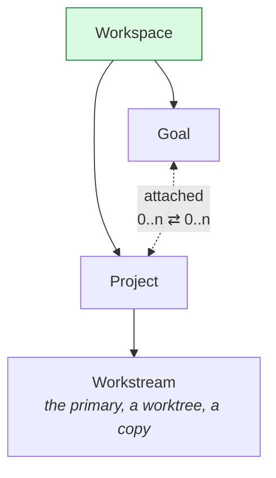
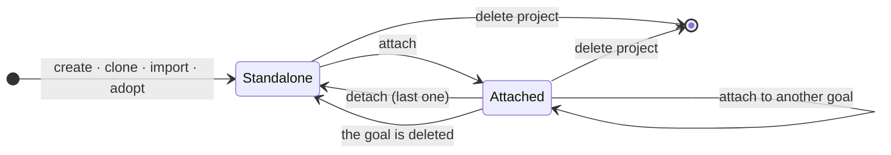

# 04 — Workspace, Project, Goal

The core relationship: **a project is a workspace citizen, and a goal is an optional association —
never a container, never part of a project's identity, never part of its path.**

---

## The relation, in one picture



Three facts the rest of this document rests on:

1. **A project has no owning goal.** There is no such field. A project's parent is the workspace.
2. **Workstreams live under the project.** A workstream is a checkout *of a project*, so attaching
   or detaching a goal moves no directory.
3. **There is one relation, `attached`.** It is symmetric and carries no privilege.

---

## Multiplicity: many-to-many

**A project may be attached to zero or more goals. A goal may have zero or more projects attached.**

### Why

A repository is a **place**; a goal is a **purpose**. Places host several purposes at once — two
features in flight in one monorepo is the normal case in software, not an edge case. Under a 0..1
model the second goal cannot attach at all, and its only recourse is to import the same folder
again, producing two projects over one directory: two slugs, two records, two sets of workstreams,
and a `git` working tree with two owners. That is precisely the outcome the requirement *"no data
loss, no path change, no re-import"* exists to prevent.

### What "enforce it" means here

The multiplicity is not the invariant worth enforcing — *independence* is:

```sql
CREATE TABLE goal_projects (
    goal_id     TEXT NOT NULL REFERENCES goals(id)    ON DELETE CASCADE,
    project_id  TEXT NOT NULL REFERENCES projects(id) ON DELETE CASCADE,
    attached_at INTEGER NOT NULL,
    attached_by TEXT    NOT NULL,
    PRIMARY KEY (goal_id, project_id)
);
```

`ON DELETE CASCADE` from both sides says the thing that matters: **deleting a goal detaches its
projects and never deletes one; deleting a project detaches it from every goal and never deletes
one.** The composite primary key makes a duplicate attachment impossible. Neither row owns the
other.

### Where "the goal" is singular, and where it is not

An agent working in a project knows *what goal it is for* — when there is one — and many-to-many
does not complicate that, because **an agent's goal comes from its work item, not from its
project**:

| Session kind | Where the goal comes from | Cardinality |
|---|---|---|
| running a work item — an `agent` step of a run | the run's home (`WorkItemSpec.home`): its goal, or none for a workspace run's step | exactly one, or none |
| a turn in a goal's thread, or in a conversation with a goal origin | the scope's goal, or the conversation's origin ([13 — Conversations](13-conversations.md)) | exactly one |
| a turn in a conversation about a workstream or a project, a terminal, an editor | the project's attachments | **zero or more, named honestly** |

Only the third is plural, and there the honest answer *is* plural. A prompt that claimed one goal
when there are two would be lying to the agent.

---

## Storage — no goal in any path

```
~/.bisa/
├── projects/<slug>/                     the record, its settings, tree/ for a managed root, workstreams/, notes/, review/
├── workflows/state/33412-<WorkflowId>.json
├── workflows/runs/<RunId>/              a workspace run's own home: journal, its run snapshot, ledger, results, scratch/
├── addons/<id>/addon.json · addons/<id>/files/ · addons/state/33407-<id>.json
├── logs/                                the diagnostic log — this machine's, disposable, never synced
│   ├── <process>/<process>.<period>.jsonl one folder per process family
│   ├── crashes/<process>.<stamp>.<pid>.json one report per abnormal end
│   └── runs/<process>.<pid>.json        a run's marker, gone with its goodbye
└── goals/<GoalId>/                      journal, the goal and run snapshots, the goal's own workflow designs, ledger, edges, results, documents/, notes, scratch/
```

**`projects/` and `goals/` are siblings.** Nothing under `projects/` names a goal, so attaching,
detaching and re-attaching move no bytes at all — the requirement is satisfied structurally rather
than by careful coding. The attachment itself is a signed fact in the **goal's** journal
(`kind:3400`, payload `attachment { project, attached }`): it syncs with the goal, the
`goal_projects` cache is rebuilt from it, and deleting the goal takes it — and only it — away. The
full tree is [`reference/workspace-layout.md`](../reference/workspace-layout.md).

**A workspace run is filed beside the library, never inside a goal.** A goal's runs live in the
goal's folder; a run started in the workspace, with no goal behind it, is its own **home** under
`workflows/runs/<RunId>/`, a folder of the same shape as a goal's run-truth (`HomePaths`, which a
goal's `GoalPaths` extends): `journal.jsonl`, `state/33413-<run>.json`, `ledger.jsonl`,
`results/<item>.patch` and `scratch/` with its `.tmp/`. The store files both kinds of run through
the one type (`Paths::home`), a workspace run's folder names no goal, and deleting its workflow takes
its runs' folders with it — they are the workflow's history.

**A goal's documents are its context, not its work.** The files a person gives a goal — at capture
or later — are `document` facts in the goal's journal (the `AttachmentRef`: name, hash, type, size),
and `goals/<GoalId>/documents/` is materialised from those facts wherever the bytes are held, the
way an attachment's named copy is. A peer that holds the fact and fetches the bytes by hash fills
the folder in on its next rebuild; nothing is decided by what happens to be on disk. Sessions are
told the folder's absolute path (`get_goal`, the first prompt, the Workflow Agent's wake) and read
what is relevant; the folder is not a session's placement and not where a step's files go.

**An agent step runs in a project when it has one, and in the goal's scratch when it has none.**
The step runs in a workstream of the project it names or of the goal's only attached project. A step
naming none on a goal with none runs in `goals/<id>/scratch/` with no workstream: its result is its
deliverable, nothing there is committed, and nothing is created — a project is made only by an
agent's `create_project`, once, when the goal's outcome is files (`projects::create_for_agent`: a
managed folder, `git init`, a root commit so the first workstream is a branch of its own, attached
and journaled; born `origin: goal` from a goal's session, `origin: step` from a work item's, with the
step named). A goal with several projects and a step naming none is refused at run start. A worktree
that settles with nothing to commit is closed and its branch deleted (`projects::close_clean_worktree`);
one that committed stays. **What its person gives a goal to work in is attached to it**: a project
named under an input of kind `project` at a door a person speaks through — a capture, a start by
hand, a test run, an adoption's inputs, what a goal listens with — is attached before the work
begins, and detached again when the door refuses (`ops::begun_by_its_person`). What an occurrence's
payload names is attached by nobody: the step refuses, naming the remedy. A spawned goal inherits
its parent's attachments at capture (`projects::inherit_attachments`), so a sub-goal never mints a
project of its own; a goal born of a run of the workspace has no parent to take them from, and is
attached to the projects its step gives it — it works where the run that made it says, as that run
does. `scratch/` is also a
`check` command's cwd when the goal has no project, the Workflow Agent's design session, and
`TMPDIR`. A workspace run's step runs in the project it names — attachment is a goal's relation,
so none is asked — else in the run's own `workflows/runs/<id>/scratch/`, which is likewise its
`check` command's cwd and its sessions' `TMPDIR`; a project an agent makes there is born
`origin: step` with no goal and attached to nothing.

**Workstreams under the project, and the rule that keeps scratch out of an adopted repository.**
*Never write into a folder you did not create*: `projects/<slug>/workstreams/` is a workspace
directory Bisa made, sibling to `tree/`, and an adopted project's own root is somewhere else
entirely and is never written to. The
primary workstream *is* that root — a record, not a directory of its own.

**Slug uniqueness is workspace-wide**, which makes `projects/<slug>` unambiguous without a lookup.

---

## Types

```rust
pub struct Project {
    pub id: ProjectId,
    pub slug: Slug,                 // the directory name; an allowlist, not a label
    pub name: String,
    pub root: ProjectRoot,          // Managed | External { path }
    pub vcs: Vcs,                   // None | Git { default_branch, remote, code host }
    pub assignees: Vec<Assignee>,
    pub publish: PublishPolicy,
    pub tags: Tags,
    pub group: Option<String>,          // the rail's grouping — display only, not indexed
    pub photo: Option<AttachmentRef>,   // a picture, by content hash — display only
    pub origin: ProjectOrigin,          // where it was born — history, never an owner
    pub revision: u64,
    pub created_at: u64,
}
// There is no owner_goal. There is no goal_id. `origin` names a goal it may have been born of, and
// that goal may since be gone: the record says where the project came from, not who has it.

pub enum ProjectOrigin {
    Workspace,                                                          // a person, no goal in hand
    Goal { goal: GoalId },                                              // a person from a goal, or an agent in a goal's session outside a step
    Step { goal: Option<GoalId>, run: RunId, step: StepId, workflow: WorkflowId }, // an agent step's session — no goal in a workspace run
}

pub struct Attachment {
    pub goal: GoalId,
    pub project: ProjectId,
    pub attached_at: u64,
    pub attached_by: PrincipalId,
}

pub struct Workstream {
    pub id: WorkstreamId,                // the primary's id is its project's ULID
    pub project: ProjectId,              // required — a workstream is always of a project
    pub name: Option<String>,            // a person's label; None = "call me by my branch"
    pub note: Option<String>,
    pub pinned: bool,
    pub kind: WorkstreamKind,            // Primary | Worktree { branch, base } | Copy
    pub goal: Option<GoalId>,            // the goal it was made for — history, not a live association
    pub work_item: Option<WorkItemId>,
    pub agent: Option<String>,
    pub state: WorkstreamState,
    pub created_at: u64,
    pub board: WorkstreamBoard,   // a person's column, order and due date on the Board — never the state
}

pub enum WorkstreamKind {
    Primary,                             // the project's own root checkout — every project has one from birth
    Worktree { branch: String, base: String },
    Copy,                                // a non-git project, copied through bisa-iso
}
```

`Workstream.goal` being optional is what makes an IDE-only workflow real: a person can branch, work
and commit with no goal in the system at all. **No path is stored**: the store derives a checkout
from the kind (`Workspace::checkout_in`), so a record cannot name a directory outside its project.

### Project visibility

`projects_for(goal)` is one join over `goal_projects`. There is no inheritance: a project is a
workspace citizen, so there is nothing above it to inherit from. Every caller that asks "can this
goal see this project?" asks "is this project attached to this goal?", which has an answer that does
not depend on a tree walk.

---

## Operations

| Operation | Effect on disk | Reversible | Approval |
|---|---|---|---|
| **Create project** | `projects/<slug>/tree/`, `git init` | by deleting | — |
| **Clone project** | `projects/<slug>/tree/`, `git clone` | by deleting | — |
| **Import project** | copy a folder into `projects/<slug>/tree/`, `.git` and all; symlinks skipped and counted | by deleting | — |
| **Adopt project** | **nothing** — a record naming an external root | by deleting the record | — |
| **Born by hand** (`POST /projects`, `project new`, a channel or DM session) | the record says `origin: workspace`, attached to nothing | — | — |
| **Born from a goal** (`POST /goals/{id}/projects`, `project new --goal`, a goal-scoped session, or a step of the goal's own design) | `origin: goal { goal, step? }` — `step {run, step, workflow}` when a design's step made it — attached to that goal | detach; the origin stays | — |
| **Born of a step** (an `agent` step of a **library** workflow, its own `create_project` or the engine's) | `origin: step { goal?, run, step, workflow }`, attached to the step's goal — a workspace run's step names no goal, and its project is attached to nothing | detach; the origin stays | — |
| **Attach to goal** | one row | yes | none |
| **Detach from goal** | one row removed | yes | confirmation, not approval |
| **Archive project** | one mark on the record; every session in it stopped; hidden from the rail and refused for an attachment or a step until taken back out; an IDE standing in one of its checkouts leaves for the next home | yes | confirmation |
| **Delete project** | record and links; the folder only on explicit request, and never for an adopted root; every session in it stopped first; an IDE standing in one of its checkouts leaves for the next home | no | — |

**Attach and detach are pure record operations.** Neither reads, writes, moves or deletes a single
byte under `projects/`. That is the design property the UX copy is allowed to promise.

**Attachment is the relation, origin is history.** The engine derives the origin from the session or
route that created the project (I28a) and writes it once; nothing edits it, detaching does not clear
it, and deleting the goal or the workflow it names leaves it standing — the index carries no foreign
key on the `origin_*` columns for exactly that reason. Two readers exist for it,
`projects_born_of_goal` (either variant naming the goal) and `projects_born_of_workflow` (the
`step` variant alone — a design's projects are its goal's); the rail's three tabs are a fold over the
origin itself — one tab per variant.

---

## What the surfaces must honour

The desktop's rail, About panel and dialogs are described in [the IDE guide](../guide/the-ide.md);
the rules they are allowed to promise are these. **One list, never two**: every project appears in
one list; the rail's tabs are a fold over `origin` — each project in exactly one, the one that says
where it was born — and attachment is never a tab or a stored second identity: a project's goals are
shown on the project (About's *Goals* section), and *unattached* is not a category anywhere.
**Attach is unconfirmed**: additive, reversible, moves nothing. **Detach is confirmed**, and the
dialog says what stays (everything on disk, every workstream's record of the goal it was made for)
and names the one consequence (the goal's agents stop seeing the project). **Deleting a goal states
the cascade as a promise**: its attached projects and every checkout under them stay. **A goal never
enters a path, a URL, a slug or an id**: `#/projects/workstream/<id>` is the project's address
whether it has zero goals or five. **A person who only wants the IDE never meets a goal**: the empty
workbench offers *New*, *Clone*, *Adopt a folder* and nothing else. **Origin is shown, never
edited**: the rail's tabs are the three origins — *Workspace* the hand-made, *Goals* under the goal
that made each (its own design's steps included), *Workflows* under the library workflow whose step
made each — and the About panel says *made here · from goal … · step x · by a step of …* as links. No
dialog offers to change it. **The rail follows the route**: `#/projects/workstream/<id>` from any
screen shows the project's tab, unfolds its section and scrolls to its row.

---

## State transitions of the association



`Standalone` and `Attached` are **views over the relation**, not stored states. There is no
`Project.status`, no `is_attached` flag, and nothing to keep in step — the answer is a count of rows
and cannot drift from the truth it summarises.

---

## What this design refuses to do

- **No "default goal".** A project with no goal is a normal project, not a project in a holding pen.
- **No implicit attachment.** Running a goal's `agent` step in a project does not attach it — a step
  that names an unattached project fails, and says why; a person or an agent attaches, and it is
  recorded with who and when. A workspace run's step uses the project it names and attaches nothing,
  since there is no goal to attach it to.
- **No goal in a URL, a path, a slug or an id.** `#/projects/workstream/<id>` — the project's own
  ULID, which is its primary workstream's — is the project's address whether it has zero goals or
  five, so a link survives every attach and detach.
- **No cascade from goal to project bytes, ever — unless the person chose it, project by project.**
  Retiring a goal (`engine/retire.rs`) is one plan stated up front: the goal archived or deleted,
  and one fate — keep, archive, delete — for the projects **born of** it (`origin: goal` or a step
  of its run), with the Trash only on request and never for an adopted folder. A project merely
  attached is detached on delete and left alone on archive; the preview the dialog is drawn from
  (`GET /goals/{id}/retirement`) lists both kinds apart, so the promise is read before it is kept.
  Deleting a goal by itself (`DELETE /goals/{id}`) is that plan with the projects kept. A refusal —
  a design of the goal's own that another goal still uses — is stated in the preview and refused
  before anything stops; what stops is stopped first and waited for, the harness processes ended,
  and only then does the folder go.
  That is enforced by the schema and stated in the copy.
