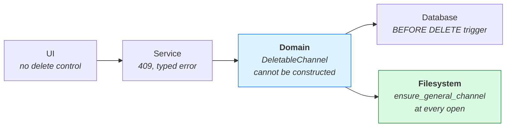
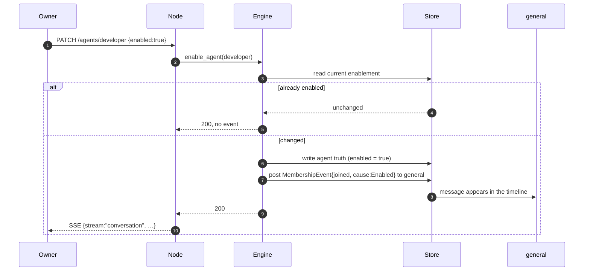

# 05 — Channels

A **channel** is a standing conversation the workspace can see. A **direct message** is a
conversation with a restricted audience. Both are one stored object and one wire kind, because they
are the same act; only the audience differs.

---

## The model

```rust
pub struct Channel {
    pub id: ChannelId,
    pub name: String,
    pub topic: Option<String>,
    pub kind: ChannelKind,          // Standing | Direct
    pub audience: Audience,         // Workspace | Restricted(Vec<PrincipalId>)
    pub roster: RosterPolicy,
    pub tags: Tags,
    pub origin: Origin,
    pub created_at: u64,
}

pub enum ChannelKind { Standing, Direct }

/// Who may read. `Workspace` is wrapped pairwise to each person whose role
/// reaches the channel; `Restricted` is wrapped pairwise to exactly those
/// principals. There is no shared workspace key.
pub enum Audience { Workspace, Restricted(Vec<PrincipalId>) }
```

**Audience and roster answer different questions and must never be conflated.** An audience
restricts who can *read*; a roster says who *belongs*. Putting agents in the audience of a standing
channel would encrypt it pairwise to exactly them and turn an open room into a private one.

**A roster has three halves and an edit names the ones it changes.** `PATCH /channels/{id}` and
`bisa channels edit` replace the agents, the teams or the people when they are named and keep each
half that is not — naming an agent takes no team and no person off the roster.

**A roster is a directory, not a subscription.** A rostered agent still speaks only when addressed.
Five agents in a channel must never mean five harness sessions per message. What a roster buys is
the header, the mention picker's ordering, and the channel handle: `@engineering` expands to exactly
that roster's pubkeys at post time.

---

## `RosterPolicy` — membership as a policy, not a list

```rust
pub enum RosterPolicy {
    /// Every enabled agent and every enabled team. Stores no list.
    Everyone,
    /// Exactly these, intersected with enablement when read — and the people
    /// (hosted members, by pubkey) a guest reaches this channel through.
    Listed { agents: Vec<AgentId>, teams: Vec<TeamId>, humans: Vec<PrincipalId> },
}
```

The `humans` half is the roster's for people on other nodes ([14 — Collaboration](14-collaboration.md)):
`bisa_core::reaches(channel, role, person)` says a standing channel reaches an owner, an admin and
a member always, and a guest only when listed here; a direct channel reaches its audience. The
store vets the list against the people of the workspace (`vetted_roster`), and a removed person
comes off every roster (`unroster_human_everywhere`). `general` never lists people: every
non-guest reaches it.

This is the **Strategy pattern**, and it earns its place by making "membership is derived from
enablement" a *variant* rather than a special case threaded through every reader with an `if`.

It is also how the standing rule **implicit membership is never stored** survives contact with a
channel that contains everybody: `Everyone` stores no list, so there is no list to edit, no list to
accidentally empty, and nothing that can drift from the enablement it is supposed to reflect.

```rust
/// The one implementation. Every caller asks this; nobody re-derives it.
pub fn members(channel: &Channel, agents: &[Agent], teams: &[Team], people: &[PrincipalId]) -> Vec<Member> {
    let enabled_agents = agents.iter().filter(|a| a.enabled);
    let enabled_teams  = teams.iter().filter(|t| t.enabled);
    match &channel.roster {
        RosterPolicy::Everyone => enabled_agents.chain_members(enabled_teams),
        RosterPolicy::Listed { agents: a, teams: t, humans: h } =>
            enabled_agents.filter(|x| a.contains(&x.id))
                .chain_members(enabled_teams.filter(|x| t.contains(&x.id)))
                .chain(h.iter().filter(|p| people.contains(p)).map(Member::Human)),
    }
}
```

A listed person is a member while they are still a person of the workspace — the same
intersection the agents pass, against the people instead of enablement.

Note that `Listed` is *also* filtered by enablement. A disabled agent is out of every roster,
whether the roster names it or not — which keeps one rule instead of two.

---

## `general` — seeded, permanent, everyone

Exactly one channel exists in a fresh workspace:

```toml
id     = "general"
name   = "general"
topic  = "Everything that does not have a home yet."
kind   = Standing
audience = Workspace
roster = Everyone
origin = Core
```

This is a deliberate, single exception to the platform's standing rule that **the library is a
catalog, not seed data** — a workspace opens with the two agents of the platform that hold a record, the General Agent and the Workflow Agent, and everything else is installed because
somebody chose it. One room is not an organisation, and a workspace with nowhere to say anything is
a workspace where the first question has no address. The exception is named, bounded to one object,
and does not reopen the door: the other eight catalog channels remain opt-in.

### It cannot be deleted — four layers, and only one of them is the real one



**Domain — the rule.** Deletion takes a value that cannot be built for `general`:

```rust
/// A channel that may be deleted. The only constructor refuses `general`,
/// so `delete_channel` has no code path that could remove it.
pub struct DeletableChannel(Channel);

impl DeletableChannel {
    pub fn new(channel: Channel) -> Result<Self, ChannelError> {
        if channel.id == ChannelId::GENERAL {
            return Err(ChannelError::Permanent { id: channel.id });
        }
        Ok(Self(channel))
    }
}

pub fn delete_channel(channel: DeletableChannel) -> …
```

There is no runtime check inside `delete_channel`, because there is nothing left to check.

**Service — the answer.** `DELETE /channels/general` → `409 Conflict`, the body the error body
every route answers (`{error}`, the sentence; [reference/http-api](../reference/http-api.md)). No
client switches on it — the desktop offers no delete of `general` — so it carries no `code`.

**Database — defence against our own bugs.** The index is a cache, so a constraint there cannot
protect data. It can catch a bug in *our* code before it corrupts the cache and confuses a reader:

```sql
CREATE TRIGGER channels_general_undeletable
BEFORE DELETE ON channels
WHEN OLD.id = 'general'
BEGIN SELECT RAISE(ABORT, 'the general channel cannot be deleted'); END;
```

**Filesystem — the guarantee that actually holds.** `ensure_general_channel()` runs in
`Workspace::open`, beside the existing `ensure_core_agents()`. Delete the truth file by hand and the
channel is back on the next open. This is the only layer that survives somebody with a text editor,
and it is the reason the other three are defence rather than the design.

---

## Membership events

§4 asks that enabling and disabling be **visible in the channel timeline**. Two things are being
asked for and they are not the same:

| | What it is | Where it lives |
|---|---|---|
| **Membership** | who is in the channel *now* | **derived** from `RosterPolicy` + enablement. Stored nowhere |
| **A join or a leave** | the record that a change happened, at a time, because of something | **a fact**, stored as a message in the channel |

Conflating them is how derived-membership designs go wrong: either the derivation drifts from a
stored list, or the history is lost because "it can be recomputed" — and it cannot, because
enablement is a boolean with no past.

### The contract

The event is a message on kind 3407, so it orders, syncs, dedupes and renders with machinery that
already exists and is already tested. Message content becomes typed:

```rust
pub enum MessageBody {
    Post { text: String, context: Vec<ContextRef>, artifacts: Vec<ArtifactRef> },
    Membership(MembershipEvent),
}

pub struct MembershipEvent {
    pub channel: ChannelId,
    pub member: Member,             // Agent(AgentId) | Team(TeamId)
    pub change: MembershipChange,   // Joined | Left
    pub cause: MembershipCause,
    pub at: u64,
}

pub enum MembershipCause {
    Enabled, Disabled,      // the member's enablement flipped — the one change that produces the event
}
```

A roster edited, a member made or removed produce no membership event: the roster is a directory
and a membership is derived, so a channel's list changes without a line in its timeline — only an
enablement's flip is announced where the member was addressed. (Four other causes were once in the
vocabulary and produced by nothing; they went.)

**Payload on the wire** — the `content` of a kind 3407 event:

```json
{
  "body": "membership",
  "channel": "general",
  "member": { "agent": "developer" },
  "change": "joined",
  "cause": "enabled",
  "at": 1735689600
}
```

### Authorship

**Only the node that made the change authors the event.** Peers never re-derive it.

This matters because enablement itself syncs — an agent's `enabled` flag rides its kind 33403
snapshot — so every node *could* compute the same join. If two did, they would author two events
with two ids (a Nostr event id includes the author's pubkey) and the timeline would double. One
author, propagated by sync, is the same rule the platform already holds for an agent's replies.

### Idempotency

- **Enabling an agent that is already enabled is not a state change**, so it emits nothing. The
  event is produced by the *transition* of the flag, never by its value.
- A replayed event carries the same id and is dropped by the existing `seen_events` dedupe.
- Reprocessing the same enablement change produces a byte-identical event from the same author,
  therefore the same id, therefore one row.

The idempotency key is the Nostr event id, which is a hash over `(author, kind, created_at, tags,
content)` — and every one of those is a deterministic function of the change.

A **post** is the opposite on purpose. What a person or an agent says is said each time it is said,
so a post carries a `once` tag of its own
([09 — Protocol](09-protocol-gep.md#message-carries-two-bodies)) and the same words twice within
one second are two rows. A replayed post still carries the id it was made with, and is dropped like
any other replay.

### Ordering

- **Within a channel, on one node:** total, by `(created_at, event_id)` — the existing
  `idx_messages_scope` index and its tiebreak.
- **Across nodes:** **per-author monotonic only.** `created_at` is the authoring node's clock, and
  there is no global sequencer, no vector clock and no consensus. Two members enabling two agents in
  the same second may render in either order on a third node.

That limit is stated rather than papered over. It is acceptable because a join and a leave for
*different* members commute, and for the *same* member they are authored by whoever holds the
enablement flag, so they are per-author ordered — which is exactly the case that must not be wrong.

### What is deliberately not built

**No new protocol kind for membership.** It is derivable from two kinds that already sync — 33403
(agent) and 33405 (channel) — so publishing it as a third would create a fact and a projection that
can disagree. The stored message is the *history*, which is not derivable; the membership itself
never travels.

---

## Enablement and the channel, end to end



Membership itself is never written. The next reader of `general`'s roster derives it from the flag
that just changed.

---

## Direct messages are conversations, not rooms

`ChannelKind::Direct` with `Audience::Restricted`. Both kinds are one stored object because
`open_dm`'s idempotency scan, the inbox and the activity timeline all reason about *conversations* — the inbox's rows are things, and a thing's conversation is one of these when it has one.

Every surface that means "the rooms you can join" asks for `ChannelKind::Standing` explicitly. That
filter lives in the store rather than in each caller, because it was missing from exactly one route
once and every consumer downstream of it — the sidebar, the channel index, a `notify` step's scope picker
and the command palette — showed each direct message twice.

---

## Conversations are apart

A message stream is scoped to a channel, a goal's thread, a direct message — or to a
**conversation**: a saved exchange a person starts with agents, with an **origin** (the node, the
workspace, a goal, a workflow, a project, a workstream) instead of a name, many per origin, listed,
searched, resumed ([13 — Conversations](13-conversations.md)). A conversation is not
a channel — it has no roster and no handle and nothing is triaged between conversations — and it is
not the goal's thread, where the Workflow Agent designs and a gate is asked. It is stored like every
other scope (`conversation/<ConversationId>.jsonl`, `messages.scope_kind = 'conversation'`), has a
workspace audience, and is reached through the same `Conversation` surface
(`POST /conversations/{id}/messages`). The IDE's Agent panel is a conversation about the checkout,
and a checkout has as many as a person starts; a workstream has no thread of its own.

A message in any scope may carry **context** — a bounded list of `ContextRef` chips (a selection, a
file, a diff hunk, a terminal tail, a work item, a commit) — which is what the agent sees and exactly
what the person saw above the composer. See [the IDE documents](ide/09-agents-in-the-ide.md). A
message in any scope may carry **artifacts** — what its author made for the reader to look at, each
a titled, kinded descriptor of bytes the attachment store holds, rendered live where it is read
([12 — Artifacts](12-artifacts.md)). An agent's post may carry its **thinking** — the reasoning
its harness streamed before the words — kept beside the reply and shown folded above it
([13 § The reply streams](13-conversations.md#the-reply-streams)).

## Triage: a message that names nobody

A message in a **standing** channel with a workspace audience and no mentions — or in a goal's thread or a
conversation — that somebody *asked* (not one the platform *announced*) wakes the General
Agent, and only the General Agent. It answers, or it addresses the agent that should — the Workflow
Agent among them, when the question is the shape of the work.

The loop guard is bounded by *shape*, not by a counter: a message from any agent that is not a
core agent is dropped before dispatch, and a core agent's own message never wakes itself. The
chain human → triage → worker → stop is therefore two hops long by construction, and the longest
chain — human → General Agent → Workflow Agent — is the same length. One thing more may speak: the
platform, *announcing*. A workflow's `notify` step posts as an agent — its `author`, or the Workflow
Agent — into the conversation it names, else its goal's thread, else — a workspace run has no goal —
`general` (`PostOrigin::Announced`); an announcement carries the owner's authority whoever signs it:
it addresses exactly the agents it mentions, none by default, never triages, and cannot chain,
because the woken agent's reply is asked, agent-authored and not core, so it is dropped as any
worker's is. So a workspace run's report in `general` wakes nobody it does not name.

Narrowed to standing channels on purpose: a workspace-wide rule would make every notification
summon a model.
