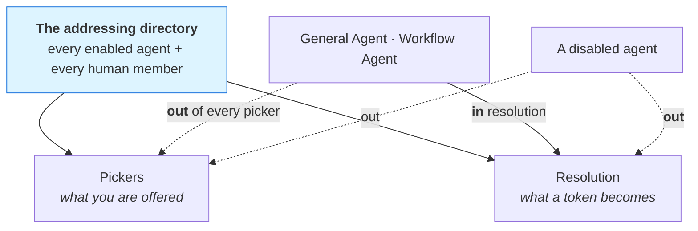
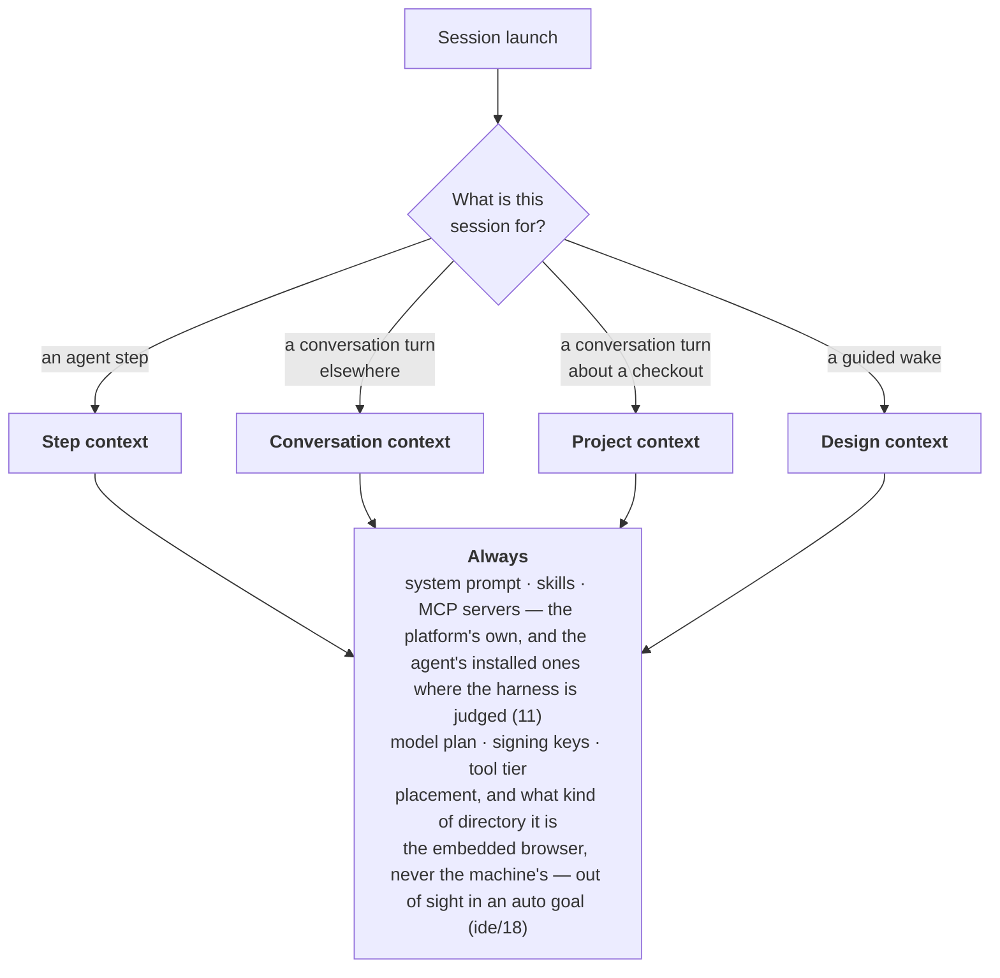

# 06 — Agents and teams

An **agent** is a definition, not a process: a prompt bound to a harness, a model plan, skills and
MCP servers, with its own attested keypair so its work is signed as itself — and so is what the
platform says on an agent's behalf: a workflow's `notify` is its author's, a step's question the
Workflow Agent's, a nameless tool post the General Agent's; the owner's key signs only what the
person did. A **session** is one live run of a harness — evidence, never the unit of work. One
agent is the exception to the definition, and it is stated once, [below](#the-core-agents): the
Decision-Making Agent is a core agent with no prompt and no keypair of its own.

---

## The model

```rust
pub struct Agent {
    pub id: AgentId,                    // a slug; the id is the slug
    pub name: String,
    pub description: String,
    pub system_prompt: String,
    pub harness: HarnessId,
    pub models: ModelPlan,              // ordered candidates + a strategy + an effort
    pub skills: Vec<SkillId>,           // referenced, never copied
    pub mcp_servers: Vec<McpId>,        // referenced; local, never synced
    pub respond: RespondPolicy,         // OwnerOnly | Members
    pub enabled: bool,
    pub tags: Tags,
    pub origin: AgentOrigin,            // Local | Catalog { slug } | Core
    pub pubkey: PrincipalId,            // attested by the owner
    pub created_at: u64,
}

pub struct Team {
    pub id: TeamId,
    pub name: String,
    pub purpose: Option<String>,
    pub members: Vec<Assignee>,         // agents and humans
    pub enabled: bool,
    pub tags: Tags,
    pub origin: Origin,
    pub created_at: u64,
}
```

**The outward surfaces are two.** An agent reaches the outside world through the embedded browser
(ide/18) — pages the person can see, on the desktop — and through connectors (03 § Connectors) —
declared APIs called as an account this machine holds: read live by any session through
`call_connector`, written only by a workflow's `connector` step behind a gate. There is no OS-level automation of the
platform's own: a computer-use server, like any other capability the platform did not write, enters
only as an installed MCP server on an agent, mounted where the harness is judged and kept off the
observed ones by default (11 § MCP servers), so nothing acts on the machine that a rule did not see.

**An installed MCP server** is a registry entry (`mcp/<id>.json`, local, never synced) with one of
the protocol's three transports (`McpServerConfig`): a process over **stdio** (`command`, `args`,
`env`, `cwd`), **Streamable HTTP** (`url`, `headers` — MCP 2025-03-26 onwards) or the 2024-11-05
**HTTP+SSE** transport (`url`, `headers` — deprecated by the spec, still spoken). The registry
speaks both protocol eras: the *handshake era* (revisions 2024-11-05 through 2025-11-25:
`initialize` → `notifications/initialized` → `ping`) and the *discover era* (2026-07-28: stateless,
one `server/discover`). A **probe** (`bisa-mcp-probe`, `POST /mcp/probe`, `POST /mcp/{id}/probe`,
`bisa mcp probe`) dials a server over its transport, negotiates whichever era it speaks, and
reports who answered, the negotiated revision, its capabilities and tools — or the stage it
stopped at (spawn · initialize · ping · tools); the answer is the server's **health**, kept in the
engine's memory beside the entry and read with it. Every `env` and `headers` value is written once
and never read back: the wire and the terminal answer `••••••`, and an edit that sends the mask back
keeps the stored value.

**An edit is one write.** `PATCH /agents/{id}` and `PATCH /teams/{id}` read every field of the
body before anything is written, then write the record once through the engine
(`directory::update_agent`, `update_team`), which announces what the edit did to the enablement —
the transition, never the value — in every channel the member is in (`membership.rs`). An edit
that is refused changed nothing, stood nobody down and told no room. What a body leaves out is
kept; `photo`, `description` and a team's `purpose` are taken away by `null`. The command line
makes the same edit through the node when one runs, and through an engine of its own for the
one edit that must be announced when none does.

**A record that cannot be read costs that record.** The four lists leave it out and say so in the
log; asked for by itself it is `Unreadable`, by its file; a reference to it — a skill on an agent,
an agent on a team — is answered with that, never as *unknown*
([08 — Persistence](08-persistence.md#a-list-tolerates-one-broken-file)).

**Teams have `enabled`**, because
[channels](05-channels.md) derive `general`'s membership from the enablement of *agents and teams*,
and because an agent could be stood down without being deleted and a team could not.

Disable semantics match an agent's exactly: a disabled team is out of the addressing directory, out
of every roster, and not expanded by the assignment union — but it is not deleted, keeps its
members, and comes back unchanged. Addressed all the same — a workflow's `notify` that names it —
it reaches nobody: not its members, and not the core agents that are in every room
(`Workspace::team_addressed`).

---

## The core agents

Three agents are the platform's own: always here, never removed, their names fixed. Two of them
**hold a record** — a key, a prompt, a conversation — and exist in every workspace from its first
open; `AgentId::CORE` names exactly those two. The third judges, and holds none.

| | General Agent | Workflow Agent | Decision-Making Agent |
|---|---|---|---|
| id | `general-agent` | `workflow-agent` | `decision-making-agent` (`AgentId::DECISION_MAKING`) — reserved: no agent record may take it |
| addressed as | `@General Agent` | `@Workflow Agent` | never — nothing messages it, assigns it or wakes it |
| reached by | a message, a mention, triage | a message, a mention, a capture, a failed step | a decision point's typed question, a `judge` step, the `decide` tool |
| definition | `library/core/general-agent.toml` | `library/core/workflow-agent.toml` | `library/core/decision-making-agent.toml` |
| does | triage, staffing, delegation: answers what nobody addressed, installs and assigns the staff a piece of work needs, hands the *shape* of the work to the Workflow Agent | design: reads a goal, asks at most one round, proposes a workflow from the closest template — the events it starts on, waits for and ends with, and its gateways, among its steps — validates it, and repairs a run that failed | judgement: which of an agent's models leads, who of a pool takes a work item, whether a tool call is harmful — always beside a rule that runs when it is off, unsure, or does not answer ([15](15-decision-making-agent.md)) |
| holds | a record: its key, its prompt, its conversations | the same | nothing per workspace — no key, no prompt, no row |
| origin | `AgentOrigin::Core` | `AgentOrigin::Core` | — |
| ensured by | `ensure_core_agents()` in `Workspace::open`, and nowhere else | the same call | nothing to ensure: compiled in, read by `decision_making_agent()` |
| set up | harness, model plan and the decision-making switch only; the name is fixed | the same | who answers for it and whether it is on: the `decisions.*` settings (Settings › Decision Settings › Decision Making); the name is fixed |
| removable · disableable | no · no | no · no | no · off until it is switched on |

**The rest of this section is about the two that hold a record.** Rooms, wakes, pickers, tool sets
and work queues are questions asked of agents that can be addressed; the Decision-Making Agent is in
none of them, and "a core agent" in a rule about any of them is the General Agent or the Workflow
Agent.

**Capabilities.** Both see the whole workspace. Their tool sets are the common set plus a shared
core set, and then one set each that the other never receives:

| Tool set | Tools |
|---|---|
| **Common** — every session | `list_connectors`, `call_connector` (a read through an installed connector — the operation's host policy, deadline, cap and circuit, the answer redacted and screened as content from outside; a write is refused: it is a `connector` step behind a gate), `get_goal` (refused by name in a workspace run's work item, which has no goal — *orient with `get_run`*), `ask_human`, `await_human`, `ask_human_and_wait`, `add_note`, `spawn_sub_goal`, `emit_signal`, `post_message`, `recall_store`, `recall_get`, `recall_list`, `note_read`, `note_append`, `review_notes_list`, `review_note_resolve`, `create_project`, `decide` (typed questions to the Decision-Making Agent, refused in a sentence unless it is switched on for the session's agent — [15](15-decision-making-agent.md)), and the twenty-one browser tools (ide/18) — `browser_open`, `browser_tabs`, `browser_close`, `browser_snapshot`, `browser_read`, `browser_find`, `browser_click`, `browser_fill`, `browser_type`, `browser_press`, `browser_select`, `browser_hover`, `browser_scroll`, `browser_back`, `browser_forward`, `browser_reload`, `browser_wait`, `browser_console`, `browser_eval`, `browser_screenshot`, `browser_serve` — the seven drawing tools ([19](19-drawings.md)) — `drawing_list`, `drawing_read`, `drawing_create`, `drawing_draw`, `drawing_mermaid`, `drawing_erase`, `drawing_snapshot` — and the four mobile development tools (ide/19), on every menu and answered only where mobile development is on — `mobile_development_status`, `mobile_development_devices`, `mobile_development_boot`, `mobile_development_screenshot` |
| **Work item** — a session running an `agent` step | `get_run` (the run the item belongs to — its workflow, inputs, steps, work items, journal, budget, and whose goal it is: `null` for a workspace run; the session orients with it, then with `get_goal` when the run is a goal's), `yield_result`, `report_progress` |
| **Conversation** — a conversation's turn | `pr_reviews_list`, `pr_review_submit`, `pr_thread_reply`, `pr_thread_resolve` — the pull request of the checkout the conversation runs in, a workstream's or a project's primary; off a checkout they refuse |
| **Goal** — a session designing a goal's workflow, and the Workflow Agent's turn in a goal's thread (launched knowing the goal) | `revise_statement`, `propose_workflow`, `amend_workflow` |
| **The General Agent and the Workflow Agent** | `workspace_overview`, `list_staff`, `list_catalog` |
| **General Agent only** | `install_catalog_entry`, `assign`, `capture_goal` — work that recurs or waits for something (*every Monday…*, *whenever someone posts in #support…*) captured as a standing goal in the workspace's default mode: the Workflow Agent designs its workflow with the start event the statement names, and the goal listens once the design is adopted ([03 — Workflows](03-workflows.md#listening)) |
| **Workflow Agent only** | `list_workflow_templates`, `get_workflow`, `validate_workflow`, `save_workflow` — the one write to a library workflow: from the conversation about it, and to that workflow alone (`intake::workflow_of`), whole, at the revision it read; refused with its problems, refused as moved when the person saved meanwhile; announced as the agent's hand (`WorkflowChanged { designed: true }`), which the designer beside the conversation and the Inbox hear |

A project an agent makes with `create_project` is a git repository like any other the platform makes,
and gets its identity the same way: it inherits the person's global git config, and — only
when nothing resolves there — the person is asked through `committer.needed`, wherever they are. The
agent's own settlement commit still needs that answer; refused for want of one, it is kept uncommitted
and made by the engine the moment who commits is set.

There is no removal tool and no self-edit tool, and neither agent can adopt a workflow, decide a
gate, start a run or turn a workflow on: **an agent proposes; a person adopts** — and a person
arms what listens, save the starts an auto goal's adoption may arm on its own (a schedule, a
signal, a run's end, a platform topic, a message). The engine re-checks the caller on
every core-only op, because the intake socket is a path on disk.

**They are in every room and in no work queue.** Both participate in every team and every channel,
and neither is a candidate for an unassigned `agent` step. Those are two different questions asked
of the same data, and the split runs along one line: `principals()` — who may be addressed —
includes them; `workers()` — who may be *given* the work — excludes them, because they guide,
design and delegate, and an agent that could win the routing race for an implementation step would
be doing the one thing its role forbids. A step whose own `assignee` names one still reaches it: the
exclusion cancels *implicit* membership, never a request somebody typed.

**They are offered in no picker**, and kept in the resolution set so `@General Agent` and
`@Workflow Agent` still work — in a goal thread and in a channel. That is safe only because triage
means you no longer have to reach for the first, and an auto or guided capture wakes the second on its own.
**A conversation about a checkout is the Workflow Agent's one exception**: it designs workflows and
shapes goals, and a project or a workstream has neither, so there it is neither offered nor resolved,
and the engine's `dispatch` never wakes it — mentioned or named as the project's default
(`ConversationOrigin::reaches_workflow_agent`, [13 — Conversations](13-conversations.md),
[ide/09](ide/09-agents-in-the-ide.md)). A conversation about a goal, a workflow, the workspace or the
node keeps it.

**The Workflow Agent staffs its steps from who is here.** Its design and repair wakes carry the
**staff roster** (`staff.rs`: every installed and enabled agent that is not a core agent, with its
harness, skills and teams; every enabled team with its members) rendered under a `STAFF` heading —
beside the `GOAL`, `CONNECTORS` and `TEMPLATES` blocks read from the record once per wake — and
`list_staff` returns the same for a chat wake. When this machine develops for mobile
([ide/19](ide/19-mobile-development.md)), the `GOAL` block gains one line — *Mobile: iOS and
Android · Flutter 3.24 — mobile_development_devices lists the simulators, emulators and phones here* — a fact
from the last toolchain examination, never a probe and never a rule: the designer stays universal,
and a mobile goal reaches the Mobile Developer through its staff line, which names Flutter, iOS,
Android and the stores. The directive says every `agent`
step names an assignee from that list — `{ "agent": id }`, or `{ "team": id }` when the work needs
several members' skills — never a core agent, and, when nobody fits, the closest with a word about
it, or an input of kind `assignee` for the person to fill; it cannot install. The rule is enforced at
the agent's door, not in core validation: `validate_workflow` reports `unstaffed_step` and
`unknown_assignee`, and `propose_workflow` and `amend_workflow` refuse an unstaffed agent step while
staff exists — a hand-drawn design keeps the placement fallback (the goal's assignees, then the
routing race), and an empty roster refuses nothing. A wake also **speaks in the goal's thread** as
the Workflow Agent — a greeting, its question, the proposal, a stall — and every move is a
`Guidance` fact ([03 — Workflows](03-workflows.md#the-goal-and-its-status)).

## Sessions and presence

A session is one live run of a harness; what it is *doing* is **presence**, folded once in the
engine (`presence.rs`) and served as `GET /sessions`. Adapters map their wire into
`SessionEvent`s and never decide anything; the engine folds those into one `SessionState` —
`starting · idle · thinking · running { tool } · waiting { on } · done · aborted · failed · parked`
— per `LiveRunId`, with the harness, the model, the effort it runs at, the agent definition, the session id, the work
item, the goal, the run (`SessionMeta.run` — how the roster names a workspace run's worker, which no
goal holds, and links its run's page), the workstream, the project, the accumulated cost and the
**sub-agents** the
harness spawned (`SubagentStarted`, the `Nested` events under it, `SubagentEnded`). A
`SessionState` frame goes out on a change — never per token — and a finished session stays in the
roster for `retain_ended_secs` (60) before `SessionGone`; a parked one is resumable and stays. The
registry keeps its four control statuses; presence is what a person reads.

A session is one of four **kinds** (`SessionKind` — the store's word, on the roster as `kind`):
`worker`, a step's work item; `guided`, the Workflow Agent's design or repair wake; `conversation`,
a turn of a conversation, naming it (`conversation`) — a conversation about a note or a drawing is
one of these, there is no kind of its own; `terminal`, a harness
a person opened in a terminal, reporting through its hooks. Presence carries every kind; which are
drawn where is the reader's rule — the IDE's rail draws work sessions and terminals, and a
conversation's turn is shown, followed and stopped on its conversation
([13 — Conversations](13-conversations.md#the-rail-draws-work-sessions-and-terminals)).

**A harness that stops for a person raises an `InputRequested`** — a permission, a question, a
sign-in — and blocks until the engine calls `HarnessSession::answer` (capability `INPUT_REQUESTS`).
One answerer (`inputs.rs`) decides for every driver: a permission inside the step's tier ceiling is
allowed at once; anything else on a goal or a workspace run becomes an escalation gate homed on it,
in the Inbox — the goal's row, or the workspace run's workflow's — the session's presence says
*waiting* first, then the gate opens — and the decision goes back as `Allow`, `Deny { reason }` or
`Text`; a workspace run is attended, so above the ceiling it always asks a person; a refusal is an answer the agent hears, not an abort. Claude Code speaks this
through its control protocol (`--permission-prompt-tool stdio`, `control_request` /
`control_response`), and `AskUserQuestion` arrives as a question; ACP forwards
`session/request_permission` — a call known by its id, so a request that names the id and nothing
else is judged as the call that was announced ([crates/adapters](crates/adapters.md)); A2A maps
`input-required` and `auth-required`. A conversation's turn about a checkout has no goal and asks
**in the conversation** ([ide/20](ide/20-reviewing-agent-changes.md#the-asks-desk)); a turn outside
any goal and any checkout — about a workflow, the workspace or the node — has nobody to escalate to
and is refused ([feature status](../feature-status.md)).

---

## Addressing

One question, one predicate, seven surfaces: the `@` autocomplete, the address tray, the channel
roster picker, the new-DM dialog, the assignee picker, an agent card's Message button, and the
command palette. One component draws the row, one function decides a match.



The two special cases run in **opposite directions**, and each has a reason:

- **A core agent** is hidden from pickers and kept resolvable. An entry absent from the directory
  produces no token at all, so `@Workflow Agent` would stop working.
- **A disabled agent** is removed from the directory entirely. Hiding it from a picker while leaving
  its name resolvable is worse than either: the message carries a `p` tag nothing will answer *and*,
  because it addressed somebody, triage does not answer either. The message reaches nobody, with no
  error.

**An unknown mention token is refused, never dropped.** A selection that quietly resolves to nothing
is an address the human believes they gave.

**Unknown is not uninstalled.** A picker marks an agent whose harness this machine lacks, and marks
nothing at all while the answer is still in flight or the read failed. A fact about *this machine*
is never a reason to withhold the agent — a collaborator's node may have the harness.

**Who wakes whom.** A human's message wakes a core agent when it names nobody — the default agent,
`agents.default`, or the general agent when it cannot be reached. Where two or more agents may
answer and the Decision-Making Agent is on for the workspace or for the default agent, triage puts it a
`choice` over who should — asked off the dispatch path, so a slow judgement never holds up the
message — and falls to the default agent when it is unsure, fails, or is off
([15](15-decision-making-agent.md#the-decision-points)). A message from the General Agent or the Workflow Agent may wake
one other agent — the other of the two included, which is how the General Agent hands the shape of
the work to `@Workflow Agent`. Nobody wakes itself, so a chain stops at two hops.

---

## Assignment

One union, two filters. Nothing re-implements it.

```
assignee(agent step) ─── set? it wins alone
        │
        ├── else ──▶ assignees(goal) ∪ assignees(the item's project) ∪ ancestors
        │             (a workspace run has no goal: the project's alone, else the routing race)
        │
        ├── workers()   = agents, enabled, harness resolvable, minus the General and Workflow Agents
        └── approvers() = humans, plus teams expanded to their humans
```

Naming somebody on a step is a decision, not a suggestion the goal's assignment gets to widen. Where
the eligible pool has two members or more and the Decision-Making Agent is on — the workspace's switch, the
run's workflow's, or any pool member's own — `assign::choose` puts it a `choice` over the pool by
each agent's own description before the lot (`assign::pick`) ever runs; unsure, off, or a pick
outside the pool falls straight to the lot ([15](15-decision-making-agent.md#the-decision-points)). Teams
expand one level. Any walk over a user-editable parent link — a goal's `origin.parent` — carries a
visited set, because a goal can end up its own ancestor and an unbounded loop inside a gate check
would be a very bad place for one.

---

## Context injection

What a session receives, and — the part that matters — **how it differs by placement**.



| | Agent step (a work item) | Guided wake (the Workflow Agent) | Conversation turn about a checkout (a workstream or a project) | Conversation turn about a goal, a workflow, the workspace or the node |
|---|---|---|---|---|
| goal statement | ✅ on a goal's run (`framing::goal_note`); none in a workspace run | ✅ | — | — |
| the step's instructions, rendered | ✅ | — | — | — |
| the result protocol, and the step's `output_schema` when it has one | ✅ | — | — | — |
| the unattended line — decide with defaults, say the assumptions, ask only for what a person alone holds (`executor::UNATTENDED_APPENDIX`) | ✅ on an auto goal | — (the design directive says it) | — | — |
| the design or repair directive | — | ✅ | — | — |
| the staff roster — enabled agents and teams, and how to name them | — | ✅ (`STAFF`; `list_staff` for a conversation turn) | — | — |
| project name, root, vcs | when the step names one | — | ✅ | — |
| **attached goals** | — | — | ✅ **named, 0..n** | — |
| the goal's documents — the files the person gave it as context, by the folder's absolute path and each name (`documents::note`; `get_goal` lists each with its path, type and size) | ✅ when the goal has any | ✅ when the goal has any | — | — |
| the conversation transcript — its last fifty messages, oldest first; the harness holds the rest as its own context ([13 § Memory](13-conversations.md#memory)) | — | — | ✅ (it *is* the memory) | ✅ (it *is* the memory) |
| placement | a project's workstream — the step's project or the goal's only one — or `goals/<id>/scratch/` when the goal has none; in a workspace run the project the step names, else `workflows/runs/<id>/scratch/` | `goals/<id>/scratch/` | the workstream's checkout — the project tree for the primary, the primary for a project origin | `agents/<id>/scratch/` |
| tool tier | the step's `tier_ceiling` — above it, a person in a guided or manual goal or a workspace run, the classifier in an auto one ([11](11-security.md#the-guards-evaluation-order)) | `Exec` | the conversation's **mode** — manual `Write`, auto `Exec`, plan `Read`; above it the person is asked in the conversation itself ([ide/20](ide/20-reviewing-agent-changes.md#modes)) | `Exec` |

### The project prompt says what it does not have

An agent working in a project with no step must not infer that a workflow is judging it somewhere it
cannot see. The prompt states the absence:

> You are working in the project **web-app** at `~/.bisa/projects/web-app/tree`. It is a git
> repository on branch `main`.
>
> This project is attached to 2 goals: **Dark mode**, **SSO rollout**. You are not running a work
> item for any of them, so no workflow step is judging this session and no result is owed here. Do
> what was asked, and use `ask_human` when the request is ambiguous rather than choosing for the
> person.

And when there are none:

> This project is not attached to any goal.

### The session is told what kind of directory it is in

Two placements are workstreams, committed when the step settles. Three are scratch folders that
nothing ever commits and that are not repositories — a goal's, a workspace run's and an agent's. A prompt that gets a session to the right directory and
then says nothing about it produces an agent that assumes the version control it needs is there and
runs `git init` when it is not — leaving the work in a folder no Projects panel can show.

So every first prompt names the directory and says what it is for, and `create_project` is in the
**common** tool set so that "put it in a project" is an action any session can take rather than
advice it cannot follow.

---

## Model plans and failover

An agent carries a `ModelPlan` — an ordered list plus a strategy (`fallback`, `weighted`,
`round_robin`, `least_busy`, `auto_route`) — rather than a single model. An empty plan is the honest
way to say "whatever the harness runs by default".

**`auto_route` lets the Decision-Making Agent lead.** Each model in the plan may carry a `suited_for`
sentence — what it is the right one for; the Decision-Making Agent reads the task and picks among the
plan's ready models by those sentences, and its pick leads the order the same way a hard step
`model` pin does, only softer: a plan with fewer than two ready models is not a question, and with no
sure pick the plan's own order stands. It is [15 — The Decision-Making Agent](15-decision-making-agent.md#the-decision-points).

A quota wall arrives as a **typed** `ModelUnavailable`, classified once at the adapter boundary and
never re-read as prose above it. The engine keeps a health ledger keyed on `(harness, model)` —
never on the model alone, because "this model is rate-limited" is only ever true of *this harness's*
account and credentials.

`ModelPlan::order` is a pure function of `(plan, health, rotation, lead)` — no clock, no RNG, no
registry — which is what makes the five strategies exhaustively testable; `lead` is read by
`auto_route` alone, and only when it names a ready model of the plan. All models cooling still yields the
whole list rather than nothing, because a cooldown is a *guess*, and returning nothing would turn
"everything is briefly throttled" back into "this step failed" — the exact failure the taxonomy
exists to remove.

The launch walk is two-dimensional and the dimensions are walked for different reasons: a harness
that probes unavailable is abandoned entirely; a model that says no moves to the next model on the
*same* harness; any other launch error fails the step.

**How the model reaches the harness** is the adapter's: a flag for the CLIs that take one
(`--model`, `-m`), and for an agent that speaks ACP — a generic target, GitHub Copilot CLI, Grok
Build — the session's own config option of category `model`, set before the first prompt and
before the effort. **A session is never recorded on a model it is not running**: an ACP session
that chooses its model among ones that do not include the model asked, or that refuses it when it
is set, ends `ModelUnavailable` before any prompt — *a model that says no* — and the walk moves to
the plan's next. A session that offers no model option cannot be told; it runs the agent's own
default, as it always did ([crates/adapters](crates/adapters.md)).

**Which harnesses are walked** is one rule, read once the item is taken
(`executor::harnesses_for`): the ones the step named — the author's word, whoever takes the item;
else the harness of the agent that took it, since **an agent runs on its own harness** — it is
what made the agent a candidate, `workers()` offering work only to one whose harness is there;
else the platform's default (`DEFAULT_HARNESS`, Claude Code). The item says where it ran
(`harness_candidates`), so a session resumed after a restart runs where the first one did.

**What ships.** Every agent the platform ships — the two core agents that hold a record and the
catalog's thirty-two — carries one plan: `claude-opus-5-5[1m]`, then `claude-sonnet-5-5[1m]`,
`fallback`. Both are Claude Code's ids for Opus 5.5 and Sonnet 5.5 with the one-million-token
window ([models overview](https://platform.claude.com/docs/en/about-claude/models/overview),
[Claude Code — model configuration](https://code.claude.com/docs/en/model-config), read
2026-09-29); a test in `bisa-store` holds all thirty-four to it. A workspace keeps the plans its
agents already have: core agents are ensured only when absent, and nothing is migrated.

---

## Effort

**Effort** is how hard a model works on a task: `minimal` · `low` · `medium` · `high` · `xhigh` ·
`max` (`Effort`, ordered, in `crates/bisa-core/src/effort.rs`). What somebody *asks for* is an
`EffortChoice`: one of the six, or `auto`. Thinking switched off is not an effort and has no word.
One vocabulary serves every harness; each adapter translates a level into its own flag, variant or
command ([crates/adapters](crates/adapters.md)).

**Who decides** — the first that is set:

| | Carried by |
|---|---|
| 1. the step | an `agent` step's `effort` ([03](03-workflows.md)), copied onto its work item (`WorkItemSpec.effort`) |
| 2. the model | `ModelChoice.effort` — that model's own, in the plan |
| 3. the agent | `ModelPlan.effort` — the plan's, for every model that names none |
| 4. the setting | `agents.effort` — project, then workspace; `high` |

The agent's effort lives in its plan, so every door that carries a plan carries it: the agent
editor, `PATCH /agents`, the setup gate's fix, kind 33403, and the four launch sites. It is also
why a core agent's effort may be edited: the plan is one of the three things that may. The agents
the platform ships name none, so the setting is one dial for all of them.

`resolve(step, model, plan, setting)` is a pure function and answers `Level(effort)` or
`Auto { fallback }` — the fallback being the next level further down the chain that is a level,
and `high` when there is none.

**`auto` asks the Decision-Making Agent** — decision point `model.effort`, selected explicitly
([15](15-decision-making-agent.md#the-decision-points)). It is asked **once for a launch walk**,
beside the route and under the same deadline (`decider::walk`), and only when an attempt of the
walk could resolve to `auto`. The two are asked together, so the question is about the model the
plan leads with before anybody routed it — a step's pinned model when there is one — and every
attempt fits the answer to its own model. Unsure, failed, or an answer naming a level nobody
offered: the fallback runs. A conversation's relaunch after a model wall carries both answers
with it, so neither is asked twice.

**The level is fitted per attempt.** The walk sets the model, then resolves that model's effort and
fits it to what `(harness, model)` takes — `HarnessAdapter::efforts(model)`, synchronous, spawning
nothing: the level itself, else the nearest below, else the lowest above (`Effort::clamp_to`). A
model wall moves to the next model with the same judged level, fitted again. **An empty list is
nothing sent**: a harness without the control (`HarnessCaps::EFFORT` unset), or a model that takes
none, runs at the harness's own default and its session says no effort. An ACP agent says what it
takes only once a session is open, so before then every level may be asked for and the adapter
fits it among what the session advertises — as pi fits a level to its model.

| Harness | How the level is passed | Levels |
|---|---|---|
| Claude Code | `--effort <level>`, at launch and on every revival — the flag does not persist ([CLI reference](https://code.claude.com/docs/en/cli-reference)) | by model ([model configuration](https://code.claude.com/docs/en/model-config)): `low`–`max` with `xhigh` on Fable, Opus 4.7 and later, Sonnet 5 and later; without `xhigh` on Opus 4.6 and Sonnet 4.6 and on an id the adapter does not know; none on Haiku |
| Codex | `-c model_reasoning_effort="<level>"`, every turn ([config reference](https://learn.chatgpt.com/docs/config-file/config-reference)) | `low` `medium` `high` — Codex lists no models, so only the levels every model takes |
| OpenCode | `--variant <name>`, every turn ([CLI](https://opencode.ai/docs/cli/), [models](https://opencode.ai/docs/models/)) | by the id's provider prefix: `anthropic/` `high` `max` · `openai/` `minimal`–`xhigh` · `google/` `low` `high` · none otherwise |
| pi | `--thinking <level>` ([pi-mono](https://github.com/badlogic/pi-mono), the coding agent's CLI reference) | all six; pi fits the level to the model |
| Oh My Pi | the `set_thinking_level` command, written before the first prompt — no flag is documented ([oh-my-pi](https://github.com/can1357/oh-my-pi), its RPC reference) | all six |
| ACP | `session/set_config_option` on the option whose category is `thought_level` ([session config options](https://agentclientprotocol.com/protocol/session-config-options)) — after the model, when the session chooses one: the levels fitted are the ones the model's own answer offers | all six may be asked for; the adapter fits the level among what the session advertises |
| GitHub Copilot CLI | as ACP — reasoning effort is a session config option of its ACP server ([changelog](https://github.com/github/copilot-cli/blob/main/changelog.md)); no `--effort` word is passed | `low`–`max` on a `claude-*` model, `low`–`xhigh` on any other and on none — *`max` is the highest-depth tier for Anthropic models* ([CLI reference](https://docs.github.com/en/copilot/reference/copilot-cli-reference/cli-command-reference)) |
| Grok Build | as ACP — the session's `reasoning_effort` option ([agent mode](https://github.com/xai-org/grok-build/blob/main/crates/codegen/xai-grok-pager/docs/user-guide/15-agent-mode.md)) | `minimal`–`xhigh`; a model that takes none advertises none, and is sent none |
| Goose, Cursor Agent, A2A, a custom harness | nothing — none documents a control | none |

Every page was read on 2026-09-29, Copilot CLI's and Grok Build's on 2026-09-30. A harness refusing a level would fail the launch as any other
launch error does, which is why the lists for a model the platform does not know are the
conservative ones.

**What a session keeps.** A session's effort is chosen when it launches. A conversation's later
turns reuse the live session and its effort; a session parked after its idle time is never
revived — the next turn, or the Workflow Agent's next wake, launches afresh and decides again
(the adapters' `attach` and the `ResumeToken` a session row keeps are each harness's own to
resume a session on its side; the engine calls none of them). After a node restart nothing of a
judged level is kept, and the next launch asks again. A harness a person opens in a terminal is theirs
([ide/06](ide/06-terminals.md)): the platform passes it no model and no effort.

The session the Decision-Making Agent itself runs in never resolves `auto`: it takes
`decisions.harness.effort`, and the security classifier `security.classifier.effort`.

---

## Skills

**A skill is a procedure; the system prompt is the role.** The prompt says who an agent is and what
it refuses to do; a skill is the checklist it works through for one kind of thing. That split is what
lets twenty agents share one code-review checklist instead of twenty prompts each growing a drifting
copy.

Skills live in one library and are referenced by id, never copied per agent — and edited in one place,
Settings › Capabilities › Skills (`SkillsPanel`) and `bisa skill`; the agent editor picks from the library and opens
the door there, never a skill form of its own. A catalog agent carries
at most six — four of its own, and the two platform skills every one carries, Embedded Browser and Drawing — because every
skill is delivered into every session that agent runs and the list is a tax on each launch. A
reference that no longer resolves costs that skill and nothing else.

---

## What holds it

| Promise | Held by |
|---|---|
| The core agents exist from the first open, are always on, and a fresh workspace has nothing else | `bisa-node` `node::a_fresh_workspace_has_the_two_core_agents_and_nothing_else`; the store's `core_agents.rs` tests |
| A core agent changes only its harness, its plan and its decision-making switch; it is never removed or stood down | the unit tests of `bisa-core` `agent.rs` (`check_update`, `check_remove`); the journey `the_roster_and_its_library` (refused from the command line) |
| The Decision-Making Agent's id and name are reserved | `bisa-core` `agent.rs`; `bisa-store` `studio::an_agent_named_as_the_decision_making_agent_is_refused_for_its_slug_is_reserved` |
| An edit is one write: refused, it changed nothing, stood nobody down and told no room; made, it is said once | `bisa-node` `node::an_edit_that_is_refused_stands_nobody_down`; the journey `the_roster_and_its_library` |
| `null` takes a description, a purpose or a picture away; what is left out is kept | `bisa-node` `node::what_an_edit_names_as_nothing_is_taken_away` |
| What the command line sends a node is a body the node reads | `bisa-cli` `agents::tests::what_is_sent_to_the_node_is_a_body_the_node_reads`, `a_member_is_said_as_the_node_reads_one`, `a_reference_goes_into_a_route_as_an_id_and_nothing_else` |
| A team stood down is addressed by nothing, carries no work, and comes back as it was | `bisa-engine` `assign::a_team_stood_down_is_addressed_by_nothing_and_comes_back_as_it_was`; `guided::a_guided_wake_names_every_enabled_agent_and_team_and_no_disabled_one` |
| A disabled agent cannot be addressed; an unknown mention is refused, never dropped | `bisa-store` `studio::a_disabled_agent_cannot_be_addressed`; the unit test `conversation::mentions_resolve_agents_teams_and_the_channel_handle` |
| A record that cannot be read costs that record and never the list, and is never said to be unknown | `bisa-store` `durability::an_unreadable_record_of_the_roster_costs_that_record_and_not_the_list`; `bisa-node` `node::a_record_that_cannot_be_read_is_never_said_to_be_unknown` |
| Nothing is removed while something names it, and the refusal names what | `bisa-store` `usage.rs`; the journey `the_roster_and_its_library` |
| A probe is a report, never an error; its answer is the server's health; a secret comes back masked and a mask sent back keeps the stored value | `bisa-engine` `mcp_health.rs`; `bisa-node` `node::a_probe_is_a_report_never_an_error_and_registers_nothing`, `mcp_registry_and_agent_wiring`; `bisa-core` `mcp.rs` (`masking_hides_every_value…`); `bisa-store` `usage::an_edit_that_keeps_a_masked_value_keeps_the_stored_one`; the journey (the platform's own server dialled) |
| An install is transitive and idempotent | `bisa-store` `catalog.rs`; `bisa-engine` `core_agent::installing_a_catalog_entry_is_transitive_idempotent_and_journalled`; the journey |
| Every core-only op refuses any other session | `bisa-engine` `core_agent::every_core_agent_op_refuses_any_other_session`, `intake_scope.rs` |
| The assignment union: nearest wins, teams expand one level, humans take no work, a parent cycle ends | `bisa-engine` `assign.rs` (`explicit_beats_project_beats_goal_beats_ancestor`, `teams_expand_and_humans_never_take_work`, `a_parent_cycle_terminates`, `an_explicit_item_assignee_wins_alone`) |
| The core agents are in every room and in no work queue | `bisa-engine` `assign::the_core_agent_is_never_offered_work_it_was_not_asked_for_by_name`, `the_core_agent_is_a_principal_of_every_team` |
| Who wakes whom, and a chain stops at two hops | `bisa-engine` `conversation.rs` (`an_agents_own_message_never_wakes_it`, `a_hand_off_from_the_core_agent_wakes_one_agent_and_then_stops`, `an_unaddressed_channel_message_wakes_the_core_agent_and_nobody_else`) |
| An agent runs on its own harness | `bisa-engine` `assign.rs` (the three harness tests); the journey `models_and_effort` |
| Presence: states never tokens, a finished session leaves after retention, sub-agents nest | `bisa-engine` `presence.rs` |
| The plan's order is a pure function of plan, health, rotation and lead | the unit tests of `bisa-core` `model_plan.rs` |
| The desktop's roster: an id its list does not hold is asked of the node and answered in the node's words — a record that cannot be read is said by its file, never as *not found*; a team stood down is offered by no picker and an assignment made before says why; a team's or a skill's record moving reads the list again; an edit of an agent is one `PATCH`, a cleared description `null`; a new agent starts on a harness installed here, or on none | `desktop/src/views/rosterModel.test.mjs`, `desktop/src/views/_work/agentDraftModel.test.mjs`, `desktop/src/scenarios/agentEditor.test.mjs` |
| The desktop's MCP editor: a refusal is put beside the field it is about by the refusal's id, never by its words; a *Test connection* answer is drawn only over the draft it dialled; a probe's answer is the row's health | `desktop/src/views/_settings/mcpFormModel.test.mjs`, `desktop/src/views/_settings/mcpHealthModel.test.mjs` |

**Left open.** A harness that is handed no MCP server (pi, Oh My Pi, a custom harness) still
takes an `agent` step, runs its session, and the step ends *without yielding a result*
([feature status](../feature-status.md)). What would refuse it before a session is spent is a
capability of its own — *settles a work item* — since `MCP_SERVERS` is not that: the A2A adapter
is handed no server and yields for its agent. It is not built.
