# 07 — Layering

The crate map, the two rules between the layers, and — the part that matters — how each rule is
enforced by something that fails a build rather than by something that fails a review. One page per
crate is in [crates/](crates/README.md); the paths a request takes across them are in
[10 — Runtime flows](10-runtime-flows.md).

---

## The crates

```mermaid
graph TB
    core["<b>bisa-core</b><br/>the domain<br/><i>zero I/O</i>"]
    cache["bisa-cache<br/>TTL cache toolkit<br/><i>no Bisa deps</i>"]
    log["bisa-log<br/>the diagnostic log<br/><i>no Bisa deps</i>"]
    http["bisa-http<br/>the one HTTP client set<br/><i>no Bisa deps</i>"]
    netrules["bisa-netrules<br/>the host grammar · reserved headers<br/><i>no Bisa deps, no I/O</i>"]
    i18n["bisa-i18n<br/>the catalog · a Text rendered in a language<br/><i>no I/O</i>"]
    vcs["<b>bisa-vcs</b><br/>git, typed<br/><i>no Bisa deps at all</i>"]
    ssh["bisa-ssh<br/>ssh · ssh-keygen · ssh-add, typed<br/><i>no Bisa deps at all</i>"]
    mobile_development["bisa-mobile-development<br/>flutter · simctl · adb, typed<br/><i>no Bisa deps at all</i>"]
    codehost["bisa-codehost<br/>pull requests behind one trait"]
    connectors["bisa-connectors<br/>outside platforms' APIs behind one shape"]
    lsp["bisa-lsp<br/>language servers, supervised"]
    security["bisa-security<br/>redactor · guard · classifier<br/><i>no I/O</i>"]
    decision["bisa-decision<br/>the Decision-Making Agent's providers"]
    iso["bisa-iso<br/>isolation backends"]
    harness["bisa-harness<br/>adapter traits, catalog, model plans"]
    adapters["bisa-adapters<br/>claude-code · codex · acp · pi · omp · OpenCode · copilot · grok · gemini"]
    store["<b>bisa-store</b><br/>truth files + rebuildable index"]
    mcp["bisa-mcp<br/>the tool surface"]
    mcpprobe["bisa-mcp-probe<br/>dials an installed MCP server"]
    collab["bisa-collab<br/>the wire: wraps · controls · invite code · relay pool"]
    guest["bisa-guest<br/>a hosted member's replica"]
    net["bisa-net<br/>the host's pump + iroh"]
    engine["<b>bisa-engine</b><br/>orchestration + every filesystem effect"]
    node["bisa-node<br/>HTTP/SSE control plane"]
    cli["bisa-cli<br/>the multicall binary"]

    harness --> core
    harness --> cache
    adapters --> harness
    adapters --> core
    iso --> vcs
    decision --> core
    decision --> connectors
    store --> core
    store --> harness
    collab --> core
    guest --> core
    guest --> collab
    guest --> security
    net --> core
    net --> collab
    net --> store
    mcp --> core
    engine --> core
    engine --> cache
    engine --> store
    engine --> harness
    engine --> iso
    engine --> vcs
    engine --> ssh
    engine --> mobile_development
    engine --> codehost
    engine --> connectors
    engine --> lsp
    engine --> security
    engine --> collab
    engine --> decision
    engine --> mcpprobe
    mcpprobe --> core
    mcpprobe --> http
    node --> core
    node --> cache
    node --> engine
    node --> store
    node --> harness
    node --> vcs
    node --> collab
    node --> guest
    node --> log
    node --> i18n
    node --> mcpprobe
    cli --> core
    cli --> i18n
    cli --> store
    cli --> harness
    cli --> mobile_development
    cli --> adapters
    cli --> engine
    cli --> vcs
    cli --> net
    cli --> collab
    cli --> guest
    cli --> node
    cli --> mcp
    cli --> mcpprobe
    engine --> log
    cli --> log
    codehost --> http
    connectors --> http
    connectors --> netrules
    core --> netrules
    security --> netrules
    i18n --> core
    adapters --> http
    engine --> http
    cli --> http

    style core fill:#dafbe1,stroke:#1a7f37
    style vcs fill:#dafbe1,stroke:#1a7f37
    style store fill:#ddf4ff,stroke:#0969da
    style engine fill:#ddf4ff,stroke:#0969da
```



| Crate | Owns | Must never |
|---|---|---|
| **core** | the domain: types, the three state machines, invariants, the GEP kind registry, the settings registry, capability flags | perform any I/O — no tokio, no rusqlite, no axum, no reqwest |
| **i18n** | the catalog — every message the platform says to a person, Fluent under `locales/<lang>/`, compiled in — the locale negotiated once, and a `Text` (`core/text.rs`, the sentence as data) rendered in one language at the edge that talks to the person ([17](17-internationalisation.md)) | read a file at run time; render for a model, a log or a person's own content; depend on anything of ours but `core` |
| **cache** | the shared TTL cache toolkit — a cell, a keyed cache, hit/miss stats, a clearable registry | cache a write, the wire, or anything authoritative-must-be-exact; depend on anything of ours |
| **http** | the one place an outbound HTTP client is built: a proxy policy — the environment's, none, or a manual pair with a bypass — applied to one swappable set of `reqwest` clients every network-reaching crate holds by `Arc`, and the environment a child is handed to obey the same policy; the engine maps the `network.*` settings onto it; the one reader of a server-sent event stream (`SseFrames`), for the engine's harness puller, the CLI's `/events` tail and the MCP probe alike | depend on anything of ours; read a setting or an environment variable itself; log a proxy's password |
| **log** | the diagnostic log — one `tracing` subscriber per process, the JSON-lines file layer under the workspace's `logs/` (one folder per process family), the flight recorder, the crash reports and the run markers, the level and rotation words the `logging.*` settings speak; installed by the CLI's three personalities and by the desktop shell, a separate workspace, by path | depend on anything of ours; read a setting or know where the workspace is; buffer, drop or send a line (the recorder is a copy for a report, never a line's path); format a payload |
| **vcs** | `git` as typed, time-boxed, argv-only subprocess calls, in two tiers | depend on anything of ours; revert a file from the safe tier; move the tree without a recovery ref |
| **ssh** | `ssh`, `ssh-keygen` and `ssh-add` for git hosts as typed, time-boxed, argv-only subprocess calls — public keys and their fingerprints, what ssh-agent holds, what `ssh -G` would offer, a host's greeting; the SSH directory is a parameter | depend on anything of ours; open a private key; take a passphrase; write `~/.ssh/config` or `known_hosts`; prompt |
| **mobile-development** | the mobile toolchain and the devices on this machine as typed, time-boxed, argv-only subprocess calls — Flutter, Xcode, the iOS runtimes, CocoaPods, the Android SDK and Java probed; simulators, emulators and phones listed, booted, shut down, shown, made and captured; the one `flutter run` line composed | depend on anything of ours; run `flutter run`; read the environment beyond `ANDROID_HOME` and `ANDROID_SDK_ROOT`; keep a capture; prompt |
| **code host** | pull requests, checks, reviews and merges behind one `CodeHost` trait, bound to one account at a time; GitHub, GitLab and Bitbucket over `reqwest`, each layered behind the machine's `gh` or `glab` through the crate's own `CliRunner` port — the CLI asked first, the API when it has no say; may ask the CLI for one command's token and hold it in memory for that command | log, store or return a credential; open a CLI's own files; run a CLI's sign-in; touch a key |
| **connectors** | outside platforms' HTTP APIs behind one declarative shape (`CallSpec`): binding a step's parameters by kind, rendering the definition's placeholders into a URL and a body, applying the account's credential (API key, bearer, basic, OAuth2 with PKCE and refresh), the one retry policy, and refusing a host the definition does not name — every platform need (a secret by name, the clock, entropy, the host lists, the transport) arriving through a trait the engine implements | depend on anything of ours beyond `http` and `netrules`; log, store or return a credential; write to the filesystem; reach a host the definition does not declare; follow a redirect; run a shell |
| **lsp** | language servers found on `PATH`, supervised, framed by a hand-written codec | install a server; embed a parser |
| **security** | the redaction rules and the placeholder vault, the guard rules, the classifier's prompt and verdict — pure over text ([11 — Security](11-security.md)) | perform I/O; run anything it judges; keep a secret in a rule; depend on anything of ours beyond `netrules` |
| **decision** | the Decision-Making Agent's providers behind one port: a calibrated model over its own HTTP wire (Jev, any RLCD model), a generative model held to the same shape, and the contract check, retry budget and deadline every answer passes ([15 — The Decision-Making Agent](15-decision-making-agent.md)) | depend on anything of ours beyond `core` and `connectors`; read a setting, a keystore or a clock of its own; redact a request |
| **iso** | isolation backends; two-phase probe, ordered fallback | shell out to `git` itself — that is `vcs`'s job |
| **harness** | the adapter traits, the three-tier catalog, model plans, skill delivery | know about goals, runs or a run's home — `Home` stays in `core` and the engine; a session is handed a directory, never the record it is filed under |
| **adapters** | one harness's private vocabulary translated into the shared one, once | be read for prose above the boundary |
| **store** | truth files, the rebuildable index, identity, ingest, and the typed API over them | create a directory for work, run `git`, launch a process, migrate |
| **collab** | the collaboration wire: the gift-wrap envelope, the control messages, the invite code, the relay pool with its health | know a store, a member or a role |
| **guest** | a hosted member's replica of a workspace on another node and the session that speaks for them — what a mobile client embeds | open the node's workspace; run an agent; decide reach |
| **net** | the host's pump: every store event to the people who reach it, a person's fact to the store's ladder, invitations claimed; the direct QUIC transport | know a path — it asks `store`; decide admission — that is the store's ladder |
| **mcp** | the tool surface injected into every session | hold domain rules; flatten a refusal into a result |
| **mcp-probe** | the client that dials an installed MCP server — stdio, Streamable HTTP, the older HTTP+SSE — in either protocol era and reports what answered; the engine's health check and the node's `POST /mcp/{id}/probe` stand on it | call a tool; keep a connection; carry a header or an environment value out in an error |
| **engine** | the run machine's effects, scheduling, gates, listening for events, waits, failover — **and every filesystem effect** | own transport |
| **node** | the HTTP/SSE surface, the hook receiver, A2A | **write to the store directly** |
| **cli** | argument parsing, output discipline, the three personalities | hold domain rules; embed a second engine beside a daemon |

The edge set is exactly `allowed_edges()` in `crates/bisa-core/tests/it/layering.rs`; a
dependency added between crates is a change to that test, on purpose. One member is not in the
graph: `crates/bisa-deps/`, cargo-hakari's generated crate that every member but `bisa-log` depends on so each
third-party dependency is built with one feature set whichever crate is checked
([testing-rules §Faster builds](../contributing/testing-rules.md#faster-builds)). It holds no code
and the test ignores it — a build-time device, not an edge.

---

## The two rules

### Rule 1 — the domain lives in `core`

Every entity type — goals, work items, workstreams, projects, agents, teams, channels, skills, MCP
servers, notes, members — and every rule about it is defined in `bisa-core`, as a
pure function with a unit test. `bisa-store` keeps persistence: reading, writing, indexing and
the typed API above them. This is what makes *every invariant is enforced in the domain layer* true
rather than aspirational, and what lets the `general`-is-permanent rule and the roster policy be
unit tests instead of tests that need a workspace on disk.

### Rule 2 — the node reads the store; every write goes through the engine

**`bisa-node` may read from `Workspace`; every mutation goes through `Engine`.** A store write
is a record; a filesystem effect — a directory, `git`, a process — is the engine's alone, through
the one `Effect` interpreter. The rule is proportionate: a read cannot violate an invariant, so a
full read API on the engine would be a large job for no benefit; a write can, so it has exactly one
door. The engine's modules `ops`, `projects`, `notes`, `messaging`, `directory`, `admin`, `listen`,
`membership` and `ide::*` are those doors ([crates/engine.md](crates/engine.md)).

---

## Enforcement

Rules that only exist in a document are rules that decay, so each rule on this page is a test that
fails `just verify`: the crate graph equals the declared edges, `core` does no I/O and never panics,
the node writes nothing to the store — every `impl Workspace` method is classified as a reader or a
writer by its verb, a new one refused until somebody says which (`crates/bisa-node/tests/it/layering.rs`;
`home_of_work_item` and `workspace_runs` read) — and the command line writes it only where no node
runs: every function of it that calls a store writer asks for the node first, or is excused by name
with its reason (the same file) — `HumanConsent` is minted in one place, the vcs crate
cannot revert a file, and every documented route is mounted. The full table of guard tests, with the test
that holds each, is [Testing rules](../contributing/testing-rules.md#guard-tests).

---

## The desktop

```
desktop/src/
├── theme/       tokens · themes/ (Glass, the default · Harbor · Orchard · Dune · Suede) · material.css · accents · density · fonts · motion · flow.css · contrast.mjs
├── ui/          the kit — one wrapper per library + icons.ts, the one glyph map + PlatformMark.tsx, the platform's mark shown from logo/logo.svg
├── views/       screens. Import from ../ui and nothing else
├── shell/       sidebar, top chrome, the footer, the terminal layer, keymap, workspace data
├── terminal/    xterm + the typed Tauri commands (open · resize · ports)
├── notes/ pet/ addons/  the three overlays
└── *.mjs        pure models with .d.mts beside them, tested by node --test
logo/logo.svg          the platform's mark — the one file the app shows and `just app-icon` rasterises into src-tauri/icons/
```

The desktop has four rules of its own — one wrapper per library, one glyph map, facts in tested
models, guards on every hand mirror of something Rust owns — each with the failure it exists to
prevent; they are stated once in [`desktop/README.md`](../../desktop/README.md), and the page that
maps every directory, store and key is [crates/desktop.md](crates/desktop.md).

---

## Build profiles

The shipped node is the `bisa` CLI built at the `dist` profile (`just dist`), spawned by the
desktop shell as its sidecar. That profile is tuned for **throughput, not size** — `opt-level = 3`,
`lto = "fat"`, `codegen-units = 1` — because the node is a CPU-bound process that runs for weeks.
The Tauri shell's own release profile (`desktop/src-tauri`, a workspace of its own that does *not*
inherit the root profiles) matches it. `just desktop-bundle` builds both, reproducibly.

The `dev` profile — every check, build and test in the loop — is tuned for the **edit loop**: the
workspace's own crates at `opt-level = 0` with line tables and incremental compilation; every
dependency, build script and proc macro at `opt-level = 3` without debug info, compiled once and
cached; `split-debuginfo = "unpacked"` so no dsymutil pass runs; `lto = "off"`. Why each, and the
levers around it (one test binary per crate, `just check <crate>`, two cores left free, the
editor's own target directory, the bisa-deps crate, nextest) are in
[testing-rules §Faster builds](../contributing/testing-rules.md#faster-builds).

---

## Errors

Typed at every boundary, and never a panic on anything a user or a peer controls.

```
CoreError      the domain refused                     → 400 / 409, typed
StoreError     truth or the index failed, or refused  → 404 for a missing record · 409 for a state machine · 400 for a refusal · 500 otherwise
EngineError    an effect failed or was refused        → 400 / 409 / 404 by variant, 500 for a failure
HarnessError   a harness failed or is dead            → a session outcome, never a panic
VcsError       git refused                            → the typed error with git's own words, never reparsed
SshError       ssh, ssh-keygen or ssh-add refused     → 400 / 502 / 503 / 504 by variant; 503 when no SSH is configured
CodeHostError     the code host refused                      → 400
LspError       a server failed                        → 400 / 500 by whose fault it is
IsoError       a backend is unavailable or failed     → the next candidate, or 500
RegistryError  a stale or aborted session mutation    → refused inside the engine
```

The node's exact mapping is on its page ([crates/node.md](crates/node.md)). Three standing rules:

**Never parse prose.** Structured results go through a schema-validated tool; a mismatch retries with
the validation error as steering. The one place prose *is* parsed is the adapter boundary, where a
harness's private wording about a dead model becomes `ModelUnavailable` exactly once — and a false
positive there is worse than a false negative, so the classifier is fed error channels only and
patterns are conjunctions of literal fragments with explicit exclusions. `bisa-vcs` has its
own single such place, `classify`, which turns git's words into `VcsError` once; `bisa-ssh`
has `greeting.rs`, which turns a git host's banner and exit code into a `HostGreeting` once.

**A refusal reaches the caller as a refusal.** Every MCP tool returns a real error for a refusal,
because a model that cannot tell a refusal from a result is the exact failure "never parse prose"
exists to remove, with the arrow reversed.

**A discarded write is a lie.** A journal or snapshot write is never `let _ = …`; the workspace
lint `clippy::let_underscore_must_use` is denied in every crate and in the desktop shell (its own
workspace spells the same rule) — a dropped `Result` is handled, logged, or bound to a name that
says why it may be dropped. The one allowance is the shell's four command modules, for a check
`#[tauri::command]` emits beside every async command that borrows (`let _: &dyn … = &_check`, in a
`const` of the macro's own); their own results are handled by hand. The journal is the
source of truth and the index is rebuilt from it, so a discarded append means the emitted event and
the durable record disagree — and the disagreement only surfaces on the next rebuild, long after
anyone could connect it to a cause.
