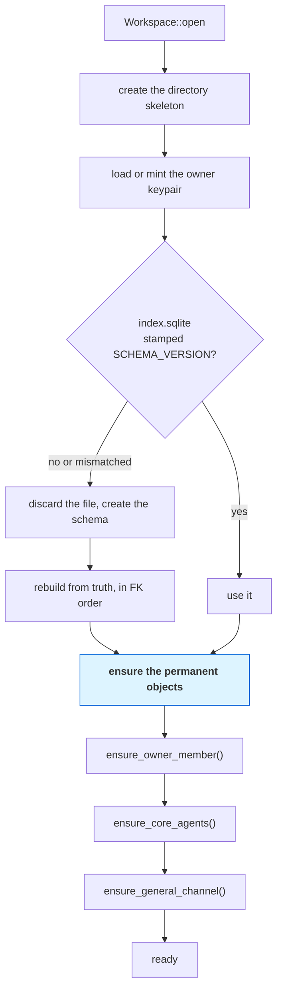

# 08 — Persistence

**The filesystem is truth. `index.sqlite` is a cache and can be deleted at any moment without
loss.** Everything below follows from that one sentence — including, and especially, what the
database constraints are *for*.

---

## Truth

Every durable fact is a file.

| What | Where | Shape |
|---|---|---|
| A goal's history | `goals/<GoalId>/journal.jsonl` | append-only, one signed Nostr event per line — step and run facts (kind 3411) included: a run queued, started, amended, finished or cancelled with its cause |
| The current goal | `goals/<GoalId>/state/33400-<GoalId>.json` | one signed addressable event; the higher revision wins; what the goal listens with (`listening`) is on it |
| What a library workflow listens with | `workflows/listening/<WorkflowId>.json` | the `Listening` record — the inputs, the per-run budget, since when; there while the workflow is On, gone when it is Off. Local and unsigned: a toggle is never a revision of the definition, and a workflow stays on the node it was turned on at |
| A run | `goals/<GoalId>/state/33413-<RunId>.json` — a goal's; `workflows/runs/<RunId>/state/33413-<RunId>.json` — a run of the workspace's | the frozen workflow, its `scope` (the goal, or the workspace with its ceiling), the inputs, the start it began at, the event that began it and the signal it was dispatched from, its causal chain, every step's record; one per attempt, revision per event, written by compare-and-swap |
| A run of the workspace's history | `workflows/runs/<RunId>/journal.jsonl` | append-only like a goal's journal — its step and run facts, its questions, decisions, notes and results — each fact under the run's own coordinate, `33413:<pk>:<RunId>` ([09](09-protocol-gep.md)) |
| A work item | `<home>/state/33402-<WorkItemId>.json` — the goal's folder or the run's | bound to its run and step |
| A library workflow | `workflows/state/33412-<WorkflowId>.json` | your definition or an installed template; `origin` is `workspace` or `catalog` |
| A goal's design | `goals/<GoalId>/state/33412-<WorkflowId>.json` | `origin: goal`; travels, and is deleted, with the goal |
| Budget spend | `<home>/ledger.jsonl` — `goals/<GoalId>/` or `workflows/runs/<RunId>/` | append-only |
| The goal graph | `goals/<GoalId>/edges.json` | |
| A work item's captured result | `<home>/results/<WorkItemId>.patch` | the patch a copy workstream left; a git workstream's result is its commit |
| A goal's document — a file a person gave it as context | the goal's journal, as a `kind:3400` `document { file }` fact | syncs with the goal; `goals/<GoalId>/documents/<name>` is **derived** from the facts in journal order (a taken name numbered) by hard link, else copy, from the attachment store — on add, on rebuild, on a peer's ingest once the bytes are held (`goal_documents.rs`) |
| A project | `projects/<slug>/project.json` | |
| A goal ⇄ project attachment | the goal's journal, as a `kind:3400` `attachment` fact | syncs with the goal; `goal_projects` is rebuilt from it |
| A workstream | `projects/<slug>/workstreams/<WorkstreamId>.json` | the primary's id is the project's; no path is stored — the checkout is derived from the kind |
| An agent, team, skill, MCP server | `<kind>/<id>.json` | |
| A connector | `connectors/<id>.json` and `connectors/state/33414-<id>.json` | a declarative definition of an outside platform's API; `origin` is `local` or `catalog`; syncs like a skill |
| A connector account | `identity/connectors/<connector>/<account>.json` | this machine's login: a label, non-secret parameters, the default mark, which secret fields are set — never a value; the fields live in the keystore under `connector:<connector>:<account>:<field>`; never synced, like everything under `identity/` |
| An addon | `addons/<id>/addon.json` and `addons/state/33407-<id>.json`; the bundle under `addons/<id>/files/` | the **record** — the manifest as installed, `origin` (`local` or `catalog`), `enabled`, `granted`, `installed_at` — syncs like a skill; the **bundle** is this machine's and never travels, so a record from a peer lists with its files absent ([18](18-addons.md)) |
| A channel | `channels/state/33405-<id>.json` | no journal, so the signed addressable event *is* the record |
| A conversation | `conversations/state/33415-<id>.json` | the record — its origin, its title, whether it is archived — signed and addressable like a channel's; its messages are the stream below, under its own id ([13 — Conversations](13-conversations.md)) |
| A note | `notes/workspace/<NoteId>.md`, `notes/goals/<GoalId>/<NoteId>.md`, `notes/projects/<slug>/<NoteId>.md`, `notes/workflows/<WorkflowId>/<NoteId>.md`, `notes/channels/<ChannelId>/<NoteId>.md`, `notes/node/<NoteId>.md` | Markdown with a front matter block (`title`, `pinned`, `created_at`, `updated_at`); `notes/` is one git repository — the engine makes it with the first note, and the person commits and pushes from the overlay. The `notes` table is the locator, the file the truth |
| A drawing | `drawings/state/33401-<DrawingId>.json`; `drawings/workspace/<DrawingId>.excalidraw`, `drawings/goals/<GoalId>/…`, `drawings/projects/<slug>/…`, `drawings/workflows/<WorkflowId>/…`, `drawings/channels/<ChannelId>/…`, `drawings/node/…` | the **record** — title, scope, `pinned`, the scene (vector only, under 768 KiB) — is the snapshot, signed and addressable like an addon's, and syncs; the `.excalidraw` **file** is its export, rewritten by every write and every ingest, with a `bisa` block naming it; `drawings/` is one git repository the engine makes with the first drawing, excluding `state/` through `.git/info/exclude` — commit, push, fetch, no pull. The `drawings` table holds every column a list draws ([19](19-drawings.md)) |
| A message stream — a channel's, a goal's thread, a conversation's | `conversation/<scope>.jsonl` | append-only; the scope is the channel id, the goal id or the conversation id |
| The activity log — the engine's own facts (a project made, a workstream opened, a listener that began a run, a setting changed, the node paused), which have no journal and no channel to live in | `activity/<YYYY-MM>.jsonl` | append-only, one JSON `ActivityFact` per line, local and unsigned — no GEP kind, by the test 09 applies to workstreams; the index's `activity` table is derived from it beside the journals and the conversations, so a rebuild loses nothing (`activity_log.rs`) |
| The diagnostic log — what the node, a command, an MCP server and the desktop write about themselves: a 5xx, a panic, a crashed screen, and at `info` one line per activity fact | `logs/<process>/<process>.<period>.jsonl` | one JSON object per line, written synchronously by `bisa-log`, rotated by the hour or the day and pruned past `logging.keep_files` — **the files the platform removes on its own**, with the crash reports past fifty and a stale run marker; this machine's, never indexed, never synced, no GEP kind by the same test; nothing reads a file back but a person ([crates/log](crates/log.md)) |
| A crash report — a panic with its location, thread and backtrace, a run that ended without a goodbye, the desktop's node exiting with its last stderr lines — and the flight recorder's last lines before it | `logs/crashes/<process>.<stamp>.<pid>.json` | one JSON document, written atomically by the hook, the next start of the family or the shell; fifty kept; read back by `GET /logs/crashes/{name}`, `bisa logs` and Settings › Node › Logging |
| A run's marker | `logs/runs/<process>.<pid>.json` | written when a process opens its file, removed by its goodbye; found by the next start of the family with the pid dead, it becomes the report above |
| The signal queue | `events/queue.jsonl` | append-only; an `enqueued` line carries the whole signal — its listener (none for a named signal kept for a wait to replay), its source, its name, its payload, its scope, its chain and its dedupe key — and a `state` line per move carries the state, `attempts` and the note, the last line per id wins — the index restores the queue from it, skipping a signal whose host is gone and a line of another shape |
| A listener's memory | `events/listeners/<host kind>-<host id>-<step>.json` | when it is next due, when it last began a run, what a poll has seen, a project's branch heads, files and pull request states as last looked at, a check's last result — and the digest of the start it belongs to. This machine's, never synced, never indexed; started afresh when its host is turned on or its start changed, forgotten with its host |
| A check start's folder | `events/scratch/<host kind>-<host id>-<step>/` | where a check start that names no project runs its command |
| A session's record | `sessions/<adapter>/<id>.json` | the adapter, the `kind` (`worker` · `guided` · `conversation` — the fourth kind, `terminal`, lives in presence and is never recorded), the item, the workstream, the conversation it is a turn of, the transcript, `status` (`live` · `parked` · `ended`), the harness child's `pid` and when it was seen, `ended_at` |
| Attachment bytes — an attachment's and an artifact's alike | `attachments/<2 hex>/<62 hex>` | content-addressed; `attachments/named/<sha256>/<name>` is a blob under its maker's name, made on demand for the file manager and the default app ([12 — Artifacts](12-artifacts.md)) |
| Membership and governance | `members.json`, `governance.json` | the owner and the people hosted here, each at a role ([14](14-collaboration.md)); four gate policies — owner, admins, members, a list; an older shape, or a file that is there and does not parse, is refused at open — read whole or not at all, never read as empty and written back |
| Invitations and held messages | `invites.json` (mode `0600`), `held.json` | an invitation's record with its secret's hash and its state; the messages from outside no agent may hear yet, with the reason |
| What this node holds of a workspace it joined | `hosts/<host-pubkey>/` | `bisa-guest`'s, apart from the store: the host's card, the channels and people the host said, the relayed facts one log per scope, the ids seen, the read marks |
| The wire's ledger | `net_published.jsonl` | `(member, event)` pairs the host's pump delivered, so a fact is sent once across restarts |
| Keys, a connector account's secret fields, a public hook's secret | `identity/<name>.key` (`:` written as `_`) | mode `0600`, created exclusive; a connector secret is replaced in place when re-entered or refreshed; a hook's — `hook:<host>:<step>` — is minted when its host is first turned on, kept across Off and On, replaced on rotation, removed with its host |
| Settings | `machine.json` (never synced), `settings.json`, `projects/<slug>/settings.json` | three scopes; see [the IDE documents](ide/13-settings.md) |
| Review notes | `projects/<slug>/review/<NoteId>.json` | local, no kind |
| IDE layout, graph cache, terminal scrollback | `ide/layout/`, `ide/graph/`, `run/terminals/` | window furniture and caches — rebuildable or disposable, never synced |
| What agents changed in a checkout, per conversation | `ide/changes/<conversation>/ledger.json`, `blobs/<sha256>`, `index` | the turns and the files under review, each file as it was and as the turn left it, and the private git index a snapshot is staged through — this machine's, never synced, gone with the conversation; a ledger that no longer parses is kept beside it as `ledger.unreadable.json` |
| The bearer token, the engine lock | `run/token`, `run/engine.lock` | mode `0600`; `run/` never syncs |

The full tree is in [04 — Workspace, Project, Goal](04-workspace-project-goal.md#storage--no-goal-in-any-path).

**A goal stores no status — but it stores its marks.** `closed` and `archived` are the two moves a
goal makes on its own, written by `set_goal_closed` and `set_goal_archived` alone; `archived_at`
in the index is the column every list filters on. Its row in the index carries a status — `draft`, `running`, `waiting`,
`done`, `failed`, `closed` — because a list needs to sort by it, but the row is computed from the
goal snapshot and its current run at index time (`Goal::status`), never written by anything else.
An older goal snapshot, which carried a `state` and criteria, is refused as `Unreadable` by name.

**A run is filed in its home.** `Home` (`bisa-core/src/home.rs`) is where a run's truth lives: a
goal's run in the goal's folder, a **run of the workspace** — a workflow run on its own, started by
*Run…*, the CLI or an event of a workflow that is On — in its own folder, `workflows/runs/<RunId>/`, beside
the library's `workflows/state/` and never inside a goal. The folder is a goal's shape without what
only a goal has (`HomePaths` in `paths.rs`): `journal.jsonl`, `state/` (the run's snapshot and its
work items), `ledger.jsonl`, `results/`, `scratch/` — the run's writable scratch, where a step with no
project works. Every run-truth write takes a `&Home` — the journal, the work items, the ledger, the
results — so one code path serves both. A run never changes scope: a snapshot that says otherwise is
refused at ingest. There is no older shape to read: a run, work item or journal fact that carries a
bare `goal` is `Unreadable`, and a development workspace from before 0.1.0 is reset
(`scripts/reset-dev-workspace`).

**From 0.1.0 a record only grows.** A field added in a minor release is optional, with a default, so
every file an earlier 0.x wrote still reads; nothing is renamed, removed or retyped inside a major
([Compatibility](../reference/compatibility.md)). The strictness below is what makes that safe: a
file is read whole, or refused by name.

**A record refuses a key nobody knows, by name.** Every record the store writes and every part of
one — a goal, a run and its scope, steps and events, a workflow's steps, inputs and flows, a
workstream and its kind, an agent, a team, a skill, a channel and its roster, a conversation, a
server, an addon's record, a member, an invite, a drawing, a note's front matter, a judgement, a
connector's operations and auth — is read with `deny_unknown_fields` (or, where a struct is
flattened beside its siblings, by hand — `refuse_unknown_keys` over the raw map first, since a derived
`flatten` would let a stray key drop in silence), so a file another shape of the code
wrote is `Unreadable` with the key named, never read with a field dropped in silence; the same
types carried in a request body refuse the key as a 400 ([crates/node](crates/node.md)). What is
left loose is named with its reason and held there by `core tests/it/shapes.rs`: another program's
file (an Excalidraw scene, a pet pack's manifest), the node's own output (a `Text`, a resolved
setting, the activity rows), and the journal facts of the wire, which a node reads by the fields it
knows ([09](09-protocol-gep.md)).

### A list tolerates one broken file

A single read refuses: `get_goal` and `get_run` answer `GoalNotFound`, `RunNotFound` or
`Unreadable` for a snapshot that is gone, was written by another shape of the code or is no signed
event at all, and the
node maps that to a 404 or a 500 for that one thing. A **list** never fails whole for it:
`list_goals`, `list_archived_goals` and `list_runs` skip such a row through one rule
(`workspace::tolerated`), saying so once at `error` with the id, so the inbox, the goals screen
and the guided resume read every goal that *can* be read. The roster and its library keep the
same rule — `list_agents`, `list_teams`, `list_skills`, `list_mcps`, and the connectors' `list_connectors`
and `list_connector_accounts`: one agent's file cut short
costs that agent, never the roster every picker, every wake and every assignment reads, and the
workspace still opens; asked for by itself (`get_agent`, `get_team`, `get_skill`, `get_mcp`) it
is `Unreadable`, naming its file and what it should have been — and a reference to it is
answered with that, never as a reference to something nobody wrote. A list is a read and repairs nothing —
`rebuild_index` is the one reconciler of the index against the disk, and it skips the same file
the same way. The node's read routes carry the fact one step further: a goal whose current run
cannot be read is a row with `run_unreadable: true`, drawn as a goal with no run.

### Ordering a snapshot

An addressable snapshot is ordered **revision first**: the stored `(revision, created_at)` must be
below the incoming pair for a write to land, and the clock decides only between two authors at the
same revision (`apply_remote`). A time-first rule let two writers a second apart both win, and the
second silently dropped what the first had written — for a run, a parallel step's record.

A local edit names the revision it was made from and is written through `put_expecting(expected)`:
the stored copy must be at exactly `expected` (0 for a new object) or the write is refused with
`RevisionConflict { kind, id, expected, actual }` and nothing lands. Workflow edits and every run
event go through it; a run event is also recorded under one lock per process (`run_writes`) and,
when a peer's snapshot moved the run under the write, is re-read and re-applied a bounded number of
times.

### Writing truth

One function, `write_atomic`, and it does three things the shape it replaces did not:

1. **A unique temporary name per write**, not per process. Two threads writing one path used to
   target the same temporary and could interleave into a byte-mix of two serializations.
2. **`sync_all()` on the temporary before the rename, and an fsync of the parent directory after.**
   "Atomic" without durability means atomic with respect to other readers, which is not what a
   platform whose model is *the filesystem is truth* needs.
3. **A failed rename removes its temporary**, so a workspace does not fill with orphans.

Append-only logs — the journal, the ledger, the signal queue, the conversation logs, the activity
log — open with `O_APPEND`, write one line per call and `sync_data` it before returning
(`append_line`): a fact acknowledged to a caller is on the disk, not in a page cache a power loss
empties. The tail an interrupted write leaves is one partial line, and every reader skips a line it
cannot parse.

### Where paths come from

`bisa-store/src/paths.rs` is the **only** place that knows where anything goes. Nothing
anywhere joins a workspace path by hand.

That is a rule with teeth, because the shape it replaces had seventeen sites building paths from
literals — including the sync layer, which walked the workspace with `read_dir(root.join("goals"))`
inside an `if let Ok`. Rename the directory, miss that literal, and sync publishes nothing and
**reports success**. A test asserts that no crate outside `paths.rs` joins a workspace directory
name.

Anything that becomes a filename is a **type**, not a checked string: `Slug`, `GoalId`, `RunId`,
`WorkflowId`, `NoteId`, a validated `sha256`. A function that joins a path takes one, and the
compiler refuses a `String`.

---

## Cache

```rust
/// Bump when SCHEMA changes. The next open discards the file and rebuilds
/// from truth. This is a cache-invalidation marker, not a migration ladder.
const SCHEMA_VERSION: i32 = 26;
```

There is no ladder to preserve and nothing to migrate from — a mismatch discards the file and the
index is rebuilt from truth. Version 10 is
the archived mark: `goals`, `workflows` and `projects` each carry `archived_at`, the column every
list filters on, and the test that pins the number says why — *archived arrived; still no ladder*.

Version 14 is the restart mark: `sessions.status` is one of `live` · `parked` · `ended` with a
`CHECK`, indexed, beside `pid`, `pid_seen_at` and `ended_at`; the signal queue's counts live in the
queue. Version 15 is the conversations mark: a `conversations` table with its `conversation_agents`,
a message's scope is a `channel`, a `goal` or a `conversation`, and a session row says its `kind`
and the `conversation` it is a turn of (the roster's fifth kind, `ask` — one bounded question to a
model — is never written here: it runs at the read tier in a scratch folder under a deadline, so
a crash's orphan can hurt no checkout and no restart needs its record; it is a row of the roster
alone, [06](06-agents-and-teams.md#sessions-and-presence)). Version 17 is the thinking mark: a message carries the
`thinking` its author's harness streamed before the words (null for a person's post), a body kind
is `post` or `membership` and nothing else, and a conversation keeps no compaction counters — the
harness compacts its own context. Version 18 is the project-list mark: `conversations` gains
`idx_conversations_project` over `(project, archived, last_message_at)`, the index the Project IDE's
one read by project walks. Version 19 is the connector-poll mark: an outside platform may be
polled on a clock through a connector's read operation.
Version 20 is the judge mark: `run_steps.kind` admits `judge`
([15 — The Decision-Making Agent](15-decision-making-agent.md#the-judge-step)) — no other table changes, because a
judgement is not a new fact shape: it rides the activity log and, on a goal, a `GOAL_NOTE` the way a
guard decision does. Version 21 is the mode mark: `conversations` gains `mode` — `manual`, `auto` or
`plan`, how far an agent goes on its own in a conversation about a checkout
([ide/20 — Reviewing agent changes](ide/20-reviewing-agent-changes.md)). What a turn changed is not
indexed at all: the ledger and its blobs are files under `ide/changes/`. Version 22 is the drawing
mark: a `drawings` table, the locator and every column a list draws
([19 — Drawings](19-drawings.md)). Version 23 is the note-conversation mark: a conversation's origin
may be a `note`, and a session's `kind` is `worker`, `guided`, `conversation` or `terminal` — a
note's answer is a conversation's turn. Version 24 is the workspace-run mark: `workflow_runs` gains
`scope` — `goal` or `workspace` — with `goal_id` null for a run of the workspace, `CHECK`ed both ways
and never `queued`, and `idx_runs_workflow` over `(workflow_id, scope, queued_at)` lists a
workflow's runs; `work_items.goal_id` is nullable beside `run_id` (one of the two, `CHECK`ed);
`approvals` and `budget_ledger` are keyed by a goal **or** a run, exactly one; a goal's `origin` may
be `run` (captured by a workspace run's `spawn` step); a project a step made may name no goal.
Version 25 is the events mark ([03 — Workflows](03-workflows.md#events)): the `triggers` table is
gone — a listener is a start step of a host that listens, not a row — and `signals` is keyed by
the listener each occurrence is for (`host_kind`, `host_id`, `step`, all null for a named signal
kept for a wait to replay), with its `source`, `name`, `chain_json` and `dedupe_key`, unique per
listener, and the states `waiting`, `held` and `skipped` beside the four before; `workflow_runs`
gains `listener` and `dispatched` — unique, so one signal makes one run; `workflows` and `goals`
gain `listening_since`; `run_steps.kind` admits `start`, `emit` and `parallel` and `run_steps.state`
`diverted`; a goal's `origin`, a tag's `entity` and an activity fact's `concept` lose the words
the feature before had. Version 26 is the said mark ([17 — Internationalisation](17-internationalisation.md)):
`messages` gains `said` — the platform's own sentence behind a post it authored, as the message of
the catalog with its arguments (`Text`, JSON), so a reader in another language renders the note
and not its English; null for what a person or an agent said.

A mismatch deletes `index.sqlite` and its `-wal` / `-shm` siblings and rebuilds. So does a file
that lies: `Index::open` runs `PRAGMA quick_check` on an existing file, and anything but `ok` —
or a file SQLite cannot open at all — goes through the same door (`bisa workspace reindex`
opens it by hand on a stopped node).

### The index is written in transactions

Every write that lands more than one row lands them in one `Index::in_transaction` — a run's row
with its step rows and the goal's cached status (`index_run_in`), a work item's row with its text,
every `reindex_*` walker of a rebuild — so a process ended between two statements leaves the rows
as they were, never a run with no steps at a version that would not trigger a rebuild. A nested
call joins the outer transaction. `journal_mode = WAL` with `synchronous = NORMAL` is the right
setting **because** the index is a cache: a committed transaction may be lost to a power cut, and
`reconcile_live` at the next open re-indexes every unfinished run of every open goal and every
unfinished run of the workspace — read straight from `workflows/runs/*` — and their work items, from
the snapshots, so a snapshot written a moment before the crash is never ahead of
its projection when the engine reads it. Both walks read every snapshot through `tolerated`: a run,
goal, work item or workflow this build cannot read is one error line naming the file and a skipped
row (`list_work_items_readable` names the skipped items), never a failed open — the single read of
that record still refuses it by name. Only `governance.json` stops the open, by design. `wal_autocheckpoint = 1000` bounds the WAL a busy node
grows.

### What the constraints are for

The schema declares real foreign keys, real checks, real unique indexes and — beside it, in
`GUARD_TRIGGERS` — two triggers, `channels_general_undeletable` and `agents_core_undeletable`. In a cache
these cannot protect user data — the truth files can be re-read. **They exist to catch our own
bugs**, at the one moment a bug is cheapest to find: during a rebuild, where a dangling reference
means the rebuild is wrong, not that the data is.

A constraint here is never the definition of a domain rule. The rule lives in `bisa-core`.

### The schema

```sql
-- Workflows: definitions, then the goals that run them
CREATE TABLE workflows (
    id           TEXT PRIMARY KEY,
    name         TEXT NOT NULL,
    origin       TEXT NOT NULL CHECK (origin IN ('workspace','catalog','goal')),
    catalog_slug TEXT,
    goal_id      TEXT,
    author       TEXT NOT NULL,
    revision     INTEGER NOT NULL DEFAULT 0,
    step_count   INTEGER NOT NULL CHECK (step_count >= 0),
    archived_at  INTEGER,
    listening_since INTEGER,
    created_at   INTEGER NOT NULL,
    CHECK ((origin = 'catalog') = (catalog_slug IS NOT NULL)),
    CHECK ((origin = 'goal') = (goal_id IS NOT NULL))
);
CREATE UNIQUE INDEX idx_workflows_catalog ON workflows(catalog_slug) WHERE catalog_slug IS NOT NULL;
CREATE INDEX idx_workflows_goal ON workflows(goal_id);

-- Goals
CREATE TABLE goals (
    id          TEXT PRIMARY KEY,
    status      TEXT NOT NULL CHECK (status IN
                  ('draft','running','waiting','done','failed','closed')),
    closure     TEXT     CHECK (closure IS NULL OR closure IN ('abandoned','superseded')),
    superseded_by TEXT   REFERENCES goals(id) ON DELETE SET NULL,
    origin      TEXT NOT NULL CHECK (origin IN ('captured','spawned','run')),
    workflow_id TEXT     REFERENCES workflows(id) ON DELETE SET NULL,
    run_id      TEXT,
    author      TEXT NOT NULL,
    title       TEXT,
    assignees   TEXT NOT NULL DEFAULT '[]',
    revision    INTEGER NOT NULL DEFAULT 0,
    archived_at INTEGER,
    listening_since INTEGER,
    created_at  INTEGER NOT NULL,
    CHECK ((status = 'closed') = (closure IS NOT NULL)),
    CHECK (superseded_by IS NULL OR closure = 'superseded'),
    CHECK (archived_at IS NULL OR status = 'closed')
);
CREATE INDEX idx_goals_status   ON goals(status, created_at);
CREATE INDEX idx_goals_workflow ON goals(workflow_id);

CREATE TABLE workflow_runs (
    id          TEXT PRIMARY KEY,
    scope       TEXT NOT NULL CHECK (scope IN ('workspace','goal')),
    goal_id     TEXT     REFERENCES goals(id) ON DELETE CASCADE,
    workflow_id TEXT NOT NULL,
    status      TEXT NOT NULL CHECK (status IN ('queued','running','waiting','done','failed','cancelled')),
    revision    INTEGER NOT NULL DEFAULT 0,
    queued_at   INTEGER NOT NULL,
    started_at  INTEGER,
    finished_at INTEGER,
    listener    TEXT,
    dispatched  TEXT,
    CHECK ((scope = 'goal') = (goal_id IS NOT NULL)),
    CHECK (scope = 'goal' OR status != 'queued'),
    CHECK (dispatched IS NULL OR listener IS NOT NULL)
);
CREATE INDEX idx_runs_goal     ON workflow_runs(goal_id, queued_at);
CREATE INDEX idx_runs_workflow ON workflow_runs(workflow_id, scope, queued_at);
CREATE INDEX idx_runs_listener ON workflow_runs(listener, status);
CREATE UNIQUE INDEX idx_runs_dispatched ON workflow_runs(dispatched) WHERE dispatched IS NOT NULL;

CREATE TABLE goal_edges (
    from_id TEXT NOT NULL REFERENCES goals(id) ON DELETE CASCADE,
    to_id   TEXT NOT NULL REFERENCES goals(id) ON DELETE CASCADE,
    kind    TEXT NOT NULL CHECK (kind IN ('refines')),
    PRIMARY KEY (from_id, to_id, kind)
);

-- Projects, and the relation
CREATE TABLE projects (
    id          TEXT PRIMARY KEY,
    slug        TEXT NOT NULL UNIQUE,
    name        TEXT NOT NULL,
    root_kind   TEXT NOT NULL CHECK (root_kind IN ('managed','external')),
    root_path   TEXT,
    vcs         TEXT NOT NULL CHECK (vcs IN ('none','git')),
    publish     TEXT NOT NULL CHECK (publish IN ('manual','gated','auto')),
    origin          TEXT NOT NULL CHECK (origin IN ('workspace','goal','step')),
    origin_goal     TEXT,
    origin_run      TEXT,
    origin_step     TEXT,
    origin_workflow TEXT,
    archived_at INTEGER,
    created_at  INTEGER NOT NULL,
    CHECK ((root_kind = 'external') = (root_path IS NOT NULL)),
    CHECK (origin != 'workspace' OR (origin_goal IS NULL AND origin_run IS NULL)),
    CHECK (origin != 'goal' OR origin_goal IS NOT NULL),
    CHECK ((origin_run IS NULL) = (origin_step IS NULL) AND (origin_run IS NULL) = (origin_workflow IS NULL)),
    CHECK (origin != 'step' OR origin_run IS NOT NULL)
);
CREATE INDEX idx_projects_origin_goal     ON projects(origin_goal);
CREATE INDEX idx_projects_origin_workflow ON projects(origin_workflow);

CREATE TABLE work_items (
    id          TEXT PRIMARY KEY,
    goal_id     TEXT     REFERENCES goals(id) ON DELETE CASCADE,
    project_id  TEXT     REFERENCES projects(id) ON DELETE SET NULL,
    run_id      TEXT     REFERENCES workflow_runs(id) ON DELETE CASCADE,
    step_id     TEXT,
    state       TEXT NOT NULL CHECK (state IN
                  ('open','claimed','in_progress','blocked','review','accepted','rejected','cancelled')),
    harness     TEXT,
    assignees   TEXT NOT NULL DEFAULT '[]',
    updated_at  INTEGER NOT NULL,
    CHECK (goal_id IS NOT NULL OR run_id IS NOT NULL)
);
CREATE INDEX idx_work_items_goal    ON work_items(goal_id);
CREATE INDEX idx_work_items_project ON work_items(project_id);
CREATE INDEX idx_work_items_run     ON work_items(run_id);

CREATE TABLE run_steps (
    run_id      TEXT NOT NULL REFERENCES workflow_runs(id) ON DELETE CASCADE,
    step_id     TEXT NOT NULL,
    kind        TEXT NOT NULL CHECK (kind IN
                  ('start','wait','emit','end','decide','if','switch','judge','parallel',
                   'for_each','while','agent','human','approval','check','connector','notify',
                   'spawn')),
    state       TEXT NOT NULL CHECK (state IN
                  ('pending','running','waiting','done','skipped','failed','cancelled',
                   'diverted')),
    wait_topic  TEXT,
    due_at      INTEGER,
    work_item   TEXT REFERENCES work_items(id) ON DELETE SET NULL,
    updated_at  INTEGER NOT NULL,
    PRIMARY KEY (run_id, step_id)
);
CREATE INDEX idx_run_steps_wait ON run_steps(state, wait_topic);
CREATE INDEX idx_run_steps_due  ON run_steps(state, due_at);

CREATE TABLE goal_projects (
    goal_id     TEXT NOT NULL REFERENCES goals(id)    ON DELETE CASCADE,
    project_id  TEXT NOT NULL REFERENCES projects(id) ON DELETE CASCADE,
    attached_at INTEGER NOT NULL,
    attached_by TEXT    NOT NULL,
    PRIMARY KEY (goal_id, project_id)
);
CREATE INDEX idx_goal_projects_project ON goal_projects(project_id);

-- Agents, teams, channels
CREATE TABLE agents (
    id         TEXT PRIMARY KEY,
    name       TEXT NOT NULL,
    harness    TEXT NOT NULL,
    enabled    INTEGER NOT NULL CHECK (enabled IN (0,1)),
    pubkey     TEXT NOT NULL UNIQUE,
    origin     TEXT NOT NULL CHECK (origin IN ('local','catalog','core')),
    created_at INTEGER NOT NULL
);

CREATE TABLE teams (
    id         TEXT PRIMARY KEY,
    name       TEXT NOT NULL,
    enabled    INTEGER NOT NULL CHECK (enabled IN (0,1)),
    origin     TEXT NOT NULL CHECK (origin IN ('local','catalog')),
    created_at INTEGER NOT NULL
);

CREATE TABLE channels (
    id            TEXT PRIMARY KEY,
    name          TEXT NOT NULL,
    kind          TEXT NOT NULL CHECK (kind IN ('standing','direct')),
    topic         TEXT,
    audience_json TEXT NOT NULL,
    roster_policy TEXT NOT NULL CHECK (roster_policy IN ('everyone','listed')),
    origin        TEXT NOT NULL CHECK (origin IN ('local','catalog','core')),
    created_at    INTEGER NOT NULL,
    CHECK (roster_policy = 'listed' OR id = 'general')
);

CREATE TABLE channel_roster (
    channel_id  TEXT NOT NULL REFERENCES channels(id) ON DELETE CASCADE,
    member_kind TEXT NOT NULL CHECK (member_kind IN ('agent','team')),
    member_id   TEXT NOT NULL,
    PRIMARY KEY (channel_id, member_kind, member_id)
);


CREATE TABLE workstreams (
    id          TEXT PRIMARY KEY,
    project_id  TEXT NOT NULL REFERENCES projects(id)   ON DELETE CASCADE,
    kind        TEXT NOT NULL CHECK (kind IN ('primary','worktree','copy')),
    name        TEXT,
    goal_id     TEXT     REFERENCES goals(id)           ON DELETE SET NULL,
    work_item   TEXT     REFERENCES work_items(id)      ON DELETE SET NULL,
    branch      TEXT,
    agent_id    TEXT     REFERENCES agents(id)          ON DELETE SET NULL,
    state       TEXT NOT NULL CHECK (state IN
                  ('open','dirty','committed','pushed','pr_open','merged','closed')),
    created_at  INTEGER NOT NULL
);
CREATE INDEX idx_workstreams_project ON workstreams(project_id);
CREATE UNIQUE INDEX idx_workstreams_primary ON workstreams(project_id) WHERE kind = 'primary';
CREATE INDEX idx_workstreams_goal    ON workstreams(goal_id);
CREATE INDEX idx_workstreams_work_item ON workstreams(work_item);

-- Conversations: the records, then every message stream's rows
CREATE TABLE conversations (
    id              TEXT PRIMARY KEY,
    origin_kind     TEXT NOT NULL CHECK (origin_kind IN
                      ('node','workspace','goal','workflow','project','workstream','drawing','note')),
    origin_id       TEXT,
    project         TEXT     REFERENCES projects(id) ON DELETE CASCADE,
    title           TEXT,
    first_line      TEXT,
    author          TEXT NOT NULL,
    created_at      INTEGER NOT NULL,
    last_message_at INTEGER,
    message_count   INTEGER NOT NULL DEFAULT 0 CHECK (message_count >= 0),
    archived        INTEGER NOT NULL DEFAULT 0 CHECK (archived IN (0,1)),
    mode            TEXT NOT NULL CHECK (mode IN ('manual','auto','plan')),
    CHECK ((origin_kind IN ('node','workspace')) = (origin_id IS NULL))
);
CREATE INDEX idx_conversations_origin ON conversations(origin_kind, origin_id, last_message_at);
CREATE INDEX idx_conversations_project ON conversations(project, archived, last_message_at);

CREATE TABLE conversation_agents (
    conversation_id TEXT NOT NULL REFERENCES conversations(id) ON DELETE CASCADE,
    agent_id        TEXT NOT NULL,
    PRIMARY KEY (conversation_id, agent_id)
);

CREATE TABLE messages (
    id         TEXT PRIMARY KEY,
    scope_kind TEXT NOT NULL CHECK (scope_kind IN ('channel','goal','conversation')),
    scope_id   TEXT NOT NULL,
    author     TEXT NOT NULL,
    body_kind  TEXT NOT NULL CHECK (body_kind IN ('post','membership')),
    content    TEXT NOT NULL,
    thinking   TEXT,
    said       TEXT,
    context    TEXT NOT NULL DEFAULT '[]',
    reply_to   TEXT REFERENCES messages(id) ON DELETE SET NULL,
    retracted  INTEGER NOT NULL DEFAULT 0 CHECK (retracted IN (0,1)),
    created_at INTEGER NOT NULL
);
CREATE INDEX idx_messages_scope ON messages(scope_id, created_at, id);

CREATE TABLE message_mentions (
    message_id TEXT NOT NULL REFERENCES messages(id) ON DELETE CASCADE,
    pubkey     TEXT NOT NULL,
    scope_id   TEXT NOT NULL,
    created_at INTEGER NOT NULL,
    PRIMARY KEY (message_id, pubkey)
);
CREATE INDEX idx_mentions_pubkey ON message_mentions(pubkey, created_at);

CREATE TABLE attachments (
    message_id TEXT NOT NULL REFERENCES messages(id) ON DELETE CASCADE,
    ordinal    INTEGER NOT NULL,
    sha256     TEXT NOT NULL,
    name       TEXT NOT NULL,
    mime       TEXT NOT NULL,
    size       INTEGER NOT NULL CHECK (size >= 0),
    PRIMARY KEY (message_id, ordinal)
);
CREATE INDEX idx_attachments_sha ON attachments(sha256);

CREATE TABLE artifacts (
    message_id   TEXT NOT NULL REFERENCES messages(id) ON DELETE CASCADE,
    ordinal      INTEGER NOT NULL,
    sha256       TEXT NOT NULL,
    name         TEXT NOT NULL,
    mime         TEXT NOT NULL,
    size         INTEGER NOT NULL CHECK (size >= 0),
    kind         TEXT NOT NULL,
    title        TEXT NOT NULL,
    source_scope TEXT,
    source_id    TEXT,
    source_path  TEXT,
    PRIMARY KEY (message_id, ordinal)
);
CREATE INDEX idx_artifacts_sha ON artifacts(sha256);

CREATE TABLE reactions (
    id         TEXT PRIMARY KEY,
    target_id  TEXT NOT NULL REFERENCES messages(id) ON DELETE CASCADE,
    scope_id   TEXT NOT NULL,
    author     TEXT NOT NULL,
    emoji      TEXT NOT NULL,
    retracted  INTEGER NOT NULL DEFAULT 0 CHECK (retracted IN (0,1)),
    created_at INTEGER NOT NULL
);
CREATE INDEX idx_reactions_target ON reactions(target_id);

CREATE TABLE read_markers (
    scope_id      TEXT PRIMARY KEY,
    last_read_at  INTEGER NOT NULL,
    forced_unread INTEGER NOT NULL DEFAULT 0 CHECK (forced_unread IN (0,1))
);

-- Library, work, governance
CREATE TABLE skills (
    id TEXT PRIMARY KEY, name TEXT NOT NULL, description TEXT NOT NULL,
    origin TEXT NOT NULL CHECK (origin IN ('local','catalog')),
    created_at INTEGER NOT NULL
);

CREATE TABLE connectors (
    id TEXT PRIMARY KEY, name TEXT NOT NULL, description TEXT NOT NULL,
    auth TEXT NOT NULL,
    origin TEXT NOT NULL CHECK (origin IN ('local','catalog')),
    created_at INTEGER NOT NULL
);

CREATE TABLE mcp_servers (
    id TEXT PRIMARY KEY, name TEXT NOT NULL, description TEXT NOT NULL,
    transport TEXT NOT NULL CHECK (transport IN ('stdio','http','sse')),
    enabled INTEGER NOT NULL CHECK (enabled IN (0,1)),
    created_at INTEGER NOT NULL
);

CREATE TABLE sessions (
    id                TEXT PRIMARY KEY,
    adapter           TEXT NOT NULL,
    kind              TEXT NOT NULL CHECK (kind IN ('worker','guided','conversation','terminal')),
    work_item         TEXT REFERENCES work_items(id) ON DELETE CASCADE,
    workstream        TEXT REFERENCES workstreams(id) ON DELETE SET NULL,
    conversation      TEXT REFERENCES conversations(id) ON DELETE SET NULL,
    agent_id          TEXT REFERENCES agents(id)     ON DELETE SET NULL,
    transcript_path   TEXT,
    resume_token_json TEXT,
    status            TEXT NOT NULL CHECK (status IN ('live','parked','ended')),
    parked_at         INTEGER,
    -- The harness child this process spawned for the session, and when it
    -- was seen: what a restart terminates — if it is still that process —
    -- before it resumes the work.
    pid               INTEGER,
    pid_seen_at       INTEGER,
    ended_at          INTEGER
);
CREATE INDEX idx_sessions_status ON sessions(status);

CREATE TABLE approvals (
    id         INTEGER PRIMARY KEY AUTOINCREMENT,
    goal_id    TEXT REFERENCES goals(id)         ON DELETE CASCADE,
    run_id     TEXT REFERENCES workflow_runs(id) ON DELETE CASCADE,
    gate       TEXT NOT NULL CHECK (gate IN ('approval','escalation','publish')),
    subject    TEXT NOT NULL,
    actor      TEXT NOT NULL,
    approve    INTEGER NOT NULL CHECK (approve IN (0,1)),
    at         INTEGER NOT NULL,
    CHECK ((goal_id IS NULL) != (run_id IS NULL))
);
CREATE INDEX idx_approvals_goal ON approvals(goal_id, at);
CREATE INDEX idx_approvals_run  ON approvals(run_id, at);

CREATE TABLE budget_ledger (
    id         INTEGER PRIMARY KEY AUTOINCREMENT,
    goal_id    TEXT REFERENCES goals(id)         ON DELETE CASCADE,
    run_id     TEXT REFERENCES workflow_runs(id) ON DELETE CASCADE,
    tokens     INTEGER NOT NULL DEFAULT 0 CHECK (tokens    >= 0),
    usd_cents  INTEGER NOT NULL DEFAULT 0 CHECK (usd_cents >= 0),
    wall_secs  INTEGER NOT NULL DEFAULT 0 CHECK (wall_secs >= 0),
    at         INTEGER NOT NULL,
    CHECK ((goal_id IS NULL) != (run_id IS NULL))
);
CREATE INDEX idx_ledger_goal ON budget_ledger(goal_id);
CREATE INDEX idx_ledger_run  ON budget_ledger(run_id);

CREATE TABLE notes (
    id          TEXT PRIMARY KEY,
    scope_kind  TEXT NOT NULL CHECK (scope_kind IN ('workspace','goal','project','workflow','channel','node')),
    scope_id    TEXT,
    home_goal   TEXT REFERENCES goals(id) ON DELETE CASCADE,
    title       TEXT NOT NULL,
    pinned      INTEGER NOT NULL DEFAULT 0 CHECK (pinned IN (0,1)),
    updated_at  INTEGER NOT NULL,
    CHECK ((scope_kind IN ('workspace','node')) = (scope_id IS NULL))
);
CREATE INDEX idx_notes_scope ON notes(scope_kind, scope_id);

-- Drawings: the locator and the listing's columns; the snapshot is the truth
CREATE TABLE drawings (
    id             TEXT PRIMARY KEY,
    scope_kind     TEXT NOT NULL CHECK (scope_kind IN ('workspace','goal','project','workflow','channel','node')),
    scope_id       TEXT,
    home_goal      TEXT REFERENCES goals(id) ON DELETE CASCADE,
    title          TEXT NOT NULL,
    pinned         INTEGER NOT NULL DEFAULT 0 CHECK (pinned IN (0,1)),
    hash           TEXT NOT NULL,
    element_count  INTEGER NOT NULL DEFAULT 0 CHECK (element_count >= 0),
    created_at     INTEGER NOT NULL,
    updated_at     INTEGER NOT NULL,
    CHECK ((scope_kind IN ('workspace','node')) = (scope_id IS NULL))
);
CREATE INDEX idx_drawings_scope ON drawings(scope_kind, scope_id);

-- Signals: the durable queue of occurrences, keyed by the listener each is
-- for (none for a named signal kept only for a wait to replay). A listener
-- is not a row, so nothing here refers to one; one occurrence is one row per
-- listener, whatever wrote it twice.
CREATE TABLE signals (
    id           TEXT PRIMARY KEY,
    host_kind    TEXT CHECK (host_kind IS NULL OR host_kind IN ('workspace','goal')),
    host_id      TEXT,
    step         TEXT,
    source       TEXT NOT NULL CHECK (source IN
                   ('schedule','hook','message','signal','project','run','platform','connector',
                    'check','test')),
    name         TEXT,
    scope_kind   TEXT NOT NULL CHECK (scope_kind IN ('workspace','goal')),
    scope_id     TEXT,
    dedupe_key   TEXT,
    state        TEXT NOT NULL CHECK (state IN
                   ('queued','running','waiting','held','done','skipped','failed')),
    at           INTEGER NOT NULL,
    started_at   INTEGER,
    attempts     INTEGER NOT NULL DEFAULT 0 CHECK (attempts >= 0),
    payload_json TEXT NOT NULL,
    chain_json   TEXT NOT NULL DEFAULT '{}',
    last_error   TEXT,
    CHECK ((host_kind IS NULL) = (host_id IS NULL) AND (host_kind IS NULL) = (step IS NULL)),
    CHECK ((scope_kind = 'goal') = (scope_id IS NOT NULL))
);
CREATE UNIQUE INDEX idx_signals_dedupe ON signals(host_kind, host_id, step, dedupe_key)
    WHERE dedupe_key IS NOT NULL AND host_kind IS NOT NULL;
CREATE INDEX idx_signals_state    ON signals(state, at);
CREATE INDEX idx_signals_listener ON signals(host_kind, host_id, step, state, at);
CREATE INDEX idx_signals_name     ON signals(source, name, at);
CREATE INDEX idx_signals_scope    ON signals(scope_kind, scope_id, at);

-- Workspace-wide
CREATE TABLE members (
    pubkey     TEXT PRIMARY KEY,
    role       TEXT NOT NULL CHECK (role IN ('owner','admin','member','guest')),
    label      TEXT,
    added_at   INTEGER NOT NULL
);

CREATE TABLE seen_events (
    event_id TEXT PRIMARY KEY,
    at       INTEGER NOT NULL
);
CREATE INDEX idx_seen_at ON seen_events(at);

CREATE TABLE tags (
    entity TEXT NOT NULL CHECK (entity IN
             ('agent','team','channel','skill','mcp','project','goal','workflow','connector')),
    id     TEXT NOT NULL,
    tag    TEXT NOT NULL,
    PRIMARY KEY (entity, id, tag)
);
CREATE INDEX idx_tags_tag ON tags(tag, entity);

CREATE VIRTUAL TABLE events_fts USING fts5(doc_id, goal_id, content);

-- The activity feed (the Pulse): one row per fact across every concept,
-- paged by keyset on (at, seq). Derived from the journals, the
-- conversations and the activity log.
CREATE TABLE activity (
    seq         INTEGER PRIMARY KEY,
    at          INTEGER NOT NULL,
    concept     TEXT NOT NULL CHECK (concept IN ('workspace','goals','workflows','projects','channels','agents','node')),
    kind        TEXT NOT NULL,
    source_kind TEXT NOT NULL,
    source_id   TEXT NOT NULL,
    author      TEXT,
    event       TEXT NOT NULL
);
CREATE INDEX idx_activity_at ON activity(at, seq);
CREATE INDEX idx_activity_concept ON activity(concept, at, seq);
CREATE INDEX idx_activity_kind ON activity(kind, at, seq);
```

Three tables are the run engine's: `workflows` finds a definition by name, tag or catalog slug —
the unique partial index is what makes *a template is installed at most once* a fact rather than a
convention; `workflow_runs` is one row per attempt, queued or started — `started_at` is null while a run waits its turn behind the goal's live one, `scope` says whose run it is: a goal's, or the workspace's, which never waits, and `listener` with `dispatched` says which start's event began it, so a listener's guard counts its live runs in one read; `run_steps` is one row per step of a run, and
its two indexes answer the engine's two standing questions on restart — *which `wait` steps hold
for this?* and *which are due by now?* — without opening a snapshot. `signals` is the queue: the
worker claims its oldest `queued` row in one statement, and the unique index on a listener's
dedupe key is what makes an occurrence heard twice one signal. What a run owns — its
work items, its decisions (`approvals`), its spend (`budget_ledger`) — is keyed by its home: the goal
for a goal's run, the run itself for a run of the workspace, so deleting either cascades. A journal
fact's `activity` row files under its home's source: the goal, or — for a run of the workspace — its
workflow (`source_kind` `workflow`, the Workflows concept), which is where the Pulse and the Inbox's
workflow row read a run's story (`record_journal_activity`); `events_fts` indexes a goal's facts,
since search finds goals.

### Rebuild order

Foreign keys are the one real cost of this schema, and it is paid exactly here: `rebuild_index()`
must insert in dependency order, because a child inserted before its parent is now an error rather
than a dangling row.

```
1. agents · teams · skills · connectors · mcp_servers · members · channels (+ channel_roster)
2. projects
3. workflows                  (workflows/state/ and every goals/<id>/state/; a goal's row names the
                               workflow it runs; workflows/runs/ holds runs, never a definition;
                               then the library's listening column, from workflows/listening/)
4. goals                      (self-referencing: superseded_by is SET NULL, so order-free;
                               the row's status is computed from the goal and its current run)
5. per goal: workflow_runs → run_steps → work_items · approvals · budget_ledger ·
   goal_projects · goal_edges
   (goal_projects and approvals come from each goal's journal; a reference to
   something the cache does not hold — a project not yet synced, an edge to a
   deleted goal — is skipped, never a failure: the file is the truth)
5b. per run of the workspace (workflows/runs/<id>/): workflow_runs → run_steps →
   work_items · approvals · budget_ledger, from its own snapshot, journal and ledger —
   after the goals, since a goal its spawn step made may be named by nothing else
6. notes · drawings           (from the files and the snapshots)
7. workstreams                (needs projects, goals, work_items, agents — the
                               optional references resolve to NULL when absent)
7b. conversations → conversation_agents (the records; the facts beside them
                               land with the messages below)
8. sessions                   (a conversation's turn names its conversation)
9. messages → attachments · artifacts · message_mentions · reactions; activity
                              (a journal fact's row lands with its home, the engine's
                               own facts from the activity log)
10. signals                   (from events/queue.jsonl; a signal whose host is gone is skipped)
11. seen_events               (tags are written beside each object; read_markers are lost)
12. the stamp                 (written last: a rebuild a crash cut short reads as unstamped
                               and is rebuilt again at the next open)
```

`TABLES_IN_FK_ORDER` (`index.rs`) names the thirty-five tables in an order their foreign keys
allow — a parent before its child, not the walkers' order above line for line — and `clear()`
deletes in its reverse.

A single test asserts a full rebuild of a populated workspace succeeds with
`PRAGMA foreign_keys = ON` — which is what turns this list from a comment into a guarantee.

---

## Bootstrap and seed

Opening never migrates. There is one path in, and it is the same on a fresh machine and on the
thousandth open — inside a major nothing needs converting, and the first major's migration is a tool
of its own, run by the person ([Migrations](../contributing/migrations.md)).



**Seed data is exactly three objects**: the `general-agent`, the `workflow-agent` and the
`general` channel. Everything else — the agents, skills, teams, channels, connectors and workflow templates in
[the catalog](../reference/catalog.md) — is compiled into the binary and installed only because somebody
chose it. Seeding a library answers "starts empty" by charging the owner for an organisation:
keypairs minted for agents nobody picked, rooms nobody opened.

The three exceptions are permanent objects rather than seed data, and the difference is that they
cannot be removed. `ensure_*` is idempotent, runs on every open, and is the only mechanism that
restores them — which is why it, and not a database trigger, is the real guarantee.

An install from the catalog is transitive (a team brings its agents, an agent brings its skills, a
workflow brings the agents its steps name), idempotent, reports what it *created* rather than what
it touched, and **refuses a collision by name instead of overwriting**: the definition already
holding an id is the one somebody chose.

---

## The destructive developer operation

`scripts/reset-dev-workspace` — the only thing in the repository that removes a workspace, and it is
built to be difficult to fire by accident.

- **Human-invoked only.** Nothing in `just`, in CI, in a test or in any automated flow calls it, and
  a test asserts no test source or workflow file references it.
- **It requires an explicit `--data-dir`.** There is no default and no fallback to `~/.bisa`.
- **It refuses** a path that is `/`, a home directory, outside the caller's `--data-dir`, or does not
  look like a workspace (no `index.sqlite`, no `goals/`).
- **It moves aside; it does not delete.** The directory is renamed to
  `<name>.reset-<timestamp>` and the script prints where it went. Nothing in this repository runs
  `rm -rf`.

That last point is the design: reversible beats tidy, and a developer who wanted the disk space back
can remove the directory themselves, having read its name.

---

## What the cache does not carry

Stated so nobody looks for it:

- **Markdown, prose and payloads.** A note's body, a skill's procedure, a message's attachments, a
  step's instructions and outputs — the index carries the row that finds them; the bytes stay in
  truth.
- **Domain types.** Rows are strings. `status` is `TEXT`, not an enum bound to Rust. The domain
  lives in the snapshot; the index only finds things.
- **Anything authoritative.** If a query and a truth file disagree, the file is right and the index
  is stale. That is not a failure mode to handle; it is the definition of a cache.
- **IDE state.** Settings, review notes, layout and the commit-graph rows are read from their files;
  the index has no table for any of them. A settings key that needs finding is found by reading a
  small JSON file, and a graph cache is its own binary file — neither belongs in SQLite.
