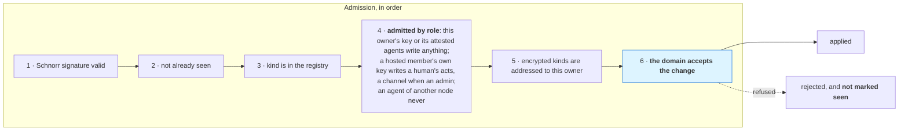

# 09 — GEP, the Goal Engineering Protocol

GEP is how two Bisa nodes agree on what happened. It is a set of Nostr event kinds plus the
rules about which of them may travel, who may write them, and how they are encrypted.

Relays are **dumb transport and never authorities**. A workspace with no relay configured works
completely; sync is optional, and nothing in the domain depends on it.

---

## The one question

Every candidate for a kind is asked:

> **Would a second node be able to act on this?**

If the answer is no, it gets no kind, and it cannot travel.

| Passes | Fails |
|---|---|
| a goal (an outcome, true everywhere) | a **workstream** — it names a path on one machine |
| a workflow with its **start events**, a run, a work item | an **MCP stdio server** — a command line on one disk |
| an agent definition, a team, a skill | a **note** — a scratchpad on one machine |
| a channel, a message | a **pet** — an installed asset |
| a project *record* | a listener's **runtime memory** — the branch heads, file stamps and poll keys it last saw are one machine's |
| a signal that started a run | whether a library workflow **listens** — this machine's switch, with the inputs and the budget it was turned on with |
| a step fact that a boundary event fired | an armed **wait** or **boundary** — the run snapshot carries the fact; what is armed is rebuilt from it |
| a **connector** definition — an API declared, which reads the same everywhere | a connector **account** — one machine's login, its secrets in that machine's keystore |
| an **addon's record** — what is installed, where from, whether it runs, what it was granted | an addon's **bundle and window** — one machine's files and screen |
| a decision, a step fact | the **index** — it is a cache |
| a **judgement** on a goal or a run — a fact of the run, not a new kind of authority | the Decision-Making Agent's own **configuration and key** — who answers is this node's settings, its remote key this machine's keystore |

The test is not about privacy; it is about *actionability*. A workstream is not secret, it is
**meaningless elsewhere**. What is globally true about it — the branch was pushed, pull request #12
was opened — rides an existing progress fact instead.

---

## The kind registry

Numbers are permanent. Names change; numbers never do. Retired numbers stay holes — and from 0.1.0, the first public release, a number is never reissued ([Compatibility](../reference/compatibility.md#the-collaboration-wire)). Two were reissued before it, each when no workspace that version opened could hold an event of the old kind: `33407`, a goal's living document once, is the addon record's; `33401`, a plan's once, is the drawing's ([19](19-drawings.md)). The holes are `3405`, `3409`, `33406` and `33410`: the last numbered a standalone object that named the workflow an event starts, and a workflow's own `start` steps say that now ([03 — Workflows](03-workflows.md#events)).

### Addressable — `33xxx`, latest revision wins

| Kind | Name | `d` tag | Notes |
|---|---|---|---|
| 33400 | `GOAL` | `GoalId` | the goal snapshot; `revision` is the authority |
| 33401 | `DRAWING` | `DrawingId` | a drawing's **record** — its title, what it is attached to, its scene (Excalidraw's elements, vector only, under 768 KiB) — in `drawings/`; its `.excalidraw` file is this machine's export ([19](19-drawings.md)). Reissued after a retirement, like 33407 |
| 33402 | `WORK_ITEM` | `WorkItemId` | bound to its run and step, filed in the run's home |
| 33403 | `AGENT_PROFILE` | `AgentId` | carries `enabled`, from which channel membership is derived |
| 33404 | `ENGRAM` | blinded slug | agent memory, encrypted to the owner. **Does not sync in v1** |
| 33405 | `CHANNEL` | `ChannelId` | `{name, topic, kind, audience, roster_policy}` |
| 33407 | `ADDON` | `AddonId` | an addon's **record** — manifest, origin, enabled, grants — in `addons/`; its bundle never travels ([18](18-addons.md)). Reissued after a retirement, like 33401 |
| 33408 | `TEAM` | `TeamId` | carries `enabled` |
| 33409 | `PROJECT` | `ProjectId` | the record; **never a path a peer could use** |
| 33411 | `SKILL` | `SkillId` | a markdown procedure reads the same everywhere |
| 33412 | `WORKFLOW` | `WorkflowId` | a definition, in the `workflows/` namespace — its start events, boundaries and gateways are steps of it; whether it listens is not in it |
| 33413 | `WORKFLOW_RUN` | `RunId` | one run, under its home's `state/` — its goal's, or its own folder `workflows/runs/<RunId>/` for a run of the workspace; admitted only with its decisions and never with another scope. A run of the workspace's journal hangs off it (below) |
| 33414 | `CONNECTOR` | `ConnectorId` | a connector definition — its base URL, the hosts it may reach, its auth scheme, its operations; never an account |
| 33415 | `CONVERSATION` | `ConversationId` | a conversation's record — its origin, its title, whether it is archived — under `conversations/state/`; its messages are 3407 events on its own scope ([13 — Conversations](13-conversations.md)) |

### Regular — `3xxx`, append-only facts

| Kind | Name | Meaning |
|---|---|---|
| 3400 | `GOAL_NOTE` | a note appended to a journal — a goal's, or a run of the workspace's (where a `document`, an `attachment` and `guidance` never land: those are a goal's) — a person's or an agent's `note`, an `attachment`, a `document` (a file given as the goal's context, by its `AttachmentRef`), the Workflow Agent's `guidance` standing, a `guard` decision on a tool call (the redacted subject, the verdict, who decided — [11 — Security](11-security.md)), a `judgement` — the Decision-Making Agent's answer for this goal or run: which point asked, who answered, the questions and answers, what became of it ([15 — The Decision-Making Agent](15-decision-making-agent.md)) — or a `withdrawn` question (`subject`, `reason`) — what a restart writes for a gate nobody can answer any more |
| 3401 | `DECISION` | a signed approval — the thing a gate requires |
| 3402 | `CLAIM` | a principal took a work item |
| 3403 | `PROGRESS` | advisory; never mutates state |
| 3404 | `RESULT` | a structured, schema-validated result |
| 3406 | `TURN_METRICS` | tokens, cost, wall clock |
| 3407 | `MESSAGE` | one kind for every message stream — channel, direct, goal thread, conversation |
| 3408 | `RETRACTION` | targets a message or a reaction |
| 3410 | `SIGNAL` | the durable fact of the occurrence that started a run — the signal's id, the listener it was raised for, what kind of event it was, its name when it had one, what it carried — journaled on the home of the run it started |
| 3411 | `STEP` | a run's history: a step started, waited, finished, failed, was diverted by a boundary event, had a boundary event act beside it, was answered, decided, skipped or cancelled; a run was queued, started, amended, finished or cancelled — with its cause: stopped, restarted, withdrawn, closed, or retired (a run of the workspace whose workflow was archived or deleted while it went) |
| 7 | `REACTION` | NIP-25 |

`GEP_KINDS` is twenty-six kinds; `ADDRESSABLE_KINDS` fourteen.

**A journal hangs off a snapshot.** Every regular fact on a journal carries, in its `a` tag, the
coordinate of the addressable event it belongs to: a goal's journal `33400:<pk>:<GoalId>`, a **run
of the workspace**'s — a workflow run on its own, with no goal — `33413:<pk>:<RunId>`
(`JournalAddr { author_pubkey_hex, home }` in `store/journal.rs`). A run of the workspace needed no
new kind: its journal is the run's own history — its step and run facts, its questions and
decisions, its notes and results — filed in `workflows/runs/<RunId>/journal.jsonl`. A fact whose
`a` tag names neither is refused.

### Ephemeral — `23xxx`

| Kind | Name | Meaning |
|---|---|---|
| 23400 | `OBSERVER_FRAME` | live session output for a watching client. Never stored |

---

## `MESSAGE` carries two bodies

Kind 3407 is one kind for four message surfaces — channel, goal thread, direct message,
conversation — and its content is typed:

```json
{ "body": "post", "text": "…",
  "context": [ { "kind": "selection", "path": "src/main.rs", "range": [40, 52], "text": "…" } ] }
```

`context` is optional and bounded (64 KiB serialised). Its paths are **project-relative** and the
bytes that matter are captured at send, which is what lets it pass the one question: a peer with the
same project attached can act on it.

A post may also carry `artifacts` — at most eight `{sha256, name, mime, size, title, kind,
source?}` descriptors of what its author made to be looked at ([12 — Artifacts](12-artifacts.md)).
The descriptor rides the body, not an `imeta` tag, so a peer knows the title and the kind before it
holds a byte; the bytes are fetched by hash exactly as an attachment's are.

A post signed by an agent may carry `thinking` — the reasoning its harness streamed before the
words, at most 64 KiB, kept beside the reply and shown folded above it
([13 — Conversations](13-conversations.md#the-reply-streams)); a person's post never does. The
second body is a membership event. There is no third.

```json
{ "body": "membership",
  "channel": "general",
  "member": { "agent": "developer" },
  "change": "joined",
  "cause": "enabled",
  "at": 1735689600 }
```

A post is **one of a kind**: it carries a `once` tag — a ULID minted when it is said — so the same
words from the same author are two messages however close together they are said. An event's id is
a hash over its author, its second, its tags and its content; without the tag a reminder that fires
again, a loop that posts for every item and a person who says *yes* twice within one second would
each be read as said once. A membership event carries no such tag, and neither does a reaction or a
retraction: made twice, each is the same event and one row
([05 — Channels](05-channels.md#idempotency)).

**A journal fact is one of a kind too**, by the same tag: a fact is an occurrence, and the same
thing happening twice in one second — a loop's step started again, a note repeated — is two events
with two ids. Alike to the byte they hashed alike, the home's own journal kept both lines, and
whoever keeps facts by their id — another node reading this one, which drops an id it has seen —
kept one (`bisa-store` `journal::build_event`; its test
`the_same_fact_said_twice_in_one_second_is_two_events`).

A membership event is a **record that something changed**, authored only by the node that changed
it. Membership *itself* never travels — it is derived from 33403 and 33405, both of which already
do. Publishing the derivation as a third kind would create a fact and a projection that can
disagree. See [05 — Channels](05-channels.md#membership-events).

---

## Who may write what



**Step 6 is where the run's rules bind a peer as they bind a local write.** A run snapshot (33413)
is admitted only when its revision is higher than the local one **and** every `approval` step it
records as `Done` has an authorising `DECISION` in the local journal — the same check
`store/runs.rs` makes before it applies a `Decided` event locally — the decision looked for in the
run's home, its goal's journal or its own. A run never changes its scope, its workflow, when it was
made or when it started (`run_snapshot_admissible`, `store/ingest.rs`): a peer's snapshot that says
otherwise is final, not retried. A goal snapshot (33400) may not
reopen a closed goal. `AUTHORITY_CHECKED_KINDS` is `[DECISION]`: a decision must come from a
principal the gate's policy names.

**A refusal for a missing prerequisite does not mark the event seen**, so a later catch-up retries it
once the decision that authorises it has arrived — and a goal's run that arrives before its goal is
retried, not dropped; a run of the workspace is its own home and waits for nobody. Ordering heals itself; correctness does not bend.

**Step 4 is where a person on another node is a human only** ([14 — Collaboration](14-collaboration.md)).
A hosted member's key is admitted for `MESSAGE`, `REACTION`, `RETRACTION` and `DECISION` — and
`CHANNEL` when the role holds `ManageChannels` — and refused for every other kind with *a hosted
member writes as a human only*; a conversation fact from one also passes `reaches` and
`PostInChannels`. An attestation is admitted only when the attesting owner is this node's: *an
agent of another node never writes here — its person may*. A message so admitted is said once as
`RemoteMessageArrived`, for the classifier to read before any agent does.

**An agent signs as itself**, with an owner attestation (NIP-OA semantics), so a remote node can
verify which agent produced what. That includes the General Agent and the Workflow Agent: each signs with its
own key, never the owner's. The Decision-Making Agent has no key and signs nothing — a judgement is
recorded by the platform. Nothing the platform writes on a workflow's behalf is owner-signed: a
`notify` step speaks as its author, a step's question and an approval's gate are the Workflow
Agent's fact, and an agent's tool post with no identity is the General Agent's. The owner's key
signs what the person did.

---

## Encryption and audiences

| Audience | Wrapping |
|---|---|
| a standing channel's fact | **pairwise to each person whose role reaches the channel** — every non-guest, and a guest the roster lists |
| `Restricted(principals)` — a direct channel | pairwise to exactly those principals |
| owner-only kinds (`ENGRAM`) | encrypted to the owner; never relayed |

Every event travels gift-wrapped (NIP-59), so a relay sees neither the kind nor the content. There
is no shared workspace key: a person receives what their role reaches and nothing they could open
with a key they already hold, and a removed person receives nothing new from the moment of the
removal. What already reached them cannot be un-sent.

---

## Transport

| | |
|---|---|
| **Relays** | ordinary Nostr relays, the pool in `bisa-collab` — reconnecting on their own, each with a health row; negentropy catch-up (NIP-77) where supported, a since-window `REQ` where not |
| **Direct** | iroh QUIC, relay-less, between nodes that host each other's key — a hosted member's client dialling its host |
| **Neither** | a workspace with no relay and no peer is complete and fully functional |

What travels to a person is their reach: the conversation facts of the channels their role reaches,
and the host's words about the channels and the people (`channels_changed`, `members_changed`).
Goals, runs, journals, agents, workflows, skills and projects stay on the host — a person on
another node is a human in the workspace's channels, not a replica of it.

---

## What is deliberately not on the wire

- **Local state**: workstreams, MCP server configs, notes, pets, an addon's bundle bytes and where its window stands, the diagnostic log (`logs/` — one process's words about itself), whether a library workflow listens (`workflows/listening/`), the event queue and every listener's runtime memory (`events/`), armed
  waits and boundaries, read markers, the index — and the IDE's own: review notes, layout, the graph cache,
  terminal scrollback, machine-scope settings, recovery refs (which live in the repository, not the
  workspace), the bearer token, the engine lock.
- **Anything derived**: channel membership, a goal's status, inbox rows, the activity timeline.
  Publishing a projection alongside its source lets the two disagree.
- **Connector accounts**: a login is one machine's; the definition it belongs to travels, the
  account's record and every secret field of it stay under `identity/` and in the keystore.
- **Credentials**: keys, hook secrets and env values never enter a snapshot. A public hook's secret is
  shown once — when its listener is turned on, its design adopted or the secret rotated — and lives
  only in the keystore.
- **Prose the receiver has to parse.** Every payload is structured. The one place text is
  interpreted is the harness-adapter boundary, and nothing above it ever looks at wording.
