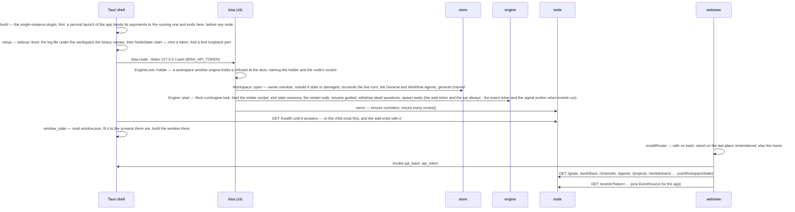
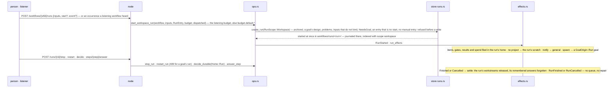
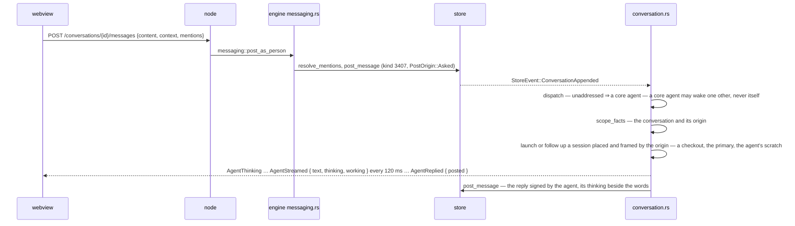
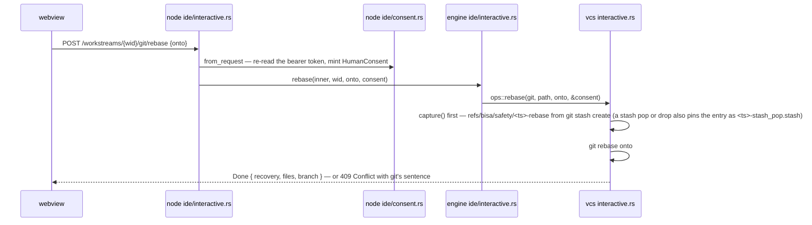
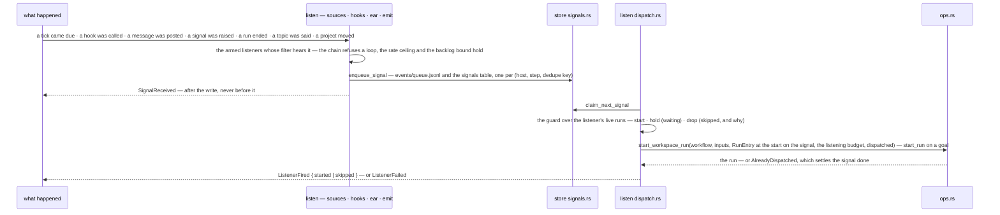

# 10 — Runtime flows

Fourteen paths a request takes through the layers, each with the files on it and the events it emits.
The crate pages ([crates/](crates/README.md)) say what each layer owns; this document says how a
change crosses them, so a bug can be placed and a feature can be routed before a line is written.

---

## App start

Files on the path: `desktop/src-tauri/src/second_launch.rs`, `desktop/src-tauri/src/sidecar.rs`, `crates/bisa-cli/src/main.rs`,
`crates/bisa-store/src/workspace.rs`, `crates/bisa-engine/src/lib.rs`,
`crates/bisa-engine/src/sessions.rs` (`end_stale`: every session row still `live` is a dead
session — its harness child, when the row's `pid` is still the process seen at `pid_seen_at`, is
terminated first, `SIGTERM` then `SIGKILL` — and ended), `crates/bisa-engine/src/recovery.rs`
(`sweep`, the restart walk below), `crates/bisa-engine/src/waits.rs` (`rearm_run` arms a run's
`Waiting` `wait` steps and its live steps' boundary events from its snapshot — a schedule from the
step's `started_at`, a signal wait replayed against the durable signals since then, a boundary
timer from the step's entry and what it already fired; `run_ticker` is the clock a delay, a
schedule or a boundary timer comes due on, spawned whatever `events.enabled` says),
`crates/bisa-engine/src/listen/ear.rs` (`spawn` — the one ear on the bus, spawned always: a run's
waits and boundary events hear through it), `crates/bisa-engine/src/listen/sources.rs` and
`crates/bisa-engine/src/listen/dispatch.rs` (`run_ticker`, `run_worker` — the event ticker and the
signal worker, spawned with `EngineConfig::events_enabled`), `crates/bisa-node/src/lib.rs`,
`crates/bisa-node/src/auth.rs`, `desktop/src/api.ts`, `desktop/src/shell/useWorkspaceData.ts`,
`desktop/src/bus.ts`. A workspace written by another shape of the code stops at `Workspace::open`
with `StoreError::Unreadable`, naming the file and `scripts/reset-dev-workspace`.

**The app opens where it closed.** The shell reads the window's place before the window exists
(`desktop/src-tauri/src/window_state.rs`) and builds it at the size and place it had, on a screen
there is now. The webview resolves its address before its first render (`desktop/src/router.ts`
`installRouter`, over `desktop/src/shell/placeMemoryStore.ts`): a launch has no hash, so it stands
on the last place the memory holds — the screen, its tab, its filters, its pane — and each screen
reads what it kept of itself from `desktop/src/shell/viewMemoryStore.ts`. None of it waits for the
node and none of it is the node's: the memory is the webview's own storage, stamped with the
workspace's owner key once `useWorkspaceData` has it, and another workspace's is forgotten whole. A
place whose thing went while the app was closed is found out by the screen's first read — *not
found* — and left for its section's list (`desktop/src/shell/useGonePlace.ts`). A deep link and the
menu bar's *needs you* navigate after the launch, and win.

### Restart

A node that dies — a crash, a `kill -9`, a power cut — leaves files, not memory, and the next
`Engine::start` reads only the files. The store has already made them agree
([08 — Persistence](08-persistence.md)): every acknowledged line is on the disk, and the index was
rebuilt if damaged and reconciled with every live run's snapshot. The engine then does four things,
in this order, before it serves anyone:

1. **Sessions** (`sessions::end_stale`). Every row still `live` belonged to the dead process. The
   harness child it recorded — every driver records one, a worker's, a design wake's, a chat turn's,
   an ask's; the broadcaster replays a start announced before the driver listened — is terminated
   if — and only if — the pid is still the process that was
   seen (`ps -o etime=` against `pid_seen_at`; a recycled pid is somebody else's), so nothing keeps
   writing into a checkout the engine is about to resume. Then the row is `ended`.
2. **The walk** (`recovery::sweep`). For every unfinished run of every open goal, and every live
   workspace run (`live_workspace_runs`), read from its snapshot: its waits and its live steps' boundary events are re-armed (`waits::rearm_run`, which ends in `waits::sync_boundaries` — a reminder that already fired three times of five has two left); every `Running` step whose kind dies with
   the process gets **`StepInterrupted`** through the run funnel — an `agent` step with a work item
   **resumes on that item**, in the same checkout, with one line in its prompt saying so — the
   step's record counts its `interruptions`, and the fourth fails it, *interrupted too often*
   (`MAX_INTERRUPTIONS`, 3), so a step that kills the node is not resumed on every boot; an `agent`
   step with none, and a `check`, start again; an `emit` runs again, its dedupe key making the repeat the same signal; a `connector`, `judge`, `notify` or `spawn` runs again only
   within its `retries` and otherwise fails once — and no attempt is charged for the interruption —
   except a `connector` **write with no idempotency key**, which is **stopped** (`StepStopped`)
   rather than sent again: the last process may have sent it, and a resend the platform cannot
   tell from the first would do the thing twice; the note says so, and the person looks at the
   platform first;
   a work item the dead process created for this run but no step's record names is cancelled
   *orphaned by a restart*. One note on the run's home — the goal, or the workspace run's own
   journal — says what happened: *a restart interrupted 2 running steps: `build` resumed on its work
   item, `verify` will run again*. Then every open
   goal with nothing live and a queued run has its next run started (`ops::advance_queue`): the
   dead process ended a run and stopped before its queue advanced.
3. **Guided work** (`guided::resume_interrupted`) — a design or a repair the dead process was in the
   middle of is scheduled again.
4. **Questions nobody can answer** (`recovery::withdraw_dead_questions`). A publish gate, a guard
   escalation or a permission escalation is a journaled question whose live gate died with the
   process — on an open goal or a live workspace run; each with neither a decision nor a withdrawal
   after it gets a `withdrawn` fact on that home with the reason and a note — *a decision you were asked for was interrupted by a restart — "Publish:
   push …" — ask again from where it came*. The inbox reads the withdrawal as a decision would be.

Each of the four runs under `contain`: a panic on one persisted row is an error line naming the walk,
and the next walk runs — a node that died on the same row at every launch was a platform nobody could
open. After them, off the boot path, `identity::rearm` reads every live git repository and puts the
ones nobody can commit in back on the committer desk (*unresolved*), so the who-commits dialog asks
again after a relaunch. The intake socket serves after the walk, so no session settles an item the
walk is judging. On the desktop, the sidecar's watchdog restarts the node on the same port and the
page reads every list again when the event stream comes back, with a toast saying so; a node that
cannot start at all still gets a window — the shell says why, and the watchdog keeps trying on the
same curve.

**What listens comes back from the files too.** The listener registry is a projection — built on
first use from `workflows/listening/`, the open goals' `listening` and the definitions
(`listen::registry::build`) — so nothing is armed by hand. Each listener's memory
(`events/listeners/`) says when it next comes due and what it has seen: an occurrence the downtime
covered fires once, a poll does not list again what it already listed. The signal worker begins by
handing back what the dead process had claimed (`requeue_stale_running`), and a signal whose run
was already made is refused by the store as already dispatched and settles done
([An event starting a run](#an-event-starting-a-run)).

---

## A goal, from capture to done

```mermaid
sequenceDiagram
    participant P as person
    participant N as node
    participant O as ops.rs
    participant G as guided.rs
    participant R as core run.rs
    participant F as effects.rs
    P->>N: POST /goals {statement, mode?} — mode absent takes goals.default_mode (auto)
    N->>O: submit — the 33400 snapshot, the journal — a manual goal wakes nobody and stops here
    O->>G: notify_captured — the Workflow Agent wakes in Design (Guidance scheduled → working, and the directive carries AUTO_ADDENDUM or GUIDED_ADDENDUM)
    Note over G: staffed from the STAFF roster · a question is Guidance asking · no proposal is Guidance stalled, and POST /goals/…/design retries
    G-->>O: propose_workflow — a design of the goal's own (WorkflowOrigin::Goal) → set_goal_workflow, then by mode (WorkflowProposed, Guidance proposed)
    Note over O: auto — adopt_alone: inputs bind on their defaults, failed_runs ≤ goals.auto.repair_limit and every event start is one nobody needs to see armed → a note, begin_goal(Auto, defaults), else the Adopt gate opens saying why
    Note over O: guided — the Adopt gate opens · manual — the design is the person's draft, no gate
    P->>N: POST /goals/{id}/decide {approve, inputs} (guided, or an auto goal that had to ask)
    N->>O: decide — subject adopt: → begin_goal(goal, inputs, Auto)
    Note over O: begin_goal — the workflow has event starts → the goal listens (turn_on, ListeningChanged) and each occurrence starts a run · none → start_run at the manual entry
    O->>R: create_run(RunEntry) → apply(Start) — the entry start Done, the other starts Skipped — or, while a run is live on the goal, the run is written queued and RunQueued is announced, and it starts from the queue when the live run ends
    R-->>O: effects
    O->>F: run_effects — StartAgent · Ask · OpenGate · RunCheck · CallConnector · Judge · Arm · Post · Emit · SpawnGoal · BoundaryAct · CancelWork
    Note over F: an item settles → item_settled → record_run_event(StepDone) → the next effects
    Note over F: a step fails with on_fail fail on an auto or guided goal → notify_run_failed → Repair → the corrected proposal, adopted alone (auto, within the budget) or gated (guided)
    Note over R: nothing live and a step still pending → stalled: … → Finished Failed (never Done)
    Note over F: Finished or Cancelled → settle: release workstreams · RunFinished or RunCancelled · advance_queue — close → Cancel (closed) on the queue and the live run · GoalClosed
```

**A stop, a restart.** `POST /goals/{id}/stop` (`ops::stop_goal`) stops the goal listening
(`listen::turn::turn_off`), withdraws every queued run, cancels the live one (`Cancel { stopped }`)
and ends the goal's sessions (`sessions::stop_for`), in that order — so nothing its events start
slips in and the last settle finds nothing to advance — then waits a bounded time for the
sessions to be gone; the goal reads `draft`. Every stop goes through `sessions::stop_row`: the
registry's abort, the driver's own stop, then **every question the session was waiting on is
withdrawn** (`sessions::withdraw_questions_of` — a `withdrawn` fact on the home, the harness
answered a refusal the guard never records as the person's), so a worker blocked at a permission
is released and aborted, never left at work behind a row that reads *aborted*. A close
(`ops::close_goal`) stops the goal's sessions the same way — the design wake's and the thread's
turns' — before it forgets the goal. `POST /goals/{id}/restart` (`ops::restart_goal`)
reads where the last run began before it cancels anything (`restart_entry`: the start it entered
and the event that began it — refused, the run left as it is, when that start is gone from the
workflow as it stands), cancels the live run with `restarted` — a settle that advances nothing —
and calls `start_run` with the last run's inputs at that entry: the store starts it at once
because nothing is live, and the queue keeps its place behind it. The signal the run was made from
is never copied: it made that run alone. A workflow's own `stop` and `restart` act on its workspace runs alone
([A workflow run in the workspace](#a-workflow-run-in-the-workspace)); a goal's run of it is the
goal's.

A goal captured **with** a workflow skips the wake: `POST /goals {workflow, inputs}` begins its
work at once — listening when the workflow has event starts, a run otherwise — or waits for
`POST /goals/{id}/run` when `start` is off. **One door begins a goal's work**, `ops::begin_goal`:
`Begin::Auto` (a person's start, an adoption, a capture) arms the event starts when there are any —
with the inputs given, or, given none, with what the goal listened with before — and runs at the
manual entry otherwise; `Begin::RunNow` (a `spawn`, *Run now*) always runs at the
manual entry. Files:
`crates/bisa-node/src/goals.rs`, `crates/bisa-engine/src/ops.rs` (`submit`, `begin_goal`, `start_run`,
`record_run_event` — **the one funnel** every run event passes through, `decide`, `close_goal`),
`crates/bisa-engine/src/guided.rs`, `crates/bisa-store/src/runs.rs` (the one writer of a
run: verify, apply, snapshot, journal, index), `crates/bisa-core/src/run.rs` (the one function
that changes a run), `crates/bisa-engine/src/effects.rs` (the one interpreter),
`crates/bisa-engine/src/gates.rs`. Every step change emits `StepChanged { run, workflow, step,
state, kind }` on the bus and a `Step` fact in the run's home's journal; a gate emits `GateOpened`
and `GateDecided`.

---

## A workflow run in the workspace

No goal is captured and nothing queues: two runs of one workflow go side by side, each in its own
folder. A stop (`ops::stop_run`, through `end_workspace_run`) cancels the run first — an aborted
session settles its item at once, and a settle meeting a live run would fail it — aborts its
connector calls in flight, then ends its sessions (`sessions::Scope::Run`) and waits for them within
the bound; a restart (`ops::restart_run`) does the same with `restarted` and starts a new run of the
workflow's current revision with the same inputs, at the same start, on the same event and under
the same ceiling — refused when that start is gone from the current revision. A run by hand begins
at the workflow's manual entry (`RunEntry::by_hand`); a **test run** names an event start and a
sample payload (`ops::test_entry`: the event marked `test`, the inputs its mapping reads laid over
the ones given); an occurrence begins at the start that heard it
([An event starting a run](#an-event-starting-a-run)). The workflow's
`POST /workflows/{wfid}/stop|restart` walk its live workspace runs (`live_workspace_runs(Some(wf))`)
and answer the runs they touched; retiring the workflow ends each with `retired` before it is
archived or deleted (`retire::retire_workflow`). Every emit goes through `EngineEvent::of_run`, so
the envelope names the workflow and the Inbox and the feed file the run's facts under it. Files:
`crates/bisa-node/src/workflows.rs`, `crates/bisa-node/src/runs.rs`,
`crates/bisa-engine/src/ops.rs` (`start_workspace_run`, `test_entry`, `stop_run`, `restart_run`,
`stop_workflow`, `restart_workflow`), `crates/bisa-store/src/runs.rs` (`create_run`,
`live_workspace_runs`, `list_workflow_runs`), `crates/bisa-engine/src/retire.rs`,
`crates/bisa-cli/src/workflow.rs` (`bisa workflow run|runs|stop|restart`).

---

## An agent step

1. `effects::run_effects` receives `StartAgent { step }`: it renders the instructions
   (`core/template.rs`), resolves the step's `assignee` and `project` references from the run's
   inputs, checks the assignees exist, and resolves the project by the placement rule
   (`core/placement.rs`): on a goal, the one named (checked attached), the goal's only one, or
   `Scratch` — the goal's scratch folder; in a workspace run, the one named, with nothing to attach,
   else the run's own scratch. Several projects and none named was refused at run start
   (`EngineError::ProjectAmbiguous`). It writes a `WorkItemSpec` bound to `(run, step)` and filed in
   the run's home (`WorkItemSpec.home`).
2. `executor::launch_step_item` → `scheduler::preflight` — the home is open (the goal not closed,
   the workspace run unfinished), the step is `Running`, the budget allows, no harness is disabled; every rejection is a typed
   `ScheduleRejection`, and a rejection becomes `StepFailed` on the run.
3. The item is reserved in `Inner::inflight` — an `executor::InFlight` guard the executor's task
   holds and releases when it ends, however it ends; a panic in the task is caught there and
   settles the step as a failure with the panic's sentence (`retries` and `on_fail` then decide) —
   then `assign::workers` + `assign::pick` choose the agent, written on the spec and journaled.
4. **Placement** (`executor::place`: `projects::project_for_step`, then `open_workstream`): with a
   project, a project with commits gets a worktree on its own branch; an unborn HEAD runs in the
   **primary** — the root itself, attributed like any other run and never auto-committed; a non-git
   project gets a copy through `bisa-iso`. With none, the session runs in its home's scratch —
   `goals/<id>/scratch/`, or a workspace run's `workflows/runs/<id>/scratch/` — with no workstream,
   told so by its placement note, and its result is its deliverable. Nothing is created. `TMPDIR` is
   the home's `scratch/.tmp`. A goal's run tells the session its goal in the first prompt
   (`framing::goal_note`); a workspace run's names none.
5. `caps::acquire` takes the concurrency permits.
6. The launch walk: `harness_candidates × ModelPlan::order(health, rotation)`, bounded by
   `max_model_attempts`; each `ModelWall` is recorded in the `ModelLedger` and emits
   `ModelSwitched`; the relaunch registers its session on the next model, and a harness that
   switches on its own says so (`ProgressEvent::ModelChanged`), which the roster row follows.
   Before the walk, `decider::walk` asks the Decision-Making Agent what the walk needs of it — the
   model that leads a routed plan and, when an attempt may come to an effort of `auto`, the level —
   together, once, under one deadline; the effort is asked about the model the plan leads with
   before anybody routed it. Each attempt then sets its model and its **effort**: resolved for that
   model (the step's pin, the model's own, the plan's, `agents.effort` for the item's project) and
   fitted to what the harness takes for it (`effort::fitted`); an empty list sends nothing
   ([06 § Effort](06-agents-and-teams.md#effort)).
7. `build_session_spec` injects the MCP server (`bisa mcp --socket … --work-item <id>`) and
   materialises skills (`crates/bisa-harness/src/skills.rs`); `record_run_event(StepStarted {
   step, work_item })`.
8. `drive_session` consumes `SessionEvent`s, re-broadcast as `EnginePayload::Session`; every
   prompt went out through `security::RedactedSession`, so a secret the rules recognise reached the
   harness as a placeholder. A permission request goes to `inputs::decide`: the Tool & Commands
   Guard first (`security::decide_tool` — placeholders restored into the input that will run, the
   rules in order, the classifier where a rule asks for it), then the step's `tier_ceiling` for a
   call no rule had an opinion on ([11 — Security](11-security.md)).
9. The agent calls `yield_result` → `intake::result_submit` validates against `output_schema` (up
   to `max_result_attempts`) and appends a `Result` journal event.
10. `settle_workstream`: a worktree is committed (`projects::settlement_message`) and moves to
    `Committed`, or — clean, nothing to keep — is closed and its branch deleted
    (`projects::close_clean_worktree`); a copy has its `.patch` captured and stays, tree and record,
    until the run ends (a `check` that follows reads where the work landed); the primary and
    a scratch placement are left alone. Then
    `WorkItemState::apply(Submit)`, `Accept`, and `effects::item_settled` → `StepDone { output }` —
    or `StepFailed { error }` when the session failed, the budget ran out, or the result never
    validated.

An agent that calls `create_project` — the one way a project is ever made from a session — goes
through `intake::create_project` → `projects::create_for_agent`, which makes the repository with a
root commit, loads the work item and derives the project's origin from it — `ProjectOrigin::Step { goal?, run, step,
workflow }`, no goal for a workspace run's step (`project_origin_for`; a goal-scoped session gives `Goal`, a channel or DM `Workspace`) —
attaches the project to the goal when there is one, journals a note naming the step, and emits `ProjectCreated { project,
slug, origin }`. No request carries the origin (I28a).

Files: `crates/bisa-engine/src/{effects,executor,scheduler,assign,projects,registry,models,intake}.rs`.

---

## A step that waits

A `human` step opens an `Escalation` gate with the question (`gates::open_for_step`), homed on the
run's home; the inbox shows it — on the goal's row, or on a workspace run's workflow's —
`POST /runs/{rid}/steps/{step}/answer` (any run, a goal's or the workspace's) or `bisa step answer
<goal-or-run>` resolves it through the gate (`Engine::answer_step`), and `ops::decide` turns the
answer into `Answered { step, answer }` — an *unsure* answer re-opens the question. An `approval` step opens an `Approval` gate; a person's decision becomes `Decided`,
approve and decline both signed, a decline failing the step. A `wait` step is **armed**
(`waits::arm`) with what it holds for, its filter rendered against the run: a `delay`, a `time` or
a `schedule` comes due on `waits::tick` — the wait ticker's own clock (`waits::run_ticker`, every
`wait_tick_secs`, whatever `events.enabled` says; `Engine::tick_waits_at` in a test) — a `signal`,
a `message`, a `project` change, a `run`'s end or a `platform` topic is heard through the one ear
(`waits::on_heard`, offered before any listener is), which records `Heard { step, payload, chain }`
— the payload is the step's output, and the chain widens the run's — and a `release` moves only
when a person calls `POST /runs/{rid}/steps/{step}/release`, with a payload or none. A wait hears
what belongs to no goal in particular and its own goal's, so a workspace run, which has no goal,
never hears a goal's. A restart re-arms every `Waiting` `wait` step from
its run's snapshot (`rearm_run` — a schedule from the step's `started_at`, so an occurrence the
downtime covered fires once; a signal wait against the signals the queue kept while the node was
down) and sends `StepInterrupted` to every `Running` step it interrupted (`recovery`, §Restart
above). A step that may be stopped can carry boundary events — a timeout, a reminder, a message or
a signal that diverts it or acts beside it ([A boundary event](#a-boundary-event)). A `spawn` step with `wait` holds until the child's run finishes (`waits::child_finished`) —
a goal's child through its `refines` edge, a workspace run's through the child's `GoalOrigin::Run`.

Files: `crates/bisa-engine/src/{gates,waits,ops}.rs`, `crates/bisa-engine/src/listen/ear.rs`,
`crates/bisa-node/src/runs.rs`, `crates/bisa-cli/src/step.rs`.

---

## A judgement

1. A decision point (`assign::choose`, `decider::route`, `classifier::classify`, a `judge` step, the
   `decide` MCP tool, …) builds a `DecisionRequest` and calls `decider::judge(inner, point, &standing,
   request)`.
2. **Is the point on?** [15 — The Decision-Making Agent](15-decision-making-agent.md#where-it-is-on). Off returns
   `Judged::Off` at once; nobody is asked.
3. The state and every question pass the redactor before they leave the process.
4. `decider::ask` builds the provider `decisions.provider` names (`bisa_decision::build`, already
   wrapped in the contract check, the retry budget and the deadline) and calls it.
5. The certainty of a contract-holding answer is checked against the threshold
   (`decisions.confidence.act`, or `.security` at a security point); below it, or on any error, the
   caller's own rule runs instead — the fallback is always the caller's own logic.
6. `record` puts a `Judged` event on the bus (kept in the activity log whether or not there is a
   home) and, when the judgement was asked for a goal or a workspace run, a `judgement` fact in
   that home's journal.

Files: `crates/bisa-engine/src/decider.rs`, `crates/bisa-decision/src/{factory,system_one,prompted,resilient}.rs`,
`crates/bisa-core/src/decision.rs`.

---

## A turn in a conversation

Files: `crates/bisa-node/src/conversations.rs`, `crates/bisa-engine/src/messaging.rs`,
`crates/bisa-store/src/conversation.rs` (`resolve_scope`: a conversation's scope is its own id;
`transcript_tail`), `crates/bisa-store/src/conversations.rs` (the record),
`crates/bisa-engine/src/conversation.rs` (`scope_facts`, `wake_attempt`, `spawn_reply_pump`,
`live_turns`),
`crates/bisa-engine/src/framing.rs` (`project_frame`, `origin_frame`). Where a turn runs and what it
is told follow the origin: [13 — Conversations](13-conversations.md#origins--placement-frame-reach).

---

## A terminal open

`TerminalLauncher` → `useTerminals.openTerminalIn` → `terminal/session.ts` invokes
`terminal_open { scope, id, harness?, resume, rows, cols, on_output }` → `src-tauri/src/terminal.rs`
resolves the directory with `GET /placement/{scope}/{id}` (bearer token, five-second timeout) and
the program with `GET /harnesses`, opens a `portable-pty` PTY there, and streams bytes back over an
ordered `tauri::ipc::Channel` to `terminal/Terminal.tsx` (xterm with fit, search, serialize and
WebGL). Scrollback checkpoints go to `run/terminals/` through `terminal_scrollback_{read,write,forget}`.
The webview never names a path or a program; the node never holds a PTY.

---

## A file save

`EditorDoc` and `editorModel.mjs` decide when to save (`editor.autosave.mode`,
`editor.autosave.delay_ms`) → `api.ideSaveFile` → `PUT /ide/file/{scope}/{id}?path=` with
`{ text, base_hash }` → `crates/bisa-node/src/ide.rs` parses and delegates →
`crates/bisa-engine/src/ide/files.rs` resolves the **writable root** (a project tree, a
workstream checkout, a goal's `scratch/`, a workspace run's `scratch/`, a work item's root — never
a truth file), checks
containment, and compares-and-swaps. A lost race is `EngineError::FileConflict` → **409** with
`current_hash` and `current_text`, so the client merges without a second round trip. The write emits
`FileChanged { ignored: false }`; everything else the watcher (`ide/watch.rs`) reports.

---

## A consented git operation

Three build-failing assertions hold this path: `HumanConsent::mint(` appears only in
`crates/bisa-node/src/ide/consent.rs`; `bisa_vcs::interactive` is named only by
`crates/bisa-engine/src/ide/interactive.rs` and `crates/bisa-engine/src/folder_git.rs`; `bisa-mcp`, `bisa-harness` and
`bisa-adapters` may not name either. Recovery refs are pruned only by a person
(`just prune-recovery-refs`).

---

## A pull request through the Publish gate

`POST /workstreams/{wid}/pr` → `crates/bisa-node/src/codehost.rs` →
`crates/bisa-engine/src/codehost.rs::open_pr`: the workstream must be a worktree
(`require_worktree`); its record is reconciled with the checkout (`reconcile_before_publish`: a
terminal's commit makes it `committed`, a hand-run push `pushed`); then by state — `pushed` needs
nothing, `committed` will be pushed first under the same gate, `open`/`dirty` is `NothingToPublish`
(409, code `nothing_to_publish`), a terminal state is the table's own refusal (`workstream_state`) —
all asked before the code host is touched; `pass_publish_gate` then decides by `PublishPolicy`: `Manual`
is `PublishManual` (409, `publish_manual`); `Auto` goes straight through; `Gated` asks in the
workstream's home — its goal, else the home of the work item it was made for, so a workspace run's
workstream is gated on its run — and a gated workstream with neither is `PublishNoGoal`
(`publish_no_goal`); the gate is one `Gate::Publish` gate whose
question names both acts ("push X and open a pull request for it") and the route answers **202**
with the gate id. On approval the push runs first when it was needed (`push_branch`, journaled
"pushed"). Only the owner may sign it — a pull request spends the
owner's credentials — so `Gate::Publish.defers_to_assignment()` is false. On approval
`codehost::code_host_for_path` parses `origin` as a `RemoteUrl` (an SSH alias resolved to its host
through `ssh -G` first), `CodeHostRegistry::detect` picks the code host by its public host — or
by the checkout's `codehost.kind` for a self-hosted instance — and the host is **bound to the
account** the checkout's git config names — `codehost.account` from a profile or a local pin, else
the kind's `codehost.<kind>.account` default, read through the engine's `git` handle — with
`CodeHost::for_account`; `CodeHost::create_pr` then runs **through the kind's CLI** when the
machine's `gh` or `glab` is signed in as that account (or as anyone, when none is named), and
through the API otherwise, with that login's token from the kind's `TokenStore` chain (the
environment, the store, the CLI's own token, git's helper — never logged, never returned; two
stored and none named is a refusal by name), and `WorkstreamTransition::PrOpened { number, url }`
is recorded, emitting `WorkstreamChanged`. `POST …/pr/merge` takes the same path and is the
first writer of `Merged`. A push (`POST /workstreams/{wid}/push`) is gated the same way.

---

## A person on another node, from an invitation to a first message

The owner makes an invitation (`engine/collab.rs::create_invite` → `store/invites.rs` keeps the
record and the secret's hash; the code — link and text — is answered once). The person pastes it:
`POST /hosts/join` → the CLI's `Pump` merges the code's relays into `sync.relays`, and
`bisa_guest::Guests::join` records the membership as `requested` and sends `join` wrapped to the
host over the pool. The host's pump (`net/host.rs::on_control`) claims it —
`store/invites.rs::claim_invite`, constant time, single use — and admits (`admit_claimed`: a
member at the invitation's role, rostered on its channels) or records a request for the Inbox
under `collab.join = ask`. The store says `PeopleChanged { Joined }`; the pump welcomes the person
with the card, the role, the directory and the channels they reach, then their backlog, each fact
wrapped to them alone; the guest session applies the welcome (`guest/session.rs::on_control`) and
the *Hosted by …* section appears.

The person posts: `GuestSession::post` redacts, signs a `3407` in the host's coordinate, keeps it,
and wraps it to the host. The host's pump hands it to `store/ingest.rs`, which admits it by role
and reach and says `RemoteMessageArrived`; the pump relays it to the others who reach the channel;
`engine/collab.rs::on_remote_message` holds it, asks the classifier with the message brief, and on
*safe* releases it into `conversation::dispatch` — every session it wakes working *for* that person,
`Judge.on_behalf_of` putting every tool beyond reading to the owner. *Harmful* keeps it held with
the reason; the owner releases it from the Inbox. A relay change is a `sync.*` setting: the
engine says `settings_changed`, the pump re-reads and `Relays::set_relays` follows without a
restart.

---

## An event starting a run

**An event never acts.** Whatever observed it, it becomes one shape — a `Heard { source, name?,
scope, payload, chain }` — and is offered (`listen::ear::offer`) first to the waits and boundary
events of the runs holding for it (`waits::on_heard`), then, while `events.enabled` is on, to every
armed listener whose filter hears it. Five doors observe:

| Door | What it observes |
|---|---|
| the ticker (`listen::sources::tick`, every `events.tick_secs`) | a **schedule** came due; a **connector** start's read operation listed an item no earlier poll did (the first poll learns); a **check**'s command, judged by the guard like a `check` step, moved the way its `fire_on` says; a **project**'s branch heads, remote-tracking branches, files or — every `events.pr_poll_secs`, sooner when a workstream moved — pull requests moved |
| a hook call (`listen::hooks::call`) | the node verified the caller — the control-plane token on `POST /workflows/{wfid}/hooks/{step}` and `POST /goals/{id}/hooks/{step}`, the start's secret on `POST /hooks/{host}/{step}` — and bounded the body; a public body is redacted before it is stored and, with the content screen on, **held** until the classifier is sure it is safe |
| the bus (`listen::ear::spawn`) | a run's end is a `run` event, and every payload a `platform` event of its topic; the listening runtime's own four topics are never heard back |
| a message (`listen::ear::on_message`) | heard where `conversation::dispatch` hears it — after the hold a message from another node waits in — and never an announcement |
| a named signal (`listen::emit::emit`) | an `emit` step, an `emit` boundary act, a session's `emit_signal`, `POST /signals`, `bisa signal emit`: recorded once with no listener, so a re-armed `wait` can replay it, then offered like anything else. One raised from outside — an A2A task — comes through `emit_from_outside`: redacted, and read by the content screen before anything hears it |

For each listener that hears it, `enqueue_for` writes a `Signal` of its own — its `chain` extended
by the listener, its `dedupe_key` the source's (`schedule:<due>`, `poll:<key>`,
`commit:<branch>@<sha>`, `hook:<delivery>`, `emit:<run>:<step>:<entered>`, `run:<run>` …) — to
`events/queue.jsonl` and the `signals` table **before** `SignalReceived` is emitted; a second
occurrence with the same key for the same listener is the first one, found. The loop guard is on
the signal: a listener already in the chain refuses it, a chain is capped at `events.chain_depth`,
every start but a schedule's, a hook's and a person's hears at most `events.fires_per_minute` occurrences a minute
— a `signal` start's overflow waits in the backlog for the window — and a listener holds at most
`events.backlog_per_listener` occurrences; a refusal is said once (`ListenerFailed`) until the
listener is healthy again.

The worker (`listen::dispatch::run_worker`; `Engine::drain_signals` in a test) claims one signal at
a time and meets the start's guard over the listener's **live runs**, never over dispatches
(`Guard::admit`): `queue` starts a run when none of the listener's runs is unfinished, `parallel`
while fewer than its `max` are, `skip` drops the occurrence while one is; a goal runs one of a
listener's runs at a time whatever its guard says; the debounce is met once, when the occurrence is
first claimed. A held occurrence settles `waiting` and goes again when a run of its listener ends
(`release_ready`). The run's inputs are what the host listens with beneath what the start's mapping
reads off the event (`map_event`, `{event.payload.<path>}`), and it starts **at that start**
(`RunEntry::at`) with the signal's id as `dispatched` — a workspace run for a library workflow that
is On (`ops::start_workspace_run`, under `Listening.budget`, else `budget.default.*`), a run on the
goal for a goal that listens (`ops::start_run`, queued behind a live one) — under the same gates,
budgets, pause switch and concurrency cap as a person's. The store holds `dispatched` unique, so a
dispatch replayed after a crash is refused as already dispatched and settles done: one signal makes
one run. The result is `ListenerFired { listener, signal, outcome }` — `started { run, goal? }` or
`skipped { reason }` — or `ListenerFailed { listener, signal?, error }`, which the Inbox files on
the workflow's row or the goal's and the listener's memory keeps until it works again. The worker
rests between two passes until a signal becomes claimable, so a run begins when its occurrence is
written, not at the next poll. A goal's run that failed **pauses** its goal's listening
(`dispatch::pause_goal`) and withdraws its queued event runs; a spent goal budget pauses it too.

`events.enabled` off stops the ticker, the queue's claims and the hooks — the queue waits as it is,
a schedule keeps its `next_due` — and never a run's waits or boundary events: the ear and the wait
ticker run whatever it says.

Files: `crates/bisa-engine/src/listen/{mod,registry,ear,emit,hooks,dispatch,sources,schedule,turn}.rs`,
`crates/bisa-store/src/{signals,listening}.rs`, `crates/bisa-core/src/{listen,start,signal}.rs`,
`crates/bisa-node/src/{listening,hooks}.rs`, `crates/bisa-cli/src/signals.rs`.

---

## A boundary event

A boundary event stands on a live step — an `agent`, `human`, `approval`, `wait` or `spawn` that
waits. Nothing arms it by hand: after every write of a run and at boot, `waits::sync_boundaries`
makes what is armed equal to the snapshot — every `Running` or `Waiting` step's boundaries armed
for its current visit (`StepRecord.entered`), a timer due from the visit's entry and what it has
already `fired`, a reminder never past its `max`, and nothing for a step that is no longer live.

1. **It occurs.** A timer (`after`, `every`) comes due on the wait ticker (`waits::tick`); a
   `message` or a `signal` is heard through the ear (`waits::on_heard`). What is due in one pass is
   taken in order: the step's own catch or completion first, then the boundaries that divert, then
   the ones that act, each group in the order the step declares them.
2. **The run decides.** `RunEvent::BoundaryFired { step, boundary, entered, payload, chain }` goes
   through the one funnel. A visit that is over is `RunError::StaleBoundary`, a name the step does
   not carry `RunError::UnknownBoundary` — refusals, logged at debug, which is what makes a missed
   disarm harmless.
3. **A divert stops the step.** It becomes `Diverted { by }` — terminal — and only the flows
   labelled with the boundary's name are taken. `CancelWork` ends what the step held
   (`effects::cancel_work`): the work item is cancelled and its session ended — with every
   permission or question that session was waiting on withdrawn (`executor::cancel_item`), so a
   worker mid-ask is released — the gate withdrawn,
   the wait disarmed; a `spawn` stops waiting and the child goes on.
4. **An act happens beside the step.** `RunEffect::BoundaryAct` posts the message a `notify` step
   would (`post_as`) or raises a named signal through the emit door, its dedupe key
   `boundary:<run>:<step>:<entered>:<name>:<count>`; the step goes on whatever came of it, and
   `fired` counts it. A post that could not be made is a note on the run's home, never a failure
   of the step.
5. **It is said.** `BoundaryFired { run, workflow, step, boundary, diverts }` on the bus, and a
   `diverted` or `boundary` step fact in the run's home's journal.

A **race** is a `wait` with boundaries that divert: whichever is heard first wins, and the visit
being over refuses the rest.

Files: `crates/bisa-engine/src/waits.rs` (`sync_boundaries`, `tick`, `on_heard`),
`crates/bisa-engine/src/effects.rs` (`boundary_act`, `cancel_work`),
`crates/bisa-core/src/boundary.rs`, `crates/bisa-core/src/run.rs`.

---

## Where a flow may be changed

| Flow | The file that owns each step |
|---|---|
| App start | `sidecar.rs` (how the node is found), `auth.rs` (the token), `useWorkspaceData.ts` (what is loaded first), `window_state.rs` and `placeMemoryStore.ts` (where the app opens) |
| A goal | `workflow.rs` in the core (a step kind, a condition, validation), `run.rs` in the core (what an event does to a run), `effects.rs` (what an effect does to the world), `runs.rs` in the store (how a run is written), `ops.rs` (how a person or an agent causes an event), `guided.rs` (the Workflow Agent's wakes) |
| A workspace run | `run.rs` in the core (`RunScope`), `home.rs` in the core (where its truth is filed), `runs.rs` and `paths.rs` in the store (its folder, its start's refusals), `ops.rs` (start, stop, restart), `retire.rs` (retired with its workflow), `runs.rs` in the node (the run's routes) |
| An agent step | `scheduler.rs` (a refusal), `projects.rs` (placement), `executor.rs` (the launch walk and settlement), `intake.rs` (what an agent may do) |
| A waiting step | `gates.rs` (questions and approvals), `waits.rs` (what a wait holds for, clocks, releases, children), `listen.rs` in the core (the filters' `hears`) |
| A judgement | `decider.rs` (on? → redactor → provider → threshold → record), `bisa-decision`'s `factory.rs` (which provider), `decision.rs` in the core (the contract) |
| A conversation turn | `conversation.rs` (the wake rules, placement by origin, the streamed reply and its thinking), `conversations.rs` (the record's door, the turns in flight), `framing.rs` (what the agent is told), `messaging.rs` in the engine (what a person may post) |
| A terminal | `terminal.rs` in the shell, `useTerminals.ts`, `TerminalPanel.tsx`, `layerSlots.ts` |
| A save | `ide/files.rs` (roots and the swap), `editorModel.mjs` (when to save), `EditorDoc.tsx` (the conflict banner) |
| A consented op | `interactive.rs` in the vcs crate (the op and its recovery), `ide/interactive.rs` in the engine (the wrapper), `ide/interactive.rs` in the node (the route) |
| A pull request | `codehost.rs` in the engine (the gate, the account binding and the transition), `github.rs` (the code host), `creds.rs` (the credential chain by login), `gitprofiles.rs` and `ide/connection.rs` (which profile and account a checkout resolves, and its cautions) |
| A person on another node | `host.rs` (what each person receives, and a person's claim), `truth.rs` (the reach rule over a fact), `wrap.rs` and `relays.rs` in the collab crate (the envelope and the pool), `ingest.rs` (what is admitted, by role), `collab.rs` in the engine (the classifier's hold and release, invitations, people), `session.rs` in the guest crate (what a guest applies and sends) |
| An event starting a run | `start.rs` in the core (the start events, the guard's verdict), `listen.rs` in the core (the filters, the chain), in the engine's `listen/`: `registry.rs` (what is armed), `sources.rs` (what the ticker looks at), `ear.rs` (the bus and the messages), `hooks.rs` and `emit.rs` (the two doors), `dispatch.rs` (the guard and the start), `turn.rs` (On, Off, the secrets); `signals.rs` and `listening.rs` in the store; `listening.rs` and `hooks.rs` in the node (the routes and the public receiver) |
| A boundary event | `boundary.rs` in the core (the events, the acts, which kinds may carry one), `run.rs` in the core (`BoundaryFired`), `waits.rs` (what is armed, the order in one pass), `effects.rs` (the act, the cancelled work) |
