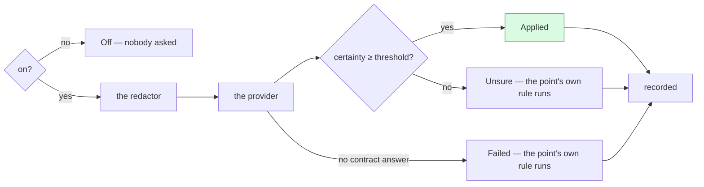

# 15 — The Decision-Making Agent

A decision point — which of an agent's models leads, who of a pool takes a work item, whether a tool
call is harmful — builds a typed question against a state and gets back an answer sure enough to act
on, or the reason its own rule ran instead. The **Decision-Making Agent**, `decision-making-agent`,
is the third core agent of a workspace, beside the General Agent and the Workflow Agent, and the one
that judges: it holds no conversation, takes no work item and signs nothing, and its id is reserved
— no agent record may take it. Off by default, everywhere.

---

## What it is, and is not

There are three core agents, always here and never removed. The General Agent staffs and
delegates, the Workflow Agent designs and repairs, and the Decision-Making Agent judges. The first
two **hold a record** — a key, a prompt, a conversation, a place in every room — and `AgentId::CORE`
names exactly those two ([06](06-agents-and-teams.md#the-core-agents)). The third holds none: it is
**asked a typed question**, never a process with a memory or a turn, so nothing can message it,
assign it work or wake it.

Its definition is compiled in, like the other two's — `library/core/decision-making-agent.toml`,
read by `bisa-store`'s `decision_making_agent()` — but nothing about it lives per workspace: no key
file, no truth record, no row, and so nothing to ensure at open. Its id (`AgentId::DECISION_MAKING`)
and its name (`DECISION_MAKING_AGENT_NAME`) stand beside the other two's in `bisa-core`. Who answers
for it is a setting (`decisions.provider` and the keys beside it), never the definition; the
definition's own `provider = "harness"`, `harness = "claude-code"`, `model = "claude-sonnet-5-5[1m]"`,
`effort = "high"` is only what the registry's defaults say before anybody writes a different one, and a test holds the
two together.

**Its answer is a judgement, never a decision.** On the wire a *decision* is kind 3401 — a
person's signed approval on one of the three gates. A judgement never signs a gate: nothing here
adopts a workflow, starts a run, or approves a publish. Every decision point still runs its own rule
when the Decision-Making Agent is off, unsure, or fails to answer — it is a **judgement in a place
a rule already covers**, standing in, never a new kind of authority.

---

## The contract

The shape is a System One model's — Jev's, and any other model trained for calibrated decisions: a
request is a **state** and a map of typed **questions**; a response is `{ model, answers, usage }`,
one answer per question. A generative model behind a harness is held to the exact same shape, so a
caller never learns which provider answered.

Three questions, and no fourth:

- **`noul`** — is it so? Answered as a probability in `[0, 1]`.
- **`choice`** — which one, of the options the caller described? Carries the probability of each and
  a confidence.
- **`score`** — how much, along ordered levels? Carries the probability of each level and a
  confidence.

```json
{
  "state": "Help! My payouts have been failing for 3 days.",
  "questions": {
    "is_urgent": {
      "type": "noul",
      "instructions": "Does this convey urgency?",
      "criteria": { "true": "Explicitly time-sensitive", "false": "No urgency expressed" }
    }
  }
}
```

```json
{
  "model": "jev-1.13.0",
  "answers": { "is_urgent": { "type": "noul", "noul": 0.95 } },
  "usage": { "input_tokens": 426, "output_tokens": 73 }
}
```

A `choice` question names its options and what each means; its answer names the one chosen, the
probability of every option, and a confidence:

```json
{
  "state": { "task": "rename a variable" },
  "questions": {
    "model": {
      "type": "choice",
      "instructions": "Which model suits the task?",
      "criteria": { "small": "quick edits", "large": "design work" }
    }
  }
}
```

```json
{
  "model": "jev-1.13.0",
  "answers": {
    "model": {
      "type": "choice",
      "choice": "small",
      "probabilities": { "small": 0.8, "large": 0.2 },
      "confidence": 0.7
    }
  },
  "usage": { "input_tokens": 214, "output_tokens": 12 }
}
```

A `score` question's `criteria` is its rubric, lowest level first (two to ten); its answer's `legend`
repeats the levels by number and `score` is the probability-weighted level.

`DecisionResponse::check(&request)` is the **one runtime validator**, and the only door an answer
passes through on its way to being acted on. It refuses a response that:

- leaves a question unanswered, or answers one that was never asked;
- answers with the wrong type — a `choice` question answered as a `noul`;
- chooses an option, or names an outcome in `probabilities`, that the question never offered;
- gives a probability or a confidence outside `[0, 1]`, or a distribution that does not sum to `1`
  within `0.05`;
- scores off the rubric's legend;
- names no model.

A response that fails it is an error — never a guess, never a partial answer. **Certainty** is one
scale for all three answer types: a `choice`'s or a `score`'s own `confidence`; a `noul`'s is how far
its probability stands from a coin toss toward either end (`0.5` reads `0`; `0` and `1` read `1`). A
response's own certainty is the least certain of its answers — what a caller that needs every
question answered gates on.

---

## Research note

The contract above is the System One wire of TypeSafe AI's Jev, a model trained with RLCD
(reinforcement learning for calibrated decisions): its probabilities mean how often it is right, not
how sure it feels. That is what lets a caller threshold on a number and trust the threshold — a
`choice` answered with `confidence: 0.9` is right about nine times in ten, across the questions Jev
was trained on. A generative model asked the same question through a harness reports its own
estimate of its own certainty, which is a different thing: two large language models asked to grade
their own confidence are known to disagree with their own accuracy in ways a calibrated model does
not. Every provider record says which kind it is (`calibrated: true` for Jev and for any other RLCD
model at an endpoint a person names; `calibrated: false` for a harness or an agent) so a reader of
the judgement log always knows which promise a number carries.

---

## Providers

One port, `DecisionProvider { descriptor(), decide(&request, deadline) }`, in the
[`bisa-decision`](crates/decision.md) crate. Two shapes answer it:

- **A calibrated model**, over its own HTTP wire (`SystemOneProvider`): `POST
  <endpoint>/v1/systemone` with `{ state, model, questions }`, a bearer key when the endpoint wants
  one. **Jev** is this provider at TypeSafe AI's own endpoint (`https://api.typesafe.ai`); **RLCD**
  is the same provider at any endpoint a person names, with `none` or `bearer` sign-in. The
  endpoint's host passes the rules a connector's does — `https`, or `http` to this machine alone —
  and this node's own `security.net.deny_hosts` / `security.net.allow_hosts` lists apply to it as to
  any outbound call.
- **A generative model**, held to the same shape (`PromptedProvider`): a harness on this node with
  one of its models, or an agent on its own harness and model plan, asked through the engine's
  bounded, tool-less one-shot session — one fixed prompt, one reply read strictly as JSON, nothing
  taken from prose.

Every provider is wrapped in three decorators before a caller ever sees it: **`Checked`** (the
request validated before it leaves, the response checked against it on the way back — a broken
response is a transient error, since a generative model asked again may hold to the shape this
time), **`Retrying`** (`decisions.retries` attempts, 0.5 s doubling capped at 5 s, jittered, a
service's own `Retry-After` honoured; a `Busy`, `Unreachable`, `Unreadable` or broken-contract answer
is retried, a `Refused` or `Misconfigured` one never is, and no wait outlives the deadline), and
**`Bounded`** (one deadline over the whole call). `bisa_decision::build(&settings, &ports)` is the
one factory that matches a provider kind — switching `decisions.provider` is one setting; nothing
else moves.

The default is the **Claude Code harness with `claude-sonnet-5-5[1m]` at effort `high`** — the
model the General Agent and the Workflow Agent fall back to out of the box — so a workspace that
turns the Decision-Making Agent on for the first time asks a session already installed on this
machine, no key required. A judgement's session is never routed and never asked how hard to work:
it runs the model and the effort the settings name (`decisions.harness.model`,
`decisions.harness.effort`), which is what keeps the two model points from asking about themselves.

---

## Where it is on

The Decision-Making Agent is off until it is switched on, in one of four ways — and *ready* only when the
provider can be asked as it is set up: for the `harness` and `agent` providers the harness named
must be one this node can launch **and one the last probe found installed** (`decider::launchable`
reads the warm harness listing; a harness the settings name but the machine lacks reads *not
installed on this machine*), which is what the setup gate ([16](16-setup-gate.md)) holds the
Decision-Making Agent to before the platform opens.

1. **Globally** — `decisions.enabled` (machine, workspace or project scope), read for the project a
   decision point stands in.
2. **Per agent** — `Agent.decision_making: bool`, one of the **three** things that may be edited
   on the General Agent and the Workflow Agent (harness, model plan, decision-making switch); any
   other agent's own switch counts for a pick of its pool.
3. **Per workflow** — `Workflow.decision_making: bool`, on for every decision point a run of that
   workflow reaches.
4. **By explicit selection** — an `auto_route` model plan, an effort of `auto`,
   `security.classifier.provider = decision_making_agent`, or a `judge` step. Naming the Decision-Making Agent *is* switching it on there: these
   points are never reached by `decisions.enabled`, never listed in `decisions.points_off`, and ask
   every time they are used.

A point somebody selected by name is always on. Every other point is on when the global switch
resolves true for the project **or** the agent or workflow standing at the point has its own switch
on — and the point is not named in `decisions.points_off`, the list of points the switch above leaves
to their own rule. `decisions.points_off` cannot remove a selected point; unselect it where it was
selected instead.

---

## The decision points

Eleven places in the platform ask. Each keeps its own rule as the fallback — the Decision-Making Agent never
becomes the only way a point can be decided.

| Point | Its own rule (off) | With the Decision-Making Agent |
|---|---|---|
| `model.route` | `ModelPlan::order` by strategy | strategy `auto_route`: a `choice` over the plan's ready models, each one's `suited_for` sentence beside its id, leads the order; a hard step `model` pin still wins. Selected explicitly |
| `model.effort` | the next level down the chain — the step's, the model's, the plan's, `agents.effort` — that is a level, `high` when none is ([06 § Effort](06-agents-and-teams.md#effort)) | an effort of `auto`: a `choice` among the levels the leading model takes, each with a sentence saying its rank and what it is for, over the task, the agent's name and description and the model; asked once for a launch walk and carried across a model wall; fewer than two levels is no question. Selected explicitly |
| `security.tool` | the classifier agent answers `SAFE` / `HARMFUL` | `security.classifier.provider = decision_making_agent`: a `choice` among `none` and six named harms; only a **sure** `none` is safe, a harm's own sentence is the reason when harmful, and unsure, failed or off all read as no verdict — the call goes to the person. Selected explicitly |
| `security.message` | the same, for a message from another node | the same, over the harms a message from outside can carry; held unless it is sure the message is safe. Selected explicitly |
| `security.content` | the same, for content an agent reads from outside — a page, a review ([11 § What an agent reads from outside](11-security.md#what-an-agent-reads-from-outside)) | the same, over `CONTENT_HARMS`; held and put to the person unless it is sure the content is safe. Selected explicitly |
| `assign.pick` | a work item's id decides a lot over the pool | a `choice` over the pool by each agent's own description; falls to the lot when unsure or failed. On when the workspace switch is on, the run's workflow's is, or any agent in the pool's is |
| `dispatch.triage` | an unaddressed message wakes `agents.default` | a `choice` over the scope's agents that may respond; falls to the default agent when unsure or failed. On via the workspace switch or the default agent's own |
| `goal.adopt` | an auto goal adopts the workflow designed for it alone | a `score` over three levels — *does this workflow reach the goal?* — below the middle level it opens the Adopt gate for the person with the reason; no answer still adopts alone, as the rule always did. On via the workspace switch or the workflow's own |
| `browser.headless` | `headless_for` reads the policy against the goal's mode | only where the policy is *unattended*, the agent gave no word, the rule says out of sight and the request opens a URL: a `noul` — *does the page need a person at it?* — a sure yes shows the tab after all |
| `workflow.judge` | — (the `judge` step kind exists only through the Decision-Making Agent) | a `judge` step: `{state, instructions, options, otherwise, min_confidence?}`. Selected explicitly |
| `agent.decide` | — (an agent's own question has no rule to fall back to; refused when off) | the `decide` MCP tool: `{sure, response}` |

**Rule-only by design, never wired.** Everything else the platform decides stays a fixed rule, on
purpose: who may sign a gate (governance), the guard's rule order and `unresolved_deny`, the outsider
clamp on a message from another node, `Condition` / `decide` / `if` / `switch` / retries / `on_fail`
(the run machine is pure and replayable), which events a start, a wait or a boundary hears, a
gateway's choice (`parallel`, `decide` with `pick = "every"`), a start's guard and the loop guard, a harness's own
probe, a hard model pin, an effort somebody named and the fit of a level to what a model takes, project and account resolution, the browser's `may_use` / `reach` / scripts
policies, notification routing, the conversation transcript window. A judgement standing in for one
of these would make the run machine's replay non-deterministic, or hand a probability the power a
signature has; neither is what a judgement is for.

---

## The order of one judgement



1. **Is the point on?** [Above](#where-it-is-on). Off asks nobody.
2. **The redactor.** The state and every sentence of every question pass the redactor before they
   leave the process: a System One endpoint is an outside service, and a harness never learns a
   secret either.
3. **The provider** `decisions.provider` names, already wrapped in the contract check, the retry
   budget and the one deadline (`decisions.deadline_secs`, retries included).
4. **The threshold.** `decisions.confidence.act`, or `decisions.confidence.security` at a security
   point. Below it the answer is recorded and the caller's own rule runs — **the fallback is always
   the caller's own logic**; nothing here decides *for* a point that was not answered.
5. **The record.** A `Judged` event on the bus, which the activity log keeps whether or not the point
   stood on a goal, and, on a goal or a run of the workspace, a `judgement` fact in that home's
   journal, signed as the platform.

A judgement's own session is never routed and never classified: the engine's one-shot ask (`ask_once`)
pins no lead and judges its own tool calls with the classifier off, so asking the Decision-Making Agent never
waits on another judgement — the Decision-Making Agent, when a harness answers for it and the
question is a permission, does not call itself.

---

## Failing closed at the security points

`security.tool`, `security.message` and `security.content` are the three points marked `is_security()`, and they read
differently from every other point: **only a sure `none` is safe.** A harmful choice is held with the
harm's own sentence as the reason; an unsure answer, a failed one, and the point being off all read
as **no verdict** — never a guess toward safe. No verdict is exactly what the classifier already does
without the Decision-Making Agent: it puts the call to the person, or holds the message. A security point's
threshold is `decisions.confidence.security` (0.9 by default, never settable below 0.5), sharply
higher than `decisions.confidence.act` (0.7) — the bar to *act* on an assignment pick is lower than
the bar to *call something safe*.

---

## What is recorded, and where

Every judgement — asked and answered, asked and unsure, asked and failed to answer, however it
came out — is an `EnginePayload::Judged { judgement, agent?, run?, step? }` event (topic
`decision.judged`, activity concept `agents`, kind tag `judged`), durable in the local activity log
(`activity/<YYYY-MM>.jsonl`) and its index row, read back by `GET /decisions` whether or not the
point stood on a goal. **No new GEP kind and no new table**: a judgement rides the same feed a guard
decision does.

Where the point stood in a home (`Standing.home`) — a goal, or a run of the workspace, which has
no goal — a judgement additionally becomes a
`JournalPayload::Judgement { judgement, run?, step? }` fact — type tag `judgement` — on kind 3400
`GOAL_NOTE` in that home's journal, signed as the platform, exactly like the Tool & Commands Guard's
own fact; the bus event is scoped to the same home, so a run of the workspace's judgement files under
its workflow's row. The index's `SCHEMA_VERSION` was bumped for it: `run_steps.kind`'s `CHECK` admits
`'judge'`, one of the workflow's eighteen step kinds — no migration, since a stale index is simply rebuilt
from truth.

A `Judgement` never carries the state it judged: only the questions as they were asked (already
redacted) and the answers. Nothing here keeps the text of what was decided about — only the shape of
the decision.

---

## The judge step

`judge` is one of the workflow's eighteen step kinds. It reads `state` and `instructions` rendered against
the run, offers `options: [{branch, meaning}]`, and asks the Decision-Making Agent a `choice` — naming the
step *is* switching the Decision-Making Agent on for it, whatever the workspace or the workflow's own switch
says. The engine puts the effect `RunEffect::Judge` on the bus; the step finishes with output
`{choice, confidence, judged}`, and the run machine reads the branch to take off `choice`
(`bisa_core::run::judged_branch`) against the step's own definition — the branch a finished `judge`
takes is the option `choice` names, or `otherwise` for a pick that names no option and for none. An
unsure or a failed judgement finishes the step on `otherwise` too: **a `judge` that cannot judge is
not a failed step**, and the run machine stays pure — the branch is read from the step's own output,
never from a side channel a replay could disagree with. `min_confidence`, when given, is the bar this
one step judges at instead of `decisions.confidence.act`.

---

## Settings

The `decisions` group (`crates/bisa-core/src/settings.rs`):

| Key | Scope | Default |
|---|---|---|
| `decisions.enabled` | machine, workspace, project | `false` |
| `decisions.points_off` | machine, workspace, project | `[]` |
| `decisions.provider` | machine, workspace | `harness` |
| `decisions.harness.id` | machine, workspace | `claude-code` |
| `decisions.harness.model` | machine, workspace | `claude-sonnet-5-5[1m]` (empty is the harness's own default) |
| `decisions.harness.effort` | machine, workspace | `high` (`minimal` · `low` · `medium` · `high` · `xhigh` · `max`, fitted to what the model takes) |
| `decisions.agent.id` | machine, workspace | `general-agent` |
| `decisions.jev.model` | machine, workspace | `jev-latest` |
| `decisions.rlcd.endpoint` | machine, workspace | `""` |
| `decisions.rlcd.model` | machine, workspace | `""` |
| `decisions.rlcd.auth` | machine, workspace | `bearer` |
| `decisions.deadline_secs` | machine, workspace | `20` (5–120) |
| `decisions.retries` | machine, workspace | `2` (0–5) |
| `decisions.confidence.act` | machine, workspace, project | `0.7` (0–1) |
| `decisions.confidence.security` | machine, workspace | `0.9` (0.5–1) |

A remote provider's API key is never a setting: `PUT /decisions/key/{provider}` keeps it in this
machine's own keystore under `decision:<provider>:api_key` and it is **never read back** (the desktop's
secret field keeps what was typed, hidden, while its window lives, and draws the mask afterwards —
[ide/13 §Secret fields](ide/13-settings.md)) — a status
route says only whether one is stored.

Four keys beside `security.classifier.*` let the classifier read as the Decision-Making Agent instead of a
generative reader: `security.classifier.provider` (`agent` · `harness` · `decision_making_agent`),
and `security.classifier.harness`, `security.classifier.model` and `security.classifier.effort`,
used when the provider is `harness`.

`agents.effort` (project, workspace; `high`) is not in this group, and is where an effort of
`auto` for everyone who names none is set ([06 § Effort](06-agents-and-teams.md#effort)).

---

## HTTP, CLI and MCP surfaces

**HTTP** (`crates/bisa-node/src/decisions.rs`):

```
GET    /decisions/status         → DeciderStatus { agent, enabled, provider, answers_as, effort?,
                                    calibrated, ready, problem?, key_stored?, points,
                                    deadline_secs, confidence_act, confidence_security }
GET    /decisions?limit=         → [JudgementRecord { seq, at, goal?, agent?, run?, step?, judgement }]
POST   /decisions/try            → DecisionRequest in, DecisionResponse out; nothing decided,
                                    nothing recorded; a request or an answer that breaks the
                                    contract (or a request over MAX_REQUEST_BYTES, 64 KiB) 400, a
                                    provider that refused or answered nonsense 502, one not set up
                                    or busy or out of reach 503, one out of time 504
PUT    /decisions/key/{provider} → { key_stored: true }   (jev | rlcd only)
DELETE /decisions/key/{provider} → { key_stored: false }
```

`GET /security/status` names the classifier's `provider`, `harness`, `model` and `effort` beside its
existing fields. `DeciderStatus.effort` is what a harness provider works at — `decisions.harness.effort`
fitted to what the harness takes for the model — and is absent for any other provider; `agent`
carries the definition's `default_effort`.

**CLI** (`crates/bisa-cli/src/decisions.rs`):

```
bisa decisions status
bisa decisions list [--limit]
bisa decisions try --state … (--noul "…" | --choice "…" --option id=meaning …)
bisa decisions key set <jev|rlcd> --from @stdin|@path
bisa decisions key clear <jev|rlcd>
```

A key is always read from stdin or a file, never typed on the command line where a shell would keep
it in history. `bisa agent add|edit` takes `--strategy auto-route`, `--effort auto`, a `--model`
spec of the form `"claude-opus-5-5[1m]=3@auto: design work"` (the text after `: ` is the model's
`suited_for` sentence, the word after `@` its effort), and `--decision-making` /
`--decision-making true|false`.

**MCP** — the `decide` tool is on every session's menu, agent and core alike; the engine is the
boundary, not the tool list: it refuses in a sentence unless the workspace switch or the agent's own
`decision_making` switch is on, and answers `{sure, response}` — `sure` is whether the answer cleared
`decisions.confidence.act`, so an agent reads an unsure answer as what it is and nothing but the
agent acts on it.

---

## Tests

| File | Proves |
|---|---|
| `crates/bisa-core/src/decision.rs` (unit tests) | the contract round-trips exactly as documented, a request or a response that breaks a rule is refused by name, certainty reads all three answer shapes on one scale, every point's and outcome's and provider's wire word reads back, the security points are the ones that fail closed |
| `crates/bisa-decision/tests/it/{main,support,system_one,prompted,resilient,factory}.rs` | the System One wire refuses a bad endpoint before any request and never leaks the key, a generative reply is read strictly, the retry wait doubles under its cap and obeys `Retry-After`, the factory builds the right provider for each `decisions.provider` and wraps every one in the same three decorators |
| `crates/bisa-engine/tests/it/decisions.rs` | the points wired into the engine — on/off resolution, the threshold, the redactor, the record on the bus and the home's journal, `judge` step branching, `agent.decide`'s refusal when off |
| `crates/bisa-node/tests/it/decisions.rs` | the HTTP surface — status, the newest judgements, `try` deciding and recording nothing, a key stored and cleared and never read back |
| `crates/bisa-store/src/decision_making_agent.rs` (unit tests) | the Decision-Making Agent's definition and the settings registry's defaults say the same thing, its reserved id is no agent record's to take, and its file is no catalog agent's |
| `crates/bisa-cli/src/decisions.rs` (unit tests) | a `try` question is built correctly from its flags, a key is refused from the command line, the status line never prints a key |

---

## Invariant

**A judgement never signs a gate.** Kind 3401 `DECISION` stays a person's signed approval alone; the
Decision-Making Agent's answer travels as `JournalPayload::Judgement` on kind 3400 and as
`EnginePayload::Judged` on the bus, never as a `Decision`. Held by `crates/bisa-core/src/decision.rs`
(the two are distinct types) and `crates/bisa-engine/src/decider.rs::record` (which writes only a
`Judged` event and, in a goal or a run of the workspace, a `Judgement` fact — never a `Decision`).
