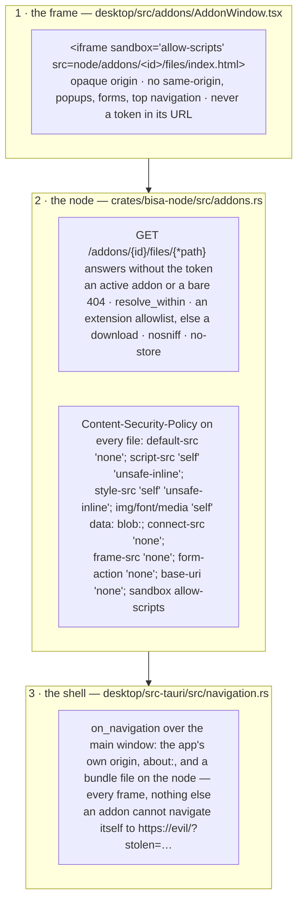

# 18 — Addons

An **addon** is a folder of HTML, CSS and JavaScript with an `addon.json` beside it, installed into a
workspace and shown as a **window that floats over the desktop** — draggable, and resizable, closable
and see-through as its developer decided. The platform ships thirteen in the catalog (a clock, the
machine's load, the weather, a game, a few small tools); anyone may write one and import the folder.
An addon reaches the platform only through one door, with only what the person granted, and can leave
the machine with nothing it was not given. This page is the model, the walls, the door, and what
travels.

---

## The words

| Term | Means | Does **not** mean |
|---|---|---|
| **Addon** | a community-built overlay widget: a folder with an `addon.json`, its page and its files, run in a sandboxed frame over the app | a plugin, an extension, a widget of the app's own chrome |
| **Manifest** | the developer's word — `addon.json`: id, name, description, version, author, homepage, repo, licence, tags, the **window** it opens as, the **permissions** it declares, its entry page | a lock file, a config |
| **Record** | the workspace's word — the manifest as installed, its `origin` (`local` · `catalog {slug}`), `enabled`, `granted`, `installed_at` — GEP kind **33407** in the `addons/` namespace | the bundle |
| **Bundle** | the copy of the folder the node serves, under `addons/<id>/files/`; this machine's, never on the wire | the record |
| **Grant** | one of the manifest's declared permissions the person gave — exactly as declared, never wider; a subset kept on the record | a capability the app has |
| **The bridge** | the `postMessage` conversation between the frame and the app: a closed method registry, a permission per method, caps on every field, a rate limit, a storage quota | an IPC, a plugin API |
| **The library** | `bisa-addon.js` — `window.bisa`, promises over the bridge, served by the node at every addon's root; a bundle may not carry a file of that name | an npm dependency |

---

## Three walls, none depending on another

**The frame.** `sandbox="allow-scripts"` and nothing more: the document's origin is opaque, so it
cannot reach the app's origin, its `localStorage`, its token or its parent. Its `src` is the node's
**token-less** files route — a token in that URL would be a token the addon could read — and the
node's answer is what the frame runs.

**The node.** The files route is the one route that answers without the bearer token, and the
module says why on every line that keeps it small (`crates/bisa-node/src/addons.rs`,
`auth::is_addon_file`): `GET` alone; an `AddonId` and an **active** addon (enabled, files here,
`addons.enabled` on) or a 404 that names no reason; the path judged by `is_bundle_path` and resolved
inside the bundle by `resolve_within`; the type decided from the extension allowlist
(`bisa_core::addon::SERVED_EXTENSIONS`), else `application/octet-stream` as a download; `nosniff`;
and a Content-Security-Policy header that lets the page load its own files and reach **nothing** —
`connect-src 'none'`, no frame, no form, no base. The library is served from the binary at every
addon's root, so a bundle cannot ship a tampered one; the store refuses a file of that name at
install.

**The shell.** WebKit asks the navigation delegate about every frame's navigation and wry hands
`on_navigation` the URL; the main window is built in `setup` (`"create": false` in
`tauri.conf.json`) so it carries `navigation::allowed`: the app's own origin, the empty page, and
`<node>/addons/<id>/files/…` — in every frame, nothing else. A sandbox cannot stop a document from
navigating *itself*; this can.

None of the three depends on another: a document opened outside the desktop still wears the node's
policy (its `sandbox` directive repeats the frame's), the frame's sandbox holds whatever the headers
say, and the shell refuses whatever a page tries.

---

## The door: the bridge

The one way out of the frame is `postMessage` to the window that hosts it, and the one way in is
the same wire. The app's half (`desktop/src/addons/addonBridge.ts`) trusts **the frame's own
window and nothing else** — the origin is opaque, so every send targets `"*"` and every receipt is
judged by `event.source`, as the page inspector's wire is ([ide/03](ide/03-files-and-editing.md#rendered-documents)).
Every message is read by a pure model (`addonBridgeModel.mjs`) that owns:

- **the shape** — version 1; a `bisa:hello`, or a `bisa:call {id ≤ 64, method, params ≤ 16 KiB}`; anything else is dropped unread, or answered `bad_params`/`unknown_method`/`too_large` when its id is sound;
- **the registry** — seventeen methods, each with the permission it needs and the window flag it needs (`window.resize` needs `resizable`, `window.close` needs `closable`); a method not in it is refused before its params are read ([reference/addon-api.md](../reference/addon-api.md) is the table, and a test holds the two equal);
- **the caps** — a notice's title 100 and body 200 characters, once every ten seconds per addon; a clipboard write 64 KiB; a storage bag 256 KiB per addon, strings only, kept by the host under `bisa.addons.storage.<id>`; a URL 2048 characters, `http(s)` only; a title 60 characters; a fetched body 1 MiB;
- **the answers** — a reply to send now, or an **effect** the bridge performs: a notice through the desktop's own door (under the person's *Addons* notifications switch, Settings › Capabilities › System), the clipboard, a route from a closed list of screens, a window move, or one of the two that answer later — `network.fetch`, which goes to the node's broker, and `url.open`, which asks the person first;
- **the events** — `theme`, `visibility`, `workspace.summary` and, while subscribed and granted, `system.load` at the footer's cadence — four topics, no `locale`: a language change reloads the window, and the page hears its locale in the next `ready`. The summary is `shell/workSummaryModel.mjs`'s, the rule the pet stands by.

Every refusal the bridge makes is written to the desktop's diagnostic log with the addon, the
method and the code (`refusedCode`), which is where a developer testing an addon reads them.

Nothing an addon says is ever rendered as HTML by the app: a string that reaches a person is text,
cut to its cap first. Nothing crosses that the person did not grant: the token, a path, a program, a
secret, a message's body, a file — none has a method.

**The network broker** (`crates/bisa-engine/src/addons.rs`). An addon's page can fetch nothing
itself. What it may fetch it asks the app for, the app asks the node (`POST /addons/{id}/fetch`),
and the engine reads every refusal in order before a socket opens: the machine's switch, the record
(enabled, files here), the `network` grant, the URL's shape, its scheme (`https` only), the
authority (never this machine — `is_loopback`), the declared hosts, and the person's
`security.net.*` lists judged by the same rule a connector's call is ([11 § Outbound
hosts](11-security.md#outbound-hosts)) — a refusal there is journaled as a guard decision with the
tool `addon:<id>`. `GET` only, no header but `Accept`, ten seconds, no redirect followed, the body
cut at 1 MiB and handed over as text.

---

## What a person decides, and where

- **Install** — a built-in from Settings › Library › Addons, or a folder of their own through the
  picker. Either way the **review** names every permission the manifest declares in plain words
  before anything lands. A built-in lands `enabled` with its declared permissions granted: the
  platform wrote it and the person just read the list. A folder lands with the grants and the switch
  the person chose in the review — **nothing is granted by default**. The node judges the folder
  whole before a byte is copied (`POST /addons/validate`): the manifest's rules
  (`bisa_core::addon::AddonManifest::validate`, `problem-addon-*`), then the walk (no symlink, no
  dotfile, no name that is not UTF-8, at most eight folders deep), then the listing (the entry is
  there, nothing wears the library's name, every extension is one a bundle may carry, 256 files,
  2 MiB a file, 8 MiB in all).
- **Enable / disable** — the record's switch, from Settings › Library › Addons or the footer's
  popover. Off,
  the window is gone, its files are not served, the broker refuses; what it stored stays. The
  desktop answers at once (the list reads as the node will) and puts it back if the node refuses;
  switching on brings a put-away window back.
- **Grant / revoke** — one switch per declared permission; a grant is the declaration copied
  (`network` keeps its hosts), and a grant the manifest never declared is refused by word.
- **Remove** — the record, the bundle, the snapshot. A built-in can be installed again.
- **The machine's switch** — `addons.enabled` (machine scope): off, nothing draws or is served on
  this machine; every record is kept.
- **Furniture** — whether the layer shows (the footer's Addons popover, `⌘⇧X`), which windows are
  put away, and each window's dock and size are this machine's, in `localStorage`
  ([crates/desktop.md](crates/desktop.md#per-viewer-state)). The popover lists **every installed
  addon**, running first — its state, its on/off switch (the record's), and *Show* / *Put away*
  (this machine's) — so nothing is reachable from Settings alone. What draws is one rule
  (`visibleAddons`: active, not put away, the layer shown, the machine's switch on) that the layer,
  the footer's count and the popover all read from one store, whose `switchedOn` is the node's
  `addons_enabled`, re-read on `addons_changed`, on a `settings_changed` naming `addons.enabled`,
  and when the bus comes back. The list's reads are held to the order they were asked in — an
  older answer never puts back what a later one took out — a read that refused is said on the
  panel and the popover (never *none installed*, which nobody checked), and a switch the node
  refused goes back alone, on the list as it stands.
- **A built-in the binary outgrew** — the built-ins wear the platform's version (a test holds every
  manifest to `CARGO_PKG_VERSION`, and its `homepage` and `repo` to the workspace's); at every open,
  `refresh_builtin_addons` compares each installed catalog record's `version` with the manifest the
  binary ships; when they differ, the
  bundle is staged and swapped in (the old folder retired, then cleared), the manifest replaced, the
  switch and `installed_at` kept, the grants kept but held to what the new manifest declares, the
  snapshot rewritten. A built-in at its shipped version is untouched.

---

## What travels

The record is a definition that reads the same everywhere — what is installed, where from, whether
it runs, what it was granted — so it is a GEP snapshot: kind **33407**, `d` = the addon id,
`addons/state/33407-<id>.json`, written like a skill's and admitted by ingest like one
([09](09-protocol-gep.md)). The number was retired once (a goal's living document) and is one of the two
numbers reissued before 0.1.0 — `33401`, the drawing's, is the other ([19](19-drawings.md)); no workspace of a public release holds an event of the old kind, and from 0.1.0 no number is reissued.

The **bundle's bytes** and the **window's placement** are one machine's and never travel: a record
that arrived from a peer lists with `files_present: false` and cannot be enabled until the folder is
imported here under the same id; a built-in's files come from this machine's own binary.

---

## Where it lives

| Layer | Owns |
|---|---|
| `bisa-core/src/addon.rs` | the shapes and every pure rule: the manifest, the window, the permissions, the record, `validate()` as problems by field, `check_bundle_listing`, `is_bundle_path`, `served_content_type`, `is_semver`; `AddonError` |
| `bisa-core/src/kind.rs` | `KIND_ADDON = 33407`, addressable |
| `bisa-store/src/addons.rs`, `build.rs` | the folder walk, the staging copy renamed into place, the record and its snapshot, the offers; the built-ins embedded from `library/addons/` by the build script (`BUILTIN_ADDONS`); `catalog.rs` lists them as the seventh kind |
| `bisa-engine/src/addons.rs`, `admin.rs` | the doors that announce `AddonsChanged`; the network broker |
| `bisa-node/src/addons.rs`, `auth.rs` | the routes, the token-less files route and its policy, the library served from the binary |
| `bisa-cli/src/addons.rs` | `bisa addon …` — through the node when one runs; an import reads the folder's own manifest first, so a folder that holds none, or one that is no manifest, is refused by its file before anything is copied. Held from end to end by the journey `crates/bisa-cli/tests/it/e2e/addons_drawings_and_notes.rs`: the nine verbs, a folder refused whole, the files route open to the window of an addon that is on and answering 404 for one that is off, every change said on the bus |
| `desktop/src/addons/` | the bridge and its model, the windows, the layer, the store (one `useAddonsSync` mount, in the layer), the words; `shell/AddonsStat.tsx` + `shell/AddonsOverlay.tsx` (the footer's popover), `views/_settings/AddonsPanel.tsx` |
| `desktop/src-tauri/src/navigation.rs` | the shell's wall |
| `addons/sdk/`, `addons/template/`, `library/addons/` | the library and its types, a starter, the thirteen built-ins — each `style.css` fences `[hidden]`; tic-tac-toe's and the sticky note's pure rules are a `logic.js` loaded before `main.js`, run alone by `desktop/src/scenarios/addonsLogic.test.mjs` |

The guide for people and developers is [guide/addons.md](../guide/addons.md); the library's contract
is [reference/addon-api.md](../reference/addon-api.md).
