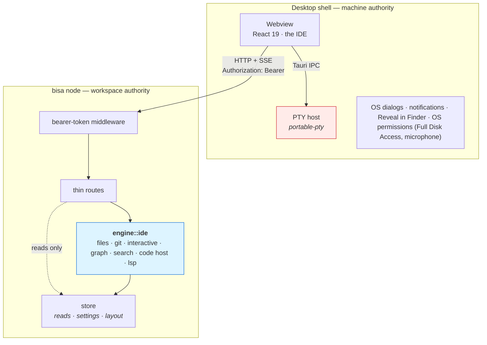

# 01 — The trust boundary

Where a capability lives is decided by one rule, and the rule is about blast radius.

---

## The rule

The desktop shell's terminal module states, in bold, that *the terminal must never become a node
route*: the node's control plane is reachable from anything that can open the socket or the port, and
a PTY behind it would hand out an interactive shell as the user. That reasoning is right and it
survives untouched. Restated as a rule rather than a case:

> **The node may hold any capability whose blast radius is the workspace. The desktop shell holds any
> capability whose blast radius is the machine.**

| Capability | Blast radius | Lives in |
|---|---|---|
| read, write, rename, delete a file under a project | the projects the owner created or imported | node |
| stage, commit, branch, rebase, push | one repository the owner registered | node |
| search a project, run a language server over it | the same | node |
| open a pull request, merge one | a remote the owner is accountable for — behind the `Publish` gate | node |
| judge a tool call before a harness runs it, and rewrite its input | the call itself — a refusal, a question, or the same call with a placeholder restored; the node decides through the harness's own permission channel and the harness executes | node |
| list the public SSH keys under `~/.ssh`, generate one, load one into ssh-agent, greet a git host; read and write the person's global git config and its profile includes | the person's own machine state, at their request — public key material and one new key file, a config file git already lets any process read; a private key is never opened, `~/.ssh/config` and `known_hosts` are never written, and the person's own terminal can already do every one of these — like the global git config, it lives in the node so the CLI has the same verbs and a Tauri-only capability cannot break parity | node |
| ask the machine's `gh` and `glab` whether they are installed and signed in as whom, and run a code host operation through them — a pull request opened, a review posted, a merge — including one command's token asked of the CLI and held in memory for that command | the same remote the API path reaches, as the account the person signed the CLI in as; nothing of ours opens the CLI's own files (`~/.config/gh`, `~/.config/glab-cli` — denied to agents by the guard), the token is never stored or logged, the argv is a closed set the platform composes and the CLI's browser sign-in is never run here — it lives in the node so the CLI has the same verbs and the same answer on every surface | node |
| run a code host CLI's own **browser sign-in** in a terminal tab — `gh auth login --hostname H --web`, `glab auth login --hostname H` — when Settings' **Authenticate** is pressed | the person's machine state: a credential written where the CLI keeps it, by the CLI, after the person finishes in the browser; the program and its arguments are a closed table in the shell keyed by kind and host, the webview names a kind and a host and never a program | **desktop shell** (`src-tauri/src/terminal.rs`) |
| read whether macOS has granted the app **Full Disk Access** or the **microphone**, and ask for it — a TCC probe that opens one protected file read-only and drops the handle unread, `AVCaptureDevice`'s own status and prompt, the System Settings pane opened by argv | this Mac — a grant belongs to the process macOS gave it to, which is the shell; the node never learns or needs it, and the platform's own switch (`system.*`, machine scope) is the only thing the node holds | **desktop shell** (`src-tauri/src/permissions.rs`) |
| write this machine's diagnostic log — the shell's own lines and the webview's, under the workspace's `logs/`, and a crash report when the node it supervises exits | this Mac's disk, in a folder the `bisa` binary named (`bisa paths`) or the node named (`GET /workspace`'s `logs_dir`), or the app's own log folder when neither could; the webview hands over words through one command (`log_event`) and never a path, and the node's own file is the node's (`bisa-log`, [11 — Security](../11-security.md#the-diagnostic-log)) | **desktop shell** (`src-tauri/src/logging.rs`, `sidecar.rs`) |
| read and write **one file the person dropped or picked, anywhere on this machine** — a loose document in the IDE, saved back where it lives, or elsewhere through the OS's save dialog ([03 §Loose files](03-files-and-editing.md#loose-files)) | this machine, as the person's own editor would — the shell keeps the node's editor rules byte for byte (the caps, the hash, compare-and-swap), and the node never learns the path; nothing an agent or an MCP tool can reach | **desktop shell** (`src-tauri/src/loose.rs`) |
| copy **files the person copied in the file manager into a folder of a checkout** — the explorer's paste of a Finder copy ([03 §Where the paths come from](03-files-and-editing.md)) | this machine, as Finder itself would — the shell reads the general pasteboard and copies by absolute path, the node learns nothing but what its watcher sees land; nothing an agent or an MCP tool can reach | **desktop shell** (`src-tauri/src/pasteboard.rs`) |
| read **the picture on the clipboard** — a screenshot pasted into a conversation as a named attachment, or written into a folder of a checkout under the name the person confirmed ([03 §Where the paths come from](03-files-and-editing.md)) | the clipboard is the machine's; the shell hands the webview PNG bytes it uploads as any attachment, or writes the file by absolute path and the node's watcher sees it land; nothing an agent or an MCP tool can reach | **desktop shell** (`src-tauri/src/pasteboard.rs`, `png.rs`) |
| read the machine's **process table** under each PTY's shell — which ports its descendants listen on, which harness runs in it, where the shell stands (its current directory, read at a click on a relative path it printed) — and, for the footer, the machine's load and what every process the app can name takes of it, the accelerator's load through `ioreg` on macOS, and the data directory's sizes | this machine's process list, as any process of the account can read it; a read, never a signal except *Stop* on a port the person named | **desktop shell** (`src-tauri/src/ports.rs`, `attribution.rs`, `stats.rs`, `gpu.rs`, `disk.rs`, the watcher in `terminal.rs`) |
| read this Mac's **network** — the VPN services System Settings knows, every interface and its addresses, which port is the Wi-Fi and which an Ethernet, the routing table's default and each interface's gateway, the resolvers, the proxy System Settings names — through the OS's own unprivileged readers (`scutil`, `ifconfig`, `netstat`, `networksetup`), for the footer's network word and Settings › Capabilities › Network; and ask whether the **internet** is reachable — the one thing here that leaves the machine: a TCP connect to two public resolvers on 443, and one `GET` through `curl` to the echo service `network.public_ip_url` names (through the proxy pair System Settings names, never a PAC), which answers this machine's public address | this machine, as any process of the account can read it; a read, never a write — the panel's doors set the echo service and copy the Mac's proxy into the platform's own `network.*` settings, and touch nothing of macOS's; the public address is shown, never stored or logged | **desktop shell** (`src-tauri/src/network.rs`, `probe.rs`) |
| run **third-party HTML and JavaScript** — an addon's page ([18](../18-addons.md)) | nothing beyond the list the person granted: the page runs in a sandboxed frame with an opaque origin, its files come from the node under one policy that lets it reach nothing, the window refuses every navigation off them, and its one door is a `postMessage` bridge whose every call is judged against the grant | desktop (the frame and the bridge), node (the files and the broker), the shell (the navigation policy) |
| **spawn a shell** | **everything the account can reach** | **desktop shell** |

A file write is bounded by the set of projects — including an `External` root, which sits outside
`~/.bisa` but is still a path the owner named. A shell is bounded by nothing.

The node does run three kinds of command a person wrote — a workflow's `check` step, a `check`
start's command, and a project's **workstream scripts** ([07](07-workstreams.md#workstream-scripts)) — and
each is argued the same way, not as a shell: the text is the workspace's own, stored in its files;
it runs in one of the node's writable roots, bounded by a timeout, its outcome journalled and on the
bus; nothing an event carried is substituted into it, and an input it reads is quoted for the
shell. The workstream scripts add one more rule because their text
**syncs**: a script runs on a machine only after a person on that machine approved its text, by
digest, in a machine-scope list nothing else writes.

The Tool & Commands Guard ([11 — Security](../11-security.md)) sits on the same side of the line:
the node never reaches into a person's terminal, it answers the question the harness asks before a
tool runs — through Claude Code's control protocol for a session the engine drives, through a
`PreToolUse` hook that waits for the node for one a person opened in the IDE's terminal — and when
the node has no opinion or does not answer, the harness's own prompt stands. A `check` step's and a
probe's command are judged by the same rules before the node's own `sh -c` runs them, and run with
their redacted placeholders restored; what is journaled is the redacted text.

---

## The token, and why it is the right bar

The unix socket's `0600` mode is not the control plane's only authentication: `--listen` exposes
the same plane on TCP, where a file mode says nothing. A file mode alone is defensible for a plane
that discloses less than the filesystem it describes; a write route breaks that argument.

The control plane carries a bearer token:

- **Minted by the node** (`bisa_node::auth::ensure_token`) into `run/token` — 32 random bytes
  as 64 hex characters, created with `O_CREAT|O_EXCL` at mode `0600` so two nodes racing to mint
  never both believe theirs is the file's; a configured token (`BISA_API_TOKEN`) replaces
  the file. One token per workspace, rotated by deleting the file and reopening.
- **Required on both listeners.** One middleware, no per-listener branch. The socket's file mode
  and the token are two independent checks; requiring both costs nothing.
- **Exceptions, named:** `GET /health` (returns `{ok, version}` and nothing else — it is what
  the sidecar polls before the token file may exist), `POST /hooks/{host}/{step}` (a public hook:
  its listener's own secret, as a token or an HMAC),
  `GET /.well-known/agent-card.json` and everything under `/a2a` (the A2A surface has its own
  posture and is documented as such), the connectors' OAuth callback (the browser arrives with no
  token), `GET /addons/{id}/files/<path>` (an installed bundle's static files, for the sandboxed
  frame that holds no token — [18](../18-addons.md)), and the four doors of a terminal session,
  `POST /sessions/{id}/{report,guard,exit,close}`, which a harness in a terminal reaches
  with the session's own secret and never the workspace token ([06](06-terminals.md)). The list
  is `auth::is_exempt`; a test walks every mounted route without the token and asserts `401` on
  everything not in it.
- **Every client reads the file.** The CLI, the MCP client, the desktop sidecar, and the desktop
  shell's own raw `TcpStream` lookups (`GET /placement`, `GET /harnesses`) all send it. A dev session
  against an external node (`BISA_API_BASE`) supplies `BISA_API_TOKEN`.
- **A non-loopback `--listen` is refused** unless `--insecure-allow-remote` is passed. A bearer token over
  plaintext to another host is a token somebody else can read; the flag exists so the decision is
  the operator's and visible.

**Why this beats the terminal doc's objection.** That document argues a token is worthless because
"a token in the node's config file is readable by anything that can already read the workspace."
True — and it is why the terminal does not move. But of the four attackers the same paragraph names,
three cannot read a `0600` file under a `0700` directory: a browser tab on `127.0.0.1`, a container
with host networking, a second user on a shared box. For a capability whose blast radius already
equals workspace-filesystem access, defeating those three is exactly the right bar. For a
capability whose blast radius is the machine, it is not — so the PTY stays where it is.

---

## What the webview may say

Unchanged from the terminal module, and now applied to every IDE route:

- **Never a path to the node.** The webview names a `scope` and an `id` — `workstream`,
  `work_item`, `goal`, `run`, the four of `FileScope::ALL` — and a path *relative to that scope's root*.
  The node resolves the root and checks containment by canonicalisation (`resolve_within`), never
  by string prefix. An absolute path goes only to the **shell**: to reveal it, and to read or save a
  loose file ([03](03-files-and-editing.md#loose-files)) — the machine's capability, in the
  machine's process.
- **Never a program.** A terminal names a harness id; a language server is named by its catalog id;
  a code host by its detected remote. Nothing the webview sends is ever executed as a command line.
  The Browser menu ([18](18-browser-and-servers.md)) keeps the rule: a served folder is a name relative to the
  checkout the node resolves and hosts, and the run command is the node's answer for the checkout
  — a project setting approved on this machine — which the shell asks for itself when a terminal
  opens with `run: true`. A browser tab is a URL and a key; its native webview has no IPC at all,
  and a page reaches the main window only through the shell's one script message handler, whose
  words are data the desktop bounds — never a command. A screenshot of a
  tab is bytes the shell hands the webview, which uploads them to the node like any attachment;
  the node names the copy an agent reads, and the shell copies a saved one from that named path
  as it copies an artifact's — the webview names no path.
- **Never a credential.** Code host tokens come from the node's credential chain
  ([08](08-code-host.md)) — the environment, the stored token of the account the checkout's git
  config names, or the one git's own credential helper holds, asked of git and never read from a
  file or a key; the webview never sees one, whichever source answered. An SSH key reaches the
  webview as its **public** half and its fingerprint, never more; a passphrase is never asked for.
  The Tool & Commands Guard keeps `~/.ssh/**` denied to agents: the SSH routes are a person's,
  behind the bearer token, and no MCP tool reaches them.

---

## Writable roots

A write route accepts a path only when it resolves under one of:

| Root | Why it is writable |
|---|---|
| a project tree (`projects/<slug>/tree/`, or an `External` root) | it is what a project *is* |
| a workstream checkout (`projects/<slug>/workstreams/<id>/`) | a branch being worked on |
| `goals/<id>/scratch/` | the goal's scratch: the Workflow Agent's design session, a check with no project, `TMPDIR` — the one writable root of the `goal` scope, whose read root is the goal's whole folder |
| `workflows/runs/<id>/scratch/` | a workspace run's scratch — the one writable root of the `run` scope, whose read root is the run's whole folder |
| a work item's root (`work_item` scope) | wherever the item ran — its workstream's checkout, or its home's scratch |

Everything else is refused with a message naming the boundary: the journal, `state/`, `edges.json`,
`identity/`, `index.sqlite`, `members.json`, `governance.json`. **The IDE cannot edit truth files,
by construction** — not because a rule says so, but because no route's root resolves there.

---

## The adopted-root rule, refined

The projects guide states: *never write into a folder you did not create.* An editor appears to
break it — a person saving a file in an adopted repository writes into a folder Bisa did not
create.

The adopted-root rule is refined here rather than weakened.
What the rule protected against was the **platform's own scratch** landing in somebody's repository:
workstreams, skill files under `.claude/skills/`, `TMPDIR`, an unasked-for `git init`. All of that
still never lands in an adopted root. What it never protected against — and never could — is a
person doing their own work in their own repository: a harness launched from the terminal panel has
written into adopted roots since the panel existed, and nobody would call that a violation.

So the refined rule is: **the platform never writes its own scratch into an adopted root; a person's
edits through the IDE, and an agent session the person launched there, are the person's.** Two
consequences are enforced rather than hoped for:

1. **Skills are delivered as a prompt appendix, never as files**, when a session's placement is an
   adopted root. The materialiser checks the root kind, not the harness.
2. **Recovery refs** (`refs/bisa/safety/*`, [04](04-git.md)) are written into a repository's
   own `.git` only by a human-consented operation, are listed in the UI, and are pruned only by a
   human running a `just` target.

---

## What the boundary is not

It is not a sandbox. A shell in the terminal panel can `cd` anywhere; a language server runs with
the user's privileges; an agent at `ToolTier::Exec` has a full shell. The boundary decides **which
process may be asked to do a thing over which channel**, so that an unauthenticated port cannot ask
for a shell and an agent cannot ask for a destructive git operation. What it buys is that an escape
is *visible*: the file tree under a project is where the work is supposed to be, and anything that is
not there is something that went elsewhere.
