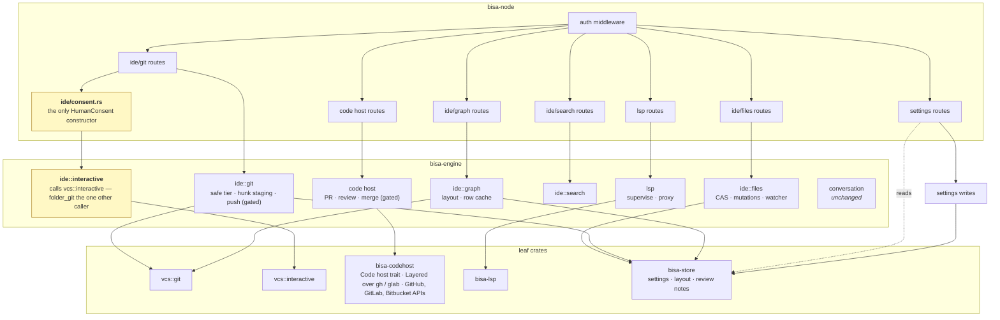
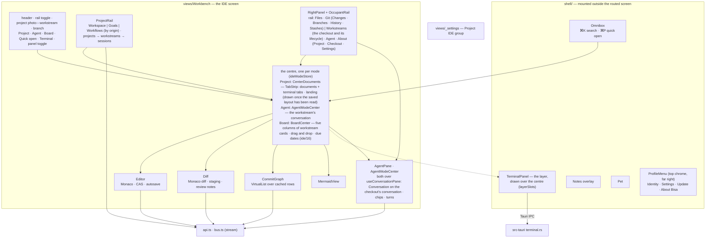
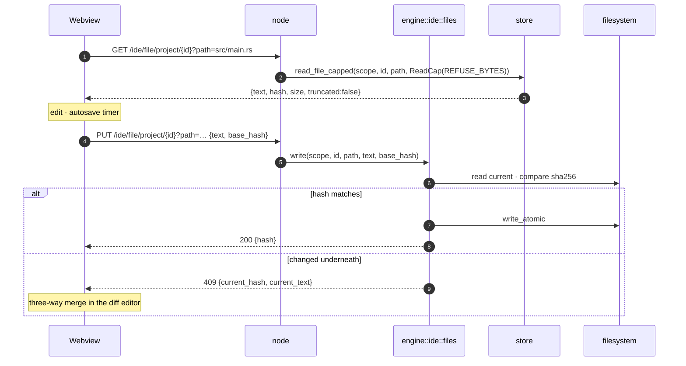
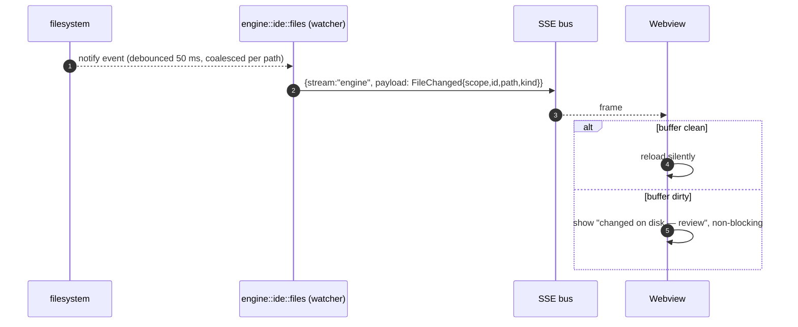
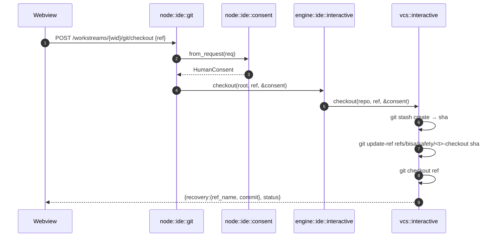
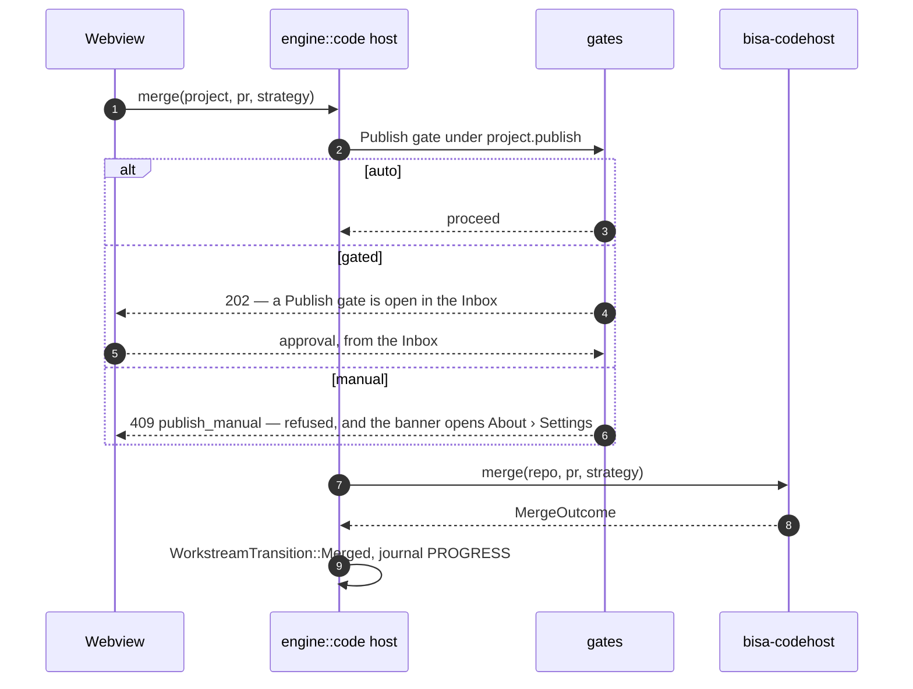

# 02 — Component model and data flow

C4 level 3 for the IDE, on both sides of the trust boundary, and the flows that cross it.

---

## Node side



| Module | Owns | Never |
|---|---|---|
| `node::ide` (`crates/bisa-node/src/ide.rs` — the file, graph, search, layout, index and watch routes in one module; `ide/consent.rs`, `ide/interactive.rs`, `ide/lsp.rs` beside it) | parsing scope, id and query; status codes; the `ROUTES` table; every filesystem read or write on the blocking pool | decide anything; touch a path |
| `node::ide::consent` | **minting `HumanConsent`** from an authenticated request | be called by anything but an IDE route |
| `engine::ide::files` | compare-and-swap writes, create/rename/move/delete — every target contained through the one canonicalising check, so a symlink out of the root is refused like a `..`; every answer and every `FileChanged` a root-relative path | write outside a writable root; hand the webview an absolute path |
| `engine::ide::watch` | the watcher: one canonical root per lease, events stripped to relative paths, a root that vanishes ends the watch with a rescan | report a path the root does not contain |
| `engine::ide::index` · `engine::ide::layout` · `engine::ide::review` · `engine::ide::connection` | the quick-open path index; the saved layout per root; review notes; what a checkout reaches its remote with | — |
| `engine::ide::git` | the safe tier: status, diff, log, blame, history, stage/unstage by path or hunk, commit, fetch, push behind `Publish` | any tree-moving verb |
| `engine::ide::interactive` | checkout, rebase, cherry-pick, merge, discard hunk, tag, remote, branch delete — **one of the two callers of `vcs::interactive`** (`engine::folder_git`, for its pull, the other) | run without a `&HumanConsent`; run before a recovery ref |
| `engine::ide::graph` | commit-graph layout and its row cache | draw anything |
| `engine::ide::search` | content search, replace across files through the CAS path — a file the apply names is contained before it is read | bypass the CAS; read a path the root does not contain |
| `engine::code host` | pull-request lifecycle through `bisa-codehost`, behind `Publish`; the host bound to the account the checkout's git config names (`codehost.account` — a profile's, the default, a pin) before any request; the accounts, the default; `ide::connection` — what a checkout will use to reach its remote, its cautions and its three read-only probes | hold a credential in a snapshot; guess between two stored accounts |
| `engine::lsp` | one server per `(language, root)`: start, stop, restart, proxy | decide which server — that is settings |

`bisa-engine` depends on `vcs`, `bisa-codehost` and `bisa-lsp` — the last two leaf
crates (`bisa-codehost → bisa-http`, `bisa-lsp` on none of ours) — and the exact-edge layering test in
`crates/bisa-core/tests/it/layering.rs` names every one of them.

### The one type an agent cannot hold

```rust
// bisa-vcs/src/interactive.rs
pub struct HumanConsent(());           // no public constructor, no Default, no Deserialize
```

It is constructed by one function, `bisa_node::ide::consent::from_request`, which takes an
authenticated request and the operator action it carries. The engine's `ide::interactive` functions
take `&HumanConsent` and have no way to make one. The MCP intake ops have no field for one, so an
agent session — which reaches the engine over the intake socket — has no path to the interactive
tier. Three tests fail the build if any of that drifts:

| Test | Asserts |
|---|---|
| `consent_is_minted_in_one_place` | the constructor call appears only in `crates/bisa-node/src/ide/consent.rs` |
| `interactive_tier_has_two_named_engine_callers` | `bisa_vcs::interactive` appears in `crates/bisa-engine/src/ide/interactive.rs` (the IDE's consented verbs) and `crates/bisa-engine/src/folder_git.rs` (the folder repositories' pull), and nowhere else in the workspace |
| `no_agent_path_reaches_interactive` | `crates/bisa-mcp`, `-harness`, `-adapters` contain neither `interactive::` nor `HumanConsent` |

---

## Desktop side



Rules the IDE code inherits from `desktop/README.md`, restated because the IDE is where each is
most tempting to break:

- **`views/` imports from `../ui` and nothing else.** Monaco is wrapped once, in `ui/CodeEditor.tsx`
  and `ui/DiffEditor.tsx`; no view imports `monaco-editor`.
- **Logic whose wrong answer is a wrong fact lives in a `.mjs` model** with a `.d.mts` and a
  `.test.mjs`: `ideLayoutModel` (tabs, splits, restore), `editorTheme` (token roles → Monaco theme),
  `hunkModel` (which lines a selection stages), `graphModel` (strokes, the sparse rows, the search
  words), `contextChips` (`ContextRef` ↔ chip), `quickOpenScore`, `keymapModel`, `sessionState`,
  `fileSearchModel`, `fileClipboard`, `tabMenuModel`, `treeListModel` (the tree's keyboard and
  drop projection), `sortModel` and `dragData` (a sortable's slot, the typed drag payloads),
  `fileMentionModel` (`@` for files), `singleFlight` (the shared fetch), `railOrderModel`, `railDragModel` (the rail's drag contract in record ids),
  `boardModel` (the Board's columns, the lifecycle rule for an unplaced card, due-date words, the
  rows and the optimistic move — ide/16).
- **No jsdom.** Components are not unit-tested; models are — and a journey across several models
  is a scenario (`desktop/src/scenarios/`, one `.test.mjs` per journey), which steps the reducers
  as the components would and reads the facts after each step, still without a DOM. `happy-dom`
  enters as a dev dependency used by exactly one script (`scripts/check-mermaid.mjs`), and a test
  asserts no `.test.mjs` imports it.
- **A read says what it is doing.** The kit's `Pending` (*reading {what}…* over rows, `aria-busy`)
  stands where a section's answer will go once its layout is known; `Spinner` where it is not;
  `ReadLine` beside a section that reads again (*checking again…*, *read 12 s ago*, the failure
  with the last answer kept — `views/_settings/loadModel.mjs`'s words). Every spin is
  `motion-safe:`; the words carry the state under reduced motion ([13](13-settings.md#every-panel-reads-the-same-way)).
  Every pending piece — the `Skeleton` block included, its box held unseen meanwhile — waits the kit's beat in a page that is already drawn and none inside a surface
  that has just opened — `Dialog`, `ConfirmDialog` and `Popover` provide `ImmediateIndicators` —
  so a dialog or a popover never opens onto an empty panel.
- **A trigger is never a button inside a button.** `Menu` and `Popover` render Radix's own
  `<button>` around the styled `<span>` they are handed; handed a `<button>` or the kit's `Button`,
  they make that element the trigger itself (`ui/triggers.ts`, `isButtonElement` → `asChild`), so
  no screen can nest one control in another — invalid HTML React reports on every render, and two
  controls where a screen reader expects one. A popover's panel is a `dialog` to assistive
  technology and carries its trigger's name; a right-click menu (`ContextMenu`) carries a name too,
  the row's when its caller gives one and *Actions* otherwise. Held by `ui/triggers.test.mjs`,
  which also reads every `trigger={` a screen writes.
- **`ui/icons.ts` is the single glyph map.** New concepts — workstream, recovery ref, pull request,
  check run, language server — get one glyph each, there.
- **Three error boundaries.** The routed screen's (`App.tsx`) costs a bad render one screen; the
  terminal panel's (`App.tsx`, around `<TerminalPanel/>`) costs a throw during a burst of closes the
  panel; the shell's (`main.tsx`, around `<App/>`) costs a throw in the chrome, the sidebar or an
  overlay a card with *Reload* — never a blank window with the error only in the console.
- **Mounted outside the routed screen**: the terminal layer, the notes overlay and the pet. The
  layer is *positioned* over the workbench's centre (`shell/layerSlots.ts`, one slot per host — the centre, the Browser pane) rather than mounted in
  it, and a screen fills the Details pane through a slot the pane *publishes* the same way
  (`shell/auxSlot.ts`) — so a pane closed and opened again is followed to its new element; the Agent occupant is *inside* the workbench: it belongs to the workstream you are looking at
  — and in Agent Mode the same conversation *is* the centre (`AgentModeCenter`), the occupant's tab
  then muted on the rail (ide/09 §Agent Mode).
- **The centre has three modes, and the header's right end is the switch**: *Project · Agent ·
  Board* (`SegmentedControl` over `workbenchChromeModel.modeSegments`, one glyph each from
  `ui/icons.ts`), then *Quick open*, *Terminal* and the right panel's toggle. A mode is a value the
  root remembers (`ideModeStore.ts`, `ideModeModel.mjs`: `MODES`, `availableModes`, `nextMode`),
  not a place: Project is `CenterDocuments`, Agent is `AgentModeCenter`, Board is `BoardCenter`
  (ide/16); `toggle_ide_mode` (⌘⌥A) cycles the three and `board` (⌘⇧B, global) goes straight to the
  Board from anywhere; the Board is offered only while `workstreams.board.enabled` is on.
- **The right panel has one kind of occupant, one kind of door**: the column shows one of
  Files, Git, Workstreams, Agent and About at a time, and every one is an icon on a
  vertical rail at the panel's right edge (`OccupantRail` over the kit's `IconRail`, the strip the
  Workflow Designer's panel — Properties · Agent · Runs — wears too; `RAIL_GROUPS`: Files · Git | Workstreams
  · Agent · About), in the model's two groups but at one spacing — no gap, no rule — with
  the showing tab marked on the rail's outer edge, on screen whether or not the column is, and a
  **mark** in the Git and Workstreams tabs' corner while their columns are closed
  (`railBadgesModel.mjs` — a dot with its sentence as the tooltip: something to commit or discard,
  conflicts, a lifecycle step in progress — over `shell/workstreamStatusStore.ts`, the one store of
  every workstream's status the project rail reads too). The rail never loses a tab: an occupant
  the root cannot show — Git on a goal's folder, Agent while the centre is the conversation — is
  drawn muted (`aria-disabled`, the reason in the tooltip), and a press on it goes through
  `showRightPanel` like a chord, so the workbench answers as it would for one. The header's two
  side toggles are the only panel buttons in the bar: the project rail's (`ProjectRailToggle`,
  `projectRailStore`, ⌘B) first, before the project's name, and the right panel's
  (`RightPanelToggle`, ⌘⌥B — a square the rail's tabs' size, pulled into the header's padding so it
  sits in the rail's own column) last — each on the side it moves, one component with
  `workbenchChromeModel.toggleWords`. A press on a rail icon is one rule (`pressOccupant`: open,
  switch, or close the column); every button is a glyph with the name and the chord as its tooltip,
  no hint in the bar. The vocabulary, the groups and the availability per root live in
  `rightPanelModel.mjs`, tested; the store, the rail, the header and the panel read it. What each
  occupant shows for a root is the model's too:
  **About** is the project's on every checkout of it, the primary or another (`aboutBody`), in three
  views (`ABOUT_VIEWS`): **Project** — its identity and relations — **Checkout** — the repository as
  this checkout reaches it: the connection, the facts, the remotes, who commits
  (`CheckoutView`) — and **Settings** — what is saved on the project itself: publishing, git,
  workstreams, scripts, editor and terminal (`ProjectSettingsView`); the two settings views edit one
  draft that a sticky toolbar saves in one act (`useProjectSettingsDraft`, `SettingsToolbar`), and
  nothing on them saves on change; the Git occupant is what a person does to
  the tree — Changes · Branches · History · Stashes (`GIT_VIEWS`) — and holds no setting. An
  occupant's view is remembered once for every root (`bisa.ide.views`, `parseViews`), and
  every door into a view is `openPanelView(occupant, view)`; **Workstreams** is the checkout you stand in — name, sessions, path, close — and, on a
  branch beside the primary, the branch's whole way to its base under the header: the lifecycle,
  the pull request, the review, the merge (`PullRequestLifecycle`); on every root, the primary
  included, and never a list: the project's other checkouts are the project rail's, and *New
  workstream…* in its menu opens the workbench's one dialog, as the rail's `+` does. A checkout's facts are never About's; its pull request is the Workstreams occupant's.
- **The canvas mirror is content-addressed**: `FlowCanvas` resyncs its live nodes and
  edges from the props through `flowMirrorModel.mjs`, which hands back the previous array when the
  caller said nothing new and keeps xyflow's measurement across a change — so a caller that
  re-renders on every frame (a goal page while the Workflow Agent designs) commits nothing.

---

## Data flows

### Open, edit, save



### A file changes on disk



### A tree-moving git operation



### Merge a pull request



---

## Status codes

New routes follow the taxonomy in the HTTP reference without adding to it: `404` for an unknown
goal / work item / session; `400` for a malformed id, a path leaving its root, a refused mutation
(carrying the store's or the vcs crate's sentence); `409` for a CAS conflict (carrying the current
text), a clean tree, a gate already decided, a permanent object; `401` for a missing or wrong token;
`202` for an outward action waiting on the `Publish` gate.
