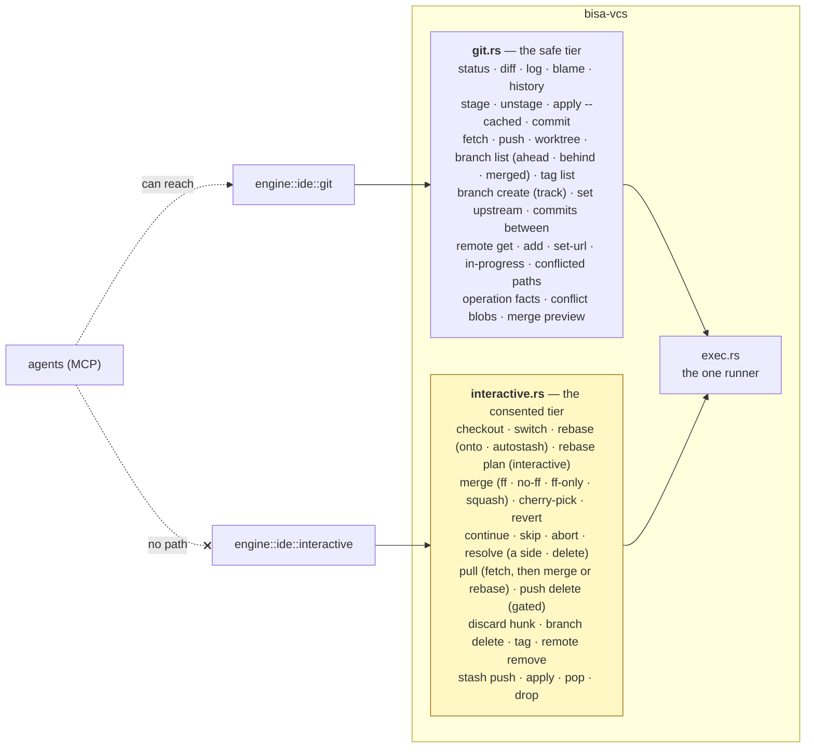

# 04 — Git

The version-control crate can create, stage, commit and push, and it has never been able to discard
a change — a test greps its own shipped source to keep it that way. An IDE that is a git client
needs checkout, rebase, cherry-pick, merge and per-hunk discard. Both are true at once, and the
invariant comes out stronger.

---

## Two tiers over one runner

`exec.rs` — argv only, never a shell; `GIT_TERMINAL_PROMPT=0` and a null stdin so no prompt can
hang; every invocation time-boxed with the child terminated on expiry; option-injection refused up front
— is shared unchanged, and the runner above it holds two more properties: **a read never takes the
index lock** (`GIT_OPTIONAL_LOCKS=0` on every child — a `status` or a `diff` used to refresh the
index and take `index.lock` to write it back, and a commit that asked in that instant failed with
*another git process seems to be running*) and **writes to one checkout queue** (`repo_lock.rs`:
every invocation that writes the index, the refs, the config or the tree holds its checkout's slot,
keyed by the canonical path, through `Git::write` / `write_input` / `write_capture`; the reads
never do). A lock some other process holds — an editor waiting on a message, an agent's own `git`
in a terminal — is `VcsError::RepositoryBusy`, answered as 409 `repository_busy`, one sentence to
try again. Above it, two modules:



| | `git.rs` | `interactive.rs` |
|---|---|---|
| who reaches it | the engine's work-item path, the safe IDE routes, the CLI, **agents** | the IDE's consented routes and the notes repository's consented pull (`folder_git.rs`) — a person's own request each; no CLI verb, no agent |
| what it may do | anything that cannot discard a change | anything else |
| what every call needs | a repository path | a repository path **and a `&HumanConsent`** |
| what every call does first | — | **writes a recovery ref** |

The consented tier's verbs take their options **typed**, one git invocation each: `merge(source,
MergeMode { Ff, NoFf, FfOnly, Squash }, message)`; `rebase(&RebaseRequest { upstream, onto, autostash })`;
`cherry_pick(&PickRequest { commits, record_origin, no_commit, mainline })` and `revert(&RevertRequest {
commits, no_commit, mainline })`, the commits oldest first; `rebase_plan(&RebasePlan)` — an
interactive rebase without a terminal (§The Branches view); `continue_op(what)` and `skip_op(what)` —
the way an operation that stopped is finished (§Conflicts, continued); `resolve(path, Resolution)` — a
side taken whole, or the path removed for a side that deleted it;
`push_delete(remote, branch)` — the one outward verb beside the pushes, and gated like them. A
refusal is decided **before** `capture`, so it leaves no recovery ref: a plan naming a commit
outside `upstream..HEAD`, a `continue` while a path is unmerged, a `skip` on a merge.

### `HumanConsent`

```rust
pub struct HumanConsent(());   // no public constructor, no Default, no Deserialize
```

Minted in one place — `bisa_node::ide::consent::from_request` — from an authenticated request.
The engine takes it by reference and cannot make one. The MCP intake has no field for one. Three
build-failing tests hold that shape; they are listed in [02](02-component-model.md#the-one-type-an-agent-cannot-hold).

### Recovery refs — the invariant, strengthened

Before any interactive operation runs:

1. `git stash create` — plumbing. It writes a commit object holding the dirty index and working
   tree and returns its id. It does **not** touch the working tree and does **not** push onto the
   stash list. A clean tree yields nothing, and the operation still records `HEAD`.
2. `git update-ref refs/bisa/safety/<unix-seconds>-<op> <sha>`.
3. Only then, the operation.

```rust
pub struct Recovery { pub ref_name: String, pub commit: CommitId, pub was_clean: bool }
```

Every interactive function returns a `Recovery`, and the IDE offers *Restore what was here* on every
destructive action because there is always a ref to restore from. The crate's invariant was *this
crate cannot revert a file*. It becomes:

> **Nothing in this tree can make a change unrecoverable.**

That covers operations the old invariant could only forbid. Recovery refs appear in a **Safety**
fold of the Branches view with the operation, the time and *Restore*. They are pruned only by a
`just prune-recovery-refs <repo> [older_than=30] [yes=--yes]` a human runs (without `yes` it only lists) — never automatically,
never by a test, and never by the platform unprompted.

A recovery ref is one of three **kinds**, read from its suffix (`RecoveryKind`): a *commit* (no
suffix — HEAD, or a deleted branch's or tag's tip; restoring is a checkout), a *tree* (`.wip` — the
stash-shaped commit `stash create` made; restoring checks out its base and applies it), or a
*stash* (`.stash` — a stash entry that was dropped or popped; restoring puts it back on the stash
list with `git stash store` and touches nothing in the tree). A tip saved beside a dirty tree
carries `_pin` and is bumped with the main name, so two deletes in one second keep both anchors.

### A review's snapshot is not a recovery ref

A conversation's turn is compared against the checkout it changed by a **snapshot**
(`bisa_vcs::snapshot::snapshot_tree`), not by the safe or the consented tier's own verbs — it is
staged through a **private `GIT_INDEX_FILE`** the caller owns (the person's own index is read once,
to seed the stat cache, and never written), `add -A` into it, then `write-tree`. The tree object
lands in the repository's object store **unnamed**: no ref, no commit, nothing in the working tree
moves, and the object is read within the turn that made it — git collects it in its own time, the
way any unreferenced object is. It is not one of this crate's discarding verbs either way — it reads
the checkout and writes an object, it does not revert one — so the no-discard invariant holds exactly
as it does everywhere else in this crate ([20 — Reviewing agent changes](20-reviewing-agent-changes.md#attribution)).

### Stash

Switching between units of work needs no stash — a workstream is its own worktree
([07](07-workstreams.md)) — but parking work inside one checkout does: pulling with local edits in
the way, trying something on a clean tree, carrying half a change to a fresh branch. So the Git tab
has a **Stashes** view — the one place stashing happens, making an entry included — and every verb
is the consented tier's, recovery first:

| Verb | What it does | What is saved first |
|---|---|---|
| `stash_push` | `git stash push [-u] [--keep-index] [-m <msg>] [-- <paths>]` — the whole tree or named paths; untracked files only when asked, ignored files never | the tree, as for every verb — the recovery ref and the stash hold the same content, and the invariant is not bent for one verb |
| `stash_apply` | `git stash apply --index stash@{n}`, the entry kept | the tree |
| `stash_pop` | apply, then `git stash drop` — **only when the apply went cleanly**; a conflict keeps the entry, as git does | the tree, **and the entry as a `.stash` recovery** |
| `stash_drop` | `git stash drop stash@{n}` | the entry as a `.stash` recovery |

**Nothing is acted on by index alone.** `git stash pop/drop` want `stash@{n}`, and `n` shifts under
every push and drop — and `refs/stash` is the **repository's**, shared by every worktree of a
project, so a push in one workstream shifts what another sees. A verb names the entry by **index and
commit together** (`StashTarget`), reads the list before it captures, and refuses
`VcsError::StashMoved { index, commit, now }` (409 `stash_moved`, `detail.now` the sha at that index
today) when they disagree; `pop` verifies again right before its drop. The desktop reloads the list
and says so.

**Refused before anything is written**, so a refusal leaves no recovery ref behind: a tree with
nothing git would save under the options asked — clean, only untracked files without *include
untracked*, paths with no change, no commit yet, a selection every path of which is gone since the
list was read — is `NothingToStash` (409 `nothing_to_stash`); a selected path git no longer knows
is left out of the push rather than refusing it (`Git::still_known`, below); an
operation half done is `InProgress`; unmerged paths are `Dirty` naming them (git's own *needs merge*
would otherwise read as a conflict); a stash carrying untracked files whose paths already exist in
the tree is `Dirty` naming them, because git stops at the first collision and names none.

**Apply retries without `--index` only on git's word.** git refuses `--index` for two reasons: *conflicts
in index. Try without --index* is decided before anything is written, so the plain apply is the same
act with less asked; a merge conflict has already changed the tree, and a second apply on top of it
would only say *cannot apply a stash in the middle of a merge*. One `apply_stash` — shared with
`restore` — retries on the first and classifies the second as it is: `Conflict { paths, in_progress:
None }` (409 `conflict`). A stash conflict leaves **no operation to abort**, so the way out is the
Conflicted list — settle each path, or *Discard changes…*, which on an unmerged path restores it from
HEAD, the one side git has whole — and *Restore* in Safety does the same before it puts the tree back.

**The reads are the safe tier's, and spell no `stash` command.** `Git::stash_list` is the reflog walk
`git stash list` itself runs — `git log -g … refs/stash --`, `%gs` for the subject (`WIP on <branch>: …`
or `On <branch>: <message>`, parsed once), three parents for *untracked*, the index by position — and
`Git::stash_diff` is `git diff <sha>^1 <sha>` plus the untracked third parent as additions. The grep
that keeps the safe tier honest bans the *command*; a ref name is an argument, and reading
`refs/stash` reverts nothing.

In the desktop, stashing is the **Stashes** view's alone — the Git tab's fourth, beside Changes ·
Branches · History (`GIT_VIEWS`), a view of its own because a person reaches for parked work on
purpose and a fold nobody sees is a fold nobody uses (`StashesPanel.tsx`). The Changes view has no
stash button and no *Stash this file…* in a row's menu: one home, so the verb is never looked for in
two places. **Stash changes…** in the view's header at rest (the one reason it is off — `canStash` —
is a `ReasonLine` under the header, never only a tooltip) opens the dialog (`StashDialog.tsx`): a
message, *Include untracked*, *Keep the index*, and **Only these files** — the checkout's tracked
changes as ticks (`stashablePaths`: tracked, unconflicted, each path once), read from the listing
when the dialog opens — which is the path-scoped push, the whole tree otherwise. Then one row per entry:
`stash` · the message or *WIP on <branch>* · *on <branch>* (where it was made) · *untracked* ·
when — a chevron opens the patch under the row (with the `SafetyNote`), and the row reveals its
verbs on hover: *Apply* · *Pop* (asked first) and a `⋮` with the three, *Drop* (asked first, red)
among them; an empty list is an `EmptyState` whose action is *Stash changes…*. The view reads the checkout's session
(`gitPanelStore`: what is busy, which patch is shown, the question pending), so a tab switch loses
nothing. The words are `stashModel.mjs`'s; a refusal is read from the node's `code`, never the
status. The Omnibox's *Stash* opens the Stashes view with its dialog. No CLI verb: the consented
tier has none, and `feature-status` says so.

### Force pushes

Never `--force`. `--force-with-lease` only; only on a **workstream branch** (never a project's default
branch); behind `HumanConsent` **and** the `Publish` gate; with a confirmation that names the remote
ref it will overwrite. It exists because a rebased or amended workstream branch cannot otherwise be
pushed. Two doors, one dialog (`PushWithLeaseDialog`, the words `consentWords("push_lease")`'s):
*Force push with lease…* last in the Changes view's sync-bar `⋮` (`syncModel.forcePushRule` says
when it is open and, off, why — no upstream, half-done, detached, the default branch) and on the
current branch's `⋮` in the Branches view. The test-source guard bans the substring `--force` in
every test file, so no test can perform one; the production code's `--force-with-lease` lives in
`interactive.rs` and is exercised against a local bare repository under the same guard that covers
every other push.

### Enforcement, extended

`no_content_discarding_git_call_exists_in_this_crate` is scoped to `git.rs`; the consented tier has its own:

| Test | Asserts |
|---|---|
| `every_interactive_fn_takes_consent` | no `pub fn` in `interactive.rs` lacks a `&HumanConsent` parameter |
| `every_interactive_fn_records_recovery_before_it_runs_anything` | each one calls `capture` before its runner call (by source order inside the function body) |
| `interactive_never_plain_force` | the literal `"--force"` appears in `interactive.rs` only as `"--force-with-lease"` |

---

## The safe tier, extended for the IDE

The safe tier's IDE surface, all read-only or index-only:

| Function | Backs |
|---|---|
| `log(range, --topo-order --date-order --parents --decorate=full)` parsed to `GraphCommit` | the commit graph |
| `blame(path, range)` from `--porcelain` | blame gutter |
| `file_history(path)` (`--follow`) | history for a file — empty before the first commit, as `blame` is, never git's refusal; a line range's history (`git log -L`) is not built ([feature status](../../feature-status.md)) |
| `apply_cached(patch)` | stage a hunk or a line selection; the mirror `apply --cached --reverse` unstages one |
| `branch_list(merged_into)`, `branch_exists`, `remote_list`, `remote_branch_list`, `tag_list`, `ahead_behind(path, base)` | the branch switcher, the Branches view's rows with their standing — `ahead` / `behind` the upstream from one `%(upstream:track)` field on the one `for-each-ref`, `merged` from one `--merged <default>` read — the Remotes section and its remote branches (`GET /workstreams/{wid}/git/remote-branches`), workstream status |
| `branch_create(name, start, track)`, `branch_set_upstream(branch, upstream)`, `commits_between(from, to, limit)` | a remote branch checked out as a tracking branch (`POST …/git/branches {track, switch}` — the ref and its config are safe, the switch consented); *Set upstream…* (`PUT …/git/branches/{name}/upstream`); the commits a cherry-pick or an interactive rebase can take (`GET …/git/branches/{name}/commits?against=`) |
| `identity(path)`, `global_identity()`, `config_view(path)`, `config_set(scope, path, key, value)`, `config_unset(scope, path, key)` | the Repository view's *Git config*; `GET /workstreams/{wid}/git/identity`, `GET`/`PUT /workstreams/{wid}/git/config`, `GET`/`PUT /git/config`, `GET /git/committer`; `project identity`, `project git-config` |
| `fetch(remote)`, `upstream_of`, `can_fast_forward(target)`, `in_progress`, `conflicted_paths` | the sync bar; `POST /workstreams/{wid}/git/fetch`; what a status says is half-done |
| `operation_facts` (`operation.rs`: `Markers::read` + `facts_of`), `conflict_blobs(path)`, `merge_preview(ours, theirs)` | the Resolve card's names and step, the conflict document's three sides, the look-ahead before a merge or rebase (§Conflicts, continued); `GET …/git/operation`, `GET …/git/conflict`, `GET …/git/merge-preview` |
| `remote_set_url`, `ensure_remote` (add or re-point) | the Remotes section and About › Checkout's card; `POST /workstreams/{wid}/git/remotes` adds, `PUT /workstreams/{wid}/git/remotes/{name}` re-points — `origin` also updates the project record |
| `version`, `include_set`, `include_remove`, `includes`, `config_file_write`, `config_file_read`, `config_origin`, `account_get`, `kind_get`, `default_account(kind)` | the profiles by organization (below); `GET /git/profiles`, `PUT`/`DELETE /git/profiles/{slug}`; the `profile` fact of `identity`; the account a checkout's pull requests are opened as, the kind a self-hosted remote is, the kind's global default |
| `ls_remote(remote)` | the Connection card's *Check* — the one network read that proves access; `POST /workstreams/{wid}/git/connection/check` |
| `stash_list`, `stash_diff(commit)` | the Stashes view (§Stash) — the reflog of `refs/stash` read as the ref it is, and one entry's patch; `GET /workstreams/{wid}/git/stashes`, `GET …/git/stashes/{sha}/diff` |

`pull` is not a verb of its own: it is a fetch followed by a merge or a rebase, and the second half
moves the tree, so it is consented and recorded like any other — `interactive::pull(remote, mode)`.
`PullMode` is `ff_only` · `rebase` · `merge`; `ff_only` refuses with
`VcsError::NotFastForward { ahead, behind }` when the branch has commits of its own, so the caller
can offer the other two; an operation already half-done is `VcsError::InProgress(op)`. `revert`
joins the consented tier for the same reason `reset` never will: it undoes with a new commit.

### The sync bar

The Changes view opens with where the branch stands against its upstream — `origin/main · ↑2 ↓1`,
*up to date*, *no upstream yet*, *no remote* — then **Push** (`POST /workstreams/{wid}/push`, the
one verb that publishes, primary, through the Publish gate, with the same banner the workstream
panel shows — `PublishOutcomeBanner`) and a `⋮` whose items are the model's
(`syncModel.syncMenu(state, defaultMode, defaultBranch)`): **Refresh** first (a read), then under a rule the
three pulls — the project's `git.pull` mode first by its label (default *Pull*, `ff_only`), then
*Pull with rebase* and *Pull and merge* — each with its meaning as the hint and each confirmed
before it runs, then under a rule **Fetch** (safe), then under a rule of its own **Force push with
lease…** last, in the danger tone (§Force pushes: the lease dialog, the same route as the Branches
view's, never the default branch); the bar binds each item by its id, never
its place; an item the state forbids is off with the reason in its label. A
pull that cannot fast-forward says so with the counts and offers rebase or merge; one that stops on
conflicts lists the files (each opens the conflict document below) and points at the Resolve card;
a checkout with an operation half-done says *a merge is in progress — the Resolve card above finishes
or aborts it* and holds no verb of its own (one door: §Conflicts, continued), and one with no remote
**Set origin**. The facts are `syncModel.mjs`, tested — the pull's banner too (`pullBannerWords`:
one sentence per outcome — pulled from the upstream with the two commits named, already up to
date, not a fast-forward with the counts and the two ways on, stopped on conflicts with the files
counted and the first one named; `syncModel.test.mjs`, `scenarios/gitPanel.test.mjs`). The Publish gate's banner
carries the gate's id when the 202 named one and `null` otherwise — never a blank string that a
door would try to open (`PublishOutcomeBanner`, `gitOps.ts`). The bar's working dot is
for its own verbs; a commit or a **Suggest** (the General Agent drafts a message read-only) shows its
progress dot **beside those buttons** in the commit box, not up here.

### Remotes

A remote has two homes. **The Branches view's Remotes section** (`RemotesSection.tsx` over
`remoteActionsModel.mjs`, pure and tested) is the working one, in the view's own grammar: a header
with the **count**, **Fetch all** at rest (every remote one after the other, *Fetching…* while it
runs, one toast saying what came in — `fetchWords`, `fetchedWords`) and **Add remote…** (one
dialog: name and URL, the URL checked by `isRemoteUrl`; `POST /workstreams/{wid}/git/remotes`).
Beside them the **layout switch** — a remote's branches as a *tree* or a *list*, the `remotes`
choice under `bisa.ide.views` (`REMOTE_LAYOUTS`, `rightPanelModel.mjs`), remembered once for
every checkout — and, past six branches in all, a *Filter remote branches* field (`branchFilter`)
over every remote. Then **one name row per remote**: the chevron, the name in mono, a quiet count
chip (*12 branches*), **Fetch** as its hover verb (spinning on the remote being fetched, not on
every one) and a `⋮` (`remoteActions`): *Fetch* · *Edit the URL…* · *Copy the URL* · *Open on
<host>* (the `https://host/owner/name` page `hostPage` derives, for an https, ssh or scp URL,
through `openExternal`) · under a rule, **Delete…**. Where the remote lives, how it is reached and
its URL are **the name's tooltip** (`remoteTitle`: `host · owner/name · SSH · the URL`), never the
row's width — the row and its path used to fight for one line — and About › Checkout's card stays
the setup home that shows them. Under the row, folded per remote (`useCollapsed("remote.<wid>.<name>")`,
open by default for `origin`), its **remote branches** (`GET …/git/remote-branches`,
`groupRemoteBranches` — each naming the local branch that tracks it, `trackedBy`) as one kit tree
(`TreeList`, [03](03-files-and-editing.md#the-tree)) drawn by `remoteTreeModel.mjs`: in the
**tree** layout the folders the slashes make, in the explorer's shape and order through the kit's
`pathTree` (`feature/x` under `feature`, the folder's count beside it), each folder folding under
`remote.<wid>.<remote>.<path>` in the collapsed store (`useCollapsedUnder`); in the **list** every
branch with its whole name, newest first. A filter keeps the branches it matches and opens the
folders holding one. **A branch row never carries the remote's prefix** — `origin/` is the remote's
row's to say, once: it is the basename in mono (the whole name in the list), its **standing** as
chips (*default* in the accent for the project's default branch, *tracked by main* naming the local
branch that follows it), when, and on hover **Check out** — a local branch named as the remote's
when that name is free (`localNameFor`), created with the remote branch as its upstream and
switched to, consented — with a `⋮` (`branchActionsModel.remoteBranchActions`, the acts the
Branches view runs — §The Branches view): *Check out…* · *Merge into <current>…* · *Rebase
<current> onto it…* · *Cherry-pick from it…* · *Fetch this branch* · *Open a workstream…* (the New
workstream dialog's `remote` preset, `fire(NEW_WORKSTREAM, { preset: { kind: "remote", … } })`) ·
under a rule **Delete on <remote>…** (red; `push_delete`, through the Publish gate) · *Copy the
name*, *Copy `<remote>/<name>`* — the menu names the whole ref, since a menu is read on demand. The
commit a row points at is its tooltip (`branchTitle`: the whole name, the subject, the sha). Keys:
the arrows the tree's, Enter folds a folder, Space is *Check out* on a branch. An empty group says
*Nothing fetched yet — Fetch brings in what <remote> has*; a filtered one with nothing left, *No
branch matches*.

**Deleting a remote is consented and honest.** `interactive::remote_remove` writes its recovery
ref like every consented verb and pins nothing of the remote in it (`Pin::None`) — a
remote's URL is configuration, not history, and its remote-tracking branches come back with a
fetch — so the confirmation (`deleteRemoteWords`) says exactly that, *Nothing is pinned in Safety
for a remote*, and shows the URL with a copy button before the red **Delete**. Nothing in the
section promises a Safety restore it cannot give.

**About › Checkout's Remotes card** (`RemoteCard.tsx`) is the setup one — `origin` as `github.com ·
owner/repo`, with **Edit** (one field, *Save* re-points it in place) or **Add origin** when there
is none, the other remotes under it with the same edit and the same consented remove. Adding and
re-pointing are configuration, not history, so they are safe; when `origin` changes,
`Project.vcs.remote` follows (`engine::ide::git::set_remote`), so the code host detection and the
record never disagree.

A remote URL is read by `bisa-codehost::RemoteUrl::parse`, which is total: `https://`,
`ssh://`, `git@host:owner/name`, `host:owner/name`, `file://` and a bare path each earn a
`RemoteProtocol` — `https` · `ssh` · `scp` · `local` · `other` — and the remote's row wears it as a chip,
because *how* a push reaches the host decides which key or which helper it uses. An **SSH alias**
(`git@github-acme:acme/web` — the multi-account idiom, a `Host github-acme` block in `~/.ssh/config`)
parses with `host = github-acme`; before detecting the code host the engine asks `ssh -G
github-acme` — offline — for the `hostname` it stands for, so a multi-account setup reads *GitHub*
and not *no code host*. Nothing of ours writes that file: *Copy a Host block…* in Settings › SSH
keys offers the text, and the person pastes it.

**Identity is safe-tier, and the one config write.** `set_local_identity` writes `user.name` and
`user.email` into the repository's local config — no tree, no ref, reversible, a person's edit
 — so it needs the bearer token and no `HumanConsent`. Every `git config` write in the crate is
`config_set` for a schema key, or `include_set` / `include_remove` for a profile's `includeIf`
entry in the global file; every `--global` sits in a `ReadScope::Global` or `ConfigScope::Global`
arm (I45; `tests/it/git.rs::global_config_is_written_only_by_config_set`), and the engine reaches
the global layer from three named functions and nowhere else
(`tests/it/projects.rs::only_the_three_named_writers_reach_the_global_layer`).
A worktree shares its repository's config, so the primary and every workstream of a project answer
alike, and every commit the platform makes there — a person's, an agent's settlement — carries it.
The engine asks `identity` before any commit it makes and refuses a repository with none by name
(`EngineError::IdentityUnset`), before staging.

#### How a repository gets one

`projects::create` — the one operation behind every
creation door — applies `identity::Committer::resolve` once the tree exists: git config named on the
request (`git_config`, schema keys only) is written to the repository's **local** layer key by key;
else a repository whose own identity resolves is kept; else the workspace's **`git.committer`**
(`identity::policy_for`, read once at creation — Settings › Git & code hosts › Identity) says what a
global identity means: `inherit`, the default — the repository is left alone and never asked;
`pin` — the global pair is written into the repository's own config (`Committer::Pin`, a local
write, so the repository keeps its author whatever the global one becomes); `ask` — the person is
asked all the same, the frame carrying the pair; else nothing resolves and the person is **asked**
and nothing is written (I47). The ask is one
frame, `committer_needed` `{ project, slug, workstream, reason, origin, global }`, raised once per
project while the question is open — on creation, and again from `ensure_identity` on every refused
commit — and the engine keeps the open questions on a `CommitterDesk` that `GET /git/committer` lists.
The answer is a write to the local layer: `PUT /workstreams/{wid}/git/config` funnels through
`identity::committer_set` when an identity now **resolves** — its own pair, or one key of its own
over the global layer, the reading `Committer::resolve` makes — which clears the desk, raises
`committer_set`, and **commits a settlement the missing identity had refused** with the message it
was meant to carry. The other two doors answer the desk too: the global config's write raises
`git_setup_changed { identity }` and a profile's write or removal `{ profiles }`, and each is
followed by `identity::settle_resolved` — the desk read against the repositories, `committer_set`
for every project that resolves now — so a repository given an author without anyone touching it is
never left asking. **A connected account is offered, never assumed.** `GET …/git/identity` carries `suggested`
for a repository nobody commits in whose remote resolves to a code host account (the connection's
own chain, `connection::resolved_account`, without the transport probes): the host's user record
(`Account { name, email, id }`, read live through the account's client, bounded to five seconds)
through `identity::committer_suggestion` — the person's name or login, their public email or the
host's no-reply address (`{id}+{login}@users.noreply.github.com`, `{id}-{login}@users.noreply.gitlab.com`;
Bitbucket's record has no email and suggests nothing). About › Checkout's Git config card draws it
as *Commit as …*; the click writes the pair through the same `PUT`, which raises `committer_set`.
The git config is its own draft (`useGitConfigDraft`): counted, refused — git needs both keys of
the pair, `gitConfigModel.identityPairProblem` — and written on its own hand, composed into the
project draft so one Save still lands everything — a read the node refuses (`apiModel.isRefusal`:
any 4xx) is an empty draft, and any other failure is raised, never swallowed
into an empty form (`apiModel.test.mjs`); a project read still out never hides an identity
the person typed, and the toolbar says *Still reading the project…* rather than *All saved* until
every read landed. The desktop re-reads who commits on one rule, `gitIdentityModel.identityMoved`
(`committer_set` · `committer_needed` · `git_setup_changed`) — and the header again when the window
regains focus, since a pair set in a terminal raises no frame — in the workbench header and About ›
Checkout alike. The **global** layer is `GET`/`PUT /git/config`, from Settings › Git & code
hosts › Identity and nowhere else (I45) — the place the platform writes a person's global git config, at
their request; the other two global writes are the profiles' includes and the default account,
below. Every key anywhere is one of the schema's (`bisa-vcs::config_schema`), served to the
desktop beside the values so its forms are drawn, not mirrored. The engine reads and commits through
one `Git` handle (`EngineConfig::git`), so a test can hand in one that sees no global config.

### Profiles by organization

A person with a personal account and an organization's — or two organizations — is two authors,
two keys and two accounts, and the wrong one on a push is the failure this section exists to
prevent. The answer is git's own: a **profile** is one gitconfig file the platform owns,
`identity/git/profiles/<slug>.gitconfig`, holding `bisa.label`, `user.name`, `user.email` and,
when set, `core.sshCommand` (`ssh -i <key> -o IdentitiesOnly=yes` — *this* key, whatever ssh-agent
offers), `credential.username` and `codehost.account`; the global config includes it with
`includeIf "hasconfig:remote.*.url:<glob>"` for every spelling of the owner's remotes —
`https://host/owner/**`, `ssh://git@host/owner/**`, `git@host:owner/**`, and two more per SSH
alias — so a checkout under `github.com/acme` commits as the profile's author, pushes with its key
and opens pull requests as its account, and every other checkout keeps the global config.
`hasconfig` needs git ≥ 2.36; `git --version` is read once and an older git refuses with the
reason. The includes are written **last** and re-appended after any other global write, because
git's last value wins and a profile's author must outrank the global pair. `git config
--show-origin` shows exactly what the platform shows, and `matches(url)` in the core is the same
prefix test git's `wildmatch` makes on the raw URL, so the two cannot disagree. Removing a profile
removes its includes and moves its file aside; nothing in any repository changes. `~/.ssh/config`
is read, never written — a key is bound to an organization through the profile file, not through an
alias the platform would have to write for you.

The core validates a `ProfileSpec` (`bisa-core::git_profile`), the vcs crate writes the file
and the includes, the engine's `gitprofiles.rs` is the one door, and Settings › Git & code hosts ›
Identity draws the list and one dialog (`GitProfilesPanel.tsx` over `gitProfilesModel.mjs`). A
profile's `owner` is the remote's namespace — `acme`, or a GitLab group path `acme/platform` —
segments of `[A-Za-z0-9][A-Za-z0-9._-]*` joined by `/`, lowercased, since a remote's owner is
every path segment but the last ([08](08-code-host.md)).

**Which account a checkout uses** is git config too: `codehost.account = <login>`, a schema key at
both layers — in a profile (per owner) or in a repository's local layer (a **pin**, set from the
Connection card or the New Project dialog's code-host line); the **default** account is per kind,
`codehost.github.account` · `codehost.gitlab.account` · `codehost.bitbucket.account`, global only,
set from the kind's Settings panel, because one login cannot serve three hosts. A remote no public
host names is told its kind by `codehost.kind` (`github` · `gitlab`, either layer — a self-hosted
GitLab or a GitHub Enterprise instance). The engine reads the account effectively in the checkout
and binds the code host to it before any request (`CodeHost::for_account`); none named → the
kind's default, then the environment, then the one account stored, then **the kind's CLI signed in
on this machine**, then git's helper for the host; two stored and none named → a refusal that
names both.

### The repository under About › Settings

The Git tab is what a person does to the tree — Changes · Branches · History · Stashes — and
nothing else: how the repository is set up lives under **About**, in two short views
([02](02-component-model.md)) — **Checkout** (`CheckoutView.tsx`: this checkout's connection, its
facts, its remotes, its local git config) and **Settings** (`ProjectSettingsView.tsx`: what is saved
on the project — publishing, git, workstreams, workstream scripts, editor and terminal) — so a
person setting a repository up opens one of them and a person committing never scrolls past a
form. **Nothing on either view saves on change.** Every control edits one draft
(`projectSettingsDraftModel.mjs`, `useProjectSettingsDraft.ts`, session memory keyed by the
project) and a **toolbar sticky at the top** (`SettingsToolbar.tsx`) says how many changes wait,
offers *Discard*, and one **Save** that writes them all in one order — the policy on the project
record, the settings values in one call, each inherited key unset, the local git config, the
scripts approved on this machine when a text changed, the account pin last — stopping at the first
refusal with what landed kept and the rest still drafted. A synced script waiting for this
machine's word shows *Approve on this machine* on the same toolbar. Every door names its view:
the header's *no committer* and *cautions* chips, the sync bar's *Set origin* and the commit box's
*Set who commits here* open **Checkout** (`openPanelView("about", "checkout")`); a refused push's
*Change the policy* opens **Settings** — the threaded prop is `onOpenAbout(view)`.

The view opens with the **Connection** card (`ConnectionCard.tsx` over
`connectionModel.mjs`, `GET /workstreams/{wid}/git/connection`): what this checkout will use when it
talks to its remote — the remote as `host · owner/name` with the raw URL and *Copy*, its protocol
chip, the code host; the **profile** matched (or *none — global config applies*, a fact, not a
caution); **who commits** with where that comes from (*local* · *profile Acme* · *global*); the
**transport** — over SSH the key `ssh -G` would offer (the profile's first), whether ssh-agent holds
it, and a note when `GIT_SSH_COMMAND` in the node's environment overrides it all; over HTTPS git's
helpers and the username they hold, never the secret — and the **account** the code host will be
asked as with where it comes from (`local` pin · `profile` · the kind's `global` default · `env` ·
`only_stored` · **`cli`**, the kind's CLI signed in on this machine · **`git_helper`**, the
username git's helper holds for the host), with a `Select` of the stored logins and the one the
CLI or git answered with, for a local pin. Then the **cautions**, each a sentence with a stable id
and a door to the settings tab that fixes it — the kind's own panel: `identity_differs_from_profile`,
`key_not_loaded`, `no_account`, `account_outside_owner`, `credential_username_differs`,
`key_shared_across_accounts`. `no_account` fires only when none of those sources answers: a
machine whose `gh` is signed in, or whose git already pushes over HTTPS as somebody, has an
account and is told so rather than sent to Settings. *Check the connection* runs three read-only
probes — the code host's word on the account and its access to this repository (through the CLI
when it holds the account, else the API), one
`ssh -T` handshake in batch mode as the key the push would use, `git ls-remote --heads origin` — and
nothing on either side changes. The same cautions put a warn dot beside the Git tab's views and a
chip in the Workbench header beside *no committer*, so a wrong author or an unloaded key is seen
before a push, not after. `bisa git connection <workstream> [--check]` prints the same facts
and the same sentences.

Below it: `GitFacts` (branch, upstream, ahead/behind, remote, default
branch), the **Remotes** card (§Remotes), *Git config* (`GitConfigCard`: who commits here and where
that comes from — `local` · `global` · `none`, and *inherited from your Acme profile* when the pair
comes from a profile file (the identity view's `profile` fact; no new `IdentitySource` variant —
`global` stays *the global layer*) — one click, *Pin the global pair here*, on an inherited identity
(`gitIdentityModel.pinOffer`: the same local write as *Commit as*, so the repository keeps its
author) — then the repository's local layer as `GitConfigForm`: every
schema key but `codehost.account`, what this repository sets, what it inherits from the global
layer, *Inherit* to clear a value) — those four are the **Checkout** view's, and step aside on a
plain folder for the one card every plain-folder surface draws — `InitRepositoryCard` over
`initRepositoryModel.mjs` (`PLAIN_FOLDER`, the sentence's one home; `initOffer`, shown on a
project's own root that is on disk and not a repository, never on a copy; `initConsequence`, the
confirm an adopted folder gets first, naming whose folder is written): **Initialise a repository**
→ `POST /projects/{pid}/git/init` (`projects::init_repository`: `init_git`, the who-commits policy
as at creation, an empty root commit when HEAD is unborn and an identity resolves; `ProjectChanged`
and the primary's `WorkstreamChanged`, so the rail's mark, the Git panel and this view turn
together). The Git panel draws the same card in place of its views; a folder not on disk gets the
facts alone — then, on the **Settings** view, what is saved on the **project**
and so is the same on every checkout: the *Publishing* policy first (`PublishingCard`, drafted and
written through `PATCH /projects/{pid}` by the toolbar's Save — the one control for it, and the one
place it is shown; a refused push or pull request's banner links here),
the project's **Git** settings (`ProjectSettingsCard` over the four project-scope `git.*` keys — the
default branch, the merge strategy, the pull mode, deleting the branch after a merge — the project's
own layer, *Inherit* putting the workspace's back; Settings never holds a project's value,
[13](13-settings.md#visible-in-the-ui)), its **Workstreams** settings, its **Workstream scripts**
(`WorkstreamScriptsCard` over `workstreamScripts.mjs`: the pre-create, post-create and clean scripts
and their timeout, edited into the draft — the toolbar's Save writes the `workstreams.script.*`
settings and, when a text changed, approves them on this machine in the same act; *Approve on this
machine* on the toolbar alone accepts a text that arrived by sync; the trust line per script is the
node's answer from `GET /projects/{pid}/workstream-scripts` —
[07](07-workstreams.md#workstream-scripts)) and its **Editor & terminal** settings.
The same form is the project dialog's *Git config* (`projectForm.gitConfigSection(policy,
globalResolved)` — two states: `note`, nothing asked, one footnote *Commits as Ada <…> —
your global git config* (*pinned into the repository* under `pin`, `committerNote`) with *Change…*
for local values; `open`, the identity fields from the start — the workspace's `git.committer` is
`ask`, or no identity resolves globally, so the repository is born with an author; no hidden state,
since every way in makes a repository; the dialog reads the policy through `useResolvedSettings`, and
whatever is typed travels as the body's `git_config` in both shown states —
`creationGitConfig`), the
ask dialog (`ProjectGitDialog`, mounted once in the shell — under its own `OverlayBoundary`, so a
throw in it closes the dialog and never the window — over `committerPromptModel.mjs`, seeded from
`GET /git/committer` at mount and again whenever the bus comes back (a stream the node closed for
lagging re-sends nothing), and moved by `committer_needed` / `committer_set`; a seeded row carries
the same `origin` and global pair the frame does; the form reads the config view's schema through
the same guard every git-config form uses, so a view with none draws an empty form; identity first,
*More git config…*, *Also save as my global git config*; the engine's desk is read from the
repositories at every start — `identity::rearm`, reason `unresolved` — so a relaunch asks again for
a repository nobody commits in), and Settings › Git & code hosts › Identity's
`GlobalGitPanel` (the global layer alone — what is set, and a way to set it; the account keys
hidden here and drawn by each kind's panel as its default account).

### The Branches view

The Branches view (`BranchesPanel.tsx`) is four sections, all open with their counts — Branches ·
Tags · Remotes (§Remotes) · Safety — and it holds **every act on a branch, with its options, in one
dialog each**. A branch row: the current dot, the name, *current*, a **merged** chip when the
project's default branch has every commit of it (never on the default itself), its standing against
its upstream — `↑2 ↓1` (`standingWords`; in step, the upstream's name), the upstream in the tooltip
— and when. Above the list, once it is longer than six, a **filter** (`branchFilter`: the name or
the upstream, case-blind); the rows are `branchOrder`'s — the current first, the default second,
the rest as git lists them. **Switch** is the row's one hover verb; its `⋮` is
`branchActions(branch, ctx)`: *Switch to it* · *Merge into <current>…* · *Rebase <current> onto
it…* · *Cherry-pick from it…* · on the current branch *Rebase interactively…* and, off the
default, *Force push with lease…* · *Set upstream…* · *Open a workstream…* · under a rule *Rename…* and
*Delete…* (never the default). `ctx` carries the current branch, the default, the session's `busy`
and the status's `in_progress` — every consented act is off with one sentence while an operation
is half-done (`halfDoneReason`: *A merge is half-done — settle or abort it in the card above*),
the same sentence the graph's actions use.

Each act with options has one dialog, the verb as its button, the `SafetyNote` said once, no second
confirmation: **MergeDialog** (`mergeModel.mjs`: the mode as radios with a sentence each —
*Fast-forward when possible* · *Always a merge commit* · *Fast-forward only* · *Squash into one
staged change* — the default from the project's `git.merge_strategy` (`mergeDefault`), the message
for a merge commit); **RebaseDialog** (*Stash local changes first and bring them back* — autostash
— on when the tree is dirty; *Only the commits since…* for `--onto`); **CherryPickDialog** (the
commits the branch has and the current lacks — `GET …/git/branches/{name}/commits?against=` —
newest first as ticks, sent oldest first (`pickOrder`); *Record where each came from* (`-x`); *Stop
before committing*); **NewBranchDialog** (the name checked as typed by `refNameProblem`; **start
at** — HEAD, or any branch, remote branch, tag or sha through one field with a picker; *Switch to
it*); **DeleteBranchDialog** (*Also delete it on <remote>* when the branch follows one — the
Publish-gated act, run after the local delete lands); **UpstreamDialog** (a remote branch or none —
config, nothing moves); `PromptDialog` for a rename; `TagDialog` for *Tag HEAD…*;
`PushWithLeaseDialog`. A switch, a remote checkout, a tag's delete, a delete on the remote and a
restore are one plain `ConfirmDialog` over `consentWords`. Every act runs through `gitOps.ts`
against the checkout's session (§What survives a switch): one `busy` for the whole Git tab, the
rows landed, `doneWords` toasted, a conflict written as the session's `operation`, the gate's 202
written as `publish` exactly as a push's; the panel keeps **no busy and no conflict state of its
own** — a dialog's open question is the one local thing. A **remote branch** row is the same
grammar (§Remotes), its acts handed up to the panel by id.

**Interactive rebase, without a terminal.** *Rebase interactively…* on the current branch opens
**RebaseEditorDialog** over `rebaseEditorModel.mjs`: the target at the top (the upstream or the
default branch by default; any branch or remote branch), the commits since it as rows newest first
— each with its action as a segment (`REBASE_ACTION_WORDS`: *pick · reword · squash · fixup ·
drop*, a sentence each), ↑ ↓ to reorder (`moveStep`), the message field opening for a reword or a
squash (a squash composes its message from the kept commit's and its own, editable — `setAction`,
`setMessage`), the summary line (`planSummary`: *5 commits → 3: one reworded, two squashed, one
dropped*), and the consenting **Rebase** off with the first problem (`planProblem`, the same rules
the crate checks, said in sentences) or while the plan is the identity (`planIsIdentity`). What is
sent is `planOf(rows, upstream, onto)` — oldest first, git's order — to `POST …/git/rebase/plan`.
The crate runs `git rebase -i` with the todo it would have opened in an editor written by us
instead ([vcs](../crates/vcs.md)): `GIT_SEQUENCE_EDITOR` is a fixed command that copies the todo
from an environment variable into the file git names — the text never passes through a shell
string — and `GIT_EDITOR=true`; a *reword* is `pick` then `exec git commit --amend -F <file>`, a
*squash* is `fixup` then the same exec with the composed message, the message files under
`<git-dir>/bisa/rebase/`, so a stop on the way is a rebase like any other and *Continue* finds
them. A plan is validated before anything is written — the commits exactly those of
`upstream..HEAD`, the first kept step neither squash nor fixup, at least one kept, at most 200 — and
refused in a sentence. What is **not** here, and why: `reset` and a *bare* `--amend` (the crate's
invariant bans both; the one amend there is pins the commit first — §Amend — the plan rewords or
squashes, and Safety restores), rebase's *edit* stop (a tty flow).

**Deleting a branch on the remote** is `push_delete`: consented, never the project's default
branch, the remote branch's tip pinned in Safety first so it can be recreated, and **through the
Publish gate like a push** — `auto` proceeds, `gated` opens the gate in the Inbox and the route
answers 202 with nothing having left, `manual` refuses (`DELETE …/git/remote-branches/{remote}/{branch}`).
The desktop shows the gate's banner as it does a push's. The Safety row it writes reads *push
delete on <branch>*.

### Conflicts, continued

An operation that stops on conflicts is a **state the Git tab drives to its end**, in the person's
words, from one place — and the person may know nothing of git. Three pieces make it so.

**The facts come from git's directory, not from the request.** `Git::operation_facts`
(`bisa-vcs/src/operation.rs`) reads what git left under its own directory — `MERGE_HEAD` and the
first line of `MERGE_MSG` (*Merge branch 'x'*, *Merge remote-tracking branch 'origin/main'*),
`rebase-merge/{head-name, onto, msgnum, end}` or the `rebase-apply` files, `REBASE_HEAD`,
`CHERRY_PICK_HEAD`, `REVERT_HEAD`, the sequencer's `done` and `todo` — into `OperationFacts { kind,
branch, ours: SideRef, theirs: SideRef, step }`, each side a `{role: branch | upstream | commit, name,
commit, subject}` with the subject and the branch a sha is the tip of filled in by git (`Markers`
is the read, `facts_of` the pure reading, tested without a repository). The sides are **git's**
`ours` and `theirs`; the engine answers them as they are (`GET …/git/operation`, null when nothing
is half-done), so an operation started in a terminal is named as well as one started here. The
unmerged record's two letters become `ConflictKind` — `both_modified` · `both_added` · `both_deleted`
· `deleted_by_us` · `deleted_by_them` · `added_by_us` · `added_by_them` — on every file row
(`GitFileRow.conflict`), so a path that is a choice rather than a merge is known before it is
opened. `GET …/git/conflict?path=` answers the path whole: its kind, its three sides from the
index's stages (`conflict_blobs`, bytes, so a binary side is honest — `binary` says so), and the
file as git wrote it with its markers (`text`) with the hash the save that follows carries.

**The words are the desktop's, and the swap is made once.** `conflictSidesModel.mjs` turns the
facts into *mine* and *theirs*: a merge reads *main — mine, your branch* against *feature/login —
theirs, incoming* (a pull: *origin/main — the remote*); a rebase reads *your commit "Add login" —
mine, from feature* against *main — theirs, already there* — under a rebase git's `ours` is the
branch rebased onto and `theirs` the commit replayed, the person's own work, so `gitSideOf(inProgress,
"mine")` is `theirs` there, and every take, every block choice and every toast reads the mapping
from this one place (`sidesOf`, `sideByGit`, `tookWords`). `kindWords` names each kind with the
sides (*deleted on feature/login*), `kindChoices` gives a deleted-or-added-by-one-side path and a
binary its two explicit outcomes (*Keep mine — main* / *Delete it, as feature/login did*), each the
`take` a consented `POST …/git/resolve {path, take: ours | theirs | delete}` makes — `delete` is
`git rm`, git's own answer to a side that deleted the file, where no side can be checked out
(`interactive::resolve(path, Resolution)`). `whatIsAConflict` is the three sentences for a first
conflict, and the promise.

**The Resolve card** (`ResolveCard.tsx` over `operationModel.mjs`), mounted by `GitViewBody`
**above whichever Git view shows** whenever `status.in_progress` is set: the title from the facts
(*Merging feature/login into main*, *Rebasing feature onto main* with *commit 3 of 7* as a chip),
the sentence that says what is happening, the two sides as swatches, *What is a conflict?* opened
on request, then the **checklist** — every conflicted file with its kind, and the files the 409
named that are settled since, ticked, *2 / 5* on a bar (`operationWords`: the rows the panel
already reads, the session's `operation` for what the 409 named) — each row a door: Changes opens
on that path and the conflict document under it. The three verbs (`operationVerbs`), each consented
with the `SafetyNote`: **Continue** — off with the count while files are conflicted; for a merge
it names the commit it makes from the facts (`continueConsent`) — **Skip** (a rebase, a
cherry-pick, a revert; a merge has nothing to skip and shows none) and **Abort** (the branch goes
back exactly to where it was; every file settled here is put back too, said in the consent). `POST
…/git/continue` and `…/skip` are the consented tier's `continue_op` and `skip_op`; a continue that
still meets a conflict on the next commit lands as a new 409 and the card reads the new paths and
the new step (`continuedWords`, `skippedWords` say whether it is still in). The sync bar's Abort,
the Branches view's conflict banner and the pull banner's Abort are gone: **one door**, so there
is one state to keep in step. In the Changes tree the conflicted paths come **first**, under one
*Conflicted* group row (`gitTreeModel.changesTreeRows`, `CONFLICTED_GROUP`; ahead of the rest in
the list layout), and the *Conflicted* filter keeps them alone (`changesFilterModel`).

**The conflict document** (`ConflictView.tsx` over `conflictBlocksModel.mjs`) is the path resolved
**block by block**. `parseConflicts` reads the markers git wrote — the `merge` style, and the
`diff3` / `zdiff3` styles with their `|||||||` base — into the runs everybody agrees on and the
conflicts between them, each `{ours, base, theirs, raw}`; a marker out of place is a torn file, one
run with a sentence, never a guess. The document draws the legend, then one `ConflictBlock` per
conflict — *Conflict 2 of 3*, the two versions side by side under their names, the base on *Show
base* — with **Keep mine · Keep theirs · Keep both** (mine first, or theirs first) and **Edit…**
(the editor, seeded with both sides); the runs between are folded past a few lines (`FOLD_UNDER`,
`foldWords`); a settled card folds to the lines it kept and says which (`blockWords`), with *Undo*;
`nextUnsettled` / `previousUnsettled` move the cursor between the ones still open, wrapping, and
*Keep all mine* / *Keep all theirs* (`chooseAll`) settle the file at once. The result is `compose`:
every run as it is, every conflict as chosen — **or as git wrote it, markers and all, when not
yet**, so an unfinished file is never saved as finished (`hasMarkers` keeps *Mark resolved* off).
**Review** is the whole result against either side or the base in the diff editor, editable — an
edit there becomes the result until a block choice is made again. **Mark resolved** is
`gitOps.markResolved`: the result saved with a compare-and-swap on the hash the conflict was read
at (a file that moved on disk since is refused and re-read, never written over), then `POST
…/git/resolve {path}` — index only — and the panel selects the **next conflicted path**
(`nextConflict`), so a five-file merge is settled without leaving the document; when none is left
the card's Continue is the one thing lit. The choices and the edit live in the checkout's session
under the file's hash (`fileDraftKey`), so a tab switch loses nothing. The keys — `next_conflict`,
`previous_conflict`, `keep_mine`, `keep_theirs`, `keep_both`, `mark_resolved` — are `document`
commands the keymap sends the focused conflict document as `CONFLICT_COMMAND` events. **Ask an
agent** on a card attaches the block, both sides named (`agentQuestion`), as a selection chip on
the workstream's Agent pane and drafts the question into its composer (`COMPOSER_DRAFT`): the agent
explains and suggests; staging and Continue stay a person's (the consent rule, [02](02-component-model.md#the-one-type-an-agent-cannot-hold)).
A path one side deleted, a file added on both sides, a binary — anything `isWholeFileKind` or
`binary` — is one card with its `kindChoices`, each a consented `resolve {take}` through
`gitOps.resolve`.

**Before anything moves, the dialogs look ahead.** `Git::merge_preview(ours, theirs)` runs `git
merge-tree --write-tree --name-only` — objects only; no tree, no index — and answers clean or the
paths that would conflict (`None` on a git before 2.38); `GET …/git/merge-preview?source=` carries it,
and the Merge and Rebase dialogs read it as the source is chosen (`mergeModel.previewWords`: *No
conflicts expected*, *2 files would conflict: a.rs, b.rs*, a rebase's as a likelihood over the two
tips). The person decides knowing.

### Staging by hunk and by line

`HunkDiff` draws the hunks as rows of its own — the patch document's *Hunks* view, never Monaco's
diff editor, whose two comparisons are read-only (§The Changes view); `hunkModel.mjs` turns a
selection into the exact lines; the engine builds a patch containing only those lines (with
context preserved) and runs `git apply --cached`. Hunk boundaries are git's own — parsed in `parse.rs` from the unified diff —
so the IDE and git never disagree about what a hunk is. Unstaging a hunk is the same patch applied
`--reverse --cached`. Neither touches the working tree; both are the same class of operation as
`unstage`, which is why they live in the safe tier.

### Live: the tab follows the checkout

The Git tab holds the watcher's lease on its checkout while it shows (`useWatchLease` in
`RightPanel.tsx`'s `GitTab` — the explorer's and the editor's hook, so the watcher runs with Files
closed and no document open), and every view listens through one rule: `gitChangeModel.mjs`
says what a `file_changed` path means — `worktree`, `index` (`.git/index`), `head` (`.git/HEAD`),
`refs` (`.git/refs/…`, `packed-refs`, `FETCH_HEAD`), `stash` (`refs/stash`), `operation` (the
`*_HEAD` markers, `rebase-merge/`, `rebase-apply/`, `sequencer/`), nothing for the rest of
`.git/` — and `readsFor` says which view re-reads on which kinds: the tab's status on any (the
sync bar, the operation card, the rail's marks through `refreshWorkstreamStatuses`); the Changes
list on what touches the tree or the index; History on a commit or a ref moving, never on a
worktree edit; Branches, tags, remotes and Safety on a ref or `HEAD`; Stashes on the stash ref. A
`rescan` frame is every kind. `useGitChanges(wid, handler)` gathers a burst — a checkout touching
fifty files, a fetch writing twenty refs — for `GIT_COALESCE_MS` (300 ms) and calls once. The
platform's own verbs still answer with rows and bump the session's `stale`; the frames cover what
the platform did not do itself — a commit in a terminal, an agent's `git`, a fetch from another
tool. On the node, every verb drops the workstream's status cache — the index-only ones too: a
stage, an unstage and a hunk in or out, whether the write landed whole or stopped half way — and so
does every watcher flush for its root, so the read after a frame is never the two-second-old answer. Every Refresh door
stays; the frames make it rare.

### The Changes view, top to bottom — and one word per act

The Changes view is laid out in the order of the work, so nothing is scrolled past to reach the
next thing (`GitPanel.tsx`): the **sync bar** (where the branch stands, **Push**, and a `⋮` with
Refresh, the three pulls, Fetch and the force push); one **summary line** —
`fileSummary`, *5 files · 3 staged · 2 unstaged*, counting a file once however many lists it is
in — beside **who signs the commit** (*as Ada <ada@…> · your Acme profile*, with *Change*; or, when
nobody is set, the one `ReasonLine` with *Set who commits here*); the **changes** — a toolbar
(`ChangesToolbar`) and one tree (`ChangesTree`, over `gitTreeModel.mjs`, drawn with the kit's
`TreeList`, [03](03-files-and-editing.md#the-tree), *unbounded* — `overflow-visible`, windowed
against the panel body's `data-scrollport` — so the panel stays the one scrollport under the
sticky composer). The toolbar: the **layout** switch — the changed files as
**folders** (the default) or as a **flat list** of paths, one choice for every checkout, remembered
in `bisa.ide.views` — the **filter** beside it, a compact menu of seven words each with its
count, the one on wearing a check and a word with nothing to show off: *All* (the default),
*Conflicted* (the unmerged paths alone — what a merge or a rebase stopped on), *Staged* (the index's side, whatever the letter), *Unstaged* (the working tree's side of a tracked
file — a new file is *Untracked*, never both), *Tracked* (everything git knows, a conflict
included), *Untracked*, *Modified* (a content change, the letter `M` on either side — an added,
deleted or renamed file is something else); remembered beside the layout (`changesFilter`), it
narrows the rows in both layouts and never the verbs — the scopes and the summary read the whole
listing, so *Stage all* means all whatever is on screen — and a word that hides every row says
*Nothing staged* with *Show all* (`changesFilterModel.mjs`: `admits`, `filterGitFiles`,
`filterCounts`) — *Collapse all* for the folders, then **Stage all** (everything git has
not got yet: the modified tracked files and the untracked ones, never a conflicted path, which
staging would mark resolved) with the other scopes behind its `▾`: *Stage tracked (n)* — the
modified tracked files alone, `git add -u`'s meaning — *Stage untracked (m)*, *Unstage all (k)*,
and, last and apart, the two throw-aways — *Discard all changes… (j)* over every working-tree
change and unmerged path, and *Delete all untracked files… (m)* over every file git has never seen,
through the IDE's disposal, asked first with the count in the question — each off at zero, the
items `changesBulkModel.bulkMenu`'s and every scope's paths from one place (`stageScopes`).

**A selection is read as it stands when the verb runs.** Every scope, folder and row verb sends
the paths of the list as it was last read, and with an agent at work in the checkout a file it
listed can be gone by the click — while git refuses a whole `add`, `restore --staged`, `checkout`
or `stash push` for one pathspec that matches nothing. So the vcs crate asks git first which of the
selected paths it still finds, as the verb about to run reads them (`Git::still_known`, one
`ls-files` or `diff`: `Reach::Worktree` for a stage — the index and every file not ignored, so a
tracked file deleted from disk still stages as a deletion — `Reach::Index` for a discard and a
stash without untracked files, `Reach::Staged` for an unstage), and hands on only those: a path
that is gone is left out and the rest go through. A stage or an unstage left with nothing is a
no-op; a discard left with nothing is `NothingToDiscard` (409, *nothing to discard*), before any
recovery ref is written; a stash left with nothing is `NothingToStash`. A path is still validated
first — an unsafe one is refused, never dropped as gone. The commit's own staging step is a stage
(`commit_in`, and an amend with paths), so a commit of a selection one file of which is gone is a
commit of the rest. The tree is **the
project's own**: every changed file **once**, in its folder, the folders nested as the explorer
draws them — no sections, nothing compacted, directories before files at every level in the
explorer's order (the kit's `pathTree`, [03](03-files-and-editing.md#the-tree)). **Folder rows**
carry the folder glyph, the name and the count of changed files under them, and reveal only the
verbs that have files to take, each over exactly those (`folderActions`: *Stage 3 under src/*,
*Unstage 2 under src/*, *Discard changes…*, *Delete files…*). **File rows** wear the explorer's
glyph, the basename in the tree or the path in the list, and the file's **standing** as chips, one
per side it has (`standingOf`, `standingChips`): the word for what happened on that side
(`kindWord(row, side)`: *modified · added · deleted · renamed · untracked · conflict*) — the staged
side's in the accent, the unstaged side's quiet, *conflict* a warning — so a file staged and edited
since wears *added* and *modified* side by side, which is the fact; the two letters are the
tooltip. The chips are the doors to the two patches: the row's body opens the primary side (the
working tree when the file has one), a chip its own, and the open side's chip is pressed. The
verbs on hover and the `⋮` follow the standing (`rowActions(standing)`, `gitFileMenu`): *Stage*
and *Unstage* both on a file in both. A folder acts on its **files**, never on a directory
pathspec: `git add src` would take every untracked file under `src/` too, and a directory spec
with an unmerged file beneath it fails the checkout — so what a folder's verb sends is exactly the
files its row lists that the verb applies to. **One roving tree**: ↑↓ Home End PageUp PageDown
move, → opens then steps in, ← closes then goes up, `*` opens the siblings, a typed letter finds a
folder or a file, Enter selects a file or folds a folder, Space stages what the cursor holds — a
file's working-tree side, or the files under a folder — and unstages a file staged alone, Delete
discards or deletes it (asked first), Shift+F10 opens the row's menu. **The selected file's patch is a
document in the centre**, never a box under the list: selecting a row — the body, a chip, Enter —
presses the chip *and* opens `{kind: "patch", path, staged}` through the workbench's
`openPatchDocument` as a **preview** (a glance: the next row replaces it; a double-click, a pin or
an edit keeps it, as for a file), in the mode that shows documents. `PatchDocument` draws it at the
width a patch wants: a header — the file's glyph and path, `sideWords`, `+n −m` (`diffStat`), the
**View** control, *History* (the commits that touched the file, `FileHistory`, whose rows open a
commit document) and *Open the file* — then the conflict view for an unmerged path (its own editor,
no View control), else the view chosen. **Three views** (`patchViewModel.mjs`: `PATCH_VIEWS`,
`patchViewGlyph`, `patchViewHint`, `needsSides`, `sidesWords`), one choice for every patch — a
changed file's here and a commit's file in the commit document (ide/05 §Click to inspect) alike —
remembered on this machine under `bisa.ide.views` as `patch` (`VIEW_CHOICES`, `usePanelView`),
opening on *Hunks*: **Hunks** — `HunkDiff` with its three acts, else, for an untracked path, the
file itself drawn as the all-additions patch git would write for it (`newFilePatch.mjs` over the
file read through `ide/file`, through `ReadOnlyDiff`, under the sentence that it is staged whole
from the list; a binary file says its size; a file cut at the read cap says so), else *No patch on
this side*; **Side by side** and **Inline** — the file's two whole texts compared in
`ui/DiffEditor.tsx` (`Comparison.tsx`, the one component both documents draw), read-only, unchanged
regions folded (`foldUnchanged`), two columns or one with the lines interleaved (`inline`), read
from `GET /git/sides` for the path and side (the index against the working tree, or HEAD against
the index; `bisa_engine::ide::git::file_sides` over `bisa_vcs::git::blob` — `git show HEAD:p` /
`:0:p`, or `<rev>:p` for `BlobRev::Rev`, the commit document's two sides; bytes, `None` where the
revision has no such path — and the file on disk; `side_text` says binary on a NUL byte or bytes that are not UTF-8 and
cuts a side at `COMMIT_DIFF_CAP` on a line), under the sentence `sidesWords` gives — a binary file
(no editor then), a new file's empty left, a deleted file's empty right, a cut. The acts live on the
hunks view alone: a comparison is for reading. The whole-workstream diff document (`DiffView`) is
a many-file patch and keeps its one view. The document fills its column by flex — the scrollport a
flex column, the patch its `min-h-0 flex-1` content, no hunk its own scrollport (sideways only), the
conflict editor `min-h-0 flex-1`, the rule of [03 §The Files occupant](03-files-and-editing.md) —
and the whole-workstream diff document (`DiffView`) the same. The patch is `GET /git/diff` for the
path and side, re-read whenever a write landed in the checkout (the session's `stale`); a hunk
staged in the document lands its rows through the one store helper the panel's writes use
(`gitPanelStore.filesLanded`: the rows taken, the selection followed to the side that still has a
patch, the failure cleared, `stale` bumped), so the list beside and the document agree. The row's
**verbs overlay** the tail of its name on hover, focus and the pressed row instead of reserving
their width at rest — four glyphs and a `⋮` on every row squeezed the name column of a list meant
to fill its panel — and the flat list draws no disclosure column, having no folder to open. Then the
**commit composer** — the message (⌘Enter commits, and a `KeyHint` says so), *Suggest* (off with
nothing staged), and **Commit**, with the one reason it is off as a `ReasonLine` under the row,
never a second copy in a tooltip — **sticky at the bottom** of the scrollport, so it stays where
the hand ends up while the files scroll under it; and last the **review notes**, their header
carrying *Send N to agents* at rest — the composer lets go of the bottom edge once the person
scrolls down to them, and a note's row opens its file's patch document.

The words are one vocabulary (`gitWords.mjs`): **Stage · Unstage · Discard** (a working-tree change
goes back) · **Delete** (a file, a branch, a tag, a remote, a note — gone) · **Drop** (a stash entry
— git's word) · **Abort** (an operation half-done) · **Switch to X** (a branch) · **Detach at X** (a
commit) · **Restore** (Safety) — one word per act on every button, in every menu, as every
confirmation's button (never *Go ahead*), in every toast (*Aborted the rebase*). The places are one
spelling (`PLACE`: *Git › Changes*, *Git › Branches › Safety*, *About › Settings*). The recovery
promise is one component, `SafetyNote` — a shield and *Saved to Safety first*, the whole sentence
its tooltip, the recovery kind when known — rendered once under a consented control or inside its
dialog; the confirmation bodies are one or two sentences and say nothing else about it. A reason
a control is off is a `ReasonLine` under it, once; a tooltip restates a label and nothing a person
needs in order to decide.


### Amend

The composer's one other verb, beside Commit as a switch (`Switch`, *Amend*): on, the box takes
the last commit's message when it is empty — `GET …/git/commit/{head}` is read only while the
switch is on, its subject and body joined by `amendModel.headMessage` — the placeholder names the
commit (*Amend <short> — <subject>*), the button reads **Amend**, and ⌘Enter does what the button
does. The rule is `commitBlockedReason` with `amend`: a commit is needed (*No commit to amend yet.*),
nothing staged is fine — a reword — and who commits, an unmerged index and a blank message block it
as they block a commit. The verb asks first, like a discard: `pending: { kind: "amend" }` in the
checkout's session, the words `amendModel.amendWords` — the commit named, what folds in (*What is
staged — 2 files — folds into it and the message replaces its own; the commit's id changes.*) and,
when HEAD is already on its upstream (`ahead === 0` with one), the warning in the danger tone that
the branch then needs *Force push with lease…* from the `⋮`, an ordinary push being refused — with
the `SafetyNote` for a commit. Switching off empties a box that still holds exactly HEAD's message
(`amendDraft`), so nothing is committed by accident under the old words; a message the person wrote
is never touched either way.

The route is `POST /workstreams/{wid}/git/amend` `{message, paths?}` — `paths` staged first, empty
meaning what is already staged, the commit's rule — consented (`interactive::amend`): the message,
a half-done operation, a missing commit and a missing identity are refused by reads before
anything is saved; then `capture` pins HEAD as `Pin::Head` — the old commit is the whole
recovery, and no tree is saved: the index is the amend's input and the working tree is left as it
is, so nothing there is lost — and
`git commit --amend --quiet -m <message>` runs, never with `--no-verify`. The engine refuses a
detached HEAD, asks the committer desk as a commit does, stages `paths`, and journals *amended
<slug> <old> → <new>* to every goal the project is attached to. The answer is `GitDone` with
`commit` and `short`; the toast names both and the ref, the draft empties, the switch goes off, the
list redraws from the rows. Safety lists the old commit and *Restore* checks it out — the undo the
crate's invariant demands, which is why this amend is not the *bare* one it bans.

### Discarding, by file, by hunk, by line — and deleting

Throwing a change away is the consented tier's (`interactive::discard_paths`, `discard_hunk`):
`POST /workstreams/{wid}/git/discard` with `{paths}` runs `git checkout -- <paths>`, with `{patch}`
`git apply --reverse`, and either **captures a recovery ref first** — Safety in the Branches panel
restores it. Both restore the working tree from the **index** and leave the index alone: a staged
change is kept, and the confirmation says so — unstage first if it should go too. In Git › Changes
that is a row's *Discard…* — one of the icons a row **reveals on hover, on keyboard focus and
while it is the selected row** (`row-actions`, the house rule for a dense list;
`rowActions(standing)` in `gitFiles.mjs` says which: the toggles first — *Stage* for an unstaged,
untracked or unmerged side, *Unstage* for a staged one, both on a file in both — then *Discard…*
for a working-tree or unmerged side, *Delete…* for an untracked file, and only *Unstage* on a file
staged alone — the index is not discarded from), red on hover, the same item in its menu and
behind its `⋮` (`gitFileMenu`), and the Delete key on the focused row; a **folder row** reveals
the same verbs, each over the files under it that it applies to (`folderActions`, `gitFolderMenu`)
— *Discard changes under src/…* asks with the folder in the question and sends the folder's
working-tree changes (`discardCopy(paths, { under })`), and *Delete files…* deletes the
**untracked files** under it one by one through the disposal, never the folder itself, which may
hold tracked files (`deleteCopy(paths, disposal, { under })`) — *Discard all changes… (n)* and
*Delete all untracked files… (m)* (`deleteCopy(paths, disposal, { all: true })`, *Delete every
untracked file (m)?*) last in the toolbar's `▾`, apart from the stage scopes (a bulk verb, and a destructive one, is never
revealed under a sweeping pointer — a folder's verbs are one row's, revealed with the row as a
file's are), and the hunk
view's *Discard* for a hunk or for the picked lines (one glyph, `ICON.discard`, everywhere)
(`hunkPatch` / `linesPatch`, the same patches staging uses, applied in reverse to the tree). The
words — the confirmation, the toast naming the recovery ref — are `gitDiscardModel.mjs`'s. The
vcs crate reads a discard's paths the way it reads staging's (`literal_pathspecs`, the
`:(top,literal)` form), so a name with a space that stages discards too — and keeps only those the
index still holds: one gone since the list was read, or never tracked, is left out, and a discard
left with nothing is `NothingToDiscard` (409), before any recovery ref is written.

### What survives a switch

Every right-panel occupant and every Git view is unmounted when another is shown, and a mutation
that lands its answer in a component's `setState` lands it on nothing. So the Git tab's state and its
mutations live in a **per-checkout store** (`gitPanelStore.ts`, keyed by the root scope) and the
panels read it — the Changes view, the Branches view and the Stashes view alike, so a stash question asked in one is
still open when the other has been and gone: `gitOps.ts` runs *Suggest*, *Commit*, stage, discard, delete, the stash verbs, fetch,
pull, push, abort, *Open pull request* and *Merge* — and **every branch and commit act**: checkout,
merge, rebase, the interactive plan, cherry-pick, revert, continue, skip, resolve by side, branch
create, delete, rename, set upstream, delete on the remote, tag create and delete, restore, push
with lease (`consentedAct`: guard on `busy` with a `GitBusy` word per verb — the git merge is
`merge_branch`, since `merge` is the pull request's — run, land `files` and `branch`, toast the
done words; a 409 `conflict` writes the session's **`operation`** `{ kind, from, to, commits, paths }`
and toasts the count; a 202 `awaiting_publish_gate` writes `publish` as the push does) — each
guarding on the scope's `busy` and writing its outcome — the fresh rows, the note under Suggest,
the pull banner, the publish report, the failure to retry as a descriptor, never a closure — into
the store, and toasting through the module `toaster`. The Branches view, the Remotes section, the
graph's actions, the push-with-lease dialog and the conflict document keep no busy or conflict state
of their own (the document's choices are a per-file draft in the session, under the file's hash). A Suggest that lands while you are on Branches is in the box when you come back; a
pull that stopped on a conflict is still reported; a merge that opened the Publish gate still says
so. Two tiers: the **draft** — the commit message — is persisted as `bisa:git:<scope>` and
removed when it empties, like the composer's draft; the **session** — everything else — is memory,
capped at 32 checkouts, so a tab switch keeps all and a restart starts clean of what was
happening: `busy`, the failure to retry, the banners, the publish report, the operation. The
**view** part of the session is the exception and comes back after a restart — the file selected,
the Changes tree's folds (`changesFolds`, the ids of the folders shut — a folder's full path) and
the graph's refs — kept quietly in the view memory under `git:<scope>` (`gitPanelModel.gitViewOf`,
`withGitView`, `parseGitView`: the view part is kept and the rest starts clean), beside the
Branches filter, the History's search and its open commit; a checkout that is gone for good takes
them with it. One component's own
draft (a branch name, a conflict's merged text, a hunk's picked lines and note, the config and
scripts forms, a review note's edit) uses the same tier through `useSessionDraft`, keyed by the file
and its content hash, so a file that moved on disk is a fresh start and never a stale merge written
over it — and bounded: the drafts are an `Lru` of `gitPanelModel.MAX_SESSION_DRAFTS` (512) keys,
the least recently touched let go, since a key carries a content hash and every edit of a file
minted a new one for ever (`gitPanelModel.test.mjs`, `scenarios/gitPanel.test.mjs`). The changed
files themselves are `gitFilesStore.ts`, one entry per root shown: a root nobody shows any more
keeps its rows until eight such idle roots stand and the oldest are pruned, and every root shown is
read again when the bus comes back (`reloadOnReconnect`), so a commit made while the node was away
is not the two-minute-old list (`reconnectReads.test.mjs`, `scenarios/gitPanel.test.mjs`). Reads
keep aborting on unmount (`useAsync`); mutations never do — the node has already
begun, and dropping the client's record of it was the bug.

An **untracked** file has nothing in the index to go back to, so git is not the tool: its verb is
*Delete file…* — a folder's *Delete files…*, the toolbar's *Delete all untracked files…* — through
the IDE's own disposal as **one act** (`POST /ide/files/workstream/{wid}/delete`, every file in one
body, so the Trash takes a folder's files as one move and the OS says so once; the node checks the
whole list before anything goes and, after, halts at the first failure — the answer says what went
and what did not, and the failure card holds what is left to retry; `editor.delete.trash` — the
Trash by default), with the file tree's sentence for a git root, and the listing re-read
afterwards. The vcs crate keeps refusing to delete anything, as its guard test says.

### Push from the project's own tree

Pushing today is a workstream operation behind the `Publish` gate. The IDE adds push for the project's
own tree, and it is **gated identically**: an outward action passes `Publish` under the project's
policy — `auto` proceeds; `gated` opens the gate in the Inbox and the route answers `202`, nothing
having left the machine; `manual` refuses (`409`, code `publish_manual`) — nothing publishes from
Bisa, and the banner's *Change the policy* opens About › Settings, where the policy is
set.
Before any of that the record is reconciled with the checkout, so a commit made in a terminal is
`committed` to the table and the push is recorded rather than refused after the fact. `Publish`
never defers to an assignment; that rule is unchanged.

### The notes repository

`<data_dir>/notes/` is one git repository holding every note — `workspace/<id>.md`,
`goals/<goal>/<id>.md`, `projects/<slug>/<id>.md`, `workflows/<workflow>/<id>.md`,
`channels/<channel>/<id>.md`, `node/<id>.md`, Markdown with a front matter block, so a pushed
repository reads as notes on any code host. The engine makes it lazily (`folder_git::FolderGit::ensure`: `git
init` the first time a note is written or the repository is asked about) and the store stays
git-free. The same `Git` handle every project operation uses runs it, so the injected environment,
the identity chain (local, then global) and the refusal to discard all hold.

What the overlay offers is the safe tier and three outward verbs, no more:

| Verb | What it does | What it is not |
|---|---|---|
| Commit | `add_all` + `commit` — every change, one commit; an empty message is refused, nobody set to commit is `RepoIdentityUnset` with *Who commits…* as the door | never staged by hand, never an empty commit |
| Suggest | `projects::suggest_for_tree` with the notes' brief, over what is staged (everything) — the General Agent, read-only, no MCP servers | cannot commit |
| Push | `push --set-upstream origin <branch>`; no origin → `NoRemote`, nothing committed → `NothingToCommit` | **no `Publish` gate** — see below |
| Fetch | `fetch origin` | |
| Pull | the consented tier's `ops::pull` with `FfOnly` — a safety ref first; a remote that moved otherwise is refused in words | never merges, never rebases |
| Set origin… | `ensure_remote("origin", url)` — a URL or a path | |
| Who commits… | `set_local_identity` on the notes repository alone | never the global pair |

**Why no gate.** `Publish` is a project's policy with a goal to ask: the outward act belongs to a
project whose owner set `auto`, `gated` or `manual`, and the gate is a work item in that goal's
run. Notes belong to no project and no goal — there is nobody's policy to read and no Inbox to
open a gate in — so the push is the person's own act from a button, and the docs say so rather than
inventing a policy nothing else reads. Nothing pushes on its own; nothing autosaves a commit.

The status (`GET /notes/git` → `NotesRepo`: changed, branch, upstream, ahead/behind, remote,
identity, last commit, an operation in progress) sits on its own `TtlCell` at the git status TTL,
invalidated by every note write (`inner.notes_git.touched`) and every act above. Deleting a goal or a
project removes its notes directory (`Workspace::remove_notes_of`); the next commit records it.

---

## Diff

A patch has two documents in the centre, both `WorkbenchTab` kinds with self-describing ids
(`workbenchModel.mjs`): **`patch:<staged|worktree>:<path>`** — one file's patch on one side, the
side before the path because a path may hold colons — and **`commit:<sha>`** — one commit whole
(ide/05); the strip labels them `basename · staged` / `basename · tree` and the short id, the
titles say the whole thing. Both open as previews from the Git panel's rows and put the root in
`DOCUMENT_MODE` first, like every document door.

Monaco's diff editor supplies side-by-side, inline and word-level highlighting. Three views over one
file — **worktree against index**, **index against HEAD**, and **HEAD against a base** — are three
different patches, so the side is part of the request, as it is on the existing route.

An **unsaved buffer against HEAD** has no file on disk to give git and is not diffed: save first
([feature status](../../feature-status.md)). Word-level highlighting inside a hunk is Monaco's diff
editor's.

The combined multi-file diff for a workstream is a virtualised list of per-file sections, each a diff
editor mounted lazily as it scrolls into view.

---

## Review notes — annotations that reach the agent as data

A person reviewing a diff leaves a note on a line, and the note goes to an agent. The note's
shape:

```rust
pub struct ReviewNote {
    pub id: NoteId,
    pub project: ProjectId,
    pub workstream: Option<WorkstreamId>,
    pub path: RelPath,
    pub range: LineRange,             // inclusive; one line is a 1-length range
    pub scope: DiffScope,             // Unstaged | Staged | Branch { base }
    pub diff_identity: Sha256,        // of the hunk text: pins the note to the diff it was written against
    pub body: String,
    pub sent_at: Option<u64>,         // set when handed to an agent; cleared on edit
    pub created_at: u64,
}
```

- **`diff_identity`** stops a note silently reattaching to a different line after the file changes.
  A note whose identity no longer matches any hunk is shown *detached*, with its original text.
- **`sent_at` is cleared on edit.** The note knows whether the agent has seen *this* version.
- Stored at `projects/<slug>/review/<NoteId>.json` — a workspace directory even for an adopted
  root, so notes survive detaching from a goal. Local state, no GEP kind.

**Where this beats the reference.** Its flow back to the agent is text pasted into a PTY. This
platform injects MCP into every session, so a note is a **tool result**:

| Tool | Set | Returns |
|---|---|---|
| `review_notes_list { scope }` | common | the open notes with path, range, body and the hunk they pin to |
| `review_note_resolve { id }` | common | marks the note addressed; a refusal is an MCP error |

Sending notes to an agent from the diff is one action: it sets `sent_at` and posts a message into
the project conversation ([09](09-agents-in-the-ide.md)) with a `ContextRef::DiffHunk` chip per
note, so the transcript shows what was sent.

A page annotation ([03](03-files-and-editing.md#rendered-documents)) is not a review note: it pins
nothing, is stored nowhere and has no *resolve* — it is a draft of the session on one rendered
document, gone once it is sent or attached, and what the agent receives is the chip
(`ContextRef::Annotation`, [09](09-agents-in-the-ide.md)).

---

## Blame and history

The blame gutter is a Monaco decoration per line from `git blame --porcelain`, with author, age and
the commit summary on hover; clicking opens the commit in the graph. *History for this file* and
*History for this selection* open a History document — the same row renderer as the graph, filtered
— and each row opens that revision's diff. Before the first commit both are empty answers: no line
has a commit to be blamed on, no commit has touched the path.

---

## Bounds, stated

**One writer per checkout, and no read in its way.** The platform's own git commands never meet
git's `index.lock`: reads run under `GIT_OPTIONAL_LOCKS=0` and take no lock, writes queue per
checkout in the runner (§Two tiers over one runner). The watcher still reports `.git/index`, the
desktop still asks for status a moment after a commit's own writes, and the eight-wide status
fan-out still runs — none of them can hold the lock a commit needs. What can is a process that is
not ours; that is `RepositoryBusy` (409 `repository_busy`), and the Changes view's note says so in
one sentence. A commit invalidates the workstream's status cache the moment it lands, as every
other write does, so the rail's mark and the Board read the new tree at once.

- A project with an **unborn HEAD** has nothing to branch from or diff against. The git panel shows
  the working tree, staging and commit — and *Make the first commit* where a workstream or a graph would
  be. A read that walks commits — the graph, a file's history, blame — answers empty, never git's
  *does not have any commits yet*; the History document says *No commit has touched this path yet*.
  Everything else appears after the first commit.
- A **non-git project** gets no git panel, no graph, no workstream switcher; the guide says so.
- **Conflicts** are a state the panel shows, not an error it throws: `VcsError::Conflict { message,
  paths, in_progress }` names the files and the operation left half-done, the node answers 409 with
  `code: conflict` and those facts in `detail`, and the status reports `in_progress` until it is
  settled or aborted. A conflicted path comes first in the Changes tree, under *Conflicted*, with its
  kind; the conflict document resolves it block by block in the person's words, with the sides named
  from git's own directory; and the Resolve card above every Git view is the one door to *Continue*,
  *Skip* and *Abort* (§Conflicts, continued).
- **A remote branch is read, fetched, checked out as a tracking branch, merged, rebased onto,
  cherry-picked from, opened as a workstream, and deleted on the remote through the Publish gate.**
  Pruning stale remote-tracking refs has no route.
- **No `reset`, no *bare* `--amend`, no rebase *edit* stop** — stated in §The Branches view with
  the reasons; the consented amend (§Amend), the interactive plan and Safety's *Restore* cover the
  first two.
