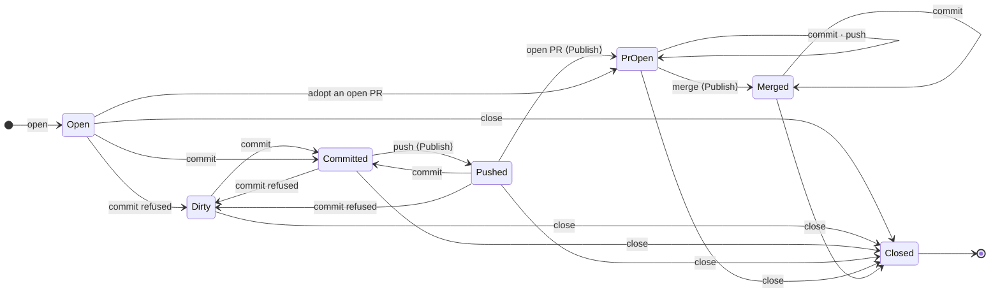

# 07 — Workstreams

What a unit of work maps to underneath — one checkout occupant of a project, the place where
terminals, agent sessions and editors live — and why switching between units of work is a
navigation operation rather than a git operation.

---

## Two objects, kept apart

A work item and a workstream are two objects, and keeping them separate is what makes the rest work:

| | Work item | Workstream |
|---|---|---|
| is | the schedulable leaf of a goal: instructions a fresh session can act on alone | one checkout of a project: the **primary** (the project's own root), a git worktree on a dedicated branch, or a copy of a non-git project |
| may exist without the other | an agent step with a project runs in a workstream of it; one with none runs in the goal's `goals/<id>/scratch/` and has no workstream, like the Workflow Agent's design session | yes — a branch made in the IDE has `goal: None`, `work_item: None`; the primary always has both `None` |
| lives at | `goals/<GoalId>/state/` | the record at `projects/<slug>/workstreams/<WorkstreamId>.json`; the checkout is the project root for the primary, `projects/<slug>/workstreams/<WorkstreamId>/` otherwise |
| syncs | yes (kind 33402) | **never** — it stands for a directory on one machine |

A work item that names a project *gets* a workstream when it runs. A person in the IDE *creates* a
workstream by branching. **Every project has one from birth: the primary**, which is the
repository's own root checkout. All three are the same object with the same lifecycle.

```rust
pub struct Workstream {
    pub id: WorkstreamId,                // the primary's id is its project's ULID
    pub project: ProjectId,              // required
    pub name: Option<String>,            // a person's label; None = "call me by my branch"
    pub note: Option<String>,
    pub pinned: bool,
    pub kind: WorkstreamKind,            // Primary | Worktree { branch, base } | Copy
    pub goal: Option<GoalId>,            // the goal it was made for — history, not a live association
    pub work_item: Option<WorkItemId>,
    pub agent: Option<String>,
    pub state: WorkstreamState,
    pub created_at: u64,
    pub board: WorkstreamBoard,         // column, rank, due — a person's view, absent until set (ide/16)
}
```

**No path is stored.** The store derives the checkout from the kind (`Workspace::checkout_in`), so
a record cannot name a directory outside its project. The primary's id *is* the project's, so
"exactly one primary" is true by construction and a project's address in the desktop is its
primary's: `#/projects/workstream/<id>`.

Every workbench root is a workstream, its status is git's own status, and every session — a
work-item run, a conversation's turn, a terminal — is attributed to the workstream it stands in
(`AgentRef.workstream`, `SessionRow.workstream`). The project root is not a different kind of
place; it is the primary.

---

## Why switching is free

Dirty-state handling never loses work, and there is no
dirty-state handling, because **switching does not touch the tree**. Each workstream is a separate
directory with its own index and its own dirty files. Switching re-roots the workbench — the Files
tab, the documents, the Git tab, the Agent tab — at a different directory. Nothing is stashed
because nothing is disturbed. Terminals keep running in the place they were opened, and their tabs
follow the root they belong to.

The model is doing the safety work rather than a policy layered on top of a single tree.

Switching is a navigation: the **rail** lists every project with its workstreams — the primary
first, badged — and the **work sessions** standing in each: a worker on a step, a harness a person
opened in a terminal, a shell — never a conversation's turn, which is shown and stopped on its
conversation ([13 — Conversations](../13-conversations.md#the-rail-draws-work-sessions-and-terminals)); `⌘P` ([12](12-search-and-quick-open.md))
filtered to workstreams does the same by keyboard, and a project row opens its primary. A workstream row leads with its status mark (`SessionMark`, [09](09-agents-in-the-ide.md#the-marks)) and shows each harness's own mark — a harness typed into a plain shell included, the moment the shell's process watcher reads it (`harnessOf`, [06 §What runs in a shell](06-terminals.md#what-runs-in-a-shell)) — — Claude's, Codex's, pi's — for each harness working in it (`harnessMark`, the harnesses' **own** marks as inline paths in `ui/harnessMarks.tsx` — Claude Code, Codex, GitHub Copilot, Grok, Goose and pi from LobeHub's MIT set, OpenCode and Cursor from Simple Icons, OMP hand-drawn since it publishes none; `NOTICES.md` carries the licences) and the shell glyph for each open shell; a port one of them opened is a chip on the row's line. A live line counts up its total open time; a finished run reads how long it took, and a shell how long it has been open. The rows honour the density setting — a project the one tall card, every other row a tree row — with the new-workstream and "…" actions as visible hover buttons; a harness folds its own sub-agents under a chevron; a folded workstream shows its summary marks, its state mark and its port chips and nothing else — no line repeating the harness under it, which read as a child that would not fold — and an open one shows its session rows instead of the glyphs — each session row wearing its harness's own mark, then its name, then, dimmed and only when the harness has said, **the model it runs on** (`modelWords`: the harness-native id with its provider prefix folded away, *general-agent · claude-opus-5*, the full id on hover), which follows the harness's own switches (`ProgressEvent::ModelChanged`, [09](09-agents-in-the-ide.md#the-marks)). The pulse line (`PulseLine`) is a folded *project's*, beside its name. A workstream row's menu — *Open · Rename · New shell here · New <harness> here · Diff against base · Close workstream…* — is one spec (`railMenuModel.mjs`), the one place its verbs are spelled; a shell row's verbs are worded by the tab menu (`tabMenuModel.terminalTabMenu`), so the rail and the strip say the same thing. A harness row's menu has one verb, *Terminate* (its tab closed — the process ended, the row gone with it; the harness's row is drawn only through the tab that claims it, [06](06-terminals.md#reporting--a-harness-in-a-terminal-is-a-roster-session)); a harness folds its sub-agents on the same memory the Workstreams panel folds them on, `bisa.collapsed.rail.agent.<id>`, so a chevron pressed in one is pressed in the other; a harness row carries no **usage line** — what the harness's *account* has left is the window footer's (`shell/UsageStat.tsx`: one harness at a time, its windows as meters on one line — *5h 23% · resets in 2 h · Weekly 41% · Fable 12%* — the first window's reset in place and the rest on hover, a refresh, and on a click every installed harness with the choice of which stays, `bisa.footer.usage`; `HarnessUsageLine` over `harnessUsageModel.mjs` and `harnessUsageStore.ts`, read from `GET /harnesses/{id}/usage`: Claude Code from the provider's usage endpoint with its own sign-in, Codex from its app server, OMP from `omp usage --json`, OpenCode from the same endpoint through the Claude Pro/Max sign-in in its own `auth.json`, pi says in its own words that it reports none) and, folded under each harness by the gauge (`UsageToggle`, `bisa.collapsed.usage.<harness>`), Settings › Harnesses' — the Workstreams panel's harness rows carry none either; `harness.usage.reads` off makes every line say so; a shell's has *Focus · Restart · Close · Close the others here · Close the exited ones here*; an engine session's *Show in the Agent panel · Answer in the Inbox · Abort* (`railMenuModel.agentRowMenuSpec` — *Abort*, and a harness's *Terminate*, only while the session is stoppable, `sessionState.isStoppable`: never idle between turns, parked or ended). **On the row itself the verb is an icon**, revealed on hover by the same rule: one stop mark (`ICON.terminate`) for *Terminate this harness* and *Abort this session*, a refresh mark for *Restart this shell* — the word lives in the tooltip and the accessible name, never beside the row's text, so a row reads as its session and not as a bar of buttons. **A row's highlight hugs the row**: the indent is a margin, so the hover wash and the accent bar begin at the row's own depth and end a step before the edge — the same in the Files tree ([03](03-files-and-editing.md#the-tree)). **What a row wears is one rule** (`railStyleModel.rowTreatment`, tested): the current root sits on the full `accent-soft` wash with the accent bar at its left edge and its name in `accent-ink` — where you are outranks what is asking, so a failed current row still wears the accent — a row waiting on you the accent bar alone, a failed one the danger bar; a project's name is set strong, a workstream's plain, a shell's or a session's dim until it wants attention; a project put away or a checkout without its folder is muted. `RailRow` maps each word to classes once, in the theme's roles, so every family and accent carries the rail. A project card carries its avatar in a hairline ring (the current card's in the accent) and its state mark in a column of its own so every card's mark aligns; a heading wears a section's space above it (`headingSpacing`), small caps set wide, a quiet count and a softer hover, since it only folds; the disclosure and hover squares wash in `surface-2` on a rest row and in `surface` on the current one, so they never vanish into the wash; the guides are a light hairline. A project group header (on the Workspace tab) can be renamed — which re-groups its member projects — and given a photo — scaled to a 256 px square before it is uploaded, drawn from a 64 px thumbnail made once per machine ([14 §Photos](14-performance.md#photos)) — kept in the workspace-scoped `rail.groups` setting keyed by group name.

The rail is a `TreeList` ([03](03-files-and-editing.md#the-tree)) over `projectRailModel.railRows` (`treeRowsOf` gives the rows ids unique across kinds — a project and its primary workstream share a record id). **Rows drag**, by one contract the view only binds (`railDragModel.mjs`, tested): a group among the named groups of the Workspace tab, a project among the projects of its group — or **into another group**, which re-groups it (`PATCH /projects/{id}` `group`, the same change *Move to a group…* makes) and then places it where it was dropped — or at the top of a rail nobody has grouped yet, a workstream within its project, a shell within its workstream. The payload speaks **record ids** (`railDragOf`: a project's own id and its section, `under`, never the tree row's composite id), every heading row says what it folds (`under`), and `railCanNest` / `railCanReorder` compare those — so a workstream reorders under its own project and a project lands in a group by the group's namespace, not by a label. A bar slides to where the row lands and the rows beside the gap part by a hair; a heading it is about to join lights up; the ghost dims where a drop is refused ([03 §The tree](03-files-and-editing.md#the-tree)). *Other projects*, agent rows and goal headings do not move, and a project on the *Goals* or *Workflows* tab stays under its goal. The drop is a **verdict** (`railDropVerdict`): the next `rail.order` (through `railOrderModel.reorderAmong` — `placeAmong` turns the tree's plan, a slot among one parent's children, into the one global project list the setting keeps, and a project a collapsed fold hides keeps its place), a project moving house with its order already placed, or a shell's place in the session order (`reorderTerminalSessionTab`) the rail and the centre strip both read; the view writes the machine-scoped `rail.order` setting and patches the project, nothing more. From the keyboard, Space lifts the cursor row, ↑↓ step it through the tree's slots, ←→ take the same gap one level out or in, Space drops it, Escape puts it back; at rest ↑↓ move the cursor, ←→ close and open, `*` opens every sibling, typing a name jumps to it, Enter opens. A click or the keyboard's cursor on a row is also the **selection** the Board narrows to — a heading its projects, a project row that project, a workstream, shell or agent row the project it stands in (`railSelectionModel`, `railSelectionStore`, [16](16-board.md)); the reveal that follows the route selects nothing.

---

## Lifecycle

`WorkstreamState` moves through a typed transition, the pattern a work item's state uses:



A commit on a branch whose pull request is open — answering a review — lands and leaves the record
`pr_open`, as a refused one does, and a branch that merged can still be committed on: the commit is
git's fact by the time the transition is asked, and the record keeps the pull request it names. What
is unpushed is the live status's to say (`ahead`), never a state that would forget the number. Every
cell of the seven-by-seven table is a state or a refusal in words
(`every_cell_of_the_lifecycle_is_a_state_or_a_refusal_in_words`).

```rust
pub enum WorkstreamTransition { CommitRefused, Committed, Pushed, PrOpened { number, url }, PrAdopted { number, url }, Merged, Close }
impl Workstream { pub fn apply(&self, t: &WorkstreamTransition) -> Result<WorkstreamState, WorkstreamError>; }
```

`Pushed`, `PrOpen` and `Merged` are *published*, which is what stops cleanup discarding something
that has left the machine; the code host's merge ([08](08-code-host.md)) is the first writer of `Merged`.
`PrAdopted` is the one edge into `PrOpen` that skips the push: a workstream **opened from a pull
request that already exists** ([§Where a workstream starts](#where-a-workstream-starts)) is born
`Open` and moved to `PrOpen` by the engine through the same writer before anyone reads it — a
birth fact, so it is legal from `Open` only; a checkout that has committed or pushed on its own
links a pull request through `PrOpened`.
`Workspace::transition_workstream` is the only writer of the state (invariant I42), and it calls the
kind-aware `Workstream::apply`: the **primary refuses `Close`, `PrOpened`, `PrAdopted` and
`Merged`** — it is the project itself and has no branch of its own to finish — and accepts
`Committed` and `Pushed` like any checkout. Deleting the primary is refused by name (`primary_is_the_project()`); removing the
project is the substitute. Before an outward action the engine **reconciles the record with the
checkout** (`reconcile_before_publish`): a branch with commits beyond its base whose record
says `open` or `dirty` is `committed`; a `committed` record whose branch has an upstream it is not
ahead of is `pushed` — both moves the table admits, so a commit made in a terminal counts and a push
is recorded rather than refused after `git push` ran. A pull request is then asked of the state
machine *before* the code host is touched: a `committed` branch is **pushed first, under the same
gate**; one with nothing beyond its base is refused by name (`nothing_to_publish`) without a pull
request being created.

---

## Where a workstream starts

A workstream is a branch and a checkout, one-to-one — never a detached HEAD — and **where it
starts is a fact apart from its base**: the source says what branch the checkout stands on and
where that branch's HEAD begins; the base (`WorkstreamKind::Worktree { base }`) is the branch the
work *goes back to* — what the lifecycle diffs against and a pull request targets — the project's
default branch unless chosen. The one creation path, `open_workstream_for`
(`crates/bisa-engine/src/projects.rs`), takes a `WorkstreamSource`
(`crates/bisa-core/src/workstream.rs`, tagged by its `source` word on the wire; the CLI spells
it `--from`):

| Source | What git does | The record |
|---|---|---|
| `new_branch {name?, start?}` | `git worktree add -b <name> <path> <start ?? base>`; a typed name is sanitised the way a derived one is (`typed_branch_name`), never refused — but **a name that already exists is refused by name** (*branch x exists — open a workstream from the branch instead*), never silently checked out; absent, `work/<label>-<tail>`, the long tail on a collision | `branch` the name settled, `base` as given |
| `local_branch {name}` | `git worktree add <path> <name>` — the branch as it is | `branch` the branch, `base` as given (no fiction about where it was cut from) |
| `remote_branch {remote, name}` | `git fetch <remote> <name>` (one ref), then `git worktree add --track -b <name> <path> <remote>/<name>` — a local twin tracking the remote's, so push and pull need no refspec; a local branch of that name already there is checked out instead | `branch` the name, `base` as given |
| `tag {name, branch?, create_at?}` | with `create_at`, `git tag <name> <ref>` first (the safe tier: a new ref, nothing moves); then `git worktree add -b <branch ?? from/<tag>> <path> <tag>` | `branch` the branch, `base` as given |
| `pull_request {number}` | the code host behind `origin` is asked for the pull request **before anything on disk moves** — not open is `409 pull_request_state`; then `git fetch origin <head>` and a tracking worktree on the head (a head that is not on origin — a fork's — fails at the fetch and the sentence says so); the record is written `Open` and moved through `PrAdopted { number, url }` | `branch` the head, `base` **the pull request's base**, `state: pr_open` from the first read; `linked_pr`, the checks, the reviews and the merge work from there unchanged |

The pre-create script is told the branch as the source intends it; the post-create script the
one git settled. The opened event carries the source in a line (`WorkstreamOpened.source`, *a new
branch x at v1* · *the branch origin/x* · *pull request #12* · *a copy*).

On the desktop the **New workstream** dialog (`NewWorkstreamDialog.tsx` over
`workstreamCreation.mjs`) has one choice, **Start from** — *New branch · Branch · Remote branch ·
Tag · Pull request* — and shows that source's fields only: the local branches (a branch another
checkout already holds is greyed with who holds it — `takenBranches`, git refuses two worktrees on
one branch), the remote-tracking branches as of the last fetch with a *Fetch* button
(`GET /workstreams/{wid}/git/remote-branches`), the tags or a *new tag* with its name and ref, the
open pull requests (`GET /projects/{pid}/prs`, *#12 · title · head → base · @author*, with
*Refresh*); the branch the engine will stand on previewed as you type (`previewBranch`); **Base**
its own field, apart from *Start at*, absent for a pull request (it brings its own). Every door
opens the same dialog: the rail's `+`, `⌘⇧W`, the palette, and — preset to the ref — *Open a
workstream on <branch>…* in a branch row's `⋮` under Git › Branches, *Open a workstream at
<tag>…* on a tag row, and the same two on a branch or tag chip in the graph
(`branchActionsModel.workstream`, `commitActionsModel.refActions` `open_workstream`, the
`NEW_WORKSTREAM` event's `detail.preset`). The body the dialog sends is the model's, not the
component's: `workstreamCreation.openBody({git, label, fields, base, defaultBranch})` puts in the
label only while its field shows (`labelShown`), the source, and the base only when it is not the
default and the source brings none — a schema-guard row holds every body it can make to
`NewWorkstreamBody` (`workstreamCreation.test.mjs`, `scenarios/bodiesFitTheSchema.test.mjs`). A
project's own dialog (`NewProjectDialog.tsx` over `projectForm.mjs`) is the same shape: the fields
a way in shows (`shownFields(provenance)`), and a refusal the node makes lands where the form can
show it — beside its input when that input is on screen, on the form otherwise (`refusalPlace`), so
an agent or a team nobody has is the node's sentence, whole, never a message under a hidden field
(`projectForm.test.mjs`). The dialog asks nothing about goals: a project made there is the
workspace's unless the door it was opened from fixed one — a goal heading's *Import into this
goal…*, attached by `POST /goals/{id}/projects` as it is made and said in one sentence
(`projectRailModel.importLanding`; nothing is guessed from the tab). Attaching a project that
exists is one dialog, `AttachGoalDialog.tsx` over `attachGoalModel.mjs` — About › Goals and the
rail's project menu open the same one: the goals not yet attached, the only candidate chosen for
you, words when there is nothing to offer, a toast naming both ends (`attachGoalModel.test.mjs`).

---

## Per-workstream status

Branch, ahead/behind of its base, dirty counts, and running agents — on the workbench header,
About › Settings and the Workstreams occupant (`GET /workstreams/{wid}/git/status`,
`GET /projects/{pid}/workstreams/status`). The rail's rows carry the ahead/behind counts alone
(`railFactsModel.workstreamFacts`, tested: `+3 · −1`, the sentence on hover) — never a word for
the tree's state, which on a working checkout is nearly always on and would say nothing on every
row; that is the Git tab's mark on the right panel's rail (`railBadgesModel.gitBadge`).

- git facts come from `git::status` and `git::ahead_behind`; the primary has no `base`, so its
  *ahead of base* is `None`;
- running agents come from the engine's live session roster, **counted by the workstream each
  session stands in, work sessions only** (`running_in`, `SessionKind::is_work`) — a worker in a worktree counts, a conversation's
  turn standing there does not (it is its conversation's, [13](../13-conversations.md#the-rail-draws-work-sessions-and-terminals)), a session in a scratch folder counts
  nowhere;
- `in_progress` names a merge, rebase, cherry-pick or revert git has left half-done in the
  checkout, and `pr` the pull request the record knows of (`WorkstreamState::PrOpen`), so a card can
  say both without a call to the code host;
- the answer is cached per workstream in `engine::ide::git` (`StatusCache`) with a two-second TTL
  and invalidated on every write the engine makes there and on every flush of the checkout's watcher
  (`watch.rs`), so the rail never runs `git status` across every checkout on every keystroke; the
  time-to-live is `cache.git_status.ttl_ms`.

---

## Operations

| Operation | Route | Notes |
|---|---|---|
| create from the IDE | `POST /projects/{pid}/workstreams` `{source?, base?, label?, goal?, agent?}` | `source` is a `WorkstreamSource` ([§Where a workstream starts](#where-a-workstream-starts)); absent, a derived new branch; `base` defaults to the project's default branch, a pull request brings its own; `409 pull_request_state` for a pull request not open |
| the sources' lists | `GET /workstreams/{wid}/git/remote-branches`, `GET /projects/{pid}/prs` | remote-tracking branches as of the last fetch (a local read; `POST …/git/fetch` first); the open pull requests on the code host behind `origin`, read fresh |
| switch | navigation | `#/projects/workstream/<id>` |
| rename, annotate, pin, date | `PATCH /workstreams/{wid}` `{name?, note?, pinned?, due?}` | tri-state fields: omitted keeps, `null` clears; the branch is untouched; `due` is a `YYYY-MM-DD` day on the Board |
| place on the Board | `PUT /workstreams/{wid}/board/place` `{column, index}` | the rank comes from `core/board.rs`; every record rewritten is answered; a closed workstream is Archived and nothing else ([16 — The Board](16-board.md)) |
| delete a work item | `DELETE /work-items/{item}` | refused while the item is unsettled, naming why |
| close a workstream | `DELETE /workstreams/{wid}?tree=` | the primary is 409, refused before anything else. **Every session standing in the checkout is stopped first** (`sessions::stop_workstream`, `Scope::Workstream`) — the engine's agents aborted, a terminal's harness ended on the roster; the desktop closes the tabs on its side (`closeTerminalsRootedAt`) — and answered as `stopped_sessions`. With `tree=true` a dirty checkout is refused before anything is stopped when `workstreams.dirty_close` is `refuse`; otherwise **a recovery ref is written next** — for a worktree, dirty or clean: a clean tree still pins its HEAD — then the clean script, then `worktree_remove` — a failing script keeps the tree (`409 script_failed`), its sessions already stopped. `projects::close_workstream` and `ide::interactive::close_workstream_removing_tree` are the two doors; `close_workstream_with` is the checkout half alone and stops nothing — what a project's delete calls per checkout after stopping the whole project's, and what the executor settles a copy workstream through from inside its own session |
| the workstream scripts | `GET /projects/{pid}/workstream-scripts`, `POST …/approve`; the texts are `workstreams.script.*` settings | pre-create · post-create · clean · run, approved per machine by the digest of their text ([§Workstream scripts](#workstream-scripts)) |
| commit, push, pull request | `POST /workstreams/{wid}/{commit,push,pr}` | push and pull request pass the Publish gate ([08](08-code-host.md)); commit and push are Git › Changes' verbs on the desktop, the pull request the Workstreams panel's lifecycle. **A commit is a commit, whichever door made it**: the Changes view's own route (`POST /workstreams/{wid}/git/commit`, the paths a person chose — `projects::commit_in`) moves the record to `committed` and says `workstream_committed` as this one does, so the Board and the lifecycle follow it |
| fetch, pull, revert | `POST /workstreams/{wid}/git/{fetch,pull,revert}` | fetch is safe; pull (`{mode: ff_only \| rebase \| merge}`) and revert are consented, with a recovery ref first ([04](04-git.md#the-sync-bar)) |
| re-point a remote | `PUT /workstreams/{wid}/git/remotes/{name}` | safe; `origin` updates the project record |

---

## After a merge

A merged pull request leaves three things behind: a checkout and a local branch nobody needs, a
primary that has not heard of the merge, and — sometimes — a harness still working on that primary.
Three project settings say what happens next, and one dialog does it:

| Setting | Values | Default |
|---|---|---|
| `workstreams.cleanup` | `keep` · `ask` · `remove_when_merged` | `ask` |
| `workstreams.after_merge` | `ask` · `return_and_pull` · `stay` | `ask` |
| `git.pull` | `ff_only` · `rebase` · `merge` | `ff_only` |

The plan (`afterMergeModel.mjs`, tested) is three steps in running order — **pull the default
branch** (`POST /workstreams/{pid}/git/pull`, on the primary, *before* anything leaves), **delete
this workstream's checkout and branch** (`DELETE /workstreams/{wid}?tree=true`, then the local
branch; a recovery ref first, as every consented step), **return to the default branch** — each a
checkbox the policies pre-tick. Under `ask` the dialog shows; under `remove_when_merged` /
`return_and_pull` / `stay` / `keep` it runs without asking and only reports. **While a session runs
on the primary** — the node's `running_agents` for it plus this app's live harness shells there — the
pull and the return are off, with the reason, and the automatic policies fall back to asking: a pull
under a harness's feet is the one thing the flow never does. A pull that stops on conflicts ends the
flow there and offers the primary's Changes view, where the Resolve card and the conflict document are. The
merge dialog itself carries *Delete the branch on the code host* (`git.delete_branch_after_merge`,
default on), when the code host can. On the desktop this dialog is the lifecycle's last step, **Clean
up**, offered once the record reads `merged` — and the record keeps the pull request it merged
through (`WorkstreamState::Merged { number, url }`), so the cockpit still shows what landed.

## The card

The Workstreams occupant's rows and the panel's header read one model
(`workstreamCardModel.mjs` — `cardTitle`, `cardChips`, `stateLabel`; the header has no chip of its
own): the title by **one rule** the rail's row, the Board's card, the panel's header and the
footer read alike — the trimmed label, else the worktree's branch, else the live branch, else
*primary*, else the copy's tail (`workstreamCardModel.test.mjs`, `scenarios/workstreams.test.mjs`); then, each only when true, the state, **the pull request**
(`#12`, a link to the code host — kept on a merged record too), the agents running here, `+a −b`
against the base, `↑a ↓b` against the upstream or *not pushed*, `S n` staged, `M n` modified, `? n`
untracked, conflicts, and an operation left half-done. A clean, quiet, pushed checkout says almost
nothing.

**The Workstreams occupant is the whole checkout: managed, and taken to its base.** One occupant,
because the lifecycle is the branch's story and a person who opens a workstream came for it; the
one act under the current step is the only button it shows, so nobody meets a merge button before
its time, and it lists no sibling, so nobody managing a checkout is shown a list.

The **Workstreams panel** (`WorkstreamPanel.tsx` over `useWorkstream`, read once and handed down)
is **the checkout you stand in**, on every root: the header — the title renamed in place
(double-click, a pencil on hover, or *Rename*; `RenameWorkstream.tsx` over
`workstreamCardModel.renameBody` and `renames` — trimmed, `null` for empty, nothing written when
nothing changed, and one write at a time, the rail's rename the same body), `→ base`
beside it on a branch, the chips, the live dot (a close in flight, or a pull request opening or merging) — then, on
a branch beside the primary (`kind.kind === "worktree"`), the **lifecycle** (below), then the sessions
standing here, the checkout's path with *Copy*, and the `⋯` menu: *Refresh · Rename · Open the
pull request on the code host* (from the record's URL, no request) *· Diff against base · Copy the
checkout path · Close this workstream… · Delete the checkout…*. On the primary the panel wears the
*primary* chip, shows no lifecycle and offers *Refresh · Rename · Copy the checkout path* alone —
the project's own root is not closed and has nothing to merge into. On the primary of a plain
folder it draws, under the header, the one card that offers **Initialise a repository**
(`InitRepositoryCard`, `initOffer` — the Git panel's and About › Checkout's card, [ide/04](04-git.md));
`useWorkstream` reloads on the facts `shell/workstreamFramesModel.mjs` lists — the record's
(`workstream_opened · changed · committed · edited`, so a commit made from Git › Changes and a
rename are read at once) and the project's (`committer_set`, `project_changed`, so the chips read
*git* the moment the folder is one) — and never on a sibling's; the same list drives the shared
status store, which reads again on a reconnect too (`workstreamFramesModel.test.mjs` reads the
engine's `EnginePayload` and holds the list to it). While the column is closed the
Workstreams tab on the rail wears the lifecycle's **mark** (`railBadgesModel.workstreamsBadge`, from
the shared `workstreamStatusStore`, the git act in flight and the review run kept for the scope):
a pulsing dot while an agent reviews or fixes or a push, pull request or merge is in flight, an
accent dot while a pull request is open — a branch's alone, never the primary's or a copy's, and
never for a branch merely ahead of its base. Closing is two dialogs (`CloseWorkstreamDialogs.tsx`) —
the record, or the record and the tree, the destructive one naming the folder — each saying what
stands in the workstream and ends with it (`closeWorkstreamModel.terminationConsent`: *1 harness
terminated, 2 shells closed and 1 agent session aborted*), the one consent; every close on the
desktop — this panel's, the Clean up step's, the rail's, the Board's — goes through
`closeWorkstream.ts`, which counts, calls the node, closes the tabs rooted there without the
terminal guard asking again, and forgets the root's document tabs; the rail and the Board move the
person off the root only once the node has answered, never before. **Removing a project** has the
same one door, `removeProject.ts` beside it (over `removeProjectModel.mjs`): the roots the project
stands on are named first (`projectRoots`), with them **the home the IDE leaves for** once the
project is gone (`ideHomeModel.homeAfterLeaving` — the first remaining project's primary by name,
or none, computed from the facts in hand before the node is asked, since the lists move only after
its answer), the node is asked to archive or delete, a remembered root that stood on the project is
forgotten for every act, and only a forgotten or deleted project (`rootsGo`) takes its terminals,
browser tabs, workbench memory and root memory with it. The door hands the home back: the rail
moves the person there when they stand on what went (`standsOn`), About always — it is the root's
own project — and both by `replace`, so Back never returns to a root that is gone; the landing is the
home when no project is left (`homeRoute`). The workbench hears the same two facts on the bus
(`project_archived {archived: true}`, `project_deleted` — `leavesRoot`) for a project put away from
the command line, an agent or another window, and leaves the same way; a checkout that answers *not
found* on arrival is left as every detail screen leaves a place that is gone (`useGonePlace`), for
`#/projects`, whose home (`homeRoot`) is an open workstream of a **listed** project — an archived
project's checkouts, which `GET /workstreams` lists too, are nobody's (`ideHomeModel.test.mjs`,
`removeProjectModel.test.mjs`, `scenarios/workstreams.test.mjs`, `scenarios/whereIWas.test.mjs`).
The rail's menu and the project's detail page once each did this by hand, one of them navigating
before the node had spoken, and both to a bare `#/projects` that picked the same root again. **The panel lists no
other checkout**: the project's workstreams are the project rail's ([the rail](#why-switching-is-free)),
where every workstream already has a row, a menu and a `+` — one place to see them all. Making one
is one dialog with many doors: the rail's `+`, its project menu and toolbar, ⌘⇧W, the palette, the
Git doors on a ref, and *New workstream…* in this panel's own menu. The dialog has one
door, `NewWorkstreamDoor` (`views/_workbench/`), mounted by the workbench **and** by `#/projects`:
it listens for `NEW_WORKSTREAM`, whose detail names the project — `{pid?, preset?}` — else the
current root's, resolves the id against the whole workspace (`projectOf` over the projects on
screen and the ones put away — the same lists the rail draws), and mounts `NewWorkstreamDialog`;
a project the workspace no longer has is a toast, never a click that does nothing. So every door
works with the rail hidden, and on the screen with no root open. A put-away project takes no new
work: its row offers no `+`, its menu item is disabled with the reason (`newWorkstreamOffer`), and
the engine refuses the same by name (`open_workstream_for`), so the route and the MCP door hear one
sentence.

The **lifecycle** (`PullRequestLifecycle.tsx`, composed of `LifecycleStepper`,
`PullRequestCard`, `ReviewStep`, `MergeControl`, `PrForm`, `AfterMergeDialog` over one hook,
`usePullRequest(base)` — the code host's side, on top of the checkout the panel read) is the cockpit
([08](08-code-host.md#surfaces)), under the header and the sessions — the checkout first, then its branch's story: the **lifecycle** — *Commit · Push · Open pull request · Checks · Review · Merge ·
Clean up* (`prLifecycleModel.mjs`), **always seven** so the spine never changes length under a
person (a code host that reports no checks says *not reported by this code host* on the step),
which one is in hand — the act's own step, the one accent dot — which are waiting (in flight, nobody's act: checks running, the code host still computing — a ring), which are blocked and why — the step in hand's note whole, as a `ReasonLine`
under its label, never cut and never repeated beside the button or in a tooltip — each step's own
surface under its row (the card with its checks counted, the review stage as two labelled parts,
*Agent* and *You*, each checked when done, the merge), and under the step in hand the **single**
legal act (the only primary button on the panel) with the last outcome's banner beside it — the merge under *Merge* and nowhere else, so nobody meets it above the review. A review is optional — an agent's, the person's, both, or none — and never gates the merge: the Review row reports who reviewed and what they said, the Merge row is offered whenever the pull request is open, and comments still open or a standing request for changes are the cautions the merge names before *Merge anyway*. The Review step's surface is there from the moment the branch exists — the branch against its base before a pull request, the pull request after — so asking an agent to review has one door. Facts before the record: a commit made in a terminal is a commit, a push is the
upstream's word; an absent code host capability is not a gate. No *Changes*, no *Diff* — those are
Git › Changes and *Diff against base*; the panel's menu reaches the diff and the pull request on
the code host. The lifecycle is drawn only for a workstream with a branch beside the primary: the
primary has nothing to merge into, a copy nothing to publish.

---

The card's facts are **git's** — state, pull request, ahead/behind, upstream, staged/modified/
untracked, conflicts, the running-agent count. What the sessions are *doing* is the rail's
(`ide/09` §The rail's pulse): the two surfaces share no chip, on purpose.

## Bounds the IDE surfaces honestly

- **Unborn HEAD.** A freshly created project has nothing to branch from, so no worktree can open
  and work runs in the **primary** — attributed to it like any other run, and never auto-committed
  there. The IDE shows *Make the first commit* where *Open a workstream* would be — on the primary's
  landing — and the Git tab's commit is the shortest route. This is the ordinary first run of every
  new project.
- **Non-git project.** Workstreams are copy-backed through `bisa-iso`; the IDE offers Files,
  the editor and terminals for such a project, and — in place of a git surface — the one card that
  offers to make it a repository (`projects::init_repository`, `POST /projects/{pid}/git/init`).
  Copies the project already has stay copies; the next workstream opened is a branch, or runs in the
  primary while HEAD is unborn, exactly as for a new managed project.
- **A workstream made for a goal keeps `goal: Some(..)` after that goal is detached or deleted.** A
  checkout records the goal it was created *for* — history, not a live association — exactly as
  [04 — Workspace, Project, Goal](../04-workspace-project-goal.md) states.

---

## Workstream scripts

Three shell scripts a project's people write, run by the engine around a checkout's life
(`crates/bisa-engine/src/scripts.rs`), set under About › Settings › Workstream scripts
(`WorkstreamScriptsCard.tsx` over `workstreamScripts.mjs`) — and a fourth, the **run command**, set
and approved beside them but never run by the engine: `Phase::Run` is what the IDE's Terminal menu
opens in a terminal
([18](18-browser-and-servers.md)), `run_phase` refuses it by name, and `Phase::LIFECYCLE` names the
three below:

| Phase | Runs | Where | On failure |
|---|---|---|---|
| **pre-create** | before the workstream is created — `open_workstream_for`, after the base is resolved and the path is known, before `worktree add` | the project root (the checkout does not exist yet) | the workstream is **not created**: `EngineError::WorkstreamScript` → `409 script_failed`, the dialog shows the tail |
| **post-create** | once the record is written, before `workstream_opened` | the new checkout | reported — journalled, on the bus, toasted — never undone: the workstream is real |
| **clean** | in `close_workstream_with`, when the tree is to go, after the sessions stopped and the recovery ref, before `worktree remove` | the checkout | the tree and the record **stay** (`409 script_failed`, shown in the delete dialog): a delete is irreversible and a clean-up that could not finish is a reason to look |

Every creation and deletion passes through those two functions — the IDE, the CLI, an agent run's
placement, the after-merge clean-up — so the scripts run for all of them; the two early returns that
create nothing (a re-run reusing its worktree, an unborn HEAD landing on the primary) run nothing. A
copy workstream runs them with an empty branch and base. Two paths never asked a person and so run
the clean script as *report*, not *refuse* (`ScriptPolicy::Report`): a run ending and closing the
copies its items worked in (`effects::release_workstreams`) and a project deleted whole. **A copy
stays until its run ends**: its item's patch is captured the moment the item settles
(`executor::capture_iso_result`), but the tree stands for the run's later steps — a `check` after
the agent step runs where the work landed, and a copy torn down at the item's settle raced it (the
check saw the file, or a root it was never written to, by which task ran first); the run's settle
closes the record and takes the tree, and an item run again takes up its copy where it stood
(`engine placement::a_check_after_an_agent_step_on_a_plain_project_finds_the_file_in_the_copy_every_time`).

**The text is the author's, verbatim.** Nothing is rendered or substituted into a script; its facts
arrive as environment variables under the engine's reserved prefix — `BISA_SCRIPT_PHASE`,
`BISA_PROJECT_PATH`, `BISA_PROJECT_SLUG`, `BISA_WORKSTREAM_ID`,
`BISA_WORKSTREAM_PATH`, `BISA_BRANCH` (the intended name in pre-create; git settles the
final one), `BISA_BASE` — which a script cannot override. It runs under `sh -c` with a null
stdin and `GIT_TERMINAL_PROMPT=0`, bounded by `workstreams.script.timeout_secs` (default 300), the
child terminated when the bound passes; the exit status and the 2000-character tail of what it printed
are journalled on the goal (a hand-opened workstream has none) and put on the bus as
`workstream_script_ran`, which Pulse renders and a failed post-create toasts.

**The text syncs; the trust does not.** The scripts are project settings
(`workstreams.script.pre_create` · `post_create` · `clean` · `run`), and `projects/<slug>/settings.json`
travels with the project — so by the time a script reaches a collaborator it is remote-authored
shell. It runs on a machine only when the SHA-256 of its text is in that machine's
`workstreams.script.trusted` (machine scope, never synced), which one thing writes: *Approve* —
`POST /projects/{pid}/workstream-scripts/approve`. Saving from the card approves what you saved; a
text that arrived by sync reads *changed since anyone here approved it* until somebody here reads it
and approves it, and until then the engine refuses it (pre-create and clean) or skips it with a note
(post-create). `GET /projects/{pid}/workstream-scripts` answers the four texts with `trusted` per
phase, so the desktop hashes nothing. This is the approval this section once said did not exist.

## Not in this design

Shared rebuildable directories linked across workstreams (one `node_modules` for every worktree).
The post-create script is where a project does that for itself today.
