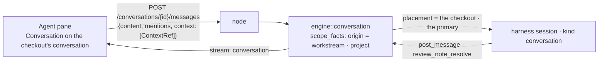

# 09 — Agents in the IDE

The General Agent and every enabled agent and team are reachable inside the project they are working
in, in **conversations about the checkout** ([13 — Conversations](../13-conversations.md)) — the
Workflow Agent alone is not: it designs workflows and shapes goals, and a checkout has neither, so a
conversation about a workstream or a project never offers, resolves or triages to it. Context goes in as chips a person can see and remove. And the agent knows —
visibly — whether the project belongs to a goal.

Everything an agent is told here passes the Redactor, and everything it asks its harness to run
passes the Tool & Commands Guard ([11 — Security](../11-security.md)): a key pasted into the
composer reaches the agent as a placeholder and comes back as a *redacted secret* chip in its reply;
a command a rule refuses is refused with the reason and the agent goes on; one a rule sends to you
is a card in the Inbox when the workstream belongs to a goal, and a card in the conversation itself
when it does not — the conversation's own **mode** decides how far the turn goes before that happens
at all ([20 — Reviewing agent changes](20-reviewing-agent-changes.md)). The
sessions list wears a shield beside a harness the guard can stop — Claude Code, GitHub Copilot CLI,
Grok Build, any ACP agent — and none beside one that runs under its own sandbox.

---

## A checkout is on a conversation

The Agent panel is a **conversation** ([13 — Conversations](../13-conversations.md)): a saved
exchange with an origin — here a workstream, or its project — many per project, listed, searched,
resumed. The list is **the project's**: every conversation standing in the project — the project's
own and every checkout's, this one's and its siblings' — one read (`GET /conversations?project=`,
`useConversationSurface` over `listQuery`, whose source names the project), each row saying where it is about. A
checkout is **on** the conversation a person picked there last (`bisa.conversations.pick`, per root —
the owner key `workstream:<wid>`, one memory with every other owner's), a sibling checkout's included
once picked; with nothing picked, the pane shows the **list** — one click from any conversation — or,
with none at all, the empty state whose one button says *New conversation*. The pane never guesses;
a **hand-off** does (`conversationsStore.ensureConversation` over
`conversationPaneModel.currentConversation`: the remembered pick while it is live here, else the newest
live one whose turns run here — the checkout's own or its project's, `runsHere` — else the newest of
the project, else a new one about the workstream) and writes the pick, so the pane lands on it.
`handOffTarget` goes only where the turn runs here: a sibling checkout's conversation is opened by a
click, never landed in by a hand-off, since its turns run in that checkout. The pane is the **one
conversation surface** every owner paints ([13](../13-conversations.md): `useConversationSurface`
with the project's list and the `root` selection, `ConversationSurface`), so it shows **one view at a
time** (`surfaceView`): the conversation; the project's **list** — live, or put away with its *Archived*
switch, searched by the node (`?q=`, what was said included), with *New conversation* — filling the
pane; or the empty state. The bar's one door, **Conversations**, goes to the list and back, and is held
when the list is the only view; a row opens its conversation and the composer continues it (a post
into an older conversation resumes the agent on its transcript); the fold is remembered per root under
`bisa.ide.agents.view` (`agentPaneViewStore.ts`), so a list left open is open after a reload and a row
picked closes it; a `?conversation=` link is taken into the memory and off the address on arrival. A
goal's tab, a workflow's Agent pane and the drawers beside a note or a drawing paint the same surface,
and no screen lists every origin's. A conversation about the checkout's *project* runs in the
primary; one about a sibling checkout runs there — so every talk of the project is one pane away
from each other, and a workstream has no thread of its own.

Everything else is unchanged and reused: the pane mounts the existing `Conversation` component on
the conversation's scope; wakes go through `engine/conversation.rs`; mention an agent and it answers;
name nobody and the **default agent** takes it — `agents.default`, resolved at the project layer for
a conversation about a checkout and at the workspace layer for a goal thread, a channel or a
conversation about anything else, the general agent unless a project says otherwise, and the general
agent again when the named one is missing, disabled or refuses the author under its respond policy
(an unaddressed message is never met with silence because of a stale setting). **The Workflow Agent
is the one agent a conversation about a checkout never wakes** — not by mention, not as the
project's default: `dispatch` skips it when the origin cannot reach it
(`ConversationOrigin::reaches_workflow_agent`) and `default_agent` falls through to the general
agent, so a setting written from the CLI or synced in cannot route around the rule, and the desktop
simply agrees with it (`addressModel.reachableIn` over `CHECKOUT_KINDS`). A goal thread, a channel
and a conversation about a goal, a workflow, the workspace or the node keep it. A non-core default
*answers* an unaddressed message but does not *route*: the loop guard admits only the core agent's
post as a wake, so its `@developer` reaches nobody — the bound stays where it was. An agent never
wakes another except a core agent, and never itself. `resolve_mentions` expands team handles
(`@engineering` expands to the team's agents' pubkeys) in every scope.

Placement for a turn in a conversation about a workstream is **that workstream's checkout** — the
project's tree for the primary, the worktree for a branch — and the primary for one about the
project: exactly the *conversation turn about a checkout* column of the context table in
[06 — Agents and teams](../06-agents-and-teams.md#context-injection). The run is registered as a
`conversation` session with its conversation and its workstream (`AgentRef.conversation`,
`SessionRow.conversation`, `SessionRow.workstream`), so the roster can say what it is a turn of —
and the rail, which draws work sessions and terminals only, leaves it to the panel.



---

## Context is chips, and chips are the whole contract

```rust
pub enum ContextRef {
    Selection   { path: RelPath, range: LineRange, text: String },        // captured at send
    File        { path: RelPath },
    DiffHunk    { path: RelPath, scope: DiffScope, hunk: HunkId, patch: String },
    Terminal    { session: TerminalId, tail: String },                    // bounded
    WorkItem    { id: WorkItemId },
    Commit      { id: CommitId },
    Annotation  { page: PageRef, selector: String, excerpt: String, note: String }, // an element of a page, as it was, and the change wanted — the page a file of the project, or a URL the IDE's browser showed (18)
}
```

`MessageBody::Post` carries `context: Vec<ContextRef>`, bounded at 64 KiB serialised. Each attached
ref renders as a **removable chip above the composer**. The rule that makes this intuitive rather
than magic:

> **Nothing is injected that is not a chip.** If the agent will see it, you can see it and remove it.

On a sent message the chip is a door too ([17](17-links-and-paths.md)): a `File`, `Selection`,
`DiffHunk` or `Annotation` chip's name opens the file in the IDE through the link handler with the
conversation's roots — a selection at its first line — and the chevron beside it is what unfolds the text;
an annotation unfolds to the change wanted, the element's locator and the element as it was.

How a chip gets there:

| Gesture | Produces |
|---|---|
| type `@` in the box and pick a file — the picker offers the root's paths under the people once the run has a `/` or a `.` in it, or matches nobody (`fileMentionModel.wantsFiles`, ranked by `quickOpenScore.rankPaths` over the shared path index) | `File` — the text keeps `@src/main.rs` as words; the chip is the file. Edit the token out and the chip goes (`syncFileMentions`); remove the chip and the words stay |
| drag a file from the explorer onto the pane (a `pathDrag` on the pane's `DropZone`, [03](03-files-and-editing.md#drag-and-drop-is-the-kits-never-the-browsers)) | `File` |
| drag a hunk from a diff (`hunkDrag`) | `DiffHunk` |
| **the checkout's changes, on request** — *Attach* on the *files changed* line under the composer, *The changes in this checkout* in the attach menu, or *Attach to the agent* on a row in Git › Changes (`gitContext.ts::attachGitChanges` over `gitContextModel.mjs`) | one `DiffHunk` per hunk — the staged side's then the unstaged side's, each with the id a dragged hunk carries so the two are one chip — a `File` for an untracked file; the longest prefix that fits the 64 KiB budget, the rest counted in the toast. **Never on its own**: the tree's changes reach the agent only through one of these |
| the composer's attach menu: the open file, an open tab, the selection, the checkout's changes, the active terminal's last lines, files from disk | `File`, `Selection`, `DiffHunk`, `Terminal`, or an attachment |
| select text in the editor and press the *attach selection* binding ([15](15-keymap.md)) | `Selection` |
| select text and press **Ask** or **Edit** on the toolbar beside it (or `Mod+I`/`Mod+Shift+I`), posting to a chosen agent; **Attach** on the same toolbar puts the chip in the tray and sends nothing | `Selection` |
| *Send to agent* on a terminal tab | `Terminal` with the last N lines (`agents.context.terminal_lines`) |
| **Annotate** on a rendered page ([03](03-files-and-editing.md#rendered-documents)) or on any page the embedded browser shows — in the IDE or the Browser pane ([18](18-browser-and-servers.md)): point at elements, say what should change for each, then **Send to ▾** an agent (an edit, under the Git › Changes contract) or **Attach** | `Annotation`, one per element, in number order — the page (a file of the project, or the URL), the locator, the element as it was, the change wanted |
| *Ask about this* on a commit or a work item | `Commit`, `WorkItem` |
| the palette: *Attach…* | any of the above |

**Chips belong to the checkout.** The tray is kept **per workstream scope** (`agentPaneStore.ts`,
keyed `workstream:<id>`): a hunk attached while looking at one workstream is not on the message
sent from another. Chips survive a navigation and a restart beside the draft they belong to —
`bisa:context:<scope>` next to the composer's `bisa:draft:<scope>` in `localStorage`. A
gesture that does not name a scope — the palette, the terminal strip, a commit row — attaches to
the workbench the route is rooted at.

**The box.** A **mode picker** beside it — a chip that opens a dropdown — sets the checkout's
conversation to manual, auto or plan, and `Shift+Tab` in the box cycles them — the ceiling every turn
of it runs under until the picker is touched again
([20 — Reviewing agent changes](20-reviewing-agent-changes.md)). `Enter` sends; `⌘Enter` (`Ctrl+Enter` elsewhere) sends too, Shift held or not;
`Shift+Enter` alone is a new line; mid-composition (an IME assembling a character) `Enter` commits
the character, never the message. Over the 64 KiB budget only *Send* closes — typing stays, so the
reader removes a chip rather than losing the sentence. While a turn of this
conversation is working a **status line** sits under the timeline — *Reviewer — running Bash · cargo test*, the
loudest live turn's words from the roster alone (`conversationPaneModel.turnSummary` over `sessionsOf`; the Studio's own
*is writing…* line is not drawn here, so the rows and the line cannot disagree). The line only says;
the composer's trailing slot is **one button** — *Send*, or **Stop** (`sessionsStore.stopSession` on
that session), never both (`ui/composerButtonModel.mjs`): *Stop* while a session is stoppable —
`turnSummary.stoppable` is the loudest row whose state `isStoppable`: starting, thinking, running,
waiting — and, from the press of *Send* until the roster's first frame names that session,
Stop-shaped but disabled (`SEND_HANDOVER_GRACE_MS`, 1.2 s; a message that wakes nobody shows *Send*
again when it lapses), so the slot never flickers back to *Send* mid-handover; *Send* again while
every turn here is idle, parked or ended. `Enter` still sends while *Stop* shows — a follow-up into a
running turn is a supported act; only the click's meaning changes. Once agents have written to disk,
the **changed-files bar** stands above the box ([20 — Reviewing agent changes](20-reviewing-agent-changes.md)
§The desktop surfaces): *3 files changed by Reviewer · +40 −12*, opening to a row per file with
*Keep* and *Undo*, and **Undo all · Keep all · Review · Attach** as buttons — *Review* opens the first
pending file in the centre on its diff, *Attach* puts the changes as hunk chips on the next message, on
request and never on their own. Git's own working tree is never drawn here — the Git panel's alone;
*The changes in this checkout* in the attach menu is its one door from the box. The
placeholder is short: *Ask or hand over — @ adds a file*.

**The addressee.** Who an unaddressed message reaches is a chip at the head of the address tray
(*→ Reviewer*), read from the project's `agents.default`; its menu picks another — every enabled
agent a workstream can reach, the General Agent included, never the Workflow Agent — and writes the
setting at project scope, so the engine and the chip can never disagree (a setting that names the
Workflow Agent draws, and reaches, the General Agent). It is not a mention —
naming an agent on the wire is what `@` is for, and putting the default there would defeat the
engine's own resolution and persist into the tray's memory.

**On the wire.** `ContextRef` is part of the message content on kind 3407. Paths are
project-relative and the bytes that matter (`text`, `patch`, `tail`, `output`) are captured at
send, so a peer with the same project attached *can* act on it — which is the test [09 — GEP](../09-protocol-gep.md)
applies. What the wake injects is exactly the chips, rendered as a block the framing calls
*"Context the person attached"*, in chip order — **on every turn**: a first turn carries the block
in its prompt (`framing::context_block`), and a follow-up to a live session carries it in the turn
(`framing::follow_up_text`, the transcript line then the block), so a file attached to the second
message reaches the agent as its bytes and not as the transcript's one-line label.

---

## Goal-awareness, made visible

A project is attached to zero or more goals. The agent must know which case it is in, and the
person must see what the agent was told. So the frame is **on the pane's bar** — the words the
agent is given, in the bar's tooltip, where a fact about the conversation belongs rather than among the
chips a person can remove:

| | Attached to ≥ 1 goal | Attached to none |
|---|---|---|
| the bar says | `web-app · ↳ Dark mode · ↳ SSO rollout` | `web-app` — and nothing about goals |
| the prompt says | *This project is attached to 2 goals: Dark mode, SSO rollout. You are not running a work item for any of them, so no workflow step is judging this session and no result is owed here.* | *This project is not attached to any goal.* — and nothing more about goals |
| a judging step, an owed result | **explicitly stated as absent** | not mentioned |
| tool tier | the conversation's mode ceiling (manual `Write` · auto `Exec` · plan `Read`) | same |
| skills | as files in a managed root; **as an appendix in an adopted root** | same |
| placement | the project tree, or the active workstream | same |
| always | system prompt, skills, MCP servers, model plan, signing keys, what kind of directory it is in | same |

The asymmetry is the requirement made concrete. An agent in an attached project must not infer that
a workflow step is judging it somewhere it cannot see, so the prompt names the absence. An agent in a
project attached to no goal is a pure coding partner and gets **no goal vocabulary at all** —
inventing an absence to deny would be its own kind of confusion — and the bar says nothing either:
the frame is the project alone (`contextChips.frameChips`), no chip announces what is not there.

Attaching or detaching in the `About` tab changes the frame on the next message, and the transcript
keeps the frame each message was sent under, so a reader can see what the agent knew when.

---

## Status — what each agent is doing

**One bar, then the conversation.** The pane's bar names the conversation the checkout is on (its
title, renamed in place) — or the view, *Conversations*, while the list shows — says what its turns
add up to (*2 working · 1 waiting on you*, children counted, `conversationPaneModel.turnSummary`
over the roster rows that name the conversation, `sessionsOf`), carries the frame, and ends with
one door: **Conversations** (`ConversationsDoor`, `conversationSurfaceModel.surfaceWords`:
the word, the count, `aria-expanded`, held when the list is the only view) — to the list, and back. Nothing else sits in the bar: no
filter, no agent's name — who an unaddressed message reaches is the address tray's chip (below),
nowhere else — and no list of sessions. A conversation's turns are not a list a person manages:
the bar's chip counts them, the composer's one **Stop** ends the loudest stoppable one
(`turnSummary.stoppable`), the status line under the timeline says who is doing what, and the pet
follows the loudest live one; a worker standing in the checkout is the rail's
([13 § The rail](../13-conversations.md#the-rail-draws-work-sessions-and-terminals)). A turn's
transcript is the aux pane's, by its address (`?aux=transcript&auxId=<session id>`, below); the
rail and the Agents screen offer *Open the transcript* on their own rows. The roster `GET /sessions`
serves every row, moved by the `session_state` frames the engine's one fold (`presence.rs`) emits.
Nine states, the same words everywhere (`ui/sessionState.mjs`); sub-agents
nest one level under their session:

| State | Source | Shown as |
|---|---|---|
| `starting` | registered, the harness has not spoken | a dim loader, turning slowly |
| `idle` | between turns; a `Started`, a `TurnEnded` | dim |
| `thinking` | `TurnStarted`; a wait or a tool that ended, when no sub-agent is the work | a sparkle that breathes |
| `running <tool>` | `ToolStarted` (the innermost open tool) — or `running sub-agent · explore, plan` while the session's sub-agents are the work (`presence.rs` `DELEGATION_TOOL`: a session that would otherwise read *thinking* or *idle* reads its live children instead, and returns to its own word when the last one leaves) | the tool's name, and the loader turning |
| **`waiting on you`** | an `InputRequested` the engine escalated, a step's gate, a question through the intake | **the accent** — the one state allowed to interrupt; *Answer* opens the Inbox when the wait has a gate (a goal-thread session's does, and a turn of a conversation about a goal; a turn of a conversation about a checkout has no goal to escalate to, so its agent asks in words instead — which reach the Inbox all the same: a conversation earns a row of its own kind when it names you or moves unread — and reads itself as the pane shows it, so an answer read here never waits in the Inbox (13-conversations §Lists, search, coming back) — and the checkout's scripts and lifecycle land there as notices — see *What the pane is not*) |
| `done` | the item completed; a proposal made | a tick, kept a minute then gone |
| `aborted` | a person stopped it | the danger tone, kept a minute |
| `failed` | the item failed, the session died, a wall | the danger tone, kept a minute, the reason |
| `parked` | disposed but resumable (the idle TTL) | dim, kept |

A frame is emitted only when a state — a session's or a child's — or its cost changes, never for a
token. *Waiting on you* and *failed* badge the dock (the count of sessions waiting) and raise one OS
notification each (`shell/notifications.ts`, decided in `notificationsModel.mjs` — the moment and its
category, *asks* or *failures* or *done* — and let through by the person's switches under Settings ›
System › Notifications, `notifications.enabled` over `notifications.asks|failures|done`; a gate a
session already announced is not announced twice). The
pet reads the same roster — and on a workstream root it **follows one session**: the one the
workstream is about, per `shell/followedSessionModel.mjs` — the session the person last chose there
(a rail agent row, a harness tab brought to the centre; kept in
`shell/followedSessionStore.ts`, session-only, forgotten on `session_gone`), else the loudest live
session by the panel's own order, else the newest ended one. `petModel.petStateOfSession` maps the
nine words onto the pet's rows (starting · thinking · running → running; waiting → waiting; failed ·
aborted → failed; done · idle · parked → idle) and `transientForTransition` plays a finish as a jump
and a failure once; the workspace's events are ignored while following. The pet imports from
`shell/` only — the door back into the Agent panel is a callback the workbench registers.
**Abort** is on every **stoppable** engine row — the composer's *Stop* here, the rail (its hover mark and its menu,
`railMenuModel.agentRowMenuSpec`), the Agents screen, the review step's run line and the
pulse line's `cta` — and on no other: the one rule is `sessionState.isStoppable` — *starting ·
thinking · running · waiting* — so a session **idle** between turns, alive and drawn live
(`isLive`) but running nothing, offers no Stop anywhere; nor does a parked or ended one. Stopping an
agent is an action, not a magic word in the chat; a harness row on the rail says *Terminate*, which
also closes its tab, by the same rule. The node's abort route itself stays permissive — the CLI may
end any session by id — the rule is the desktop's, in one file. Every Stop goes through one door,
`sessionsStore.stopSession` (`POST /sessions/{id}/abort`): the node stops the harness whatever
drives the session, and a row the node no longer has — its 404, a `session_gone` the stream lost —
is dropped from the roster with *That session had already ended* and no error, where each press
was once an error toast until the safety read (`sessionRosterModel.stoppedAlready`, `stopWords`).
The roster itself lands a whole read **under** the frames that arrived while the read was out
(`landedRead`): a row a frame said was *aborted* never reads *running* again because a snapshot
asked for a moment earlier answered a moment later, and one said gone does not come back.

**The transcript.** A session's transcript is the harness's own file as the node tails it
(`GET /sessions/{id}/transcript?from_byte=`, `admin.rs`), read by `SessionTranscript`
(`views/_work/SessionTranscript.tsx`: the byte cursor, a 2 s poll while the session `isLive` and the
window is visible, `LinkedText`) — the one reader the work item's pane on a goal, the transcript
pane and the transcript tab share. The **aux pane's `transcript` occupant** (`shell/TranscriptPane.tsx`,
`?aux=transcript&auxId=<session id>`) is drawn by the shell from the URL like the artifact's, so it
opens beside any screen and survives Back and a reload: the session's mark and title (the agent,
the harness and model behind it — `sessionTranscriptModel.transcriptTitle`), one line saying
whether the tail still follows (`transcriptWords`), the tail at full height and, in the IDE, *Open
as a tab* — the `{kind: "transcript", session, title}` workbench tab (`TranscriptDocument`,
`tabId` `transcript:<session id>`). The row is the roster's while it holds it and the node's by id
after (`shell/useSessionRow.ts`), so a pane kept open after the roster dropped its session still
names it. The text is lines, not a structured view: see *What the pane is not*.

The nine words above are the **roster's**, and every kind of session reports them. A harness the
engine runs (a worker, a guided wake, a conversation's turn) reports through the
event stream the engine reads. A harness a person opens **in a terminal** is a roster session too
(`kind: terminal`): it reports through its own hooks, an extension or its event server, and its
tab is its row — the PTY's exit holds the row as *done* or *failed*, closing the tab forgets it, and
the row is drawn only through the tab that claims it ([06 — Terminals](06-terminals.md#reporting--a-harness-in-a-terminal-is-a-roster-session)).
The fidelity is the harness's, from each one's own reference: Claude Code and Codex give turns,
tools, permissions and sub-agents through their lifecycle hooks (`SubagentStart` / `SubagentStop`
by `agent_id`, named by `agent_type`, described by `subagent_input.prompt`; neither carries a verdict,
so a sub-agent that stops has left; the spawn tool is `Agent` — `Task` its alias — and never a tool of
the session's; Claude Code fires no `Stop` on a person's interrupt, so an interrupted turn ends on
its `idle_prompt` notification or on the next prompt, and a turn an API error ended on
`StopFailure`); OpenCode gives turns,
tools, permissions and sub-agents as **child sessions** (every frame names its `sessionID`, a child
has a `parentID`, an idle child has left, an erroring one failed); OMP and pi give turns, tools with
their `isError` verdict, approvals and prompts, and no sub-agents (pi ships none by design, OMP
exposes none to an extension); GitHub Copilot CLI gives turns, tools with their verdict and a wait
in its own words (its `permission_prompt` and `elicitation_dialog` notifications), through a plugin
mounted for the one launch, and no sub-agents (its `subagentStart` hook carries no id); Grok Build
reports nothing — its TUI takes no hook for one launch, and it opens as a plain terminal; Goose and
Cursor are presets — detected, not driven — and report nothing. A *waiting on you*
from a terminal harness is answered **in the terminal** — the row's click opens the tab and offers
no *Answer* — and its verb is *Terminate*, which closes the tab: the process ends and the row goes with it.
While it waits it is an Inbox row too (`InboxKind::Session`, the node's `WaitingSession` from
`presence.waiting_terminals()`), owed like an ask, whose one door — *Open the terminal* — is the same
tab (`sessionDoors.openHarnessSession` with the tab `terminalsModel.tabOfSession` finds); every
`session_state` of a terminal session moves that row through the `inbox` stream (`notices::target_of`),
and the frame's `waiting: false` drops it. A plain shell is never a session and never wears a
working dot; nothing on the desktop infers a state from what a terminal prints.

---

## The marks

A state is a **mark**, not a dot (`ui/SessionMark.tsx`): the vocabulary's own glyph for each of the
nine words, in the state's tone, in the same box whatever the state so a row never jiggles — a
raised hand while it waits on you, a loader turning while a tool runs or a session starts, a sparkle
breathing while it thinks, a check that pops once when done, a cross that shakes once when failed, a
stop mark for aborted, a bot for idle, a moon for parked. The motion is one rule per word
(`ui/sessionMotion.mjs`): live states move a little, settled states not at all, the two arrivals move
once; *waiting* nudges every few seconds rather than strobing — attention, not alarm — and every
`motion-*` class stops dead under reduced motion. The same mark is the chip's glyph
(`SessionStateChip`) and the status bar's, so a state reads without its colour anywhere. A terminal's
liveness stays a dot: a shell that is *open* says nothing about what runs in it, and the one rule for
its tone is `terminalsModel.livenessTone`.

A harness is a **mark** too — its own (`ui/harnessMarks.tsx`): Claude Code, Codex, GitHub Copilot,
Grok, Goose and pi from LobeHub's MIT set, OpenCode and Cursor from Simple Icons, OMP hand-drawn because it publishes
none, an ACP plug, a custom wand; the licences in `NOTICES.md`. It is the glyph on a session row in
the rail and the Workstreams panel, on a terminal tab, in the launcher's menu and on the agent chip
in a conversation, so *which* harness reads before the name does. After the name, dimmed, **the
model** the session runs on (`modelWords`: the harness-native id with its provider prefix folded
away, the full id on hover) — the launch's, then whatever the harness has said since: Claude Code
names it at init and on its own fallback, and its `PostModelSwitch` hook reports a person's `/model`
in a terminal; Codex on `session_configured`; OpenCode on a step and on every assistant message;
pi and OMP when a turn starts on a named model. A row never guesses a model: until the harness has
said, there is none. Beside the model, **the effort** the session was launched at — the wire's own
word, *claude-opus-5-5 · high* — once fitted to what the model takes
([06 § Effort](../06-agents-and-teams.md#effort)); a session on a harness with no effort control,
and one a person opened in a terminal, says none.

## The rail's pulse

A folded project's row carries **one line about the loudest session standing in it** — the
workstream row itself draws none (its harness and agent rows say it, its pill wears the pulse's
attention) — and the same model gives every workstream its pulse.
`views/_workbench/workstreamPulseModel.mjs` decides the line from the same roster the dot reads
(`sessionsStore`) and the same vocabulary (`ui/sessionState.mjs`), so the dot and the words never
disagree:

- **The subject** is the loudest session by the one order every mark and line reads
  (`sessionState.STATES`) — attention first (*waiting*, *failed*, *aborted*), then a *running* tool
  (a name and arguments are the more telling line), then *thinking*, *starting*, then the ended
  states — ties broken by the newest activity. A sub-agent leads only when it wants a person
  (waiting, failed), prefixed `↳ name`; a parent is never upstaged by a child that merely works.
  A shell that exited badly speaks only when no agent is here.
- **The words**: `who` (the agent persona, else the harness), the `headline` (`label()` with the
  tool's arguments cut at 40 characters, a failure's reason at 60, *thinking…*), the tool's `tier`
  for a glyph (`Running` carries `read | write | exec`), `elapsed` — `duration()`
  counting up in seconds while live, the relative words once ended — a `+N working` chip for the
  other sessions, a `↳ N` chip for the sub-agents with their names and states behind it, and a
  `cta`: *Answer* through the wait's gate, else *Abort* on a stoppable session — never on one idle
  between turns.
- **The flash**: `flashKey` is `subject:word:since`, so it changes on a visible transition and never
  on a token; `PulseLine` washes once per key through the kit's `Flash` (nothing under reduced
  motion). A waiting row wears a faint accent wash, a failed one a danger wash.
- **The clock**: the rail's `now` is read whenever its rows are rebuilt — on its 15 s status poll
  (`STATUS_POLL_MS`) and on every roster or terminal change — never a tick-old value; a running
  session's and a running sub-agent's elapsed time count up on their own (`LiveDuration`, from
  `started`, the spawn instant that never resets — `since` is the state's clock, in the tooltip).
  The cosmetic clocks read visibility live (`shell/visibility.ts`: `document.hidden` at the moment
  of asking, `visibilitychange`, `focus` and `pageshow` all heard), so a webview that reported hidden
  before its first paint never leaves every counter frozen. An ended session's line lingers fifteen
  minutes on the client; the roster drops it anyway.
- A **collapsed project** shows the loudest of its workstreams' lines (`projectPulse`) beside its
  name — the name whole, the line taking what is left and cut first in a narrow rail; an open one
  shows each workstream's own.
- **Sub-agents come and go, and speak only to ask.** A sub-agent is a row under its session while
  it is the work: one that finished **leaves at once** (`SubagentEnded { ok: true }` removes it), one
  that failed stays red until the session's next turn boundary — `TurnStarted`, `TurnEnded`, a
  terminal `Ended` — so the failure is seen, one idle across a turn boundary has left (a stop hook
  that never came leaves no ghost), and a session that ends — by its stream, a PTY exit, an abort, a
  retirement — takes its children with it. The desktop draws the same rule without waiting
  (`sessionState.liveChildren`: a live or failed child of a live parent; none under a parent that
  ended), in the rail's rows, the pulse's subjects and the `↳ N` count alike. A
  child the engine was never told about is created the moment it works (a nested tool or turn under
  an unknown id); a stop under an unknown id is nothing. For a harness that names its sessions
  (OpenCode), the first nested id of a session that has never had a child is learnt as the session's
  own root, and its events are the session's. On the desktop a child counts for its parent's mark
  only when it asks — *waiting* or *failed* (`sessionState.loudest` / `counts`): a child that works
  or finished never makes its workstream or its project *done*; the parent's own word already reads
  *running sub-agent* while its children are the work.
- **A harness folds its own sub-agents**. A session that spawned sub-agents shows a chevron
  and their count; folding it hides those child rows and nothing else. The rule is the shared
  builder's — `workstreamSessionsModel.visibleSessionRows` drops the rows whose parent a person folded —
  so the rail's own rows, the pinned active-workstream card and the Workstreams panel fold identically.
The rail folds on its `bisa.collapsed.rail.*` store, the panel on
  `bisa.collapsed.wsession.<id>`; the filter still searches the whole tree, so a match is never
  hidden by a collapse.

## Agent Mode — the conversation in the centre

The workbench's centre has three modes. **Project Mode** is `CenterDocuments`: documents and
terminal tabs. **Board Mode** is `BoardCenter`: every workstream's card in its column
([16](16-board.md)). **Agent Mode** is `AgentModeCenter`: the conversation the checkout is on where the tabs were, at
reading width, on the one conversation surface with a `ConversationHeader` in place of its bar (the
conversation's title — or *Conversations* while the list or the empty state shows — the root, its
branch and the count in the catalog's words (`countWords`) or the turns' sum, the frame as chips, and
the one door, **Conversations**, the same as the panel's), under it the list of the project's
conversations filling the centre, the conversation with its composer and the addressee chip at the
head of its address tray, or the empty state with its one button — one view at a time, the surface's
rule (`surfaceView`). The rail and the right panel are what they always are;
the Details pane beside the screen is where a browser tab at home here shows while the centre is
the conversation or the Board.

**One hook, two painters.** Everything the conversation is wired to — the surface itself
(`useConversationSurface` with the project's list and the `root` selection over `conversationPickStore`
and `agentPaneViewStore`), the chips and the ways to attach (`attachItems`, the `@` file index, the drop
zone), the addressee, the turns' sum, the door and *Stop*, the *files changed* line and its
*Attach*, the frame — is `useConversationPane(wid, pid, activeFile)`. The
Agent occupant (`AgentPane`) and the centre (`AgentModeCenter`) both paint from it, so there is one
conversation, one chips tray (`bisa:context:workstream:<wid>`) and one draft whichever surface shows
it, and a rule cannot hold on one and not the other.

**The mode is furniture; the default is a preference.** Which mode a root is in is remembered per
root in `ideModeStore.ts` (`bisa.ide.mode`, capped like the right panel's occupant memory — the
memory's rules are `shell/modeMemoryModel.mjs`; the Workflow Designer has no modes — its right panel
and rail are [03 § The designer](../03-workflows.md#the-designer)'s);
which mode a root *opens* in, when nothing was remembered, is the registry key `ide.default_mode`
(`project` · `agent` · `board`, workspace or machine scope, set under Settings › Project IDE › IDE).
The header's `SegmentedControl` (*Project · Agent · Board*), the keymap command `toggle_ide_mode`
(`⌘⌥A`, the cycle Project → Agent → Board → Project), the `board` command (`⌘⇧B`) and the palette
entries all go through the store; the rules are `ideModeModel.mjs` (`MODES`, `availableModes` —
the Board only while `workstreams.board.enabled` is on — `modeFor`, `nextMode`). **Opening a document is a switch too**:
`openResolvedDoc` ([17](17-links-and-paths.md)) sets the root to `DOCUMENT_MODE` (`project`) before
it navigates, so a path clicked in the conversation lands in front of the person, not behind it — and the
workbench's own two doors, `openFile` (a file clicked in Files, a search hit, Git › Changes, a tab,
the editor's links) and `openDiffDocument`, and quick open's file and symbol entries (`Omnibox`),
take the same step first, so a file opened while the centre was the conversation or the Board is
the centre the moment it opens.

**The Agent occupant while the centre is the conversation.** `availableOccupants` takes the centre
and drops `agents` when it is the conversation — the same conversation twice on one screen would be two
trays and two composers for one draft. The rail keeps the **Agent** tab where it is — muted, its
tooltip *the conversation is the centre* — because a rail that loses a tab is a rail nobody can
learn. Every door that asks for it, the muted tab included, keeps calling
`showRightPanel("agents", root)`; the workbench answers by putting the caret in the centre's
composer (`focusComposer(scope)`, a registry the composer joins while mounted) and settling the
panel on what it can show (`settleOccupant`). No door had to learn about the mode.

**A browser tab follows the mode too** ([18 §The browser tab](18-browser-and-servers.md#the-browser-tab)).
A tab at home in the root rides the centre's strip only in Project Mode; in Agent Mode and Board
Mode it shows in the Details pane's Browser occupant, the place every other screen's browser is.
The Workbench derives what its centre shows once (`centreOf(mode, { scope, hasProject })` —
`documents`, `conversation` or `board`) and publishes it (`workbenchCentreStore.ts`); the doors
that show a tab read it (`browserDoors.showBrowserTab` over `revealPlan`), and a switch of the mode
carries the tab across (`browserDoorsModel.followCentre`): the strip's active tab to the pane on
leaving documents, the pane's tab at home here back to the strip on returning, the pane's occupant
closing. A browser door never flips the mode — a page is at home in the pane as well as the strip;
a document is not, so a document door still does.

**Teams under `@`.** The store expands a team handle to its enabled members' pubkeys at post time
in every scope; the picker now offers every enabled team (`addressModel.teamMentionables`, from
`useWorkspace().teams`) beside the agents, in every conversation kind — the promise that team
handles work here as everywhere, kept by the picker too.

## What the pane is not

- **Not a second chat.** It is `Conversation.tsx` on a conversation's scope — the component a channel
  and a goal's thread use, over a saved conversation with an origin ([13](../13-conversations.md)). The address tray, the
  `@`-picker, attachments, artifacts ([12 — Artifacts](../12-artifacts.md) — what an agent made in
  this checkout renders live under its reply, and *Open in the IDE* opens the file itself),
  reactions and the 👀 mark all work unchanged.
- **Not a place a core agent is offered.** `general-agent` stays out of the picker and the tray and
  reachable by triage and by a typed `@General Agent` — the rule the studio already holds, for the
  same reason. `workflow-agent` is not reachable here at all (`reachableIn`, and the
  engine's own refusal): typed, it is no token; named as the default, the General Agent answers; a
  chip for it remembered from another scope is dropped on read. *Ask an agent* on the pull request
  excludes it the same way (`AssigneePicker` `exclude`).
- **Not a structured transcript viewer.** The reply and its thinking stream into the timeline as
  the harness writes them ([13 § The reply streams](../13-conversations.md#the-reply-streams)):
  a live row at the foot with the words and the thinking so far, paced and parsed block by block,
  the thinking above the landed reply, the footer's control over it (*auto · shown · hidden*). The
  tool calls and the sub-agents do not: while a tool runs the live row says so in one dim line —
  *running Read src/app.ts*, the name and the summary the harness gave, replaced by the next and
  gone when it ends — and nothing more; the transcript pane and tab show a session's file as the
  node tails it — lines. Parsing a
  harness's own file format to render a structured view of the session would belong in
  `bisa-adapters`, where a vendor's format is classified once; it is not built, and a terminal
  harness's session files are not tailed at all.
- **What an agent reads from outside is screened first** ([11 § What an agent reads from
  outside](../11-security.md#what-an-agent-reads-from-outside)): a page the embedded browser answers
  and a review from a code host pass the classifier before the agent reads them; harmful or
  unanswered, the content is held and the ask card takes its second shape — *content · example.com*,
  the URL, the classifier's reason, an excerpt — with *Allow once*, *Allow this site for this
  conversation* and *Deny*; the agent reads a sentence meanwhile, and one sentence for good when
  denied.
- **Not a sandbox.** The conversation's own **mode** decides how far an agent in the pane goes on its
  own — manual's ceiling is `Write`, auto's `Exec`, plan's `Read` — never a person's own reach; what
  changed is that it knows where it is, what mode it is answering in, and what it has not been given
  ([20 — Reviewing agent changes](20-reviewing-agent-changes.md)).
- **Where an ask is answered.** A conversation about a checkout has no goal, so a call no rule
  decided — and any guard rule's own `ask` — opens an ask card at the foot of the timeline instead of
  an Inbox gate: *Allow once*, *Allow for this conversation* (the mode's own ceiling ask alone; a
  rule's own `ask` asks every time), or *Deny* with a note the agent hears as the reason. A plan
  refuses an edit outright, with a sentence, and asks nothing. A *waiting* row elsewhere still offers
  *Answer* only when it has a gate id — this pane's own asks are answered here, never in the Inbox
  ([20 — Reviewing agent changes](20-reviewing-agent-changes.md#the-asks-desk)).
- **Not a row of the rail.** A conversation's turn is never drawn as a session of the checkout — not
  on the rail, the Workstreams panel, the footer or the pulse line, and not counted in
  `running_agents` (`workstreamSessionsModel.isDrawn`, `ide/git.rs::running_in`); it is shown,
  followed and stopped here, on its conversation. The rail's rows are workers and terminals
  ([13 § The rail](../13-conversations.md#the-rail-draws-work-sessions-and-terminals)).

## The selection toolbar

Selecting text in an editor of a workstream floats one toolbar beside it (`SelectionAgentBar.tsx`
over `editorAgentModel.mjs`): **Ask** (a question; changes nothing), **Edit** (accented — it writes
the working tree under the conversation's own mode, the agent is told not to commit, and the change
is kept or undone in the review, by hunk, by file or by turn — [20 — Reviewing agent changes](20-reviewing-agent-changes.md)), **Attach** (the selection as a chip in the pane's tray, nothing sent), the agent
it posts to (`agentChoices`: the same `addressableIn(…, "workstream")` filter every other addressing
surface on a checkout applies — never the Workflow Agent — the one you used last first, the project's
default agent when that one is gone) and `×`. It sits
**above** the selection's first line when there is room and below its last otherwise, clamped to the
editor (`toolbarPlacement` — the editor emits both anchors, `null` for one scrolled out of sight, and
no bar is drawn when neither is on screen). Dismissed, it stays dismissed until the selection
changes; `Esc` closes it in both modes. After a send the toast names where an edit lands
(`sentWords`), the Agent panel opens (its button is the header's, ⌘⇧M), and the pane's *files changed* line takes over.
A rendered page has the same doors in its annotation tray ([03](03-files-and-editing.md#rendered-documents),
`PageAnnotator.tsx` over `annotationModel.mjs`): **Send** goes to the agent on the chip beside it —
`AgentPicker`, the same chip the selection toolbar wears, where choosing is not the act (its
sibling `AgentMenu`, every *Fix with ▾*, is the one where it is): the tray's chip starts on the
project's `agents.default`, the General Agent unless the project says otherwise (`useAgentChoice`
over `agentChoices` and `chosenAgent`), so one click sends and another agent is one pick away —
**Attach** is the pane's tray. The selection toolbar leads with the agent last used from a document
(`rememberedAgent.ts`, `bisa.ide.agent`), and a send from either surface writes that memory. An *Edit* from either door is **followed to the agent's end**: the document
records the ask (`agentEditsStore`, session-only) and, when that agent's session in the workstream
comes to rest, reads the file again and says how it ended — so a rendered page shows the edit the
moment it is made, whether or not the watcher's frame arrived ([03](03-files-and-editing.md#rendered-documents)).

---

## What holds it

| The promise | Held by |
|---|---|
| A turn of a checkout's conversation runs in that checkout, is the conversation's session and never the checkout's row | `crates/bisa-engine/tests/it/conversations.rs` (`a_turn_in_a_checkouts_conversation_runs_there_and_is_the_conversations_not_the_checkouts`, `a_turns_row_is_parked_on_idle_and_stopped_with_its_conversation`) · `node conversations::a_turn_of_a_conversation_is_on_the_roster_with_its_kind_and_its_conversation` |
| An unaddressed message reaches the project's default agent; the Workflow Agent is never woken in a checkout's conversation | `crates/bisa-engine/tests/it/conversation.rs` (`an_unaddressed_message_in_a_checkouts_conversation_wakes_the_projects_default_agent`, `the_workflow_agent_is_never_woken_in_a_conversation_about_a_checkout`) · `conversations::the_workflow_agent_answers_in_a_workflow_conversation_and_never_in_a_checkouts` |
| Nothing is injected that is not a chip: the block in chip order, on every turn, its bytes and not its labels; the 64 KiB bound | `crates/bisa-engine/src/framing.rs` unit tests (`the_context_block_renders_every_chip_in_order_and_nothing_when_empty`, `a_follow_up_turn_carries_the_chips_bytes_not_only_their_labels`) · `core message::context_is_bounded` · `node ide::a_checkouts_conversation_carries_context_chips_and_bounds_them` |
| The frame: an attached project names its goals and the absence of a step; one attached to none says nothing of goals | `framing.rs` (`an_attached_project_names_its_goals_and_the_absence_of_a_step`, `an_origin_frame_names_its_subject_once_and_says_a_when_it_has_none`) · `conversations::every_origin_places_its_turn_and_frames_it` |
| The nine states and the sub-agents' rules | `crates/bisa-engine/src/presence.rs` unit tests · `crates/bisa-engine/tests/it/presence.rs` |
| The reply streams, the live turn read mid-turn, the tool line | `conversations.rs` (`a_turn_streams_its_words_and_its_thinking_and_posts_both`, `a_reader_joining_mid_turn_reads_the_live_turn`, `a_turn_says_which_tool_runs_while_its_words_wait_and_clears_it_after`) · `node conversations::a_live_turn_is_readable_mid_turn_and_empty_after` |
| Modes, the review, the asks — from end to end | [20 — Reviewing agent changes](20-reviewing-agent-changes.md#what-holds-it) |
| The pane, the chips' tray, the addressee, the marks, the pulse, Agent Mode | the desktop's models and scenarios (`desktop/src/views/_workbench/`, `desktop/src/ui/sessionState.test.mjs`, `desktop/src/scenarios/`) |

---

## `agent-context`

`bisa agent-context [--json]` prints the tool schema and the framing an agent session can rely
on — the same source the MCP server serves — so an agent in a terminal can ask the CLI what it may do
rather than be told in a prompt that drifts. One command.
