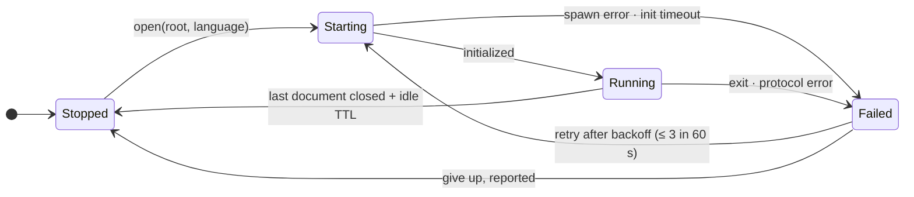

# 10 — Language intelligence

Diagnostics, hover, go-to-definition and symbols come from language servers, supervised by the node
and proxied to the editor. Nothing here parses source itself.

---

## Why servers, and why no parser of our own

Monaco tokenises for display. For anything structural — where is this defined, what is wrong on
this line, what symbols does this file contain — there are two options: a language server, or an
embedded parser such as tree-sitter.

The platform uses language servers only, never an embedded parser. A language
server gives every feature at once for languages that have one, and the people who use an IDE for
a language have that server installed already. tree-sitter would give an outline for languages with
no server running — at the cost of one `cc`-compiled C grammar per language in the build, a native
dependency this platform avoids. It is not built; a language with no server has no outline.

---

## The crate

`bisa-lsp` — a leaf crate depending on no crate of ours, with a hand-written `Content-Length`
codec over `tokio` and every payload kept as a `serde_json::Value` ([crates/lsp.md](../crates/lsp.md)).

One supervised process per `(language, project root)`. A workstream shares its project's server only
when the server supports multiple workspace folders; otherwise it gets its own. Crash-loop
containment is three starts in a rolling minute, then `Failed` with the reason on the status bar and
nothing forked forever.

---

## Which server — the catalog, again

Servers are configured the way harnesses are, because the shape is the same problem:

| Tier | Source | Examples |
|---|---|---|
| presets, probed on `PATH` | compiled in; never installed by the platform | `rust-analyzer`, `typescript-language-server`, `pyright-langserver`, `gopls`, `clangd` |
| user descriptors | `settings.lsp.servers[]` at `Machine` scope: `{language, command, args, initialization_options}` | anything |

An installed preset shows as available; a missing one shows with its install hint, exactly as the
harness picker does. A descriptor is validated like a custom harness descriptor: reserved
environment keys are stripped, and the command runs through the login shell so it sees the same
`PATH` a terminal does.

---

## The proxy

The editor speaks LSP to the node, not to the server: `POST /ide/lsp/{scope}/{id}/request` with
`{path, method, params}` for requests, and notifications on the `engine` stream as `Lsp { root, payload }`. The node owns the
process, the document synchronisation (`didOpen`/`didChange` from the editor's own buffer, so
diagnostics reflect what is typed, not what is saved) and the mapping between the editor's
root-relative paths and the server's `file://` URIs. The webview never learns an absolute path from
the server: URIs are rewritten to root-relative on the way out.

Features surfaced in the editor: diagnostics as gutter markers, hover, go-to-definition, find
references, document symbols, workspace symbols (which feed the omnibox's symbol rows) and
formatting on save (behind `editor.format_on_save`). No rename, no completion, no signature help,
no semantic tokens and no problems list — the diagnostics live in the gutter (see the known gaps);
the proxy's allow-list (`ALLOWED_METHODS`) names exactly what the editor asks for. Find references
peeks within the document; a reference in another file opens that file, as a definition elsewhere
does. `lsp.enabled` switches the whole of it off. A document's path is contained by the root
before it becomes a URI a server would read.

---

## Bounds

- **No server runs unless a document of its language is open in a workbench.** Idle TTL is
  `lsp.idle_ttl_secs` (default 300): a server stops once its last document has been closed for
  the whole of it, and not when one was opened and closed again since (`lsp::gone_idle`).
- **One server per root and language, however many documents open at once.** A workbench that
  restores its tabs opens them together; a start goes through one gate per root and language
  (`LspRegistry::start_gate`), so whoever comes second is given the first's server — never a
  server each, of which the fourth would be counted as a crash loop (`MAX_STARTS_PER_MINUTE`)
  and the language given up on.
- **Diagnostics are per open root**, never workspace-wide across every project: a workspace with
  forty projects does not start forty servers because the rail lists them.
- **A server's output is never parsed as prose.** Protocol frames are typed; a frame that does not
  parse is a `Failed` transition with the parser's words as the reason, not a guess.
- **A server that stopped leaves no document behind.** A server knows the documents it was told
  of, and the next one knows none. On `bisa/serverStopped` for a root and language — a person's
  *Restart*, a crash, an `lsp.*` setting that changed — the editor opens every open document of
  that root and language again, with its buffer as it stands, and clears the diagnostics the
  server that went had published; a server that is there again (`bisa/serverStarted`, or
  *Restart* answered after the crash loop's verdict) takes the documents on none, and one that is
  followed or being opened is not opened twice (`lspModel.documentsToReopen`). For that the
  editor must know which server's a document is even when none took it: an open answers
  `{path, language, following}` (`lsp::DocumentOpened`) — the language the path is whenever the
  catalog knows one, and whether a server of it now holds the document — so a Rust file opened
  with servers off, none configured, or the crash loop's verdict standing is remembered as Rust
  on no server and opened again the moment that server starts; only a path no language applies
  to answers `null`, and nothing more is ever sent for it. Of two opens out,
  the newest's answer stands, and an edit waits for an open rather than race it to a server that
  is still starting. The loop ends where the node ends it: the verdict answers no server and
  starts nothing. A node that restarted while the bus was down said nothing of the servers it
  lost, so when the bus comes back each followed document is sent again whole as a change: the
  node opens it on a server that holds no such document, and one that still does takes the text.
- **The chip says the state as it is.** The editor's chip for a document's server — *rust server
  running*, the reason on its hover and *Restart* when it failed, the install hint when the
  command is not on `PATH` — is `lspModel.serverChip`, the state in the catalog's words; its
  status row is read again on each of the server's lifecycle notifications.

---

## Tests

`scripts/test crate lsp` — the supervisor against processes on every machine (a command that is
not there, one that exits before `initialize`) and against the package's own scripted server
(`tests/scripted_lsp.rs`, built as `scripted-lsp`): the handshake and its capabilities, a hover
answered, a diagnostic delivered, a server's own error as the answer to a method it does not have,
a frame that is not one failing the server with the parser's words, a crash mid-session failing it
with its last words on stderr. `scripts/test module node ide` holds the status route honest
without a server — and a Rust file opened with servers off named as Rust that nothing follows.
`scripts/test module engine lsp` holds the registry: six documents opened at
once share one server and every one is open on it, another root has a server of its own, a request
off the allow-list and a document outside its root are refused, servers switched off at this
machine start none and still name the language, and a change to an `lsp.*` setting forgets a
crash-loop verdict (the verdict itself names the language and follows nothing) — its "server"
a few lines of shell the test writes, which says it started and answers `initialize`. The unit
tests beside `crates/bisa-engine/src/lsp.rs` hold the idle stop's decision, the start ledger per
root and language, and the one gate a start goes through. `scripts/test module engine docs` holds
the HTTP reference to `lsp::ALLOWED_METHODS`. No test starts a real language server.

The editor's half is `desktop/src/views/_workbench/lspModel.test.mjs`: positions, ranges,
severities and symbol kinds mapped both ways, hover in its four shapes, locations and symbols in
theirs, text edits applied from the end with overlaps refused, the palette's rows from
`workspace/symbol`, a lifecycle read off the engine's three notifications and no fourth, which
documents a stopped or returned server leaves to be opened again (a crash loop stepped to the
verdict and out of it by *Restart*), the chip's words, tone and hover per state, and the client's
wiring held by its source. `editorModel.test.mjs` holds format on save: the setting and the
options, and a save that formatted leaving the buffer clean on what it wrote.
