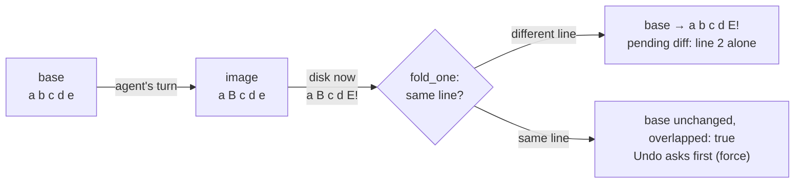

# 20 — Reviewing agent changes

A turn of a conversation about a checkout — a project's or a workstream's — used to run at `Exec`
in the tree with nobody watching until the person happened to open Git › Changes, and a call a guard
rule sent to a person had nobody to go to: a conversation about a checkout has no goal, so an
above-ceiling request or a rule's `ask` was refused outright, for want of an Inbox to escalate to.
Now a conversation about a checkout has a **mode** that says how far its agent goes on its own, a
**change ledger** that attributes every edit to the turn that made it, a review in the conversation
and in the file, inline **asks** answered where the person is reading, and a **restore** to before a
message. None of this reaches a worker, a terminal harness, a workstream agent, a goal's thread or a
channel — those write outside the ledger's attention, and the ledger survives what they do
([the conflict rule](#the-conflict-rule)).

Everything here is `SessionKind::Conversation`, turn by turn, and only where
`ConversationOrigin::is_checkout` — a project's or a workstream's conversation. Elsewhere a
conversation still has no mode and no ledger: it runs in the agent's own scratch folder and changes
nothing a person reviews.

---

## Modes

`ConversationMode` (`bisa-core`'s `conversation.rs`) is `manual` — the default — `auto`, or `plan`.
It is set on `Conversation.mode`, read fresh on every tool call so a switch holds from the very next
one, and it never loosens the Tool & Commands Guard, the Redactor or the Classifier: the guard's
rules always come first, in every mode, and a rule's `deny` refuses whatever the mode says. A new
conversation about a checkout starts in whatever `agents.conversation.mode` says (machine, workspace
or project scope — `engine::conversations::default_mode`, resolved at the project); changing it
afterwards is `set_mode`, refused for a conversation whose origin is not a checkout.

| | reads | file edits | commands (`Exec` tier) | pending changes |
|---|---|---|---|---|
| **manual** | run | land on disk, pending and owed a word | the guard's rules first; a call no rule decided is **asked in the conversation** | stay until Keep or Undo |
| **auto** | run | land, pending but never owed | run under the guard and the classifier as before; a guard rule's own `ask` is now asked in the conversation (it used to be refused) | kept automatically when the person's next message begins the next turn; still restorable |
| **plan** | run | **refused**, with a sentence | asked in the conversation | the reply is the plan; *Build this plan* returns the mode to what it was and posts a hand-off message |

### Mode → tier ceiling → `Reach`

The mechanism is one function of the mode: `ConversationMode::ceiling` (`manual` → `Write`, `auto` →
`Exec`, `plan` → `Read`) feeds the same `Reach { tier, ceiling, above }` every other session's
permission funnel uses (`security::decide_tool`, [11 — Security](../11-security.md#the-guards-evaluation-order)).
A call within the ceiling runs; one above it that no guard rule decided is what the mode's own column
says. `ConversationMode::writes()` is `false` only for `plan` — a plan's `Write`-tier call is refused
outright with a sentence (`inputs::PLAN_REFUSAL`) rather than asked, because a plan changes nothing.
The mode is said to the agent on every turn as its own paragraph (`framing::mode_note`), prepended to
the first prompt and to every follow-up a live session is handed, so an agent reading its own
instructions always knows which mode it is answering in.

### The harness requirement

`plan` needs a harness the guard can stop before a tool runs — `HarnessCaps::TOOL_GUARD` (Claude
Code, GitHub Copilot CLI, Grok Build, Gemini CLI, any ACP agent) — because a plan that cannot be held to reading is no plan.
`ConversationMode::needs_tool_guard()` is checked once, at wake time
(`engine::conversation::wake_attempt`), against the same `guarded` flag that decides whether the
turn's edits are bracketed one call at a time (below): on any other harness the wake is refused and
the agent posts a sentence saying so — *this conversation is in plan mode, and I run on \<harness\>,
which the platform cannot hold to reading* — rather than launching and hoping the harness's own
prompt stands in for the guard.

`manual` and `auto` carry no such requirement. On an unguarded harness (Codex, pi, OMP, OpenCode, a
custom JSON harness, an A2A remote — "observed only", [11 — Security](../11-security.md#which-harnesses-it-can-stop))
manual still reviews after the write, because the write still lands and the ledger still tracks it —
but the whole turn is **one attribution window** rather than one bracket per call, since the harness
never asks before a tool runs and the tracker never learns which call did what
([Attribution](#attribution)); its commands are never asked in the conversation either, because the
harness's own sandbox is standing in for the guard, not the platform's ask.

The second setting, `agents.review.checkpoints` (an integer, 1–200, default 20, machine or workspace
scope), is how many turns stay restorable: `ChangeLedger::prune` drops the oldest turns past that
count, never one with a change still pending.

---

## The ledger

Machine-local, never synced: `ide/changes/<conversation>/ledger.json`, beside `blobs/<sha256>` and a
private git `index` (`bisa-store`'s `changes.rs`, `paths.rs::changes_dir`). A conversation's deletion
takes the whole directory with it (`Workspace::remove_changes_of`).

A `ledger.json` that no longer parses does not stop the conversation: the read moves it aside as
`ledger.unreadable.json` (`bisa_store::UNREADABLE_LEDGER`) — never deleted — says so at `error` with
the conversation's id, and answers an empty ledger. What waited for a word is no longer under
review, the files in the checkout are as they were, and while the file lies there no blob is
collected, so the ledger set aside still names bytes that exist.

- A **turn** (`bisa_core::TurnChanges`) lists every file it touched: its `base` — the file before the
  turn's first touch — set once, and its `image` — as the turn left it — moved on every touch. Turns
  that changed nothing leave no record.
- The **review** (`bisa_core::ReviewFile`) has one entry per file still owed a word: its `base` is
  what a *Keep* moves forward and an *Undo* writes back to; its `image` is the disk as the ledger
  last knew it, which is what tells an outside write from the agent's own.
- The bytes are blobs the store addresses by [`Sha256`] under `ide/changes/<conversation>/blobs/`;
  `ChangeLedger::write_change_ledger` collects the blobs the ledger no longer names every time it
  writes. A file over 20 MiB (`bisa_store::MAX_CHANGE_BLOB`, a bound of its own: the editor's refusal
  bound as nobody set it, and not moved when a machine moves that one —
  [ide/03](03-files-and-editing.md#read-caps-and-large-files)) is never tracked at all, rather than
  tracked without the bytes an Undo would need. A binary file — sniffed from its bytes, never its
  name — is `opaque`: kept or undone whole, never by hunk.
- States (`ChangeState`): `pending` · `kept` · `undone` · `gone`. Kinds (`ChangeKind`): `created` ·
  `modified` · `removed`, from whether the file stood before and after the turn's first and last
  touch. A rename is a removal and a creation — there is no rename kind.
- The index schema is version 26, and `conversations.mode` — version 21's mark — is the one column
  it holds for any of this. What a turn
  changed is not indexed at all — the ledger and its blobs are files, read straight
  ([08 — Persistence](../08-persistence.md)).

---

## Attribution

The tracker (`engine::changes::tracker::ChangeTracker`) watches one conversation session's own tool
calls and attributes what they change to the turn under way.

- **A file edit** — a `Write`-tier call naming its file in `file_path`, `path` or `notebook_path`
  (the guard's own field list) — is **bracketed exactly**: the file is read when the call is
  *allowed* (`ChangeTracker::allowed`) and again when the tool *ends* (`tool_ended`). What moved
  between those two reads is the call's alone.
- **A command** — an `Exec`-tier call — names no file, so a git checkout is **snapshotted** right
  before it runs and compared right after: `bisa_vcs::snapshot::snapshot_tree` stages the whole
  checkout through a **private `GIT_INDEX_FILE`** — the person's own index is read once, to seed the
  stat cache, and never written — runs `add -A` (so `.gitignore` is honoured, and an ignored `target/`
  is never in the snapshot) and `write-tree`; the objects land in the repository's object store
  **unnamed** — no ref, no commit — and are read within the turn that made them, git collecting them
  in its own time. `bisa_vcs::snapshot::changed_between` (a `diff-tree`) says what moved since the
  last snapshot, and `blob_at` reads a path out of one. Between the conversation's own tool calls
  nothing is attributed — a write there is somebody else's ([The conflict rule](#the-conflict-rule)).
- **A harness the guard cannot stop** (an unguarded manual or auto conversation) raises no call to
  bracket, so its whole turn is **one window**: a snapshot taken at `begin_turn` and swept at
  `end_turn`.
- **A root that is not a git repository** has no snapshot at all: file edits are still bracketed —
  attribution there needs no git — but what a command changed is **not attributed**, a stated bound.

Undo writes through the IDE's own write path, `engine::ide::files::write_bytes` — atomic,
compare-and-swap against the hash of the file just read, announced as `FileChanged` so an open buffer
reloads and a dirty one gets its three-way affordance. A file the agent created is disposed of the
way the explorer disposes of one, per `editor.delete.trash` (never unlinked behind a person's back)
— and the files one word unmakes go as one act once the walk is done (`ide::files::delete_entries`):
one move to the Trash, not one per file; a halt there is the error it was, the ledger left unwritten
as a delete failing mid-walk left it before.

---

## The conflict rule

When a file under review has moved on disk since the ledger last saw it, somebody else wrote it — a
person's save, a terminal harness, a worker, another conversation on the same checkout. `fold_drift`
runs before every read of the changes and every settle, and on every new turn: for each reviewed file
whose disk no longer matches `review.image`, it calls `fold_one`, which folds the outside edit into
the review's **base** with a pure three-way merge (`bisa_core::changes::rebase`, over `similar::TextMerge`) —
so the pending difference stays *the agent's change alone*. Two conversations on one checkout are
each other's outside writers; there are no locks, no lost edits, and never a conflict marker written
into a person's file.

- **Different lines** — the outside edit folds cleanly into the base, and the file's pending diff is
  unchanged in size and content.
- **The same lines** — the file is marked `overlapped`: the base keeps its own text (the outside
  edit is not silently discarded, but it is not merged in either), and an Undo of that file **asks
  first** (`force: true` is the person's yes, once told what they are overwriting).
- **Nothing left pending** — the outside write matched the agent's own base, or removed the file —
  the review closes with state `gone`.

### Worked example

The agent's turn changed line 2 of a five-line file. Before the person answers, somebody else edits
line 5.

```
base:  a b c d e
image: a B c d e     (the agent's turn)
disk:  a B c d E!    (a person's own save, line 5)
```

`rebase(base, image, disk)` is `merge3(image, base, disk)`: the base becomes `a b c d E!` — the
person's line 5 is folded in, unchanged — and the pending diff against the disk is still exactly the
agent's one hunk, line 2. Nobody's edit was lost and nothing needed a word from anyone.

Had the outside edit touched line 2 instead — the same line the agent changed — the merge conflicts:
the base keeps its own line 2 (`rebase` never writes conflict markers into the file), the review is
marked `overlapped`, and an Undo of that file is refused until the person says `force`.



---

## Settling a change

A person's word is said through `POST /conversations/{id}/changes/settle` — **Keep** moves the
review's base forward to where the disk stands; **Undo** writes the base back — at one of four
grains (`settle::Target`):

| Grain | What it means |
|---|---|
| `all` | every file still under review |
| `turn` | one turn's change to every file it touched — folded into or taken back out from under whatever other turns still have pending changes to the same files (`fold_in`, `take_back`) |
| `file` | the whole of one file's pending difference |
| `hunk` | one hunk, cut against the disk hash the caller last read the file at — a settle of a stale hunk is `409`, refetch the file view |

`Settled { files, pending, skipped }` says how many files the word reached, how many still wait, and
which it left alone — each a `{path, why}` a person reads. **`skipped`** happens two ways: a file
`overlapped` and not `force`d ("somebody else edited the same lines; undoing it would undo their edit
too"), or a file that moved on the very lines being settled between the read and the write ("the file
changed on the same lines since; it was left as it is") — the settle re-runs `fold_drift` first, so
this is rare, not routine. **`overlapped`** is the conflict rule's own flag, above. **`force`** is the
person's yes to settle an overlapped file anyway. **`gone`** is a file's terminal state when an
outside write removed it or put it back to exactly the review's base — there is nothing left of the
agent's own to keep or undo.

A file the agent created is disposed of per `editor.delete.trash` when an Undo unmakes it — the
files of one word as one act, gathered along the walk and disposed of at its end; undoing
one turn's change to a file other turns have also touched is a three-way take-back
(`bisa_core::changes::take_back`), and a conflict there leaves the file alone, named in `skipped`,
rather than guessed at.

---

## Restore

`POST /conversations/{id}/changes/restore { turn }` goes back to before the message that woke `turn`:
`ChangeLedger::restore_plan` collects every file touched at or after that turn, each with the blob it
goes back to (the **earliest** such turn's `base`) and the blob the agent left last (the **latest**
such turn's `image`). Each file is taken back with a three-way merge against the disk as it stands
now; one that would conflict is left alone and named in `skipped`, exactly as an Undo. The messages
stay — a conversation is a record, not a branch, and restoring changes files, never what was said.

**The bound**: `restore_plan` reads only the turns' own `base` and `image` — frozen at the moment
each turn touched the file — never what a settle has done to the file since. So once one turn's
change has been undone out from under a later turn (a `turn`-grain Undo, above), a later restore to
before an *earlier* message still rebuilds its plan from the later turns' own frozen bases and
images, not from whatever state that earlier settle already produced.

---

## The asks desk

A turn of a conversation about a checkout has no goal, so before this feature an `ask` there had
nobody to go to and was a refusal (`inputs::no_goal`). Now `engine::changes::asks::ask` parks the
call: a card at the foot of the timeline (`AskView { id, agent, subject, question, grantable,
opened_at }` — `subject` is `{kind: tool, tool, tier}` for a call, `{kind: content, source, url?,
reason, excerpt}` for what an agent was about to read from outside — the question already
redacted), and the person answers where they are reading — *Allow
once*, *Allow for this conversation*, or *Deny* with a note the agent hears as the reason. `plan`
mode's edits are never a question here: a `Write`-tier call above the `Read` ceiling is the
`PLAN_REFUSAL` sentence outright, not an ask.

An ask lives exactly as long as its session: nothing is stored (`AskDesk` is in-memory, per
conversation), a restart leaves none behind, and a session that goes away answers its own open asks
*no* by dropping the sender. **`grantable`** is true only for the mode's own ceiling ask (the
`tier_ceiling` rule) — never a guard rule's own `ask`, which asks every time by design — and *Allow
for this conversation* is offered only then; granting it remembers the tool (`AskDesk::granted`),
answered at once next time without reopening a card — while the conversation stays in the mode the
grant was given in. A change of mode ends every grant of the conversation
(`AskDesk::revoke_grants`, called by `conversations::set_mode`): what was allowed under one ceiling
is asked again under another, and setting the mode a conversation already has changes nothing.

The desktop reads a conversation's asks, its changes, its record and its timeline again when the bus
comes back after the node was away (`ui/useReloadOnReconnect`): a restarted node holds no ask, and no
frame says so.

---

## Routes and bus frames

The six HTTP routes, their bodies and their answers are in the generated reference:
[`docs/reference/http-api.md`](../../reference/http-api.md) — `GET /conversations/{id}/changes`,
`GET /conversations/{id}/changes/file`, `POST /conversations/{id}/changes/settle`,
`POST /conversations/{id}/changes/restore`, `GET /conversations/{id}/asks`,
`POST /conversations/{id}/asks/{ask}`. Every route is 400 for a conversation that is not about a
checkout, and hunks are always the server's — the desktop never computes one.

The engine's bus carries `changes_moved { conversation, workstream, pending }` (a re-read is owed —
event `changes.moved`), `changes_settled { conversation, act, files, skipped }` (an activity fact,
concept Projects — event `changes.settled`), `ask_opened { conversation, ask }` and
`ask_settled { conversation, ask_id, allowed }` (events `conversation.ask_opened` and
`conversation.ask_settled`), and `conversation_changed { id, change: "mode" }` — a new word beside
`renamed` · `archived` · `unarchived` · `deleted`.

---

## The desktop surfaces

Every surface reads the routes above and re-reads on `changes_moved`, `changes_settled`,
`ask_opened` and `ask_settled` — nothing polls, and the desktop never cuts a hunk of its own.

- **The mode picker** sits at the foot of the composer of a conversation about a checkout, and
  nowhere else: a chip naming the mode that opens a dropdown (`ChoiceMenu`, the kit's radio menu) of
  *Manual · Auto · Plan*, each with its one-sentence meaning under its name. `Shift+Tab` in the box
  cycles it ([15 — Keymap](15-keymap.md#review)). *Plan* is offered disabled, with the reason, when
  the addressed agent's harness is one the guard cannot stop. A change is one
  `PATCH /conversations/{id}`.
- **A turn card** draws under the reply of the turn that made the changes — under the message that
  woke it when the turn posted none — with each file as a `ChangedFileRow` (its kind's glyph, the
  path with its folders dimmed, `+a −r`, the state's chip) and **Keep · Undo · Undo with a note** as
  buttons per file and for the whole turn; settling — the busy word, the *also edited by someone
  else* confirm, the note posted after the undo — is `useFileSettle`'s, shared with the bar. A file's
  name opens it in the centre on its diff (`reviewOpenDrafts`: Source mode and the lens on are written
  to the document's own session drafts before the path door opens it, whatever the document
  remembered — a `.md` that opens rendered lands on its changes). An `overlapped` file says *also edited by someone else*, and its Undo asks first and then
  sends `force`. *Undo with a note* is two acts: the undo, then the note posted to the conversation
  as a message. What a settle left alone is named in a toast, with its `why`.
- **The changed-files bar** (`ChangedFilesBar` over `changedFilesModel.mjs`) stands above the
  composer, the shape Cursor's and Copilot's chats give the same fact: one line — *3 files changed by
  Reviewer · +40 −12*, every pending path once, the later turn's word winning, *by 2 agents* past one
  — that opens to a `ChangedFileRow` per file with *Keep* and *Undo*, and a footer of buttons:
  **Undo all** (danger), **Keep all** (primary), **Review** (the first pending file, on its diff),
  *Attach* (the changes as hunk chips on the next message). In `auto` the footer says the changes are
  kept when the next message is sent. Nothing of git's working tree is drawn in the composer — the
  Git panel's alone — which is what tells the agent's changes from the tree's.
- ***Restore to before this message*** is on the person's message that woke a turn, and confirms
  first: it writes files.
- **An ask card** stands at the foot of the timeline for each open ask: the tool, its tier, the
  redacted question in a block, and *Allow once · Allow for this conversation · Deny* — the second
  only when the ask is `grantable`, the third with an optional note. A content ask names its
  source, the URL as text, the excerpt folded, and why it was held — the node's `reason` drawn as
  it came in one sentence (`conversationAskModel.reasonWords`), never matched as English
  (`views/_studio/conversationAskModel.test.mjs`).
- ***Build this plan*** and *Refine* draw under the timeline while the mode is `plan` and no turn
  runs. *Build* is one act of the node's (`POST /conversations/{id}/plan/build`,
  `conversations::build_plan`): the mode goes back to the one the conversation was in before the
  plan — the record remembers it (`mode_before_plan`), so no screen has to and a reload changes
  nothing; `manual` when it began in a plan; a refusal (409) when it is not in one — and the
  desktop then posts *Build this plan.*; *Refine* puts the caret in the composer.
- **The review lens** is the editor's: a root file with a pending review shows its diff — `base_text`
  against **the live, editable buffer**, saved by the path it always was — **inline by default**,
  removed and added lines in one column with the unchanged regions folded, so a long file reads as its
  changes (`DEFAULT_LENS_LAYOUT`; a toggle on the bar shows it side by side, remembered per document,
  `lensLayoutKey`); a compact widget under each server hunk's `disk` span — *Change 2 of 5 · Keep ·
  Undo*, one row — and a bar: previous and next change with their chords in the tooltips, *Keep
  file*, *Undo file*, *Next file (2 left)*, the layout toggle, and a glyph that drops the lens,
  remembered per document for the session. An Undo is made against the disk, so it is refused with
  *save first* while the buffer is unsaved. A stale `disk_hash` is a 409: the lens re-reads and says
  so. An opaque file offers the whole-file verbs alone. The lens draws in a document's *Source* mode;
  a rendered or split view of a file whose changes wait wears a banner — *This file has 3 changes to
  review · Show diff* — rather than hiding them.
- **A tab** whose file still waits wears *to review* beside its name.

---

## Compared to other tools, and what is different here

Pending edits kept or undone with checkpoints to fall back to are VS Code Copilot's and Cursor's
shape — as are the changed-files summary above the chat's box with *keep all · undo all*, the inline
diff with a per-change *Keep · Undo* and a side-by-side toggle, and one send button that is *Stop*
while a turn works; a review policy over what an agent may do on its own, and a plan step before it
acts, is Antigravity's, as is keeping the agent's edits apart from the working tree's. What differs
here: a change is grouped **by turn**, not only by file, so a whole
turn's edits settle or restore together; an Undo survives every other writer of the checkout by a
pure three-way merge rather than a lock or a last-write-wins overwrite; the asks a guard would
otherwise refuse or escalate to an Inbox are answered **in the conversation itself**, with no gate of
their own; and file-edit attribution needs no git repository at all — only a command's attribution
does.

## What it is not, and its bounds

- **Not a new authority.** The mode sets a ceiling under the same `Reach` every session obeys; a
  guard rule's `deny` refuses in every mode, and the Redactor and the Classifier are unchanged.
- **Not synced.** The ledger, its blobs and the private git index are this machine's alone
  (`ide/changes/`), like every other local, unsynced state under `ide/`.
- **No `git merge-file`.** The three-way merge is pure Rust in `bisa-core` (`similar::TextMerge`),
  not a subprocess.
- **No named recovery ref.** A command's snapshot is an unnamed git object read within its own turn;
  a restore's recoverability is the ledger's own blobs, not a `refs/bisa/review/*` ref.
- **A rename is a removal and a creation** — there is no rename tracking in the ledger.
- **A command's attribution needs a git root.** A non-git checkout still tracks file edits exactly
  (they need no git object), but a command's change is not attributed there at all.
- **An unguarded harness's turn is one window.** Manual and auto still review its writes, but
  per-call attribution and in-conversation asks for its commands do not apply — the harness's own
  sandbox stands in, as it does everywhere else the guard cannot reach.
- **`plan` needs `HarnessCaps::TOOL_GUARD`.** On any other harness the wake is refused with a
  sentence rather than launched unguarded.
- **A file over 20 MiB is not tracked**, and a binary file is kept or undone whole, never by hunk.
- **Restore reads frozen turn state**, not settle's history — see [Restore](#restore)'s bound above.
- **No MCP tool settles a change.** `bisa conversation keep|undo|restore` and the HTTP routes are a
  person's; an agent never settles its own change.

## What holds it

| The promise | Held by |
|---|---|
| The three modes from end to end, through the binary while a node runs: in `manual` an edit lands and waits, is read as one hunk against what the file was, and is undone to what it was; a command is asked in the conversation — the card's subject, its words, *grantable* — allowed once and its change the turn's as the edit is, answered twice refused; a turn kept; a command denied with a note and nothing run; in `plan` an edit refused outright and nothing asked; the review as it was after the node went and came back; in `auto` an edit and a command running unasked, pending and not owed, kept by the message that follows; a restore to before the message that woke a turn, what was said left said | the journey `crates/bisa-cli/tests/it/e2e/a_conversation_about_a_checkout.rs` — the agent is the scripted one over ACP, announcing each call once and naming it by its id after |
| What changes a conversation goes through the node that runs — started, titled, its mode, put away (the turn running in it stopped), taken back out, deleted with its review — each said on the bus in order | the same journey, its second test |
| Attribution: an edit bracketed, a command swept from a snapshot, a harness the guard cannot stop one window a turn, a turn that changed nothing leaving no card, what cannot be reviewed never tracked | `crates/bisa-engine/tests/it/changes.rs` (`a_file_edit_is_attributed_to_its_turn_and_waits_for_a_word`, `a_command_is_swept_from_a_snapshot_and_what_moved_before_it_is_not_its`, `a_harness_the_guard_cannot_stop_is_one_window_per_turn`, `a_turn_that_changed_nothing_leaves_no_card`, `what_cannot_be_reviewed_is_not_tracked_and_never_written_back`) |
| The conflict rule: an outside edit elsewhere folded, one on the agent's lines `overlapped` and its undo asked first, two conversations each other's outside writers | `changes.rs` (`somebody_elses_edit_elsewhere_in_the_file_survives_an_undo`, `an_edit_on_the_agents_own_lines_is_overlapped_and_an_undo_asks_first`, `two_conversations_on_one_checkout_are_each_others_outside_writers`) · the merge itself in `crates/bisa-core/src/changes.rs` unit tests |
| Settling, at every grain and said twice; a stale hunk a 409; bytes whole; a file made unmade and a file removed brought back | `changes.rs` (`a_word_said_twice_is_said_once`, `an_undo_said_twice_undoes_once`, `a_hunk_read_from_a_file_that_moved_since_is_refused`, `bytes_are_kept_or_undone_whole_and_never_by_the_hunk`, `a_file_the_agent_made_is_unmade_by_an_undo`, `a_file_the_agent_removed_comes_back_with_an_undo`, `many_words_at_once_settle_every_file_exactly_once`) · `crates/bisa-node/tests/it/changes.rs` |
| Restore, and its bound | `changes.rs` (`two_turns_on_one_file_are_undone_apart_and_a_restore_goes_back_before_both`, `a_restore_leaves_a_file_alone_when_it_would_lose_somebody_elses_edit`, `a_restore_said_twice_goes_back_once`) · `node changes::a_kept_turn_is_still_gone_back_to_before` |
| How many turns stay to go back to (`agents.review.checkpoints`), never one still owed a word | `changes.rs` (`the_turns_to_go_back_to_are_as_many_as_the_setting_says`) · `core changes::pruning_never_drops_a_turn_with_a_change_still_pending` |
| The modes' rules: a rule's deny in every mode, a plan on a harness the guard cannot stop refused in words, a mode changed between two messages holding from the next call, a grant ended by a change of mode | `changes.rs` (`a_rule_that_refuses_still_refuses_in_auto`, `a_plan_on_a_harness_the_guard_cannot_stop_is_refused_in_words`, `a_mode_changed_between_two_messages_holds_from_the_next_call`, `allowed_for_the_conversation_ends_when_the_mode_changes`) |
| The asks desk: answered where the person reads, a deny's note heard, an answer nobody is left to hear refused, a deleted conversation answering its asks *no* | `changes.rs` (`manual_asks_a_command_in_the_conversation_and_the_person_answers_there`, `a_deny_with_a_note_is_what_the_agent_hears`, `an_answer_nobody_is_left_to_hear_is_refused_in_a_sentence`, `a_deleted_conversation_answers_its_asks_no_and_leaves_the_checkout_alone`) |
| The ledger on disk: pending changes outliving a restart, one that does not parse set aside | `changes.rs` (`pending_changes_outlive_a_restart_and_are_still_undone`, `a_ledger_that_does_not_parse_is_set_aside_and_the_conversation_goes_on`) |
| A tool call known by its id, whatever a later message leaves out — so the guard judges, and the review brackets, the call that was announced | `crates/bisa-adapters/src/acp.rs` unit tests (`a_tool_call_is_known_by_its_id_whatever_a_later_message_leaves_out`, `a_tool_keeps_the_name_it_started_under_and_is_forgotten_once_it_ends`) |
