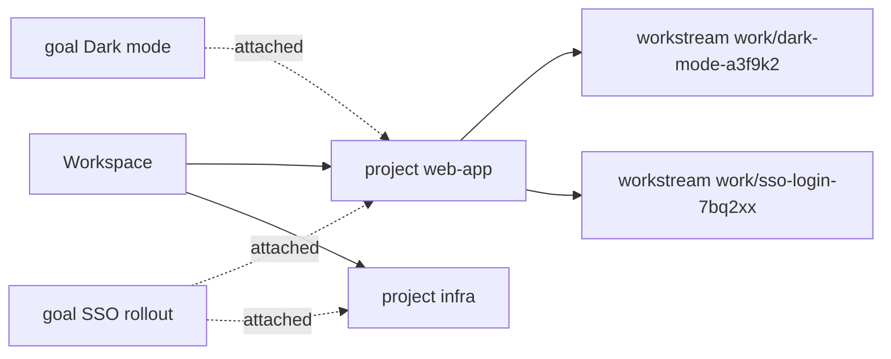

# Projects

A **project** is a real folder on disk, with or without git, that work actually runs in. It belongs
to the **workspace**. A **goal** does not own a project; it is **attached** to one — zero or more
projects per goal, zero or more goals per project — and the attachment is one record that moves
nothing when it is made or undone. A **workstream** is where one piece of work happens: a branch and
a checkout that survive to a commit, a push and a pull request.

Three rules shape everything below.

- **Never write into a folder you did not create.** Adopting an existing folder writes nothing into
  it, ever; importing one only *reads* it. Inside a folder Bisa just made there is nothing to
  protect, which is why `bisa project new` runs `git init` unconditionally.
- **Outward actions pass the `publish` gate.** A commit is local. A push or a pull request leaves
  the machine and cannot be taken back, so it passes a gate.
- **The safe tier never reverts a file.** What an agent reaches — `bisa-vcs`'s `git.rs` — creates,
  stages, commits and pushes, and never spells `checkout`, `restore`, `reset`, `clean` or `stash` as a
  command; a test greps the source to keep it that way. *Discard*, *Delete*, *Drop* and *Abort* exist
  in the IDE alone, on the consented tier: a person asks, a recovery ref under `refs/bisa/safety/`
  is written first, and the words name it ([the IDE](the-ide.md)).

## The model



| Field | Meaning |
|---|---|
| `id` | ULID, stable across renames |
| `name` | what the project is called everywhere in the app; in the desktop it is typed first and the slug is derived from it |
| `slug` | the directory name, workspace-wide and unique; lowercase letters, digits, `-`, `_` — derived from the name in the desktop (editable before creation), typed on the CLI |
| `root` | `managed` (under `projects/<slug>/tree`) or `external` (adopted, left where it is) |
| `vcs` | `none`, or `git { default_branch, remote?, code host? }` |
| `assignees` | who works on it — agents, humans, teams |
| `publish` | `manual` · `gated` · `auto` (default) |
| `tags` | how it files |
| `origin` | where it was born — `workspace`, `goal { goal, step? }`, or `step { goal, run, step, workflow }` — recorded once by the engine, never sent; `step` under `goal` names the step of the goal's own design that made it |

The slug is an allowlist, not a denylist, which is what makes `..`, absolute paths and unicode
lookalikes impossible rather than merely filtered.

Why attachment and not ownership: a project a goal owned had to be *linked* into every other goal
that needed it, a second relation with its own semantics; detaching meant moving a directory; and a
project with no goal could not exist at all, which is exactly the case an IDE lives in. One relation
answers every question — "can this goal's agents see this project?" is "is it attached?" — and
`projects/` and `goals/` are siblings on disk. See
[04 — Workspace, Project, Goal](../architecture/04-workspace-project-goal.md).

## Four ways in, and attaching

| Command | What it does |
|---|---|
| `bisa project new <slug>` | create the folder and `git init` it; the repository inherits your global git config unless `--committer "Name <email>"` or `--git-config key=value` sets its local layer |
| `bisa project clone <url> [--slug <slug>]` | `git clone` into a new folder |
| `bisa project import <path>` | **copy** an existing folder into the workspace; the source is only read |
| `bisa project adopt <path>` | point at a folder anywhere on disk; nothing is written into it |

Each takes `--goal <id>` to attach the new project in the same call, `--publish
gated|manual|auto`, `--assignee` and `--tag`. Without `--goal` the project belongs to the workspace
alone. In the desktop the *New project* dialog asks for the **name** first and derives the slug from
it (`Build a Landing Page` → `build-a-landing-page`); a clone or an import starts its name from the
tail of the URL or the folder. The slug stays editable until the project exists. **The dialog asks
nothing about goals**: a project made there is the workspace's, and attaching it is one record made
afterwards — *Attach to a goal…* under About › Goals or on the rail's project menu (one dialog: the
goals the project is not yet on, the only one chosen for you), or `bisa project attach`. The rail's
**Import** button beside `+` (`⌘⇧O`) opens the same dialog on *Import · Clone*; the project lands in
the Workspace tab whatever tab you are on, and the dialog's one sentence says so. The one door that
fixes a goal is a goal heading's *Import into this goal…*: the project is attached as it is made,
lands under that goal in Goals, and the sentence names it. An imported project is always yours —
born of the workspace or a goal, never of a step — so it never lands in Workflows.

```sh
bisa project new storefront --publish gated
bisa project clone https://github.com/acme/storefront --slug storefront --goal $GID
bisa project import /Users/you/code/storefront
bisa project adopt /srv/existing-repo
bisa project attach <project> <goal>        # one record; nothing moves
bisa project detach <project> <goal>        # one record removed; nothing moves
bisa project list                           # every project in the workspace, with its goals
bisa project list --goal $GID               # the projects attached to one goal
bisa project show <project>
bisa project assign <project> agent:developer human:<pubkey>
bisa project rm <project> [--tree]
```

Starting a goal's work with a project — `bisa new … --input project=<id>`, `bisa run <goal> --input
project=<id>`, the run form's project picker — attaches it: you said where the work is done.
Attaching is additive, reversible and asks for no confirmation. Detaching asks — not for approval,
for belief: *nothing is deleted; the folder, its branches, its checkouts and its history stay where
they are; work items that already ran keep their record of the project; the goal's agents stop
seeing it.* Deleting a goal detaches the projects attached to it and deletes none of them; the
projects **born of** the goal take the fate its retirement dialog chose — kept, archived or deleted.
Deleting a project detaches it from every goal and deletes none of them.

A project can be **archived** — *Archive* in its menu on the rail and in About: every agent and
harness working in it is stopped, it leaves the rail and the pickers, and no goal can attach it or
run a step in it until *Unarchive*; nothing on disk moves. The rail's **Archived** switch shows the
ones put away. `bisa archive project <slug> [--undo]` does the same.

**Removing a project** is one question wherever you ask it — *Archive or remove project…* on the
rail, *Delete…* on the project's page — with each act on a row of its own, saying what it does:
**Archive it**; **Forget it, keep the files** — the project and its workstreams leave Bisa, the
folder stays exactly where it is; and the folder itself — **Move the folder to the Trash**, where it
stays recoverable, or **Delete the folder for good** when deleting to the Trash is switched off on
this machine (Settings › Project IDE › Editor), which asks once more and names the exact path, since nothing
brings it back. The words follow the setting, so the dialog never promises a Trash that is off. For
an adopted folder that last act is shown held, with the reason: Bisa did not create it, and never
deletes it. A folder that was asked to go and could not — a file in use, a permission — stays, and
the project is forgotten all the same: the toast says the folder is still on disk, where, and why,
and the log has the line.

A folder is one project's. Adopting the folder another project already holds — an archived one
included — a folder inside it, or one around it, is refused by that project's name: two projects
over one tree would each open checkouts and run scripts in the other's files. Forget the project,
and its folder is free to adopt again.

`project rm` forgets the record and every attachment. `--tree` additionally takes the working
tree off disk the same way, and is refused for an adopted folder — deleting somebody's directory
is never an index operation.

An agent's `create_project` tool takes the `new` path with no human in the loop, and attaches the
project to the goal its session serves. It cannot name a path on disk, because an agent that could
adopt a path could adopt the workspace.

### Import or adopt: the same folder, two answers

Importing copies the tree into `projects/<slug>/tree` as a managed root — `.git` and all, so the
import keeps its history; symlinks are skipped and counted; above 2 GiB or 200,000 entries it is
refused before a byte is written; an existing destination is refused, never merged into. Adopting
records the folder where it lies as an external root. Neither modifies the folder it was given, and
neither runs `git init`: an imported plain folder stays a plain project — until you ask. The desktop
offers both as one *Import* action with two placements, **Copy it in** and **Link it in place**.

**Initialise a repository** is that ask. Wherever the IDE says *a plain folder* — the Git panel, the
Workstreams panel on the project's own root, About › Checkout — one card offers the button, and
`bisa project git-init <project> [--git-config key=value]` is the same act from the shell
(`POST /projects/{pid}/git/init`). It runs `git init` in the folder (an adopted folder too: the one
write adopt allows, asked about first because the folder is not one Bisa made), applies the
who-commits policy exactly as a creation does — inherit, pin, or ask — and, when someone can commit,
makes the empty root commit `project <slug> initialised` so the next workstream is a branch rather
than the primary. Nobody set to commit means no commit: the *Who commits in …?* dialog appears and
the next workstream runs in the primary until it is answered, as for a new managed project. Existing
copy workstreams keep working as copies; only the next one opened is a branch. A project that already
is a repository is refused (409), and a folder with history of its own is recorded, never committed
over.

## Where a project comes from

A project is born one of three ways, and the record says which:

| Origin | How | Attached to |
|---|---|---|
| `workspace` | `project new`, `POST /projects`, the IDE's *New*, or an agent in a channel or a direct message | nothing |
| `goal` | `project new --goal`, `POST /goals/{id}/projects`, the goal's Projects tab, an agent in a goal's session — or an `agent` step of **the goal's own design** (the workflow drawn or proposed for that goal), which then names the step (`step: {run, step, workflow}`) | that goal |
| `step` | an `agent` step of a **library** workflow — one reused across goals, or one an event started — makes a project mid-run (its own `create_project`, or the engine's when the goal had none) | the step's goal |

The origin is history, not ownership: detaching does not clear it, and deleting the goal or the
workflow it names leaves it standing. It is shown, never edited — on the project's About panel as
*made here · from goal … (· step x) · by a step of …*, and as the rail's tabs: a project sits in
**Workspace**, **Goals** or **Workflows** by its origin, under the goal or the workflow that made it
([`the-ide.md`](the-ide.md)). A goal's own design is not a library workflow, so what its steps make
is the goal's and sits in **Goals**; only a library workflow's steps fill **Workflows**. `project
show` prints it; the activity line for a new project says it. From a goal's Projects panel, a step's row
on Progress, or a workflow's card, a project is one click from the IDE — and the rail shows it.

## Workstreams

A workstream is one checkout of a project — the place terminals, agents and editors work in. Every
project has a **primary** workstream from birth: its own root, with the project's id. The others are
a checkout plus a branch, one-to-one — or, for a project with no repository, a copy. A workstream
**may** record the goal and the work item it was opened for; one opened by hand — from the CLI or
the desktop — records neither. Its record is `projects/<slug>/workstreams/<id>.json`; a worktree's
checkout is `projects/<slug>/workstreams/<id>/`, beside the record and never inside the project
tree, so scratch cannot land in an adopted repository. The primary's checkout *is* the project tree.
Attaching or detaching the project moves none of them.

A workstream's state — `open`, `dirty`, `committed`, `pushed`, `pr_open`, `merged`, `closed` — moves
through typed transitions, and `pushed`, `pr_open` and `merged` count as **published**, which stops
cleanup discarding something that has left the machine. A commit on a branch whose pull request is
open — answering a review — leaves the record `pr_open`: it keeps the pull request it names, and what
is unpushed is the live status's to say. The states and what each means are in
[ide/07 — Workstreams](../architecture/ide/07-workstreams.md). Beside the state, and never
written by it, the record carries a person's **place on the Board** — a column, an order, a due
date ([ide/16 — The Board](../architecture/ide/16-board.md)).

Opening one resolves in this order, and the disk decides — not the record:

1. **A git project with at least one commit** → `git worktree add -b <branch> <path> <base>`, based
   on the project's `default_branch`. Re-running the same work item reuses its worktree. You can
   name the branch yourself (`--from <name>`); it is made safe, never refused.
2. **A git project with an unborn HEAD** — freshly initialised, no commits — → the item runs **in
   the primary workstream**, the project root itself, and nothing is committed for it there. Nothing
   exists to branch from, and fabricating an empty commit would write a permanent object into a
   history you have not started. This is the ordinary first run of every new project; one real
   commit heals it forever.
3. **A non-git project** → `bisa-iso` copies the root into the workstream's checkout; a `.patch`
   result is captured when the step's work settles, the copy stays for the run's later steps to
   read (a `check` sees the file the agent wrote), and it goes when the run ends.

Branch names are `work/<first 40 characters of the instructions, slugified>-<last 6 of the item
ULID>` — `work/implement-the-parser-a3f9k2` — sanitised rather than refused, so an instruction that
reads `cart total (v2)` still yields a legal ref.

```sh
bisa workstream list --project <project>
bisa workstream open <project> [--goal <id>] [--label <text>] [--agent <id>] [--from <spec>] [--base <branch>]
#   --from: a new branch name, or new:<name>@<ref> · branch:<name> · remote:<remote>/<name>
#          · tag:<name> · new-tag:<name>@<ref> · pr:<number>   (default: a derived new branch)
bisa workstream show <workstream>              # path, branch, base, ahead/behind
bisa workstream diff <workstream>
bisa workstream commit <workstream> -m "message"
bisa workstream push <workstream> [--yes]
bisa workstream pr <workstream> --title "…" [--body "…"] [--yes]
bisa workstream close <workstream> [--tree]
```

`commit` refuses a clean tree rather than making an empty commit, and an unset `user.email` comes
back as an identity error — the platform never writes anybody's global git config, and never passes
`--no-verify`. When a work item settles, the executor commits whatever the session left in a git
workstream (`<first line of the instructions>` plus an `bisa-work-item:` trailer); a clean tree
is logged and dropped; a refused commit leaves the tree as it was and journals why. **Nothing is
pushed there.** `close` forgets the record; `--tree` also removes the checkout, and they are
separate because an unpushed branch may be the only copy of somebody's work.

## The primary workstream

What happens to a workstream reaches the Inbox: its thread earns a row under the *Projects* source
when it names you or moves unread, and a committer wanted, a script that failed, a pull request
opened or merged are notices on that row — read there, opened in the Project IDE from there. A
project a workflow step made earns a row of its own the same way. The primary shares the project's
id, so the project's row and its conversation are the primary's.

A worktree belongs to one piece of work and is committed for you. The primary — the project folder —
is yours, and `git add --all` is the wrong default in a directory that may hold three unrelated
edits — so this surface is per file. The `project` verbs act on the primary; the same routes serve
any workstream by id (`/workstreams/{wid}/git/…`):

```sh
bisa project files <project>                       # what git says about each path, two letters each
bisa project stage <project> <path>...             # index only
bisa project unstage <project> <path>...           # index only — the file itself is untouched
bisa project diff <project> <path> [--staged]
bisa project commit <project> -m "…" [--path <p>]...
bisa project message <project>                     # the General Agent drafts one; it never commits
```

`files` reports the index letter and the working-tree letter separately: a file can be staged *and*
edited since, and folding that into one badge hides the one thing worth seeing before you commit. A
conflicted path is a fourth state. **An empty path list commits what is already staged, never
everything.** A clean tree, or a selection that stages nothing, is `409`. `unstage` returns a file to
*modified*, byte for byte, through `git restore --staged --source=<baseline>` — the one permitted
neighbour of a banned verb, and it touches only the index.

`message` asks the General Agent for a commit message for what is staged, in a session with no MCP
servers, a read-only tool ceiling and a 90-second budget. It suggests; you commit. A failed
suggestion is a `200` with `suggested: false` and a reason, and it must leave your draft alone.

## Searching and replacing across a project

Content search runs in the node with ripgrep's own library crates — no binary to install,
`.gitignore` honoured by construction, binaries skipped by the crate's own detection, symlinks never
followed. Results stream
so the first page renders while the rest scans; `--limit` (default 2,000) bounds the whole thing.

```sh
bisa files search workstream <workstream> "cart_total"               # literal, smart case — a project's id names its primary
bisa files search workstream <workstream> "fn .*_total" --regex --case sensitive --include "*.rs"
bisa files replace workstream <workstream> "cart_total" "basket_total"      # a preview: every line that would change
bisa files replace workstream <workstream> "cart_total" "basket_total" --apply
```

**Replace is a preview first, then one compare-and-swap write per file.** The preview carries each
file's hash; the apply writes only a file whose bytes still hash to it, and reports the others as
*skipped: changed since preview* — an agent editing between the two is never clobbered. Over HTTP
the same pair is `GET /ide/search/{scope}/{id}` (SSE) and `POST /ide/replace/{scope}/{id}`.

## The `publish` gate

| `project.publish` | `push` / `pr` |
|---|---|
| `manual` | refused — a person pushes themselves |
| `gated` | a `publish` gate opens and waits for a human |
| `auto` *(default)* | straight through |

It is the same machinery as an approval step's gate and lands in the inbox beside it; it is the one
gate that never defers to an assignment ([03 — Workflows](../architecture/03-workflows.md#three-gates)),
so it fails closed to the owner. The policy is a field on the project — `--publish` at creation, and
afterwards the desktop's About › Settings or `PATCH /projects/{pid}` with `{"publish": …}`;
the CLI has no verb that changes it after
creation. A goal-less workstream has no goal to open a gate on, so a `gated` project refuses to
publish it from here (`publish_no_goal`); push it yourself, attach the project to a goal, or set the
policy to `auto`.

A pull request is opened on pushed work: `pr` on a branch that is not on the remote yet pushes it
first, under the same gate. Before either, the record is reconciled with the checkout, so a commit
made in a terminal counts.

Over HTTP `POST /workstreams/{wid}/push` and `/pr` do not block on a human: `200` published (`auto`),
`202` a gate is open and **nothing has left the machine**, `409` refused with a `code` —
`publish_manual`, `publish_no_goal`, `publish_declined`, `nothing_to_publish` (no commits beyond the
base), `workstream_state` (what the table refuses); a clean tree's commit is `nothing_to_commit` —
`504` neither finished nor gated in 120s. Under `202` the daemon finishes the push, and the pull
request behind it, once the gate is decided — and when the approved act then fails, nobody is
waiting on the call, so the failure is said on its own: `workstream_publish_failed` on the bus, a
notice on the workstream's Inbox row, and in the desktop a banner under the lifecycle's step and on
the Git tab's sync bar — what was approved, why it did not go out, the act offered again.

## The git and gh boundary

`bisa-vcs` is the one place in the tree that shells out to a version-control binary. It knows
nothing about goals: a repository path in, typed data or a typed error out.

- **argv only, never a shell.** A branch named `; rm -rf /` is a legal, silly ref, not a command.
- **No prompt can hang the engine.** `GIT_TERMINAL_PROMPT=0`, an empty askpass and a null stdin turn
  a credential prompt into an immediate, classified failure.
- **Every invocation is time-boxed** and the child is terminated on expiry.
- **It never writes global git config from a project and never passes `--no-verify`.** Your hooks
  run. A repository's `user.name`/`user.email` is written into its **local** config, at your request
  — Git → Repository in the IDE, or `bisa project identity` — so who commits is a fact of each
  repository, shared by every worktree of it, and never a global default you forgot to change. Your
  global config is written only from Settings › Git & code hosts, by three named functions: the form,
  the `includeIf` entries that wire a **profile by organization** in, and a code host's default account.

The one shell the platform runs around a checkout is yours: a project's **workstream scripts**
(Git → Repository — pre-create, post-create, clean), run with `sh -c` in the project root or the
checkout, told their facts as `BISA_*` variables, bounded by a timeout, and run on a machine
only after somebody on that machine approved the text — the scripts sync with the project, the
approval never does ([the IDE guide](the-ide.md#repository)).
- **It cannot revert a file.** No `checkout`, no working-tree `restore`, no `reset`, no `clean`, no
  `stash`. `worktree_remove --force` is the one edge: it is what `workstream close --tree` is, and it
  removes a whole checkout, uncommitted changes included.

No CLI is asked to do anything to a repository; a code host's CLI is asked to do exactly what the
platform would otherwise ask the host's API. Pull requests, checks, reviews and merges go through
the `CodeHost` trait — GitHub, GitLab or Bitbucket, detected from `origin` when a project is
created, cloned or imported and recorded on it — **through your machine's `gh` or `glab` first**,
when it is signed in, and through the host's REST or GraphQL API otherwise, as the **account** the
checkout resolves: the login its git config names (`codehost.account`, from an organization's
profile or a pin on the repository, else the host's default you set), else the one you set in the
environment (`BISA_GITHUB_TOKEN`, `_GITLAB_`, `_BITBUCKET_`), else the CLI's own sign-in, else
the one git's own credential helper already holds for the host (asked through `git credential
fill`, never read). The CLI's files are never opened either: it is asked for one command's token,
held in memory for that command. Settings › Git & code hosts › GitHub · GitLab · Bitbucket says
where you stand with each host and *Check* asks the host whose each account is and which
organizations it can see; a checkout's About › Settings says which one it will use.
SSH is the transport's business, not the code host's: `bisa-ssh` lists your public keys, asks
ssh-agent what it holds and greets a git host in batch mode — public material only, no passphrase,
no write to `~/.ssh/config` — so the same view can say which key a push will offer and whether it
is loaded. The interactive tier with recovery refs is
[the IDE documents](../architecture/ide/04-git.md).

## Assignment

A project carries `assignees` as a goal does, and a project assignment is *closer* to the work:

```
spec.assignees  ∪  project.assignees  ∪  goal.assignees
```

Nearest wins, teams expand in place, a non-empty `spec.assignees` wins alone. Agents take work;
humans decide gates. See [Agents and teams](agents-and-teams.md#assignment).
